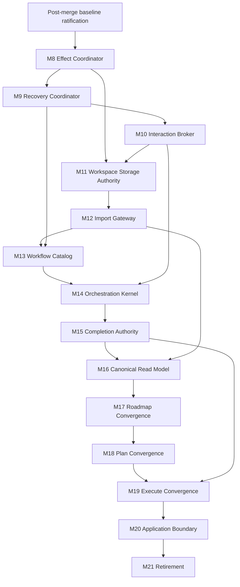

# Canonical Architecture Convergence Program — Regenerated Roadmap

Version: 3.0  
Date: 2026-07-12  
Branch at regeneration: `merge-4`  
Regeneration baseline: `35369487` (`Harden workflow effect coordination and CLI test scaffolding`)  
Architecture status: M0-M7 accepted; M8-M21 open  
Posture: pre-MVP, high-pace greenfield, single operator, no external consumers

This document is the complete durable program definition for architecture convergence. It
supersedes `ctx.md`, `architecture-convergence-roadmap.md`, and `audit-02.md`; those documents may
be deleted after this file is accepted. It preserves the accepted architecture-milestone boundary,
incorporates the merged code and accepted ADRs, records the fixture-hardened baseline, and defines
the remaining work without treating implemented foundations as completed milestones.

## 0. How to read and govern this roadmap

### 0.1 Source authority

When evidence disagrees, use this precedence:

1. Current production code and active composition.
2. Current schema, tests, certification harness, and retained certification evidence.
3. Accepted ADRs in `docs/architecture/decisions/`.
4. The architectural intent and milestone acceptance record in this document.
5. Comments, old documentation, and retained legacy bodies as historical or executable
   specification, never automatic authority.

An accepted ADR that contradicts a pre-merge milestone implementation describes the current
target unless this roadmap explicitly supersedes it. A passing test or certification campaign is
evidence of behavior, not proof that ownership has converged. A type or subsystem being present is
an implemented foundation, not milestone acceptance.

### 0.2 Status vocabulary for this program

Every capability is described using four distinct states:

- **Accepted:** the owner accepted the architecture milestone and its permanent property.
- **Implemented foundation:** relevant contracts or mechanisms exist, but authority is incomplete.
- **Production-wired:** the public route actively uses the behavior.
- **Architecturally closed:** the behavior has one owner, no competing path, complete recovery and
  evidence semantics, passing required verification, and owner acceptance.

Only the last state completes a new architecture milestone. M0-M7 retain their historical
acceptance, subject to the post-merge reconciliation gate in §8. Later implementation and
certification do not retroactively complete M8 or beyond.

### 0.3 Program execution and acceptance

Each milestone is a vertical slice across contract, durable state, behavior, production routing,
recovery, evidence, tests, and retirement of superseded paths. The normal cycle is:

```text
specify and resolve gated decisions
  -> implement through the production boundary
  -> adversarially review authority and failure semantics
  -> reconcile component and certification evidence
  -> update this roadmap when a durable ruling changes
  -> owner acceptance
  -> commit
```

Owner acceptance is required to mark a milestone complete. Verification should be proportionate
and foregrounded when decisive; there is no external CI scheduler at present. Concurrency remains
deferred unless a milestone explicitly introduces it. Temporary complexity must have a named
owner and removal milestone.

Legacy Roadmap, Plan, and Execute bodies are executable specification: consult them for intent,
do not add new authority to them, and delete them only at their named parity and acceptance gates.
Git history is the recovery path after accepted deletion.

## 1. Executive summary

LoopRelay is converging from a hybrid system into one canonical automation architecture: one
application boundary, orchestration kernel, versioned workflow catalog, logical workspace-state
authority, product lifecycle, evidence history, policy resolver, prompt-dispatch gateway, runtime
authority, effect protocol, recovery protocol, interaction model, completion authority, read
model, and one-way import boundary for the owner's existing workspaces.

The current code is materially ahead of the last accepted architecture milestone. It has a
single public CLI route, a broad canonical-v9 database, a real single-attempt runtime, durable
prompt dispatch facts, effect intents, recovery contracts, exact Codex compatibility profiles,
completion checkpoints, and strong runtime-generated certification. Yet feature-specific
mutation, recovery, completion, storage, observation, and session-policy paths remain. The main
risk is therefore **false convergence**: mistaking coexistence of target contracts, green
campaigns, and retained alternate bodies for singular authority.

The remaining dependency order is:

```text
post-merge baseline ratification
  -> M8 effects
  -> M9 recovery
  -> M10 interaction
  -> M11 storage
  -> M12 import
  -> M13 declarative catalog
  -> M14 universal kernel
  -> M15 completion
  -> M16 read model
  -> M17 Roadmap
  -> M18 Plan
  -> M19 Execute
  -> M20 application boundary
  -> M21 retirement
```

Production certification runs alongside this sequence as an independent evidence program. It may
block acceptance when behavior regresses, but it cannot by itself close an authority milestone.

## 2. Accepted milestone boundary and change history

### 2.1 Architecture milestone record

| Milestone | Accepted commit | Disposition now |
|---|---|---|
| M0 Architecture Constitution | `9f6418f5` | Accepted; ownership map regenerated here |
| M1 Workspace State Authority | `8c0b11a4` | Accepted; later merged schema extensions require consumer convergence |
| M2 Evaluation Authority | `87c97444` | Accepted; typed `Blocked` conflict requires owner re-ratification |
| M3 Product Authority | `ab10e06b` | Accepted; observer and persistence split is now broader |
| M4 History Authority | `b1b9aa8a` | Accepted; evidence sets and projection effects were added later |
| M5 Policy Authority | `96d41f44` | Accepted; policy is now v4 and role/session coverage is incomplete |
| M6 Prompt Authority | `45053775` | Accepted historically; ADR-0004/0009 superseded its composition model |
| M7 Runtime Authority | `10dd9494` | Accepted and remains the last completed architecture milestone |
| M8-M21 | none | Open; foundations and production behavior exist but are not closed |

Certification milestones 1-15 are a separate namespace. Passing certification M14 does not mean
architecture M14 is complete.

### 2.2 Material changes after M7

The merged branch contains substantial work after `10dd9494`, including these key events:

- `0a7dc6c4`: merged `architecture-convergence` into `merge-4`.
- `d8a7e50a`: merged `add-fixtures` into `merge-4`.
- `6f5df67f`: resolved the architectural merge and incorporated M7-era runtime work.
- `656e36b7`: hardened exact Codex compatibility-fixture authority.
- `76fb6ba6`: hardened runtime certification campaigns and production seams exposed by fixtures.
- `61602a62`: completed retained Eval full-chain certification evidence.
- `35369487`: reconciled the fixture-exposed component failures and hardened effect-outcome
  propagation, canonical publication/evidence paths, cancellation handling, and production-like
  CLI test repositories, establishing the green baseline in §6.1.

Eleven accepted merge ADRs establish, among other things:

- logical schema identity, family, version, and canonical-v9 convergence;
- separation of raw configuration from resolved operational policy;
- logical history/evidence authority with SQLite as the current mechanism;
- invariant prompt templates plus versioned prompt-policy profiles composed before hashing;
- recommendations as causal evidence evaluated by Policy Authority;
- single-attempt transition execution separated from recovery and effects;
- a required prompt-dispatch gateway with durable pre-dispatch facts and lifecycle; and
- a thin typed application-boundary target.

These are current architectural inputs. §7 reconciles the important contradictions with the
pre-merge program.

## 3. Canonical end state and design laws

### 3.1 End state

1. Operators and automation use one application boundary. Clients submit typed commands and
   queries, render canonical read models, forward cancellation, and map typed outcomes; they do
   not own orchestration, storage, recovery, or effects.
2. One immutable, versioned workflow catalog declares Traditional Roadmap, Eval Roadmap, Plan,
   and Execute in terms of products, gates, prompt and runtime policy, filesystem surfaces,
   effects, recovery, successors, capability requirements, and terminal outcomes.
3. One orchestration kernel interprets every transition through the same evidence-complete
   lifecycle. Workflow-specific runners do not own progression.
4. One logical workspace-state authority owns mutable orchestration state, stable identities,
   attempts, sessions, turns, history, effects, warnings, recovery, interactions, completion, and
   schema evolution. SQLite is the current replaceable mechanism, not the architecture itself.
5. Collaboration files under `.agents/**` are filesystem-authoritative and read at use. Every
   consumption records the commit, per-file hashes, surface hash, validation, and causal lineage.
   System-owned facts are ledger-authoritative; file forms are projections or imports.
6. Outcomes preserve completed, waiting, failed, cancelled, stalled, ambiguous,
   recovery-required, effect-pending, human-decision-required, and specific cannot-proceed
   meanings from execution through persistence, status, and exit mapping.
7. Every external mutation is an ordered, journaled, idempotent effect. Unknown outcomes are
   reconciled before retry. Output-surface commits block the step boundary; pushes are required
   asynchronous effects and must settle before closure.
8. Recovery starts from durable evidence and can reconcile, resume, reconstruct, fork, retry,
   compensate, wait, or request human action without depending on an undiscoverable live object.
9. Existing supported workspaces enter through explicit one-way import. Runtime never silently
   falls back to a legacy source after import.
10. One canonical read model explains selected workflow, causal state, policy, evidence,
    conflicts, uncertainty, pending effects, recovery, and required human action.
11. Every production behavior has exactly one owner and one plausible place to change it.
12. The final repository contains no compiled historical workflow authority or unowned runtime
    asset.

### 3.2 Design laws

- **Authority before routing; routing before retirement.** Establish the owner and contract,
  route behavior, prove it, then delete the superseded path.
- **One behavior, one owner.** Both zero owners and multiple owners are defects.
- **Universal mechanics, declarative workflows.** Workflows declare intent; the kernel owns
  scheduling, attempts, persistence, retry, chaining, interaction, dispatch, and reconciliation.
- **Durable causal identity.** Every attempt, prompt, session, turn, product, effect, recovery
  action, interaction, and completion fact links to a stable causal spine.
- **Effects are not state claims.** A declared or attempted mutation is not a completed effect.
- **Unknown is not not-started.** Reconcile possible side effects before any repeat.
- **Import is one-way.** No dual write, silent merge, or permanent compatibility fallback.
- **Evidence is layered.** Component tests, static compatibility fixtures, replay, live transition,
  full-chain, and platform evidence answer different questions and are never averaged together.
- **Passing behavior is not singular authority.** Certification proves observations, not absence
  of competing implementations.
- **No configured lies.** A configured value is demonstrably effective or rejected.
- **No hidden provider policy.** Runtime authorization uses resolved, durable policy and exact
  compatibility evidence.
- **Entropy must fall.** Every accepted milestone reduces duplicate authorities, direct mutation,
  workflow-local recovery, hidden policy, or unowned assets.

### 3.3 Structural filesystem and Git guarantees

- Every disk-reading transition declares its filesystem input surface.
- Every writing transition declares its output surface; output surfaces become first-class catalog
  contracts by M13.
- The kernel evaluates the clean-input gate over the declared input surface. Files outside the
  declared surface do not block the step.
- Interactive dirty input creates a durable offer-to-commit request through M10. Headless dirty
  input is a typed system-fault outcome, never an auto-commit or indefinite wait.
- The kernel/effect authority auto-generates a blocking commit and required-asynchronous push for
  declared output surfaces. Workflow authors do not hand-code these effects.
- The Project Context public contract is exactly nine files under `.agents/ctx`; any fixture that
  claims production behavior must materialize all nine explicitly.

## 4. Current production architecture

### 4.1 Deployables and route

`LoopRelay.slnx` contains 12 source projects and 12 test projects. The supported executable is
`LoopRelay.Cli`. `LoopRelay.Plan.Cli` and `LoopRelay.Roadmap.Cli` still compile and retain their
bodies, but their entry points only print retirement messages. Their bodies are specification and
test surfaces, not supported entry points.

`LoopRelay.Certification` is a separate authority around the published CLI. It creates disposable
repositories and runtime overlays, invokes the public executable, applies independent oracles,
retains scrubbed evidence when requested, and cleans up disposable cases.

The production route is:

```text
Program
  -> argument and configuration loading
  -> UnifiedCliComposition.CreateProduction
  -> CanonicalCliApplicationService (ILoopRelayApplication)
  -> WorkflowChainRunner
  -> WorkflowController
  -> TransitionRuntime (one authorized attempt)
  -> TransitionEffectCoordinator
  -> repository re-observation
```

Startup validates the catalog fail-closed. Production composition constructs the observer and
resolver, four workflows and two chains, prompt-dispatch gateway and stores, transition runtime,
effect coordinator, controller, chain runner, chain-boundary evidence, and workflow-instance
recording.

The application boundary is not yet closed: `CanonicalCliApplicationService` still owns command
dispatch, migration, direct storage SQL, run-loop policy, status queries, completion cleanup, and
some rendering concerns. Recovery request contracts exist without public CLI recovery commands.
Status directly assembles recovery and persistence readers instead of consuming one canonical read
model. Specific cannot-proceed causes are collapsed at the outer application result.

### 4.2 Concentration hotspots

The following files are current convergence hotspots, not desired permanent authorities:

| File | Approximate audited size | Significance |
|---|---:|---|
| `src/LoopRelay.Cli/Services/Cli/UnifiedCliComposition.cs` | 6,360 lines | Composition plus prompt, product, effect, completion, and feature bodies |
| `src/LoopRelay.Core/Services/Persistence/LoopRelayWorkspaceDatabase.cs` | 2,144 lines | Schema inspection, convergence, migration, and physical manifest |
| `src/LoopRelay.Orchestration.Primitives/Resolution/RepositoryObserver.cs` | 1,523 lines | Filesystem, persistence, compatibility, Git, storage, and workflow observation |
| `src/LoopRelay.Orchestration.Primitives/Workflows/CanonicalWorkflowDefinitionSketches.cs` | 806 lines | Active catalog despite provisional identity/name |
| `src/LoopRelay.Orchestration.Primitives/Runtime/TransitionRuntime.cs` | 631 lines | Canonical single-attempt lifecycle |

Paths may move as convergence proceeds. The architectural concern is ownership concentration and
cross-authority behavior, not file length alone.

### 4.3 Active workflow and product topology

The production-derived catalog currently contains:

- 4 workflows, 2 chains, and 4 chain boundaries;
- 24 stages and 46 transitions;
- 26 product identities and 136 gate obligations;
- 56 declared effects in 7 categories;
- 5 active execution postures in the current denominator;
- 44 prompt identities and 50 compiled `.prompt` assets.

The chains are:

```text
TraditionalRoadmap -> Plan -> Execute
EvalRoadmap        -> Plan -> Execute
```

Both roadmap workflows converge on `PreparedEpic` and `MilestoneSpecificationSet`. Plan produces
`ExecutablePlan`, `OperationalContext`, `ExecutionDetails`, `ExecutionMilestoneSet`, and
`ExecutionReadiness`. Execute terminates at `CertifiedCompletion`.

Catalog limitations keeping M13/M14 open include absent first-class output surfaces, no structural
auto-insertion of commit/push effects, workflow-authored effect declarations, string-only
validators with unclear ownership, repeated construction, provisional `Sketches` identity, and
feature sequencing that is not fully declarative. Linear first-eligible progression is the only
supported current model; parallel scheduling and effect conflicts are future obligations unless
explicitly admitted to scope.

### 4.4 Single-attempt lifecycle

One authorized `TransitionRuntime` attempt currently performs:

1. resolve definition and input products;
2. evaluate input gates;
3. build prompt context and causal input snapshot;
4. authorize transition run/attempt and persist attempt intent;
5. persist read receipts and the consumed-input manifest;
6. compose the rendered prompt and prepare the required dispatch gateway;
7. persist transition start and dispatch-intent boundary evidence;
8. dispatch exactly once to the provider;
9. persist normalized raw output;
10. interpret output and register candidates;
11. validate products and evaluate output gates;
12. revalidate input freshness;
13. atomically promote products, project state, complete the attempt, record gates and lifecycle,
    and insert effect intents;
14. return a terminal non-success or `EffectsPending`.

An exception after durable dispatch intent is an unknown provider outcome and yields
`RecoveryRequired`; it is not blindly retried. A recovery attempt reuses the transition-run
identity and mints a new attempt identity only after a persisted recovery plan authorizes it.

Residual seams include fresh-attempt authorization on the normal chain route, best-effort run and
policy writes that should fail closed when causally required, uncertain workflow-instance identity
on restart, and same-invocation immediate effect walking instead of restart-safe reconciliation.

### 4.5 Logical workspace, products, and history

The canonical database is `.LoopRelay/persistence/looprelay.sqlite3` with:

- schema identity `looprelay.workspace-state`;
- schema family `CanonicalWorkspace`;
- logical version 9.

The audited schema declares 64 tables and 38 indexes covering canonical workflow state, causal
identity, receipts, policy/prompt/runtime facts, continuity, recovery, effects, evidence sets,
compatibility import, projections, recommendations, profile evaluation, and dispatch lifecycle.

Identity, family, version, and physical shape are interpreted together. Canonical v8 upgrades to
v9 in place; recognized partial-v9 branch shapes converge transactionally; unknown or stamped
incomplete v9 fails closed; workspace identity is preserved; unobserved historical evidence stays
null; legacy continuity v3 enters through explicit compatibility import. Convergence emits receipts
and a complete physical-shape fingerprint.

The causal spine uses opaque prefixed ULIDs:

```text
ws_ -> run_ -> wfi_ -> tr_ -> att_ -> ses_ -> turn_
```

Other stable prefixes include receipts, warnings, history, boundaries, resolutions, rendered
prompts, and prerequisites. IDs are minted once with the durable record; catalog names are
references and provider thread IDs are attributes. Ledger insertion order, not ULID or wall-clock
ordering, is authoritative.

Collaboration products are selected from filesystem observation only. Canonical rows may retain
provenance but cannot substitute for or mask files. Reads record commit, hashes, validation, and
lineage, and freshness is rechecked before promotion. History facts are ledger-authoritative;
numbered `.agents` history files are retryable derived projections/compatibility inputs. Projection
failure after ledger commit must not rewrite or invalidate the fact.

Residual seams include direct physical-table queries by the application and observer, migration
before status, broad compatibility tables/readers, incomplete projection reconciliation, and no
single public projection for all policy, prompt, effect, import, recovery, and uncertainty facts.

### 4.6 Policy, prompt, runtime, and continuity

Shipped configuration is `settings-v3`; operational policy is `policy-v4`. Configuration contains
raw brain/provider/permission inputs. Policy resolves built-in, workspace, and invocation layers;
recognized ambient variables become invocation overrides and explicit `--policy` flags win.
Unknown keys, malformed values, and duplicate same-precedence overrides fail. Policy identity is
`pol_v1_` plus a truncated SHA-256 over canonical effective values and schema.

Execution recommendations are immutable causal evidence. Policy evaluates them as accepted,
constrained, rejected, ignored, stale, invalid, or unsupported and persists the effective runtime
profile. Runtime authorization consumes that durable evaluation/profile, not a recommendation
directly.

Current gaps: some roles still consume `BrainConfiguration` directly; fallback profiles copy raw
model/effort; adaptive capability evidence is synthesized; outer CLI runtime/prompt-policy IDs are
provisional literals; `CODEX_HOME` is read ambiently in decision execution; and not every role has
a fully resolved session policy.

Prompt Authority now composes an invariant template, a versioned `PromptPolicyProfile`, and
consumed inputs before hashing. `PromptDispatchGateway.PrepareAsync` durably records immutable
rendered bytes/hash and `Planned`/`Authorized` lifecycle before provider dispatch. Runtime loads by
prompt-fact identity; transport cannot append provider-visible text; multi-turn sends correlate
session, turn, and prompt; unknown post-start outcomes transfer to recovery.

Codex remains the only production provider. Exact scrubbed compatibility profiles exist for
0.142.5, 0.144.0, and 0.144.1. Exact resume, `excludeTurns`, and read are promoted for those
profiles; conversation write, native fork, and maximum recoverable context remain unknown unless
later certified. Provider-neutral interfaces permit additive providers but authorize no fallback.

Warm Plan and Execute checkpoints and exact-profile resume paths are production-wired, but remain
feature-specific. Generic transition recovery and decision-session recovery are not yet one
authority or read model.

### 4.7 Effects, recovery, completion, and storage foundations

Effect intents are atomically inserted with transition state and have stable identity, ordering,
and idempotency keys. State changes append records; thrown effect calls become `Unknown`; required
effects must complete before transition completion. Publication preflights independent `.agents`
Git topology and treats post-preflight exceptions as unknown.

M8 remains open because there is no general restart worker/reconciler, push is not a distinct
required-asynchronous protocol, commit/push are not generated from output surfaces, effect
execution still contains workflow progression and feature branching, helper paths can repeat
broader materialization, completion mutates before its declared archive effect, and some feature
services mutate Git/files directly.

Recovery has two implemented domains: generic transition-boundary plans/classification and rich
decision-session continuity. Decision recovery can use exact thread read, rollout salvage, or
repository continuation and can resume, reconstruct, or policy/profile-gated fork. M9 remains open
because there is no universal public recovery route, effect reconciliation is incomplete,
cancellation salvage is unratified, typed vocabulary conflicts remain, and warm-session,
transition, decision, and completion recovery are fragmented.

Completion production composition includes non-implementation review, canonical prompt dispatch,
SQLite execution evidence, completed-epic archive materialization, a durable certification
checkpoint, final session/checkpoint retirement, and terminal zero-model/no-mutation rerun.
M15 remains open because completion still has generic `Blocked` types, archive and Git work occur
inside feature execution, closure is not one recovered effect plan, direct `CommitGate` remains,
checkpoint state is opaque metadata, and partial-effect semantics are fragmented.

Storage commands currently ensure schema and metadata more than they perform truthful semantic
init/import/export/sync. Status may migrate. M11/M12 must supply read-only verification, recoverable
mutation, semantic round-trip, explicit one-way portfolio import, and non-authoritative legacy
marking.

## 5. Authority ownership and closure gaps

The canonical owner is singular even when another authority executes or governs the behavior.

| Behavior family | Canonical owner | Current closure gap |
|---|---|---|
| Application entry, composition, exit mapping | Application Boundary (M20) | Service still mixes commands, SQL, migration, status, cleanup, and formatting |
| Workflow declarations and validation | Workflow Catalog (M13) | Provisional/repeated code catalog; incomplete surfaces and policies |
| Selection, chaining, lifecycle | Orchestration Kernel (M14) | Bridge works, but feature sequencing/recovery/effects remain |
| Repository/workspace observation | Orchestration Kernel (M14) via owned read models | Large compatibility and feature heuristics remain |
| Resolution explanation | Canonical Read Model (M16) | Incomplete public evidence-linked projection |
| Mutable orchestration state | Workspace State Authority (M1) | Direct table consumers and observation-time migration remain |
| Product identity, receipts, retrievability | Product Authority (M3) | Output surfaces and observer heuristics incomplete |
| Gate and semantic evaluation | Evaluation Authority (M2) | Typed vocabulary and local validators need reconciliation |
| Append-only history/evidence | History Authority (M4) | Projection/reconciliation and canonical consumers incomplete |
| Configuration/policy/recommendations | Policy Authority (M5) | Direct brain config, synthetic capability evidence, role gaps |
| Prompt identity/composition/dispatch facts | Prompt Authority (M6) | ADR model must be ratified here; residual local framing/IDs remain |
| Sessions, capabilities, diagnostics, usage | Runtime Authority (M7) | Universal resolved profile authorization and continuity incomplete |
| External mutation and publication | Effect Coordinator (M8) | Worker, async push, reconciliation, auto effects, direct mutations |
| Restart, cancellation, unknown outcomes | Recovery Coordinator (M9) | Fragmented paths; no universal CLI route; cancellation open |
| Human requests/responses | Interaction Broker (M10) | Types exist; durable production lifecycle and CLI route absent |
| Verify/init/import/export/sync | Workspace Storage Authority (M11) | Commands are narrower than their labels |
| Legacy detection and one-way migration | Import Gateway (M12) | Portfolio-wide preview/import/receipt not complete |
| Completion decision and closure | Completion Authority (M15) | Closure not exclusively effects/recovery-owned; vocabulary conflict |
| Operational status and diagnostics | Canonical Read Model (M16) | Application and observer query stores directly |
| Roadmap behavior | Canonical authorities, converged at M17 | Retained legacy body and feature-specific behavior |
| Plan behavior/publication | Canonical authorities, converged at M18 | Retained pipeline and restart/publication seams |
| Execute behavior | Canonical authorities, converged at M19 | Retained loop and highest-risk recovery/closure seams |
| Behavioral certification | Certification executable + owner acceptance | Obligation credit and durable cross-machine evidence unresolved |

## 6. Evidence and certification baseline

### 6.1 Component baseline

The fixture-hardening reconciliation established this baseline:

```text
dotnet build LoopRelay.slnx --no-restore
  succeeded, 0 warnings, 0 errors

dotnet test LoopRelay.slnx --no-restore
  1,770 passed, 0 failed, 5 skipped, 1,775 total

dotnet test tests/LoopRelay.Cli.Tests/LoopRelay.Cli.Tests.csproj
  415 passed, 0 failed, 0 skipped
```

The five skipped tests are live Codex approval/posture checks in
`LoopRelay.Agents.Tests`; static compatibility tests pass 4/4. The restored suite includes 109
passing Plan CLI tests and 473 passing Roadmap CLI tests.

The reconciled failures covered stale prompt-policy, history, schema diagnostic, terminal
idempotency, progression, and raw-attempt expectations; production-like Project Context and nested
`.agents` Git topology; correct session turn indices; effect outcome propagation; cancellation
classification; publication from the canonical database; and declared local-verification evidence
paths. These contracts must not regress silently.

### 6.2 Harness topology and commands

The certification fixtures are runtime-generated:

- harness: `src/LoopRelay.Certification`;
- entry point: `src/LoopRelay.Certification/Program.cs`;
- tests: `tests/LoopRelay.Certification.Tests`;
- static Codex fixtures: `tests/LoopRelay.Agents.Compatibility.Tests/Fixtures`;
- generated cases: `.tmp/certification/milestone-N/<case-guid>/`;
- retained evidence: `.tmp/certification/evidence`;
- settings: `src/LoopRelay.Certification/CertificationFixtureSettings.cs`.

Build first:

```powershell
dotnet build LoopRelay.slnx
```

Run deterministic campaigns from the repository root:

```powershell
dotnet run --project src/LoopRelay.Certification -- canary --workspace . --cli src/LoopRelay.Cli/bin/Debug/net10.0/LoopRelay.Cli.dll
dotnet run --project src/LoopRelay.Certification -- milestone12 --workspace . --case-root .tmp/certification
dotnet run --project src/LoopRelay.Certification -- milestone15 --workspace . --case-root .tmp/certification
```

`canary` may be replaced by `milestone2`, `milestone7`, or `milestone8` where appropriate. For
live milestones, resolve the built CLI, exact Codex executable, and auth file, then run one of
`milestone3`, `milestone4`, `milestone5`, `milestone6`, `milestone9`, `milestone10`,
`milestone11`, `milestone13`, or `milestone14` with `--workspace`, `--cli`, `--codex`, `--auth`,
`--case-root`, and optionally `--retain-case`. M13 is the Traditional full chain; M14 is the Eval
full chain. M15 aggregates release dimensions; it does not run all campaigns.

Representative live M14 invocation:

```powershell
$cli = Resolve-Path "src/LoopRelay.Cli/bin/Debug/net10.0/LoopRelay.Cli.dll"
$codex = Resolve-Path ".tmp/certification/codex-0.144.1-package/node_modules/@openai/codex-win32-x64/vendor/x86_64-pc-windows-msvc/bin/codex.exe"
$auth = "$HOME/.codex/auth.json"

dotnet run --project src/LoopRelay.Certification -- milestone14 `
  --workspace . `
  --cli $cli `
  --codex $codex `
  --auth $auth `
  --case-root .tmp/certification `
  --retain-case
```

There is no single run-all command. Execute the applicable campaigns individually and run
`milestone15` last as the aggregate release gate.

The configured certification model/effort at audit time is `gpt-5.3-codex-spark` / `medium`, with
a 60-minute provider-turn timeout. Treat these as configuration, not architectural constants.

### 6.3 Current retained evidence and known gap

At regeneration time, status canary and certification M2-M14 evidence are passing. Windows x64
platform certification passes separator, line-ending, UTF-8, Git, path-length, and normalized
contract checks. Eval M14 passes 29 expected transitions, default and forced selection, both chain
boundaries, producer convergence, independent observation, Git publication, archive closure,
traceability, idempotent terminal rerun, process cleanup, and privacy scan. The terminal rerun
observed zero additional sessions and no user-tree/Git mutation.

Certification M15 is 16/17. Genuine Linux evidence (`platform-linux.latest.json`) is absent, so
cross-platform contract agreement is false and the current classification is 6.

The production-derived ledger currently contains 469 obligations from workflows, stages, gates,
transitions, prompts, postures, effects, products, chains, prompt assets, known risks, and schema.
Raw ledger output does not yet credit campaign evidence at obligation level; M15 aggregates
dimension-level evidence separately. A future evidence step must connect durable campaign results
to individual obligations.

Retained `.tmp` evidence is git-ignored. This protects credentials/privacy but is not durable
cross-machine release provenance. The owner must decide whether an external evidence authority is
required.

### 6.4 Evidence rule for every remaining milestone

Before acceptance, each milestone must:

1. preserve or intentionally update the green component baseline;
2. classify failures as stale legacy expectation, changed accepted contract, or production defect;
3. name production-derived obligations added, changed, or invalidated;
4. pass the lowest deterministic tier that proves its contracts;
5. run relevant live transition/full-chain campaigns when runtime behavior changes;
6. preserve exact-provider compatibility gates when provider behavior is relied upon; and
7. keep architecture closure separate from campaign success.

## 7. Reconciled decisions and standing doctrine

### 7.1 Decisions retained unchanged

- Collaboration files are filesystem-authoritative, read at use, with commit, per-file hash, and
  surface-hash receipts. System facts are ledger-authoritative.
- The clean-input gate is uniform and scoped to declared input surfaces.
- Headless unexpected dirty input is a typed system fault.
- Output surfaces generate blocking commit and required-asynchronous push effects.
- The owner's existing workspaces are imported one-way; there are no external consumers or
  compatibility support windows.
- Telemetry, usage-limit wait/retry, input-wait reporting, and runtime prerequisites are active
  product intent governed by Policy and Runtime authorities.
- Codex is the sole supported provider. Missing exact capability yields a typed outcome, not
  provider fallback.
- Product bodies live in Git; logical orchestration state uses the canonical SQLite mechanism;
  one active run per workspace remains the current assumption.
- Evaluation may be agent-executed. Verdict and evidence are durable; deterministic purity is not
  required.
- Catalog validation fails closed at production startup.
- The causal ULID spine and ledger insertion ordering described in §4.5 remain authoritative.

### 7.2 Decisions superseded by accepted merge ADRs

The pre-merge M6 implementation made implementation-first policy prose unconditional and
template-owned and explicitly rejected prompt-policy profiles. Accepted ADR-0004/0009 and current
production code supersede that composition decision:

- invariant prompt templates and versioned prompt-policy profiles are distinct typed inputs;
- template + profile + consumed inputs are composed before hashing;
- all provider-visible instructions must be covered by the composed prompt identity;
- the transport cannot append hidden provider-visible instructions;
- the durable prompt fact and pre-dispatch lifecycle are required before provider dispatch.

This is the governing target for M6's current authority. The original M6 commit remains part of
the accepted history; regeneration records the later supersession rather than pretending the
original ruling never existed.

Likewise, the old statement that rendered-prompt evidence is minted only at the transport moment
is superseded. The current gateway durably prepares immutable prompt content and
`Planned`/`Authorized` lifecycle before dispatch. Attempted, accepted, started, completed, failed,
cancelled, and unknown dispatch meanings must remain distinct.

Logical canonical v9 now represents the union/convergence model, not merely the M7 runtime
columns. Configuration and operational policy are separate domains. Recommendations are evidence,
not direct runtime instructions. Exact profile support is narrower than interface capability.

### 7.3 Typed obstacle vocabulary requiring ratification

The accepted M2 intent remains valuable: a canonical outcome should name the actual reason work
cannot proceed, and cannot-proceed state should be derived from current evidence rather than
manually unblocked. Warnings should replace obstacles wherever work can proceed or naturally retry.

The post-merge tree nevertheless contains active typed uses such as
`CompletionCertificationServiceOutcome.Blocked`,
`NonImplementationCompletionReviewStatus.Blocked`, and
`TransitionRecoveryDisposition.OperatorUnblock`, plus compatibility and legacy vocabulary. This
does not automatically reverse M2.

Until the owner rules at the baseline gate:

- natural-language “blocked because …” is permitted when the reason is explicit;
- compatibility/legacy terms may remain only behind a translation boundary;
- new canonical typed states must use specific reason-bearing outcomes;
- no new manual latch or public `unblock` behavior may be introduced;
- active generic typed uses must be mapped, renamed, or explicitly ratified before M15 closure.

The README claim that `unblock` is public behavior is stale; the current CLI parser exposes no such
verb.

### 7.4 Facts, policy, prompts, and evidence

- Facts are append-only. Corrections supersede; migrations add/converge without fabricating
  historical evidence or rewriting facts.
- Read paths should be read-only; whether `status` may trigger migration is an open M11 decision.
- A policy value is effective or rejected. Unknown keys reject at every policy-owned settings
  level. Effective policy is resolved once for the relevant scope and recorded with provenance.
- Prompt content is reproducible from template identity, profile identity, consumed input receipts,
  and exact rendered bytes. Payload holes contain data, not hidden instructions.
- Every production send crosses the required dispatch gateway and records session/turn/provider
  correlation and terminal evidence.
- Exact Codex support is profile-gated by version and app-server schema. An implemented operation
  is not release-supported until its stronger behavior is certified for the exact profile.

## 8. Baseline ratification gate before M8

This is a prerequisite gate, not a new numbered architecture milestone. It prevents unresolved
merge contradictions from leaking into M8-M21.

**Required decisions:**

1. Ratify prompt template + versioned prompt-policy profile composition as superseding the old M6
   no-profile ruling.
2. Decide which, if any, generic typed `Blocked` uses are legitimate completion-domain terms;
   otherwise map them to specific reason-bearing outcomes. Preserve derived-not-latched behavior.
3. Ratify canonical logical-v9 convergence and configuration/policy separation as the current M1,
   M5, M6, and M7 baseline.
4. Confirm durable pre-dispatch prompt facts/lifecycle as required evidence.
5. Confirm the green component baseline and current certification contracts as entry evidence.

**Acceptance:** this document records the rulings; contradictions in active canonical tests/docs
are removed; retained compatibility vocabulary is explicitly translated; build and component
baseline remain green. No claim is made that M8+ is complete.

## 9. Dependency graph and remaining milestones



### M8 — Effect Coordinator

**Permanent property:** every required external mutation is durable, ordered, idempotent,
receipted, restart-discoverable, and reconciled.

**Foundation already present:** atomic effect intents, stable IDs and idempotency keys, ordering,
append-only state, unknown classification, immediate coordination, publication topology preflight,
and effect-aware transition outcomes.

**Required convergence:**

- one durable scanner/worker/reconciliation path for planned, started, pending, failed, stalled,
  and unknown intents across restart;
- explicit blocking-local-commit versus required-asynchronous-push semantics;
- output-surface-derived commit and push effects, not workflow-authored repetition;
- exact receipts/postconditions and reconciliation before retry;
- effect executor separated from workflow progression/state materialization;
- one semantic mutation per intent even when coordination repeats;
- completion archive, publication, exports, projections, Git, and filesystem mutations removed
  from feature bodies and routed through effects;
- closure prevented while any required effect is incomplete or unknown.

**Impossible afterward:** state claiming publication without mutation; duplicate semantic effects;
blind retry of unknown work; direct required mutation outside the coordinator.

**Acceptance evidence:** restart between every ordered effect; success, failure, stalled, cancelled,
partial, and unknown remain distinct; duplicate coordination is idempotent; journal receipts equal
independent repository observation; relevant certification M8/M11/M13/M14 publication scenarios
remain green.

### M9 — Recovery Coordinator

**Permanent property:** every interruption or uncertain outcome has one durable evidence-based
classification and recovery plan.

**Foundation already present:** generic transition recovery plans and boundary journal; rich
decision recovery sources/mechanisms; exact-profile read/resume; feature-specific warm Plan and
Execute checkpoints; recovery-required propagation for unknown dispatch/effects.

**Required convergence:**

- compose one recovery authority and expose it through the normal application/CLI path;
- unify transition, effect, runtime, warm-session, decision, and completion recovery lineage;
- classify not-started, in-flight, accepted-unknown, succeeded-uncommitted, failed, cancelled,
  unknown, and partially-effected boundaries;
- persist plan selection before action and authorize new attempts under the same logical run;
- reconcile effects/provider work before retry;
- make resume, reconstruction, native fork, compensation, wait, and human-decision choices
  capability/profile/policy gated;
- remove generic `OperatorUnblock` from canonical vocabulary unless explicitly ratified.

**Owner ruling required:** cancellation salvage for cancellation before dispatch, after provider
acceptance, after validated output, during partial effects, and during partial completion closure.

**Impossible afterward:** recovery requiring a lost in-memory object; cancellation collapsing into
failure; unknown work repeated as not-started.

**Acceptance evidence:** restart and cancellation at every durable boundary; preserved observed
evidence; exact-profile capability denial fails closed; no workflow-local retry path competes.

### M10 — Interaction Broker

**Permanent property:** every required human action is a durable typed request with validated
response, policy, and resume semantics.

**Foundation already present:** request-shaped outcome/contracts and human-decision-required
vocabulary.

**Required convergence:** request identity/category/question/response schema; correlation and causal
lineage; deadline/default/timeout policy; persistence before presentation; restart-safe outstanding
state; validation of late, invalid, and duplicate responses; application and CLI command/query
path; clean-input offer-to-commit as the first production request; no workflow console reads.

**Owner rulings required:** timeout/default by request category, isolation guarantee depth, and
whether trust evidence is an audit product.

**Impossible afterward:** status saying action is required without request identity; progression
depending on ephemeral input; restart losing a decision.

**Acceptance evidence:** interactive and headless clean-input behavior, restart/late/duplicate
response cases, and canonical status visibility.

### M11 — Workspace Storage Authority

**Permanent property:** verify/init/import/export/sync are truthful, recoverable operations with
one storage owner; verification never mutates.

**Foundation already present:** canonical-v9 identity/family/shape inspection and convergence,
migration receipts/fingerprint, narrow storage commands, effect/evidence foundations.

**Required convergence:** strictly read-only verification; explicit mutation plans through effects
and recovery; semantic export round-trip; conflict, corruption, unsupported-version, and
interrupted-mutation behavior; domain-correct command names and results; remove direct application
SQL; define observation versus migration boundaries.

**Owner ruling required:** whether `status` is strictly read-only or may initiate explicit schema
migration/convergence. Recommended default: status is read-only and reports required migration.

**Impossible afterward:** verify repairing state; a labeled operation reporting work it did not do;
mutation starting while authority is ambiguous.

**Acceptance evidence:** byte/semantic non-mutation verification tests, interrupted operation
recovery, effect receipts, and round-trip equivalence.

### M12 — Import Gateway

**Permanent property:** every supported owner workspace crosses one explicit one-way boundary into
canonical authority with semantic verification and a durable receipt.

**Foundation already present:** logical-v9 compatibility convergence, explicit legacy-continuity
import, compatibility operation tables, and broad retained readers.

**Supported portfolio:** pre-unification roadmap state, partial planning artifacts, decision
sessions, histories, and completion archives owned by the operator. There are no external
consumers or support windows.

**Required convergence:** read-only detection; version/conflict report; preview; explicit import
transaction; domain identity mapping; semantic verification; receipt; legacy marked
non-authoritative; canonical-only runtime after import; adapter retirement when the owned
portfolio is exhausted.

**Owner ruling required:** enumerate the actual owned workspace portfolio and resolve ambiguous or
conflicting source cases without guessing.

**Impossible afterward:** runtime fallback to legacy state; dual write; import adapter acting as an
alternate store/workflow authority.

**Acceptance evidence:** each owned workspace imports with accepted fidelity and subsequently runs
canonical-only; ambiguous inputs fail with actionable reports.

### M13 — Workflow Catalog

**Permanent property:** all workflow intent is expressed once as immutable, versioned, validated
declarations with stable catalog identity.

**Foundation already present:** one production catalog with 4 workflows, 24 stages, 46 transitions,
typed products/gates/effects/postures, declared input surfaces for selected transitions, startup
validation, and two chains.

**Required convergence:** replace provisional `Sketches` identity with one stable catalog/version;
declare all input and output surfaces, products, schemas, gates, validators, prompts, policy,
runtime capabilities, effects, recovery, successors, entry/exit contracts, and terminal outcomes;
generate commit/push effects structurally; eliminate repeated construction and hidden feature
sequencing; make extension require declarations rather than kernel branches.

**Impossible afterward:** adding a workflow requiring a private runner/selector; duplicate catalogs
disagreeing about progression, effects, or recovery.

**Acceptance evidence:** production fails closed on invalid declarations; all supported workflows
resolve from one catalog; coverage ledger denominator derives from the accepted catalog and every
changed obligation is mapped to evidence.

### M14 — Orchestration Kernel

**Permanent property:** every transition executes through one universal, product-driven,
evidence-complete lifecycle.

**Foundation already present:** resolver, single-attempt runtime, controller, chain runner, atomic
promotion/effect intent, boundary evidence, workflow-instance records, and green full-chain
campaigns.

**Required convergence:** one lifecycle for observe -> resolve -> gate -> interact -> authorize ->
dispatch -> interpret -> validate -> freshness check -> atomic state/effect intent -> reconcile ->
recover -> chain -> read model; universal use of catalog declarations; stable restart/re-entry
lineage; causally required writes fail closed; no feature runner owns progression; no prompt result
directly completes state; replace the bridge mechanics in place.

**Impossible afterward:** workflow-specific progression authority; a client advancing state; any
transition bypassing attempts, evaluation, effects, recovery, interaction, or evidence.

**Acceptance evidence:** all success and non-success outcomes; restart at each durable boundary;
both full chains through the public boundary; independent evidence agreement; no alternate
production kernel.

### M15 — Completion Authority

**Permanent property:** completion is one typed evidence-complete decision followed by one
recoverable closure plan executed exclusively through effects.

**Foundation already present:** non-implementation review, canonical completion prompts, execution
evidence, archive materializer, durable certification checkpoint, terminal cleanup, and idempotent
zero-model rerun.

**Required convergence:** one certificate/failure/specific-cannot-proceed decision; one durable
closure plan; archive, roadmap-context update, commits, pushes, route interpretation, checkpoint
cleanup, and terminal state as ordered effects; no feature-body archive/Git mutation or direct
`CommitGate`; dedicated completion projection/read model; partial closure recovery integrated with
M8/M9; required async effects settled before certified closure.

**Owner rulings required:** typed obstacle mapping, partial-effect failure semantics, and resume/
cleanup behavior.

**Impossible afterward:** archive/publication failure reported complete; two services deciding
completion; generic failure erasing a resolvable cannot-proceed reason.

**Acceptance evidence:** certified, specific cannot-proceed, failed, cancelled, effect-pending, and
recovery-required remain distinct through persistence/read model/exit codes; closure and terminal
rerun are idempotent.

### M16 — Canonical Read Model

**Permanent property:** every client receives one evidence-linked explanation of state, authority,
policy, pending work, uncertainty, and required action.

**Foundation already present:** typed CLI snapshots, persistence projection, status output, and
stores for policy, prompt, prerequisite, effect, import, continuity, and completion evidence.

**Required convergence:** one projection covering selection alternatives/conflicts; workflow,
stage, transition, run, and attempt lineage; gates/warnings/freshness; resolved policy/runtime
profile; prompt and provider evidence; pending/unknown effects; recovery plan/action; interactions;
completion; import/storage state; compatibility uncertainty. Application and observer stop direct
ad hoc queries. Exports/renderers consume the projection without becoming authorities.

**Impossible afterward:** console text as sole truth; invisible pending push, warning, recovery,
interaction, conflict, or uncertainty.

**Owner ruling required:** whether local `.tmp` certification evidence gains a durable external
release-evidence owner; and how exact provider profiles are promoted/retired.

**Acceptance evidence:** every displayed claim traces to stable evidence; read-only status does not
repair; obligation-level certification credit can be queried or explicitly linked.

### M17 — Roadmap capability convergence

**Permanent property:** Traditional and Eval roadmap intents produce the same validated,
producer-neutral prepared products through canonical authorities alone.

**Foundation already present:** both public unified routes, common downstream products, active
catalog transitions, live full-chain certification, retained Roadmap executable specification.

**Required convergence:** preserve accepted rigor, lifecycle, validation, storage, recovery, and
review intent; eliminate feature-local state machines/readers/prompt framing; complete the three
registered Eval prompt stubs if required by accepted intent; route new work/recovery only through
catalog/kernel; prove producer-neutral downstream behavior.

**Owner ruling required:** full-roadmap generation intent for the reserved
`Planning/CreateNewRoadmap` asset.

**Acceptance:** both roadmap routes meet the same downstream contract under component and live
fixtures. After owner acceptance, delete the legacy Roadmap body and obsolete readers/assets whose
last consumer disappeared.

### M18 — Plan capability convergence

**Permanent property:** Plan produces complete validated readiness products and executes all
publication effects through canonical authorities.

**Foundation already present:** unified route, warm checkpoint/resume path, canonical products,
publication topology hardening, and Traditional/Eval full-chain evidence.

**Required convergence:** warm authoring, adversarial review, revision, scoped mutation/rollback,
validation, milestone semantics, publication, independent `.agents` repository behavior, and
parent gitlink recording through catalog/kernel/effects/recovery only.

**Owner ruling required:** restart behavior when exact Codex capabilities differ from assumptions
in the retained Plan body.

**Acceptance:** readiness cannot precede required products; publication receipts reconcile to both
repositories; restart needs no lost session. After owner acceptance, delete the legacy Plan
pipeline.

### M19 — Execute capability convergence

**Permanent property:** Execute is correct, recoverable, idempotent, and explainable from readiness
through certified completion across every interruption boundary.

**Foundation already present:** unified public route, decision and warm-session recovery,
implementation/handoff transitions, effect intents, completion certification/archive, and green
full-chain campaigns.

**Required convergence:** decision routing, implementation, handoff, publication, repository
evaluation, stall handling, review, and certified completion through canonical authorities only;
unknown work reconciled before repeat; cancellation salvage and partial effects honored; no legacy
loop progression/prompt-policy fallback.

**Owner rulings required:** first-run sequencing and review order.

**Acceptance:** restart after every provider and external-effect boundary; cancellation/unknown/
stall/completion cases remain distinct; both full chains retain evidence agreement. After owner
acceptance, delete the legacy Execute loop, `LoopRunner`/`ExecutionStep`, and last-only consumers.

### M20 — Application Boundary convergence

**Permanent property:** every command and query uses one thin typed application boundary and one
composition root.

**Foundation already present:** `ILoopRelayApplication`, typed request/result/status contracts,
one supported CLI executable, and retired Plan/Roadmap entry-point messages.

**Required convergence:** move migration, storage, recovery, status querying, run-loop policy,
completion cleanup, and formatting to their owners; expose complete command/query contracts;
preserve specific outcomes through exit mapping; make CLI rendering-only; delete historical
entrypoints and composition alternatives; validate composition uniqueness/fail-closed dependencies.

**Impossible afterward:** client reaching an alternate workflow/store, selecting progression, or
changing semantics by surface.

**Acceptance evidence:** full command/query matrix through one boundary, typed exit mapping, no
client-owned state/effect/recovery behavior, and all relevant certification through the published
CLI.

### M21 — Retirement completion

**Permanent property:** exactly one canonical architecture remains and deleting legacy changes no
supported behavior.

**Required convergence:** confirm M17-M19 bodies are deleted; remove exhausted import adapters,
compatibility fallbacks, provisional bridge adapters, direct table/effect/recovery paths, unowned
prompts/assets, dead declarations, and stale documentation; verify every behavior family in §5 has
one owner and one change location.

**Acceptance evidence:** clean build and full component suite after deletion; required live and
platform certification; north-star metrics in §10 at target; owner walk-through of §12.

## 10. North-star metrics and milestone accounting

| Metric | Final target |
|---|---:|
| Behaviors with zero or multiple owners | 0 |
| Production application boundaries | 1 |
| Production orchestration kernels | 1 |
| Production workflow catalogs | 1 |
| Logical authoritative mutable stores | 1 |
| Direct required effects outside Effect Coordinator | 0 |
| Workflow-specific persistence/retry/recovery paths | 0 |
| Behavior reachable only through retained legacy owners | 0 |
| Unowned runtime/generated prompt assets | 0 |
| Public operational claims without evidence identity | 0 |

Every milestone acceptance report must state which metric moved, which temporary duplication
remains, who owns it, and its removal milestone.

## 11. Open owner decisions docket

| Decision | Gate | Default direction if the owner asks for a recommendation |
|---|---|---|
| Prompt template + profile supersedes old M6 no-profile ruling | Baseline | Ratify current ADR/code model |
| Canonical typed `Blocked` vocabulary | Baseline/M15 | Specific reason-bearing outcomes; prose/compatibility only for generic term |
| Cancellation salvage by durable boundary | M9 | Preserve evidence; reconcile accepted/unknown work; never blind retry |
| Interaction timeout/default/isolation/trust evidence | M10 | Category-specific explicit policy; no hidden default |
| Status migration behavior | M11 | Read-only status that reports required migration |
| Public storage/import/export/sync semantics and owned portfolio | M11/M12 | Narrow truthful commands and explicit one-way import |
| Release evidence durability outside `.tmp` | M16 | External scrubbed evidence owner if cross-machine release claims matter |
| Exact Codex profile promotion and retirement | M9/M16 | Fail closed; require static plus live evidence for promoted behavior |
| Completion obstacle/failure/partial-effect/resume cleanup | M15 | Specific outcomes and one recovered effect plan |
| Full-roadmap generation intent | M17 | Decide from desired product contract before wiring reserved prompt |
| Plan restart under exact capabilities | M18 | Durable checkpoint plus capability-gated resume/reconstruction |
| Execute first-run sequencing and review order | M19 | Catalog-declared order proven by full-chain evidence |

Decisions should be recorded in this table and the owning milestone when ruled. Do not create a
parallel durable decision docket.

## 12. End-state acceptance

The program completes only when the owner accepts all of the following:

1. **Authority:** every behavior has one registered owner; one boundary, catalog, kernel, logical
   store, effect protocol, recovery protocol, completion authority, and read model remain.
2. **Behavior:** both roadmap intents converge; Plan consumes their products and publishes;
   Execute reaches certified completion through durable decision, implementation, handoff, effect,
   review, interaction, and recovery semantics.
3. **State and evidence:** every collaboration read has an exact receipt; every system fact is
   ledger-authoritative; projections cannot outrank facts; every displayed claim traces to stable
   evidence.
4. **Effects and recovery:** every required mutation is journaled/reconciled; restart,
   cancellation, partial effects, and unknown provider outcomes preserve evidence and never cause
   blind repeat.
5. **Policy, prompt, and runtime:** every provider action uses one resolved policy/runtime profile
   and one complete prompt identity; exact capability gaps fail closed; operational wrappers are
   demonstrably active.
6. **Storage and import:** verification is read-only; mutations are truthful/recoverable; owned
   workspaces are imported one-way with accepted fidelity; runtime fallback and exhausted adapters
   are gone.
7. **Certification:** component, compatibility, relevant live-chain, and required platform
   evidence agree; known gaps are not represented as passes; obligation coverage is traceable.
8. **Repository:** legacy bodies and unowned assets are deleted; build and tests pass after
   deletion; no plausible second place remains to change supported behavior.

At that point retirement is not a cleanup assertion. It is the observable consequence of a
single-authority architecture.

## Appendix A — implementation conventions worth preserving

These are current repository mechanics, not immutable architectural law. Change them deliberately
when a later authority owns a better convention.

- File-scoped namespaces; explicit types when inference obscures meaning; sealed positional
  records; trailing optional record parameters for additive compatibility.
- Snake-case SQL; guarded additive/convergent migrations; null fallbacks for historical rows;
  idempotent repeated migration; insertion-order reads for append-only ledgers.
- Terminal evidence writes use a non-cancelled token when caller cancellation has already fired;
  explicitly best-effort evidence must never hide failure of a causally required write.
- Prompt assets are LF-pinned; generated prompt holes are declared inputs; escaped braces remain
  literal; provider-visible framing belongs inside the composed/hash-covered prompt contract.
- Schema changes preserve historical evidence, validate physical shape, test upgrade and second
  pass, and keep identity/family/version interpretation explicit.
- Tests use xUnit and should exercise the public production composition where practical. Fixture
  repositories claiming production behavior include the nine-file Project Context and independent
  nested `.agents` Git topology.

## Appendix B — historical baseline facts retained for traceability

The original approved convergence score was 2.12/5 (42%). It described a hybrid architecture with
the weakest areas in persistence/history, recovery/resume, storage/compatibility, runtime
operability, and human interaction. That score is historical and must not be mechanically updated;
the authority gaps and final metrics in §5 and §10 now govern progress.

The originally registered bridge was
`LoopRelay.Cli` -> `UnifiedCliComposition.CreateProduction` -> `WorkflowChainRunner` ->
`WorkflowController` -> `TransitionRuntime`, with `WorkflowResolver`,
`CanonicalWorkflowDefinitionSketches`, and `CanonicalWorkflowPersistenceStore`. That route has
since gained the dispatch gateway, canonical-v9 persistence, effect coordinator, recovery and
completion foundations described above. It remains a bridge until M14 establishes the universal
kernel and M20 thins the application boundary.
