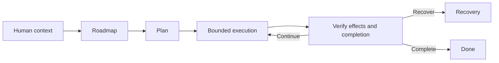

# LoopRelay

LoopRelay is an open-source CLI runtime that coordinates planning, decision formation, bounded implementation, context transfer, recovery, effect verification, and completion across long-running AI-assisted software work.

It automates a manual reasoning-to-Codex relay so an engineer can delegate implementation while keeping project goals, architecture, constraints, decisions, and newly learned context connected across agent sessions.

| Dimension | Current status |
| --- | --- |
| Release stage | Experimental, unreleased source preview; there are no repository tags or packaged releases |
| License | [MIT](LICENSE) |
| Primary provider | Codex CLI and its app-server protocol |
| Autonomous horizon | One selected epic; unbounded invocations are additionally capped at 32 continuation steps by default |
| Validation | Component tests, exact-profile fixtures, and a separate certification harness; no maintained CI workflow |
| External adoption | Sustained third-party use is not established by repository evidence |
| Human interaction | Durable CLI interaction surface exists; context-rich escalation and the intended post-decision review boundary are incomplete |
| Permissions | Incomplete; externally isolated execution is required |

> [!WARNING]
> LoopRelay's current permissions functionality is incomplete. Ordinary planning and execution sessions can run Codex with `danger-full-access`, network access, and approvals disabled. Run LoopRelay only inside an isolated virtual machine or similarly disposable environment containing no confidential data.
>
> Full-fidelity permissions are planned, not implemented. Comprehensive exfiltration protection remains aspirational until it is implemented and validated; environmental isolation currently compensates for incomplete internal controls.

## What LoopRelay does

LoopRelay carries repository-owned context through roadmap selection, planning, bounded execution, and verification:



The default command selects the evaluation chain when `.agents/evals/*.md` exists and the traditional chain otherwise. Both converge on `Plan -> Execute`. Bounded commands advance one named workflow cycle; `run` may continue to its configured step limit but does not start another epic after certified closure.

The human still owns the project context, operating environment, credentials, risk boundary, architecture decisions, responses to ambiguous states, and acceptance of the resulting software. LoopRelay attempts to reduce drift by persisting inputs, decisions, causal identities, outputs, and handoffs. It does not make a person's true intent inevitable or establish universal correctness.

### Why it exists

LoopRelay grew out of a manual workflow: one continuing reasoning conversation held project direction while focused Codex sessions implemented bounded work.

> The manual workflow worked well enough to become its own bottleneck.

The engineer became the transport layer for plans, decisions, constraints, and discoveries across sessions and repositories. LoopRelay automates that relay and its progression; it remains an orchestration runtime around engineering judgment, not a replacement for it.

### Operating philosophy

- Human judgment and project intent remain authoritative.
- Execution can be delegated, but only within an explicit bounded workflow.
- Evidence informs progression; it does not silently grant authority.

### Fit

LoopRelay is a stronger fit for:

- Individual engineers working across several repositories.
- Engineers already comfortable inspecting and correcting coding-agent work.
- Long-running work that benefits from explicit planning, causal history, context transfer, and unattended execution.
- Users willing to learn the artifact model and operate inside a disposable environment.

It is a poor fit for:

- Thin tasks or one repository already managed comfortably through one or two consoles.
- Workflows that require a low-configuration, interactive product experience.
- Environments where unrestricted agent execution cannot be isolated.
- Teams that require established third-party adoption, provider parity, or a stable packaged release today.

## Current capabilities

- **Roadmap and planning.** Traditional or evaluation inputs produce one epic, a reviewed plan, operational context, details, and bounded milestones. See the [workflow declarations](src/LoopRelay.Orchestration.Primitives/Workflows/CanonicalWorkflowDefinitionSketches.cs).
- **Decision continuity.** Execute creates, transfers, or continues a decision session while persisting provider identity, lineage, attempts, and turns. See [DecisionSession.cs](src/LoopRelay.Cli/Services/Decisions/DecisionSession.cs).
- **Bounded execution and handoff.** Each slice produces repository evidence, updated context, a handoff, publication work, and completion evidence. See [OrchestrationArtifactPaths.cs](src/LoopRelay.Orchestration.Primitives/Services/OrchestrationArtifactPaths.cs).
- **Recovery, effects, and completion.** Mutation intent is recorded before outward work. Unknown effects, recovery, workflow progression, and terminal settlement have separate authorities.
- **Causal history and storage.** Embedded SQLite records workflow, attempt, session, effect, recovery, interaction, and completion lineage, with explicit storage and compatibility commands.
- **Claim-specific certification.** A separate executable exercises disposable cases, deterministic oracles, live provider transitions, full chains, evidence privacy, and release accounting.

## Limits to understand first

| Area | Current boundary | Consequence |
| --- | --- | --- |
| Permissions | Ordinary sessions may use `danger-full-access`; internal permission and exfiltration controls are incomplete | External isolation is mandatory |
| Provider | Production composition is Codex-focused and exact-profile gated | Provider parity is not established |
| Autonomous horizon | One epic, with a per-invocation continuation cap | LoopRelay does not autonomously complete an indefinite roadmap |
| Human review | Durable interactions exist; rich escalation and the intended post-decision review point are incomplete | Some ambiguity becomes CLI action or a fail-closed state |
| Recovery | Exact resume/read covers a narrow profile set; reconstruction and native fork remain gated | Unsupported profiles can require manual reconciliation |
| Reliability and budgets | General autonomous reliability and universal token, time, or operation budgets are unproven | Operators must monitor long-running work, quota, and cost |
| Adoption and platform | Sustained third-party use is not established; release evidence is Windows-local-only | External usefulness and cross-platform behavior are not release claims |
| Release governance | No CI workflow, release tags, package, or cross-machine evidence owner | Treat the repository as experimental source, not a dependency |

## Architecture

The production path is `Program -> LoopRelayApplication -> CanonicalCliApplicationService -> OrchestrationKernel`. The kernel selects eligible work from one immutable workflow catalog; a transition runtime performs one already-authorized attempt. Provider transport lives in [LoopRelay.Agents](src/LoopRelay.Agents/), while effects, recovery, interactions, and completion remain separate owners under [LoopRelay.Orchestration.Primitives](src/LoopRelay.Orchestration.Primitives/) and [LoopRelay.Completion](src/LoopRelay.Completion/).

LoopRelay keeps collaborative project artifacts in Git and causal runtime facts in a ledger. `.agents/` contains human-readable context, plans, decisions, milestones, and handoffs. `.LoopRelay/persistence/looprelay.sqlite3` preserves identities, ordering, effect state, and authorization lineage that cannot safely be inferred from files alone.

For the detailed authority model, read the [orchestration baseline](docs/orchestration-baseline.md), [architecture decision register](docs/architecture/decisions/README.md), and [project-context contract](src/LoopRelay.Core/Services/ProjectContext/ProjectContextSourceContract.cs).

## Requirements

- [.NET SDK `10.0.301`](global.json); `latestFeature` roll-forward is enabled.
- Git, including an initialized target repository and any remote/upstream required by publication effects.
- Codex CLI available through `CODEX_EXECUTABLE`, with an authenticated local session. Run `codex login` and verify it with `codex login status`; see [Codex authentication](https://learn.chatgpt.com/docs/auth).
- A disposable VM or equivalent environment with no secrets or confidential repositories.
- A clean, versioned target repository and the exact nine-file project-context contract described below.
- PowerShell for the commands in this README. The current release-evidence contract is explicitly local-Windows-only; Linux and macOS agreement is not established.

No external database service is required; the projects use embedded SQLite.

## Installation

```powershell
git clone https://github.com/LoopRelay/LoopRelay
Set-Location LoopRelay
dotnet restore LoopRelay.slnx
dotnet build LoopRelay.slnx --no-restore
```

Run from source with `dotnet run --project src/LoopRelay.Cli --no-build -- ...`. There is no .NET tool package or installer.

On Windows, the repository also provides a framework-dependent publish script:

```powershell
.\publish-cli.bat C:\tools\looprelay
```

The script publishes `LoopRelay.CLI.exe` and creates `settings.json` from [the default template](config/settings.default.json) only when a settings file is absent.

## Configuration and repository preparation

Settings resolution is strict and uses this order:

1. `LOOPRELAY_SETTINGS_PATH`.
2. `settings.json` beside the running executable.
3. `settings.default.json` beside the executable as a development fallback.

The checked-in template selects a model and effort, operational limits, decision resume/recovery behavior, telemetry, and the current command-permission policy. Unknown fields and invalid values fail composition instead of being ignored.

| Environment input | Purpose |
| --- | --- |
| `CODEX_EXECUTABLE` | Required Codex executable name or path; `capabilities` reports it missing when unset |
| `CODEX_HOME` | Optional Codex state location; the user-profile default is used when absent |
| `LOOPRELAY_SETTINGS_PATH` | Explicit LoopRelay settings file |
| `LoopRelay_DECISION_RESUME` | `0` or `false` disables resume without deleting active continuity state |
| `LoopRelay_DECISION_RECOVERY_POLICY` | `resume-only`, `reconstructed`, or `certified` |
| `LoopRelay_SESSION_LOG` | `0` or `false` disables session telemetry |

The target repository must contain exactly these numbered files under `.agents/ctx/`:

```text
01-purpose.md
02-capability-model.md
03-invariants.md
04-strategic-structure.md
05-authority-model.md
06-evaluation-model.md
07-drift-and-false-success.md
08-vocabulary.md
09-eval-details.md
```

Populate them with repository-specific context and commit them before running a workflow. Additional numbered Markdown files violate the current contract. Add `.LoopRelay/` to the target repository's `.gitignore` before initialization: `storage init` creates the database but does **not** create that ignore rule. Generated collaborative artifacts under `.agents/` are intended to be versioned.

## Provider-free quick start

After these commands, LoopRelay will have initialized its runtime, verified storage health, inspected the workspace, and reported the next executable transition without dispatching an AI session:

```powershell
$target = 'C:\src\your-project'
$env:CODEX_EXECUTABLE = (Get-Command codex).Source

dotnet run --project src/LoopRelay.Cli --no-build -- --repo $target storage init
dotnet run --project src/LoopRelay.Cli --no-build -- --repo $target storage verify
dotnet run --project src/LoopRelay.Cli --no-build -- --repo $target status
dotnet run --project src/LoopRelay.Cli --no-build -- --repo $target capabilities
```

Success means initialization reports `Lifecycle: Completed`, verification reports `Storage health: Healthy`, and status prints a workspace, schema, catalog, selected chain, current stage, and next eligible transition. The canonical state appears at `<target>/.LoopRelay/persistence/looprelay.sqlite3`.

### First workflow

There is not yet a checked-in target-repository initializer or safe demo fixture. Before a real run, complete the nine context files, authenticate Codex, commit declared inputs, configure any required Git remote, and take a VM snapshot. Then select one chain:

```powershell
# Traditional roadmap -> Plan -> Execute
dotnet run --project src/LoopRelay.Cli --no-build -- --repo $target --traditional run

# Evaluation roadmap -> Plan -> Execute; requires .agents/evals/*.md
dotnet run --project src/LoopRelay.Cli --no-build -- --repo $target --eval run
```

These commands may invoke unrestricted provider work, modify `.agents/`, commit Git state, and schedule publication effects. Ctrl+C requests cancellation and returns exit code `130`. After stopping, inspect `status`, `storage verify`, Git state, and generated artifacts. Missing output after dispatch is not proof that no external effect occurred.

For controlled advancement, `traditional`, `eval`, `plan`, and `execute` run their named bounded workflow mode. The public command grammar is implemented in [CliSurface.cs](src/LoopRelay.Cli.Surface/CliSurface.cs):

| Command | Behavior |
| --- | --- |
| `run` or no command | Run the selected chain, bounded by policy |
| `traditional`, `eval`, `plan`, `execute` | Run one bounded named workflow mode |
| `status` | Read-only selection, gates, storage, continuity, effects, and required actions |
| `storage init|migrate|export [path]|sync|verify` | Explicit storage operations |
| `import detect|preview|execute|verify [identity]` | One-way compatibility import |
| `recovery inspect|plan|execute <identity>` | Inspect and act on durable recovery work |
| `interactions list|show|respond|cancel` | Inspect or resolve durable human interactions |
| `completion status|reconcile` | Observe or reconcile completion work |
| `capabilities` | Record and report runtime prerequisites |

Global options are `--repo <path>`, `--eval`, `--traditional`, `--interactive`, and repeated `--policy <key>=<value>`. The main CLI does not currently implement `--help`; invalid syntax returns exit code `2`. Other exit codes are `0` for completion or passive waiting, `1` for failure, `3` for a stall, `4` for ambiguous/blocked/action-required states, and `130` for cancellation.

## Project artifacts

| Artifact | Role |
| --- | --- |
| `.agents/ctx/*.md` | Human-owned project context in one canonical order |
| `.agents/epic.md`, `.agents/specs/`, `.agents/plan.md`, `.agents/details.md` | Prepared epic, executable plan, milestone linkage, and persistent detail |
| `.agents/milestones/` | Bounded implementation checklists |
| `.agents/operational_context.md` and `.agents/decisions/` | Current execution context, operational direction, history, and advisory model recommendation |
| `.agents/handoffs/` and `.agents/deltas/` | Newly learned information and rotated context-transfer history |
| `.LoopRelay/persistence/looprelay.sqlite3` | Canonical runtime ledger |
| `.LoopRelay/telemetry/` | Compatibility JSONL telemetry export; not canonical authority |

## Recovery and unknown outcomes

A provider or process error after dispatch may have unknown external effects. LoopRelay records `Started` before outward work and does not treat a missing terminal observation as permission to resend. The attempt becomes recovery work; canonical state must be re-observed and an immutable recovery plan persisted before resume, reconciliation, retry, or successor authorization.

Recovery, effect settlement, workflow progression, and completion are separate operations. Use `status` to find the causal or recovery identity, then `recovery inspect <identity>` before planning or executing recovery. Do not delete the SQLite database, edit it manually, or blindly rerun an ambiguous attempt. See [ADR-0008](docs/architecture/decisions/0008-single-attempt-runtime-and-recovery-coordinator.md) and [ADR-0013](docs/architecture/decisions/0013-recovery-cancellation-and-profile-authority.md).

## Verification and certification

Run the component suite with:

```powershell
dotnet test LoopRelay.slnx --no-build --no-restore
```

Provider-dependent approval and posture behavior is certified outside the component suite by explicit live campaigns. Those campaigns require environment inputs and may consume provider quota; a green component suite does not establish assembled-product reliability.

The certification executable documents its commands with:

```powershell
dotnet run --project src/LoopRelay.Certification -- --help
```

After a Debug build, deterministic disposable-repository certifications can run without provider credentials:

```powershell
dotnet run --project src/LoopRelay.Certification -- canary --workspace . --cli src/LoopRelay.Cli/bin/Debug/net10.0/LoopRelay.Cli.dll
dotnet run --project src/LoopRelay.Certification -- milestone2 --workspace . --cli src/LoopRelay.Cli/bin/Debug/net10.0/LoopRelay.Cli.dll
```

Live commands require `--codex <path>` and `--auth <path>`, may consume provider quota, and belong only in disposable cases. `milestone3` is the canonical live gate for Codex approval and posture behavior: it checks the exact provider profile, read-only `xhigh` acceptance, approval before mutation, precise file-change paths, declined-write completion, and scoped accepted writes. `milestone13` and `milestone14` exercise the traditional and evaluation full chains. Evidence defaults to `.tmp/certification/`; `--case-root` changes the location and `--retain-case` prevents cleanup.

Checked-in [Codex compatibility fixtures](tests/LoopRelay.Agents.Compatibility.Tests/Fixtures/README.md) cover exact versions `0.142.5`, `0.144.0`, and `0.144.1`. They support exact-ID read/resume claims. Conversation reconstruction limits and lost-response fork reconciliation remain uncertified, so reconstruction and native fork stay gated.

## Evidence boundary

The repository lacks portable evidence for previously cited counters of 3,130 agent turns, fourteen epic transitions, and 1,576 passing tests, so they are not current claims. Code, tests, fixtures, ADRs, and certification support only named implementation and exercised-path claims—not third-party usefulness, intervention-free operation, universal correctness, or general reliability.

Current technical risks are tracked in [orchestration known risks](docs/orchestration-known-risks.md) and the [issues directory](issues/).

## Repository map

```text
LoopRelay/
├── src/
│   ├── LoopRelay.Cli/                     production composition and adapters
│   ├── LoopRelay.Application/             typed application boundary and read model
│   ├── LoopRelay.Orchestration.Primitives/ workflow catalog, kernel, storage, effects, recovery
│   ├── LoopRelay.Agents/                  provider sessions and Codex transport
│   ├── LoopRelay.Core/                    identities, artifacts, prompts, SQLite schema
│   ├── LoopRelay.Permissions/             configuration and permission evaluation
│   ├── LoopRelay.Completion/              completion decisions and closure
│   └── LoopRelay.Certification/           deterministic and live certification
├── tests/                                 component, architecture, and compatibility tests
├── docs/architecture/decisions/           accepted architecture decisions
├── config/settings.default.json           strict configuration template
└── .agents/                               this repository's active plans and evidence
```

Start with [LoopRelay.Cli](src/LoopRelay.Cli/), [LoopRelay.Application](src/LoopRelay.Application/), and [LoopRelay.Orchestration.Primitives](src/LoopRelay.Orchestration.Primitives/) for the production path. Use the [tests](tests/), [decision register](docs/architecture/decisions/), and [certification harness](src/LoopRelay.Certification/) to inspect evidence and rationale.

## Troubleshooting

| Symptom | Inspect or act |
| --- | --- |
| Missing settings or Codex executable | Set `LOOPRELAY_SETTINGS_PATH` and `CODEX_EXECUTABLE` as needed, then run `capabilities` |
| Project Context contract violation | Restore the exact nine `.agents/ctx/` files and remove extra numbered files |
| Missing/unusable storage | Run `storage verify`; use `storage init` only when absent and `storage migrate` only for a supported upgrade |
| Dirty declared input | Commit it first, or inspect the durable request with `interactions list` and `interactions show <id>` |
| Continuity disabled or unsupported profile | Inspect status and compare the exact Codex version/schema with the checked-in fixtures; continuity fails closed |
| Recovery required/unknown outcome | Inspect the recovery identity and canonical Git/storage state; never infer non-execution from missing output |
| Repeated no-change stop | Inspect `.LoopRelay/evidence/execute-stall/`, status, decisions, and the configured `maxNoChangesCommits` policy |
| `--help` returns a syntax error | Use the command table above; main-CLI help output is not implemented |

## Active development

There is no public release roadmap beyond the completed [architecture-convergence plan](.agents/plan.md). Current problem areas include permissions, richer interactions, recovery/effect reconciliation, cross-platform evidence, evaluation-driven planning, and external-user validation; they are not release commitments.

## Contributing

There is no `CONTRIBUTING.md` or automated pull-request workflow. Small fixes should include an issue, observable evidence, and relevant tests. Large workflow, authority, storage, provider, permission, or completion changes should begin with an issue and usually an ADR; preserve ownership boundaries in the [orchestration baseline](docs/orchestration-baseline.md).

Before proposing a change, run restore, build, affected tests, and the full suite where practical. Label provider-dependent validation, cost, exact Codex profile, skipped cases, and evidence scope.

The repository has no documented private security-reporting channel. Do not place exploit details or confidential data in a public issue; publishing a security policy and contact path remains a project gap.

## License

LoopRelay is available under the [MIT License](LICENSE).
