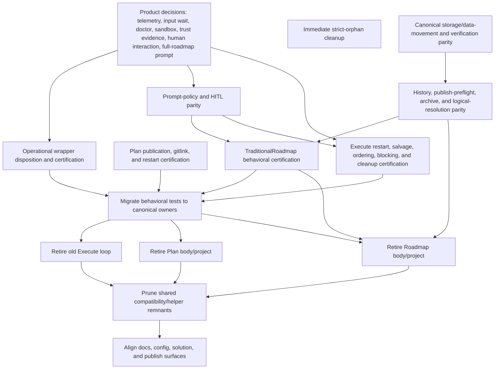

# Architectural Retirement Strategy Audit

Date: 2026-07-10  
Repository: `C:\kernritsu\LoopRelay`  
Production revision analyzed: `3ed77d9962ba181c11afa9dd8472938117ef3c4f`  
Current HEAD: `777d30cb07bbd65c968e13a0a0b4ac488bdee765` (documentation-only changes after the production revision)  
Authoritative input: `orphaned-code-audit.md`  
Output scope: this report only; no production code, tests, configuration, or documentation were changed.

## 1. Executive Summary

LoopRelay should converge on `LoopRelay.Cli`, `CanonicalWorkflowDefinitionSketches`, `WorkflowResolver`, `TransitionRuntime`, `WorkflowController`, `WorkflowChainRunner`, and canonical workflow persistence as the only production orchestration architecture. The retired Roadmap and Plan entrypoints, the old `LoopRunner`, and the duplicate workflow catalogs should not survive as alternate authorities.

The repository is not yet safe for wholesale retirement, however. Disconnection confidence is high, but deletion confidence is materially lower. The authoritative orphan audit proves that the legacy bodies are outside production. This audit finds that several intentional behaviors are either still unique to those bodies or are not certified in the canonical implementation.

The decisive findings are:

1. **The Roadmap body is only partially replaced.** The unified CLI owns the workflow shape and basic prompt/product lifecycle, but the active storage commands do not perform legacy import, export, or sync. `RunStorageSyncAsync` creates/updates the database schema and metadata; export explicitly performs no filesystem mutation. The active `FileSystemStorageVerifier` also omits the legacy verifier's stale-export, conflict, unresolved-reference, archive-recovery, and round-trip checks. Roadmap retirement is therefore gated by behavior migration and compatibility certification, not merely test migration.
2. **The Plan body is only partially replaced.** Warm authoring and scoped artifact operations have canonical implementations and focused tests. Publication and parent-gitlink effects are declared in workflow metadata, but the Plan effect path only materializes evidence and persistence records. The only production construction of `AgentsSubmodulePublisher` in the unified composition is the Execute `PublishRepositoryState` transition. Plan publication behavior remains unique to the retired Plan pipeline.
3. **The old Execute loop is only partially replaced.** The canonical Execute workflow preserves most core behavior, but restart between implementation and handoff loses the held-open session; cancellation does not perform legacy best-effort `.agents` salvage; post-execution review now runs after commit evaluation rather than before it; and completion-review/certification blocks are converted to prompt failures instead of the blocked outcome/exit-code path. The production completion path also no longer clears completed-epic decision resume state.
4. **Operational wrappers were bypassed, not replaced.** Session telemetry, SQLite/JSONL telemetry export, usage-limit wait/retry, and input-wait diagnostics are absent from production composition. `README.md` still states that telemetry is canonical in SQLite and that `LoopRelay_SESSION_LOG` disables recording. Repository documentation therefore supports reconnection unless product intent explicitly retires the feature.
5. **Persistence and completion compatibility are split across incompatible owners.** Production `LoopArtifacts` defaults to file-backed history, while the active completion logical resolver looks up decision/handoff/delta history in SQLite. Recent file-backed handoff histories can consequently be listed and then omitted from completion prompt context. SQLite archive materialization and archive recovery are also uncomposed.
6. **Prompt-policy and human-interaction behavior regressed.** `artifactPolicy` is loaded but only permission settings are passed into production composition. The ten prompt-specific Roadmap policy fragments are absent from unified prompt rendering. The repository observer always emits an empty human-interaction list, and the production `DecisionSession` is created without the HITL request-capture service even though status exposes “User action required.”
7. **A small strict-orphan set is safe now.** Obsolete decision seed prompts, wholly unreferenced generic prompt fragments, redundant workflow wrappers, the old console completion adapter, unused ownership constants, and unused generic outcome DTOs can be retired independently. The uncompiled `CreateNewRoadmap` asset is not in that set because its 258 lines represent an unresolved product-intent question.

The safest convergence strategy is therefore: remove the strict low-risk debris in parallel; settle the small set of product decisions; certify and migrate storage, Plan publication, Execute recovery/outcome semantics, Roadmap rigor, prompt policy, and operational wrappers; migrate behavioral tests to canonical owners; then delete the old Execute loop, Plan body, and Roadmap body in that order. The Roadmap project must be last because it still contains the authoritative executable specification for storage and migration behavior.

## 2. Legacy Architecture Reconstruction

### 2.1 Architectural eras

| Era | Architecture | Intent | Why implementation remains |
|---|---|---|---|
| Separate-product era | `LoopRelay.Roadmap.Cli` state machine, `LoopRelay.Plan.Cli` fixed pipeline, and `LoopRelay.Cli` execution loop | Give Roadmap, Plan, and Execute independent orchestration, persistence, prompt, and CLI ownership | Each implementation accumulated its own tests, DTOs, persistence models, and composition root |
| Operational-hardening era | Sandboxed operational-context transfer, telemetry/quota decorators, prompt-specific artifact policy, HITL capture, trust evidence, SQLite loop history, archive materialization/recovery | Add robustness, observability, compatibility, and policy controls around the separate products | These capabilities were attached at composition boundaries rather than embedded in the agent runtime or canonical contracts |
| Canonical-unification era (`3ed77d99`) | One public CLI, four workflow identities, canonical products/gates, one resolver/runtime/controller/chaining model, canonical SQLite workflow state | Replace duplicate orchestration authorities and make repository evidence authoritative | The commit deleted all three old composition roots but retained nearly all implementation and legacy tests; new wrappers were added but production used `CreateAll()` directly |
| Current state | Unified production path plus compiled/tested architectural shadows | Finish the canonical migration while preserving behavior | Green legacy tests prove the old implementation still works, not that the new implementation preserves the same behavior |

### 2.2 The architectural break

Commit `3ed77d99` deleted `LoopCliComposition`, `PlanCliComposition`, and `RoadmapCliComposition`, changed Plan and Roadmap programs into retirement stubs, and introduced roughly 20,000 lines of canonical orchestration. It did not remove the old implementation bodies. The prior `LoopCliComposition` had explicitly composed input-wait observation, telemetry recording, usage-limit retry, SQLite archive materialization, SQLite publish preflight, the console completion observer, `ExecutionStep`, and `LoopRunner`. Their absence from `UnifiedCliComposition` is positive evidence of a bypassing migration.

The migration records in `.agents/milestones/m5-traditional-roadmap.md` through `m9-unified-cli-certification.md` mark behavioral preservation and retirement complete. Several assertions are contradicted by current production composition:

| Recorded migration claim | Current production evidence | Architectural consequence |
|---|---|---|
| Storage import/export/sync is wired to shared storage | `UnifiedCliRunner.RunStorageSyncAsync` only ensures schema/metadata; export states that it performs no filesystem mutation | Legacy storage behavior is not replaced |
| Plan publication and parent gitlink are ordered effects | Plan effect handling writes evidence/product/state records; it never constructs the publisher or executes a gitlink action | Plan is not behaviorally complete |
| Roadmap rigor is preserved | `AddTraditionalRoadmapRigorEvidenceAsync` writes a Markdown explanation mapping legacy concepts to generic canonical records; legacy stores and coordinators are not invoked | The mapping is an architectural claim, not parity proof |
| Plan and Execute recover across interruption | `RevisePlan` requires an in-memory `planAuthoringSession`; `GenerateHandoff` requires an in-memory `executionSession` | Cross-process recovery is incomplete |
| Completion blocks remain explicit | the unified completion path throws on blocked review/certification, which becomes a failed prompt result | Blocked and failed outcomes are conflated |
| Runtime persistence includes telemetry and canonical histories | telemetry is uncomposed; loop histories default to files while completion resolves those histories from SQLite | Persistence ownership is internally inconsistent |

These contradictions do not invalidate the authoritative reachability audit. They reduce retirement readiness and identify behavior that must converge before deletion.

## 3. Behavioral Inventory

The inventory below treats behavior—not source files—as the retirement unit.

| Behavior domain | Legacy/orphan owner | Production importance | Current production owner | Current state | Intent assessment |
|---|---|---:|---|---|---|
| Roadmap workflow ordering and stage selection | C-01 Roadmap state machine | Critical | Canonical workflow definitions, resolver, controller, transition runtime | Exists | Intentionally replaced |
| Roadmap projection freshness, prompt/input snapshots, selection provenance, promotion, lifecycle, decision ledger, split lineage, blocker/recovery evidence | C-01 Roadmap transition/persistence services | Critical | Generic canonical prompt hashes, input hashes, products, transition/effect/blocker/recovery rows | Partial semantic mapping; detailed parity is unproven | Intended to be preserved; accidental loss remains possible |
| Roadmap storage verify/import/export/sync and legacy workspace round-trip | C-01 plus E-10 adapter | Critical | `FileSystemStorageVerifier`, `LoopRelayWorkspaceDatabase`, unified storage commands | Basic verification exists; data movement and detailed conformance do not | Required by baseline and M9; not intentionally removed |
| Roadmap prompt-specific implementation-first/auxiliary policy | C-16 | High | Generated prompt asset plus one-shot unified execution | Prompt-specific sections and `artifactPolicy` behavior absent | Required by configuration/tests; likely accidentally lost |
| Plan authoring/revision warm session | C-02 | High | Unified Plan warm-session execution | Preserved for one process | Intentional replacement; restart behavior remains incomplete |
| Plan adversarial projection/review and scoped artifact mutation/rollback | C-02 | High | Unified Plan prompt context, permission profiles, mutation transaction, validators | Substantially preserved | Intentional replacement |
| Plan `.agents` publication and parent gitlink | C-02 | High | Declared canonical effect metadata | Not actually executed in Plan | Required baseline behavior; accidentally lost |
| Execute decision routing, transfer, continuation | C-03 old loop plus shared active `DecisionSession` | Critical | Canonical Execute transitions using `DecisionSession` | Mostly preserved | Intentional replacement, with resume/HITL composition gaps |
| First execution directly from plan (`StartExecution`) | C-03 | Medium | Canonical decision-first flow using `ContinueExecution` | Does not exist | Canonical workflow intentionally changed sequencing; retire after confirming product intent |
| Implementation/handoff held-open session | C-03 | Critical | Unified Execute prompt executor | Preserved within one process; not restartable | Partial replacement |
| Cancellation/failure `.agents` salvage | C-03 | High | No canonical owner | Missing | Accidental loss unless product explicitly rejects salvage |
| Post-execution non-implementation review ordering | C-03 | High | Canonical completion stage | Exists after publication/commit evaluation rather than before commit | Behavioral ordering regression |
| Stall detection and milestone-only progress | C-03 | High | Canonical persisted stall evidence plus `CommitGate` | Preserved and made durable | Fully replaced |
| Completion review/certification/archive/route | C-03/C-07 | Critical | Execute completion stage and `LoopRelay.Completion` | Core behavior exists; block mapping, SQLite materialization, recovery, and resume cleanup differ | Partial replacement |
| Session telemetry and compatibility JSONL | C-04 | Medium/High operational | No production owner | Missing | Documentation says still supported |
| Usage-limit diagnosis, waiting, and bounded retry | C-04/E-08 | High operational | No production owner | Missing; failures surface immediately | Likely accidental loss |
| Input-wait progress and input sizing diagnostics | C-05 | Medium operational | No production owner | Missing | Human decision required |
| Loop decision/handoff/delta history authority | C-06 | High | File-backed `LoopArtifacts`; SQLite canonical workflow records | Split ownership; SQLite legacy history unused | Partial replacement with completion-context regression |
| Publish-time fresh-export/storage preflight | C-06 | High safety | Invocation-start storage verification | Only checked before workflow mutation, not at publish boundary | Partial replacement |
| SQLite archive materialization and archive recovery | C-07 | High compatibility | File-based archive service and evidence loader | Live files archive; SQLite-only history/evidence recovery absent | Partial replacement |
| Retained/migrated logical artifact resolution and canonical hashing | C-08 | High compatibility | Completion-specific SQLite-history/file-evidence resolver plus direct repository observation | Narrower provider set; file-backed migrated histories are omitted | Partial replacement |
| Roadmap execution trust posture and persistent/one-shot authority evidence | C-09 | Medium observability | Agent session specs and permissions configuration | Execution posture exists; legacy evidence model is absent | Old Roadmap execution bridge intentionally retired; evidence obligation undecided |
| Repository-relative artifact facade and numbered sequences | C-10 | Low | Direct artifact stores plus domain-specific helpers | Behavior available elsewhere | Fully replaceable after legacy tests |
| Runtime prerequisite diagnostics | C-11 | Medium operability | Late failures from executable resolver/config use | No diagnostic command/startup gate | Bypassed; intent undecided |
| Isolated temp-workspace operational-context evolution | C-12 | High security/cost | Repository-root scoped permission profile and rollback transaction | Write scope is constrained; physical isolation and bounded exploration are lost | Partial replacement |
| Workflow-definition invariant validation | C-13 | Test/build | `WorkflowDefinitionValidator` called by canonical tests | Active for tests, intentionally absent from runtime | Retain as test/build behavior; remove from production project only after relocation |
| Canonical chain catalog | C-14 and active `CreateChains()` | Medium | `CanonicalWorkflowDefinitionSketches.CreateChains()` | Duplicated only for tests | Fully replaced |
| Non-implementation terms/ownership constants | C-15/E-06 | Low | Active enums, models, services, documentation | Constants have no production behavior | Fully replaced |
| Human interaction requirements in repository observation | E-09 | High UX/recovery | Generic blockers and status formatter | Model is always empty; status cannot consume structured requirements | Bypassed; intended behavior unresolved |
| Obsolete prompt seeds/fragments/full-roadmap asset | E-01/E-02/E-03 | Varies | Active decision flow, generic composer, current Roadmap/Eval prompts | Seed/fragments obsolete; full-roadmap behavior has no owner | Mixed; E-03 requires decision |

## 4. Replacement Matrix

This matrix classifies every authoritative orphan-audit finding.

| ID | Replacement classification | Why it exists today / what replaced it | Retirement disposition |
|---|---|---|---|
| E-01 | **Intentionally Retired** | The decision flow removed the separate seed turn and primes proposal generation directly | Safe immediate removal |
| E-02 | **Fully Replaced** | Generic implementation-first behavior is owned by `ImplementationFirstPromptPolicyComposer`; these prompt inputs have no consumer | Safe immediate removal |
| E-03 | **Unknown** | A full-roadmap prompt was added without `.prompt` and contains an unresolved `{implementationFirstThinking}` placeholder; no current workflow owns full-roadmap generation | Human decision required: intentionally register a product owner or remove |
| E-04 | **Fully Replaced** | Completion phase reporting is owned by `CompletionPhaseEvidenceObserver` in the unified completion path | Safe immediate removal |
| E-05 | **Fully Replaced** | Production and tests can use `CanonicalWorkflowDefinitionSketches` directly | Safe immediate removal |
| E-06 | **Fully Replaced** | Ownership is expressed by active services/contracts and documentation, not runtime constants | Safe immediate removal |
| E-07 | **Fully Replaced** | `TransitionRuntimeResult`, `WorkflowControllerResult`, and `WorkflowChainRunResult` are canonical | Safe immediate removal |
| E-08 | **Bypassed** | The delay adapter lost its composition root with telemetry/quota gating | Reconnect with quota behavior if retained; otherwise remove with C-04 after documentation decision |
| E-09 | **Bypassed** | The observer contract anticipated structured human interaction, but all producers pass an empty list | Human decision required; do not remove while status/product requirements still promise user-action explainability |
| E-10 | **Mixed / Partially Replaced** | Four wrappers/adapters are redundant, but `CanonicalStorageVerifierAdapter` represents an uncompleted bridge from detailed legacy verification to the canonical contract | Remove the four redundant types now; retain the adapter only as migration evidence until storage behavior is canonical, then remove it with Roadmap |
| C-01 | **Partially Replaced** | Canonical workflows replace orchestration; storage, detailed rigor, HITL capture, and migration behavior remain unique or uncertified | Remove after behavior and test migration; Roadmap body last |
| C-02 | **Partially Replaced** | Canonical Plan replaces sequencing, sessions, review, and scoped operations; publication/gitlink effects remain absent | Remove after Plan effect parity and test migration |
| C-03 | **Partially Replaced** | Canonical Execute replaces the loop; salvage, restart, outcome mapping, review order, and completion cleanup remain different | Remove after Execute parity and test migration |
| C-04 | **Bypassed** | Unified composition resolves the undecorated `IAgentRuntime` | Reconnect is the evidence-backed default; removal requires an explicit product decision and compatibility-doc cleanup |
| C-05 | **Bypassed** | Input-wait observation was a decorator in the removed composition | Human decision required; reconnect with operational observability or remove as one unit |
| C-06 | **Partially Replaced** | Canonical SQLite workflow state exists, but loop history defaults to files and publish-time storage preflight has no canonical equivalent | Remove after history authority and publish-safety behavior converge |
| C-07 | **Partially Replaced** | File archive/certification remains active; SQLite materialization and recovery do not | Remove after compatibility-window decision and archive migration certification |
| C-08 | **Partially Replaced** | Completion has a narrower resolver; repository observation reads some legacy evidence independently | Remove after retained/filesystem/SQLite resolution matrix is certified |
| C-09 | **Intentionally Retired, with observability caveat** | The Roadmap execution bridge is migration-only; Execute owns implementation sessions | Remove after deciding whether trust-posture evidence remains a product/audit requirement |
| C-10 | **Fully Replaced** | Current domains use direct or specialized artifact services | Remove after legacy and helper tests migrate |
| C-11 | **Bypassed** | No `doctor` command or startup gate replaced early diagnostics | Human decision required |
| C-12 | **Partially Replaced** | Permission profiles and rollback replace write control; physical isolation and exploration-cost containment do not | Remove after security/operational parity decision and certification |
| C-13 | **Bypassed in runtime; active as test tooling** | Static canonical definitions are validated by tests, not production | Preserve behavior; move to test/build tooling before removing production-source ownership |
| C-14 | **Fully Replaced / Duplicated** | `CreateChains()` is the canonical active catalog | Redirect tests, then remove duplicate catalog |
| C-15 | **Fully Replaced** | Active terms live in actual model/service behavior | Remove or move the sole test datum into tests |
| C-16 | **Partially Replaced** | Core Roadmap prompts remain, but prompt-specific implementation-first and auxiliary-artifact sections are not rendered by the unified path | Preserve/migrate policy behavior before removing assets/tests |

## 5. Behavioral Parity Analysis

| Subsystem | Functionality | Correctness/robustness | Failure/recovery | Observability | Compatibility/operations | Parity verdict |
|---|---|---|---|---|---|---|
| TraditionalRoadmap | Basic transition sequence and products exist | Generic validation exists; legacy promotion, provenance, lifecycle, split, and ledger semantics are not cross-certified | Canonical blockers/recovery exist, but legacy recovery intent is only mapped conceptually | Canonical evidence is strong but may record claims rather than domain-equivalent facts | Detailed storage and old-state continuation are incomplete | **Insufficient for deletion** |
| Plan | Authoring, review, revision, context, details, milestones exist | Scoped rollback and output validation are strong | Warm session cannot survive process restart | Canonical evidence is present | Publication/gitlink behavior is missing | **Insufficient for deletion** |
| Execute | Decision, implementation, handoff, publication, commit, review, completion exist | Core transition gates are stronger; review ordering changed | In-memory handoff dependency, no cancellation salvage, stale resume cleanup, and block/fail conflation remain | Durable transition/stall evidence is improved; trust/telemetry are reduced | History/archive authority is split | **Insufficient for deletion** |
| Telemetry/quota | No production functionality | Tested implementation remains robust in isolation | Bounded quota retry is absent | Documented telemetry is absent | JSONL compatibility consumers receive no new events | **Bypassed regression** |
| Input-wait | No production functionality | Tested in isolation | Cancellation behavior exists only in legacy wrapper tests | No production progress or wait metrics | No current owner | **Bypassed; intent undecided** |
| Storage commands/verification | Init and basic DB checks exist | Corrupt/unsupported/partial-transaction checks exist; stale/conflict/round-trip/reference checks are absent | Explicit repair remains manual, but import/export/sync do not perform their named data operations | Unified output can overstate completion | Existing filesystem/SQLite workspaces are not behaviorally round-tripped | **Critical parity gap** |
| Loop history/completion resolver | Live behavior uses file history | Completion resolver expects SQLite history for the same logical paths | Missing records are silently omitted when optional | Completion context loses history without a clear warning | File-backed, imported, and canonical SQLite modes diverge | **Critical ownership gap** |
| Archive/recovery | File archive and synthesis work | Live-file validation remains | SQLite materialization and recovery are uncomposed | Phase evidence is good | SQLite-only migrated evidence may not enter the final archive | **Compatibility gap** |
| Prompt policy/HITL | Generic policy exists in some flows | Roadmap-specific policy/config and HITL capture are absent | Human review requirements can be lost before completion | Status has no structured human requirement source | `artifactPolicy` configuration is ineffective | **Behavioral regression** |
| Runtime doctor/sandbox/trust | Later runtime failure, permission profiles, and session specs exist | Write control is partially preserved | Early diagnosis and physical-isolation fallback are absent | Trust evidence is absent | Token/exploration characteristics changed | **Decision required** |

### 5.1 Specific regression evidence that must gate retirement

- `UnifiedCliRunner.RunStorageSyncAsync` labels operations complete without importing/exporting repository data.
- `UnifiedCliComposition` loads `CliSettings`, but only `settings.Permissions` is passed into DI; `settings.ArtifactPolicy` has no production consumer.
- Plan transitions declare `Publication` and `Git` effects, but `UnifiedEffectExecutor` records those definitions without executing Plan publication. `AgentsSubmodulePublisher` is constructed only for Execute publication.
- `RevisePlan` and `GenerateHandoff` explicitly fail when their in-memory sessions are absent. Canonical persistence cannot reconstruct those sessions after process exit.
- `ExecuteCompletionCertificationAsync` throws for both blocked and failed completion outcomes; the runtime therefore reports failure rather than preserving the blocked outcome and exit code `4`.
- `LoopRunner` cleared decision resume state on completed epic; production no longer constructs it, and no canonical completion path performs the clear.
- `CreateLoopArtifacts()` uses the default file-backed history. `CompletionLogicalArtifactServices` resolves historical decision/handoff/delta paths from SQLite, not the file-backed history that production currently writes.
- `RepositoryObserver` always supplies `HumanInteractionRequirements: []`; the production `DecisionSession` also omits the optional HITL request-capture dependency.
- `AddTraditionalRoadmapRigorEvidenceAsync` documents expected correspondences but does not itself perform selection-provenance, lifecycle, decision-ledger, split-lineage, or legacy storage operations.

## 6. Canonical Ownership Matrix

| Production behavior | Required single canonical owner | Current ownership problem | Target ownership decision |
|---|---|---|---|
| Workflow/stage/transition progression | `WorkflowResolver` + `WorkflowController` + `TransitionRuntime` | Legacy state machine/pipeline/loop remain compiled and test-authoritative | Canonical stack only |
| Workflow definitions and chains | `CanonicalWorkflowDefinitionSketches` | Wrapper definitions and `CanonicalWorkflowChains` duplicate access paths | `CreateAll()` / `CreateChains()` only |
| TraditionalRoadmap domain behavior | Canonical TraditionalRoadmap transitions, products, validators, effects | Legacy domain stores remain the only detailed behavioral specification | Canonical owner after cross-behavior certification |
| Plan lifecycle | Canonical Plan definition and executor | Legacy pipeline still uniquely owns publication/gitlink | Canonical Plan after effect parity |
| Execute lifecycle and closure | Canonical Execute definition and completion stage | Old loop uniquely owns salvage and some outcome/cleanup semantics | Canonical Execute after parity closure |
| Storage authority and commands | Shared canonical storage services exposed by unified CLI | Legacy Roadmap owns real data movement/detailed verification; unified commands own labels only | One canonical storage owner before Roadmap deletion |
| Decision/handoff/delta history | One canonical history authority usable by execution and completion | Production writer and completion reader select different representations | One representation policy with certified compatibility readers |
| Completion archive and recovery | `LoopRelay.Completion` behind canonical Execute | Optional SQLite materializer/recovery uncomposed | Completion project owns both active archive and compatibility behavior |
| Session telemetry/quota/input wait | Agent-runtime composition boundary | No production owner | Explicitly reconnect one decorator chain or intentionally retire all claims |
| Artifact policy and HITL | Canonical prompt renderer/executor plus non-implementation review services | Configuration and prompt-specific sections have no active owner | One policy owner across Roadmap/Plan/Execute |
| Human interaction/status | Repository observation and canonical blockers/requirements | Structured requirement model has no producer | Populate and consume one canonical model, or remove the promise and contract |
| Trust/sandbox/runtime prerequisites | Agent/runtime infrastructure | Three disconnected evidence/diagnostic/isolation models | Decide which operational guarantees remain products, then centralize ownership |
| Workflow definition validation | Test/build certification | Validator lives in production source while only tests call it | Test/build owner; no second runtime authority |

## 7. Architectural Clusters

| Cluster | Findings | Cohesive retirement boundary | Reason not to fragment |
|---|---|---|---|
| A. Legacy workflow authorities | C-01, C-02, C-03, E-05, most E-10, C-14 | Roadmap, Plan, and Execute retire separately after their canonical behavior gates pass | Each body and its tests encode one workflow's behavior; deletion before parity loses the executable specification |
| B. Operational runtime wrappers | C-04, C-05, E-08, C-11 | Telemetry, quota, input-wait, and prerequisite diagnostics decision | They share the agent-runtime composition and user-facing operational contract |
| C. Persistence and compatibility | C-06, C-07, C-08, E-10 `CanonicalStorageVerifierAdapter` | Storage authority, data movement, history, publish preflight, archive/recovery | These behaviors interact across filesystem, SQLite, completion, publication, and old workspaces |
| D. Prompt policy and human interaction | C-16, E-02, E-03, E-09, C-12, relevant C-01 HITL behavior | Prompt configuration, scoped operation, HITL, and status semantics | The policy controls what agents may create and how human decisions block/resume workflows |
| E. Compatibility trust and generic helpers | C-09, C-10, C-15, E-06, E-07 | Remove after legacy consumers/tests move | Low-value shared abstractions otherwise make retired architecture look reusable |
| F. Test/build architecture | C-13, C-14, C-15 and legacy characterization suites | Preserve behavioral assertions while changing ownership | Test code must move from implementation identity to canonical observable behavior |
| G. Strict prompt/adapter debris | E-01, E-04, E-05, E-06, E-07 and four safe E-10 types | Independent immediate retirement | No behavior or compatibility obligation remains |

## 8. Retirement Dependency Graph

Parallel opportunities:

- Strict-orphan cleanup can run independently of all behavior decisions.
- Plan parity, Execute parity, operational-wrapper decisions, and storage parity can proceed in parallel if they avoid shared composition hotspots.
- Roadmap prompt-policy certification can proceed alongside storage work, but Roadmap deletion waits for both.
- Test migration should occur per behavior as soon as its canonical owner is certified; the final test-project deletion must not be a single large-bang event.

## 9. Cleanup Safety Matrix

Confidence that a subsystem is disconnected is inherited from the authoritative audit. “Behavior confidence” means confidence that intentional behavior is already safe elsewhere.

| Finding/cluster | Safety class | Disconnected confidence | Behavior confidence | Deletion readiness | Migration complexity | Effort | Architectural risk |
|---|---|---:|---:|---:|---:|---:|---:|
| E-01, E-02, E-04–E-07 | Safe Immediate Removal | High | High | High | Low | S | Low |
| E-03 | Human Decision Required | High | Low | Low | Low if removed; medium if activated | S/M | Medium |
| E-08/C-04 | Reconnect (unless explicitly retired) | High | High that behavior is absent; low on product decision | None | Medium | M | High operational |
| E-09 | Human Decision Required | Medium/High | Low | Low | Medium | M | High UX/recovery |
| Four redundant E-10 types | Safe Immediate Removal | High | High | High | Low | S | Low |
| E-10 storage adapter | Remove After Behavior Migration | High | Low | Low | High | M as evidence; L for behavior | High |
| C-01 Roadmap | Remove After Behavior Migration | High | Low/Medium | Low | Very high | XL | Critical |
| C-02 Plan | Remove After Behavior Migration | High | Medium | Medium/Low | Medium | L | High |
| C-03 Execute loop | Remove After Behavior Migration | High | Medium | Medium/Low | High | L | Critical |
| C-05 input wait | Human Decision Required | High | Low | Low | Medium | M | Medium |
| C-06 history/preflight | Remove After Behavior Migration | High | Low | Low | High | L | Critical |
| C-07 archive/recovery | Remove After Compatibility Window | High | Medium | Low | High | L | High |
| C-08 logical providers | Remove After Compatibility Window | High | Medium/Low | Low | High | L | High |
| C-09 trust model | Remove After Test Migration | High | Medium | Medium | Low/Medium | S/M | Medium |
| C-10 artifact helpers | Remove After Test Migration | High | High | Medium/High | Low | S | Low |
| C-11 doctor | Human Decision Required | High | Low | Low | Low/Medium | S/M | Medium |
| C-12 sandbox | Human Decision Required / Remove After Behavior Migration | High | Medium/Low | Low | Medium/High | M/L | High security/cost |
| C-13 validator | Remove After Test Migration from production source; retain behavior | High | High | Medium | Low | S | Low |
| C-14 chains | Remove After Test Migration | High | High | High | Low | S | Low |
| C-15 terms | Remove After Test Migration | High | High | High | Low | S | Low |
| C-16 prompt policies | Remove After Behavior Migration | High | Low | Low | Medium | M | High product-quality |

## 10. Blast Radius Assessment

| Retirement area | Production | Tests/build | Persistence/serialization | Compatibility/downstream | Docs/config/deployment | Blast radius |
|---|---|---|---|---|---|---|
| Strict E cleanup | None | Prompt generator output and small compile references | None | None known | None | Low |
| Old Execute loop | Active assembly source shares types with canonical services | Loop runner/step and behavioral tests | Decisions/handoffs/deltas, resume state, evidence | Existing workspaces and cancellation recovery | Exit codes and operational docs | High |
| Plan body/project | No active entry | 108 legacy tests, project/solution references | `.agents` plan/details/milestones | `.agents` submodule remote and parent gitlink | retired publish script and migration guidance | High |
| Roadmap body/project | No active entry | 496 legacy tests, broad fixtures/conformance suites | SQLite schema/domains, exports, journals, lifecycle, split lineage, archives | Existing repositories, scripts, possible external consumers | CLI/storage docs, publish scripts, config | Very high |
| Telemetry/input-wait | Agent runtime behavior | telemetry and wrapper tests | telemetry SQLite rows and JSONL rotation | diagnostics tooling | README/env switches | Medium/High |
| Storage/history/archive | Every mutating workflow and completion | cross-project persistence tests | database schema, file exports, logical paths, archive metadata | old workspaces and recovery tooling | storage command promises | Critical |
| Prompt policy/HITL/sandbox | Roadmap/Execute prompt behavior and permission posture | policy, scoped operation, HITL tests | review ledger and evidence | operator decisions | `artifactPolicy` config | High |
| Shared helpers/contracts | Mostly none | foundation/helper tests | public DTO shape in source assemblies | undocumented out-of-repository callers | little | Low/Medium |

Coordinated implementation is mandatory for storage/history/archive retirement. A change to only one layer can make data appear missing while it still exists in another representation.

## 11. Test Migration Strategy

### 11.1 Preserve and move behavioral assertions

- Roadmap artifact lifecycle, promotion, invariant validation, projection freshness/provenance, prompt contracts, selection provenance, split lineage, decision ledger, transition journals, failure persistence, status/unblock, storage conformance, archive recovery, and cancellation tests are behavior specifications. Re-express them against canonical workflow entrypoints, repository observation, transition runtime, and unified storage commands before deleting their legacy fixtures.
- Plan warm-session, read-only review, scoped permission/rollback, output validation, milestone checkbox, publication, and gitlink assertions must target the canonical Plan workflow. Implementation-structure assertions against `PlanPipeline`, `PlanSession`, and `PreflightGate` can then be removed.
- Execute decision, transfer, implementation, handoff, publication, commit, stall, cancellation, non-implementation review, and completion tests must target canonical transitions and command outcomes. Keep old-loop tests only until each behavioral assertion has a canonical counterpart.
- Keep `WorkflowDefinitionValidator` behavior as a test/build certification guard. Its production-source placement may retire, but the validation behavior should not.

### 11.2 Tests that become obsolete after migration

- Retired Plan/Roadmap CLI parser and console-surface tests.
- Direct state-machine/pipeline/loop sequencing tests whose behavior is covered at the canonical controller/runtime level.
- Tests whose sole purpose is reading redundant wrapper catalogs or constants (`CanonicalWorkflowChains`, `NonImplementationReviewTerms`, ownership constants).
- Direct tests of compatibility implementations after the declared compatibility window closes and fixture migration is certified.

### 11.3 Missing tests required before retirement

| Required certification | Failure it prevents |
|---|---|
| Unified storage import/export/sync round-trip with real representative data | Deleting the only implementation that actually moves legacy state |
| Stale export, conflict, duplicate identity, unresolved reference, archive recovery, and nondeterministic round-trip through the production verifier | Replacing detailed verification with shallow authority detection |
| Canonical Plan invokes `.agents` publication and records the parent gitlink, including failure cases | Treating declared effect records as completed external effects |
| Restart after `WriteExecutablePlan` before `RevisePlan` | In-memory warm-session dead end |
| Restart after `ExecuteImplementationSlice` before `GenerateHandoff` | Irrecoverable handoff transition |
| Cancellation/failure after partial `.agents` mutation | Loss of salvage behavior |
| Non-implementation review mutation is committed/published in the intended order | Unpublished or wrongly ordered review changes |
| Completion-review/certification block maps to blocked state and exit code `4` | Conflating human block with failure |
| Certified completion clears or scopes decision resume state correctly | Cross-epic stale session reuse |
| File-backed and SQLite history both reach completion prompt context | Silent omission of recent execution history |
| SQLite-only archive materialization and recovery | Loss of migrated evidence at completion |
| Telemetry default, opt-out, SQLite write, JSONL compatibility export, and quota retry in production composition | Documentation/runtime divergence |
| `artifactPolicy` changes Roadmap prompt policy and HITL capture reaches status/blocking | Configuration that appears effective but is ignored |
| Scoped context evolution proves the chosen isolation/read/write/token-cost guarantees | Removing the only physical-isolation behavior without replacement |
| Cross-implementation Roadmap golden cases for each rigor category | Mistaking generic evidence prose for behavioral equivalence |

Green legacy tests must not count as canonical parity. A retirement gate passes only when the test enters through the canonical production owner or a shared domain service actually composed by that owner.

## 12. Documentation Alignment Analysis

| Artifact | Current alignment | Recommendation |
|---|---|---|
| `README.md` runtime persistence | Incorrect for production telemetry; overstates canonical SQLite ownership | Revise if telemetry is retired, or retain wording only after reconnection; document actual history authority |
| `docs/orchestration-baseline.md` | Accurate as a pre-unification behavior contract, but easy to misread as current behavior | Retain and label as historical contract; add a canonical parity cross-reference |
| `docs/orchestration-known-risks.md` | Still materially relevant | Retain; update each risk with its current canonical owner/status |
| `.agents/plan.md` and milestones M5–M9 | Describe intended target and mark incomplete behavior as complete | Retain as historical migration record, but mark certification provisional/superseded by this audit until parity gates pass |
| `resume-audit.md` | Confirms that only decision sessions are resumable and that production completion no longer clears resume state | Retain; use as evidence for Execute retirement gating |
| `config/settings.default.json` `artifactPolicy` | Loaded but behaviorally ignored by unified composition | Reconnect policy or remove the setting after an explicit compatibility/product decision |
| `LoopRelay_SESSION_LOG` documentation | Claims a switch for an uncomposed feature | Reconnect or remove after compatibility notice |
| Retired publish scripts and entrypoint messages | Correctly prevent publishing obsolete CLIs | Retain until project removal; then consolidate migration guidance in unified documentation |

## 13. Architectural Debt Assessment

| Priority | Debt | Impact |
|---|---|---|
| P0 | Storage commands and verification claim behavior that is not implemented | Can mislead operators, lose migration confidence, and permit unsafe mixed authority |
| P0 | Writer/reader mismatch for loop history and incomplete archive compatibility | Can silently omit execution context and migrated evidence |
| P0 | Plan publication/gitlink represented as successful effects without external action | Canonical state can claim completion while required publication did not occur |
| P0 | Execute restart/block/salvage/cleanup gaps | Recovery, exit semantics, and cross-epic correctness can regress |
| P1 | 17,366 lines of retired Roadmap/Plan architecture plus old Execute loop remain compiled/tested | Maintainers see multiple plausible owners and may change the wrong implementation |
| P1 | Legacy characterization tests remain green without exercising production | Creates false confidence in parity and makes retirement appear safer than it is |
| P1 | Documented telemetry/quota behavior is bypassed | Removes operational resilience and observability while preserving configuration surface |
| P1 | Prompt policy, HITL, and structured human-interaction models are split | Product safeguards can be silently omitted and status can under-report required action |
| P2 | Test-only validator/helpers/constants live in production assemblies | Expands navigation and public surface without runtime value |
| P2 | Generated/uncompiled prompt debris and redundant wrapper catalogs | Adds generator output, names, and historical concepts with no behavior |

The retained inventory is at least 21,000 lines across more than 300 source/prompt assets. Its largest cost is not compilation time; it is ambiguous ownership. A maintainer can easily “fix” storage, Plan, Roadmap, or Execute in a class that production never calls.

## 14. Phased Retirement Strategy

This is architectural sequencing, not a refactor design.

### Phase 0 — Independent debris retirement

Retire the strict high-confidence set in section 16 and redirect the trivial C-14/C-15 tests. This reduces noise without touching behavior-bearing clusters.

Exit condition: solution builds, generated prompt inventory shrinks as expected, and no behavior test changes other than removal/redirection of declaration-only assertions.

### Phase 1 — Product and compatibility decisions

Resolve telemetry/quota, input-wait, runtime doctor, sandbox isolation, trust evidence, structured human interaction, E-03 full-roadmap generation, and the support window for filesystem/SQLite legacy workspaces.

Exit condition: every decision names the behavior to preserve or intentionally retire, the canonical owner, and the compatibility end condition.

### Phase 2 — Persistence/compatibility convergence

Establish one truthful storage authority for verification and commands, one history policy consumed consistently by execution and completion, and certified archive/materialization/recovery behavior for supported workspaces.

Exit condition: production-path round-trip and failure-mode tests pass for each supported repository state; command output describes actual mutations; publish-time safety is certified.

### Phase 3 — Workflow behavioral convergence

Close Plan publication/gitlink/restart gaps; close Execute restart, salvage, review-order, blocked-outcome, resume-cleanup, history, and archive gaps; close TraditionalRoadmap rigor, prompt-policy, HITL, and old-state migration gaps.

Exit condition: every preserved legacy behavior is exercised through a canonical production owner, and every intentional semantic change is documented as such.

### Phase 4 — Test authority migration

Move retained behavioral assertions from legacy implementations to canonical entrypoints/services. Preserve fixtures for supported old repository states even after their original implementation disappears.

Exit condition: deleting a legacy body does not reduce behavioral coverage or compatibility fixtures.

### Phase 5 — Architecture deletion

Retire C-03 old Execute loop first, C-02 Plan body/project second, and C-01 Roadmap body/project last. Remove dependent shared remnants only after their final behavioral/test consumer is gone.

Exit condition: one public executable, one workflow catalog, one resolver/runtime/controller/chaining stack, one storage authority, one completion owner, and no production project whose only entrypoint is a retirement notice.

### Phase 6 — Surface alignment

Consolidate solution/project references, publish scripts, documentation, configuration, environment switches, and historical migration notes around the final architecture.

Exit condition: repository navigation and documentation identify exactly one owner for every production behavior.

## 15. Implementation Roadmap Inputs

These work items state outcomes and acceptance evidence without prescribing refactor design.

| Work item | Outcome | Prerequisites | Acceptance evidence | Effort/risk |
|---|---|---|---|---|
| AR-01 Strict orphan retirement | Remove section 16 candidates and generated outputs | None | Build and focused prompt/catalog tests | S / Low |
| AR-02 Operational behavior decision | Decide telemetry, quota retry, input-wait, doctor, sandbox, trust, human interaction | None | Recorded decisions with owner and compatibility status | S / High decision leverage |
| AR-03 Storage truthfulness | Unified verify/import/export/sync preserves declared data and reports all supported conflicts | Compatibility window decision | Production-path round-trip/failure matrix | XL / Critical |
| AR-04 History and archive convergence | Execution, completion, archive, and recovery resolve the same supported logical history | AR-03 authority rules | File-backed, imported SQLite, canonical SQLite, archive recovery tests | L / Critical |
| AR-05 Prompt/HITL convergence | `artifactPolicy`, prompt-specific safeguards, HITL capture, and user-action reporting have one owner | AR-02 | Production prompt snapshots and status/block tests | M/L / High |
| AR-06 Plan parity closure | Plan performs publication/gitlink effects and has explicit restart semantics | Storage/publish safety rules | Canonical Plan effect/failure/restart tests | L / High |
| AR-07 Execute parity closure | Execute preserves chosen first-run, handoff, salvage, review order, blocked outcome, resume cleanup, history, and completion semantics | AR-02, AR-04, AR-05 | Canonical command/transition/restart/cancellation/completion tests | L/XL / Critical |
| AR-08 TraditionalRoadmap parity closure | Canonical Roadmap owns each preserved rigor and migration behavior | AR-03, AR-05 | Cross-behavior golden cases through unified CLI/runtime | XL / Critical |
| AR-09 Behavioral test migration | Legacy tests cease to be the only proof of preserved behavior | AR-06–AR-08 per domain | Coverage crosswalk with canonical test for every retained behavior | L / High |
| AR-10 Old Execute retirement | Remove C-03 and obsolete tests/prompt | AR-07, relevant AR-09 | Full Execute and completion matrix | M / Medium |
| AR-11 Plan retirement | Remove C-02 project body and tests; preserve fixtures/contracts | AR-06, relevant AR-09 | Unified Plan and chain matrix | M / Medium |
| AR-12 Roadmap retirement | Remove C-01 project body/tests and storage adapter after compatibility transfer | AR-03, AR-04, AR-08, relevant AR-09 | Unified Roadmap/storage/migration matrix | XL deletion surface / High |
| AR-13 Shared remnant pruning | Remove C-07–C-15 remnants no longer owned by supported behavior | AR-10–AR-12 and compatibility end conditions | Reference audit, build, tests, publish | M / Medium |
| AR-14 Documentation/config closure | Make README, baseline, risks, settings, switches, scripts, and solution reflect final reality | All behavior decisions | Documentation/config assertions and publish smoke test | M / Low |

## 16. High-Confidence Immediate Retirements

The following removals do not depend on Roadmap/Plan/Execute parity decisions:

- E-01: `StartDecisionSession.prompt`, `StartDecisionSessionFromTransfer.prompt`, and `GetNextDecisions.prompt` plus generated classes.
- E-02: `ArtifactCreationInstructions.prompt`, `ImplementationFirstThinking.prompt`, and `InvalidContent.prompt` plus generated classes.
- E-04: `ConsoleCompletionObserver`.
- E-05: `EvalRoadmapWorkflowDefinition` and `ExecuteWorkflowDefinition` forwarding wrappers.
- E-06: `NonImplementationReviewOwnership`.
- E-07: `WorkflowOutcome`, `StageOutcome`, and `TransitionOutcome`.
- E-10, excluding `CanonicalStorageVerifierAdapter`: the declaration-only Plan/Roadmap workflow wrappers, `RoadmapCompletionObserver`, and `RoadmapExecutionEvidenceArtifact`.

The following are equally high-confidence after a trivial test-owner change:

- C-14: point tests at `CanonicalWorkflowDefinitionSketches.CreateChains()` and remove `CanonicalWorkflowChains`.
- C-15: remove `NonImplementationReviewTerms` and its implementation-identity assertion.
- C-10: remove generic helpers after their standalone tests and final Roadmap consumers are retired.

Do **not** include E-03, E-08, E-09, the storage adapter, C-04 through C-08, C-11 through C-13, or C-16 in an immediate deletion batch.

## 17. Findings Requiring Human Decision

| Decision | Repository evidence | Architectural choice affected | Evidence-backed default |
|---|---|---|---|
| Is session telemetry/JSONL compatibility still a product feature? | README says yes; production composition says no | Reconnect C-04/E-08 or remove code, schema claims, switch, and compatibility promise | Reconnect unless documentation is explicitly superseded |
| Is input-wait progress/diagnostics required? | Tested implementation and telemetry fields exist; no current documentation contract | Reconnect C-05 or remove it with telemetry | Decide with operator UX/diagnostics owner |
| Must quota failures wait and retry? | Previous composition did; current agent failure is immediate | Runtime resilience and long-running workflow behavior | Preserve bounded retry unless deliberate fail-fast policy is chosen |
| What is the support window for legacy filesystem/SQLite workspaces and JSONL consumers? | Baseline/M9 require migration; no external-consumer inventory exists | C-01, C-06, C-07, C-08 deletion date | Declare and certify a compatibility window before deletion |
| Should the uncompiled full-roadmap prompt become a product? | E-03 has substantial content but no extension, consumer, output contract, or workflow | Remove or intentionally introduce a canonical behavior | Remove unless a named workflow/product owner is supplied |
| Is physical temp-workspace isolation still required for context evolution? | C-12 comments record security and ~425k-token exploration rationale; current profile uses repository root | Sandbox implementation and operational cost | Preserve the guarantee unless measured/certified replacement is accepted |
| Is trust-posture evidence an audit product? | C-09 recorded sandbox/workspace/network/approval/execution; current specs do not persist equivalent evidence | Remove C-09 or migrate evidence behavior | Retain behavior if operator/security audits consume it |
| Should runtime prerequisites be a command/startup gate? | C-11 can diagnose missing `CODEX_EXECUTABLE` and invalid resume flag; current runtime fails later | Reconnect or delete doctor | Prefer explicit diagnostics if CLI operability is a product goal |
| Should structured human interaction be populated? | E-09 model and status field exist; observer always emits `[]`; HITL capture is uncomposed | Populate canonical requirements or remove contract/UI promise | Populate if HITL review remains supported |
| Are prompt-specific Roadmap artifact limits still authoritative? | C-16 tests/config say yes; unified prompts omit them | Migrate policy behavior or intentionally retire config/assets | Preserve until product owner explicitly retires them |
| Are there out-of-repository consumers of public shared types or retired executables? | Repository has no package/plugin publication path, but closed-world analysis cannot prove external absence | Final deletion/compatibility notice | Check deployment scripts, private feeds, and downstream repos before project removal |

## Final Retirement Verdict

- **Safe now:** the strict immediate set in section 16.
- **Safe after test migration:** duplicate catalogs/constants/helpers whose behavior is already canonical.
- **Unsafe now:** Roadmap, Plan, old Execute, telemetry/quota, storage/history/archive compatibility, prompt-specific policy, sandbox, and human-interaction clusters.
- **Canonical destination:** one unified CLI and canonical orchestration stack, with legacy behavior retained only as certified canonical products/services or time-bounded compatibility readers—not as alternate workflow implementations.

The repository is ready to begin retirement, but not ready for wholesale deletion. The implementation order must be driven by behavioral ownership transfer and compatibility evidence. Once those gates pass, preserving the historical implementations would add debt without product value.
