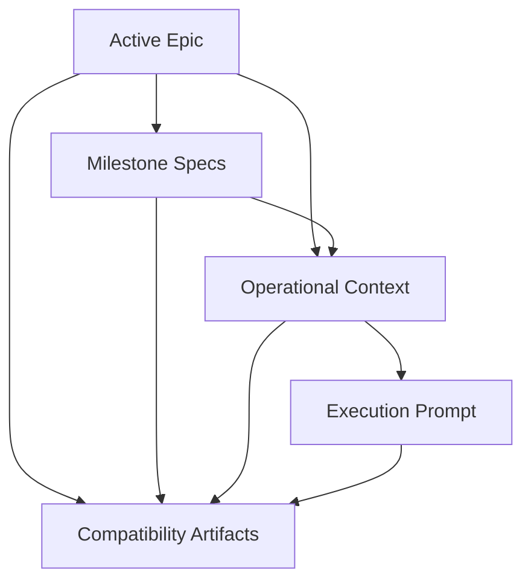

# Roadmap Execution Preparation Provenance

## Artifact Inventory

Execution preparation is a derived artifact graph:

- `.agents/epic.md` is the active authoritative epic.
- `.agents/specs/*.md` are milestone specs derived from the active epic.
- `.agents/operational_context.md` is derived from the active epic, active milestone specs, and roadmap decision ledger.
- `.agents/execution-prompt.md` is derived from the active epic, active milestone specs, and operational context.
- `.agents/plan.md` and `.agents/milestones/mNNN.md` are compatibility artifacts derived from the active epic, active milestone specs, operational context, and execution prompt.

## Dependency Graph

## Current Failure Mode

Readiness was inferred from file presence and lifecycle state. A promoted replacement epic could leave old specs, old operational context, old execution prompt, and old compatibility files on disk. Because those files existed and were marked ready, resume and execution readiness could reuse artifacts generated from a previous active epic.

## Ownership Decision

Derived artifact provenance is owned by an execution-preparation manifest, not by individual readiness branches. Generators record provenance when they write derived artifacts. Readiness evaluates the manifest against the current authoritative graph. Lifecycle remains independent and only describes workflow state.

## Freshness Contract

The manifest records each active derived artifact's generator, output identity, output content hash, and causal inputs. Freshness is true only when:

- the manifest has a trusted active entry for the artifact,
- the artifact still exists and matches the recorded output hash,
- every recorded causal input matches the current authoritative input version,
- the active manifest artifact set matches the expected dependency graph.

Deleted, superseded, unknown-provenance, or mixed old/new artifacts are not execution-ready. Stale files may remain on disk, but they are not active unless the manifest says their causal inputs still match.

## Resume And Invalidation

Promoting a new active epic changes the active epic content hash. That hash invalidates milestone specs first, which invalidates operational context, execution prompt, and compatibility artifacts through the dependency graph. Resume planning uses the same freshness contract as normal readiness, so stale execution preparation cannot silently execute.
