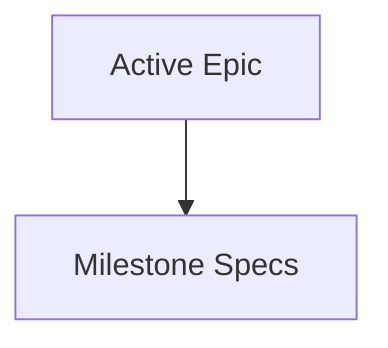

# Roadmap Milestone Preparation Provenance

## Artifact Inventory

Roadmap CLI owns the planning-side derived artifact graph:

- `.agents/epic.md` is the active authoritative epic.
- `.agents/specs/*.md` are milestone specs derived from the active epic.

Roadmap CLI does not generate `.agents/operational_context.md`, `.agents/execution-prompt.md`, `.agents/plan.md`, or `.agents/milestones/mNNN.md`. Those execution artifacts are owned by the Plan CLI / Loop CLI boundary.

## Dependency Graph

## Current Failure Mode

Readiness used to advance from milestone specs into Roadmap-owned execution preparation. That allowed stale operational context, execution prompt, and compatibility artifacts to appear as Roadmap workflow steps.

## Ownership Decision

Roadmap CLI stops at `MilestoneSpecsReady`. It records milestone-spec provenance and validates that specs still belong to the current active epic, but it treats legacy execution-preparation states as report-only and does not advance them.

## Freshness Contract

The execution-preparation manifest still records milestone-spec provenance so Roadmap resume planning can reject stale or mismatched specs. Freshness is true only when:

- the manifest has trusted active milestone-spec entries,
- each spec still exists and matches the recorded output hash,
- each recorded causal input matches the current active epic.

## Resume And Invalidation

Promoting a new active epic changes the active epic content hash. That invalidates existing milestone specs first. Resume planning validates milestone specs before reporting `MilestoneSpecsReady`, but it does not generate operational context, execution prompts, compatibility artifacts, or execution turns.
