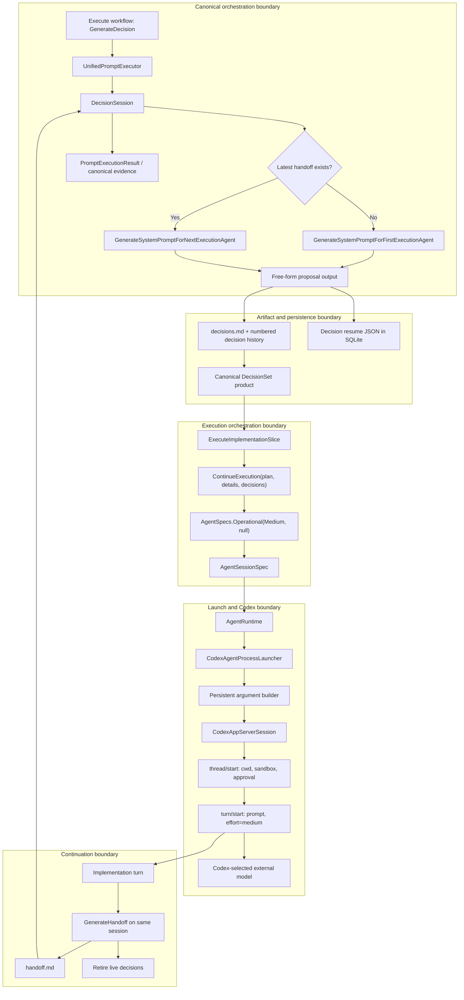
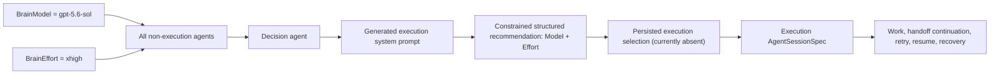

# Execution Model/Effort Selection Architecture Audit

Audit date: 2026-07-10  
Observed revision: `3ed77d9962ba181c11afa9dd8472938117ef3c4f` (`next`)  
Scope: architecture facts plus the clarified configuration-authority boundary supplied after the initial audit; no implementation design, API recommendation, pseudocode, or roadmap.

## Executive Summary

1. The active production entry point is the unified `LoopRelay.Cli`. It constructs the canonical workflow runtime and executes the `Execute` workflow one transition at a time. The old `LoopRunner`/`ExecutionStep` implementation is still compiled and tested, but no production source constructs it. `LoopRelay.Roadmap.Cli` is also compiled and tested, but its `Program` exits immediately and directs users to the unified CLI. Evidence: `src/LoopRelay.Cli/Program.cs:18-25`, `src/LoopRelay.Cli/Services/Cli/UnifiedCliComposition.cs:106-183`, `src/LoopRelay.Cli/Services/Execution/LoopRunner.cs:21-34`, `src/LoopRelay.Roadmap.Cli/Program.cs:12-17`.

2. In the active workflow, `GenerateSystemPromptForFirstExecutionAgent` and `GenerateSystemPromptForNextExecutionAgent` are not separate workflow transitions. `DecisionSession.BuildProposalPromptAsync` chooses one template based on whether a handoff exists, runs one persistent decision-agent turn, and treats that turn's free-form output as the execution agent's system prompt. Both variants converge at the same `AgentTurnResult proposed` before `decisions.md` is persisted. Evidence: `src/LoopRelay.Cli/Services/Decisions/DecisionSession.cs:89-116`, `src/LoopRelay.Cli/Services/Decisions/DecisionSession.cs:130-158`.

3. The active execution slice does **not** hardcode `gpt-5.5` or `xhigh`. It opens a danger-full-access persistent session with `AgentEffortLevel.Medium` and no effort identifier, which maps to Codex effort `medium`. The same held-open session performs the implementation turn and the handoff turn. Evidence: `src/LoopRelay.Cli/Services/Cli/UnifiedCliComposition.cs:1494-1556`, `src/LoopRelay.Cli/Services/Cli/UnifiedCliComposition.cs:1570-1615`, `src/LoopRelay.Agents/Services/Codex/CodexAppServerSession.cs:90-159`, `src/LoopRelay.Agents/Services/Codex/CodexAppServerSession.cs:462-470`.

4. There is no `gpt-5.5` literal, no `gpt-5.6-*` literal, and no `BrainModel` or `BrainEffort` symbol in current source, tests, configuration, or scripts. The only pre-existing code/config model literal is `gpt-5` in a transport unit test; it is outside the proposed model schema. Production `AgentSessionSpec` instances do not set a model. Evidence: `tests/LoopRelay.Agents.Tests/Services/Codex/CodexAgentArgumentBuilderTests.cs:225-238`, `src/LoopRelay.Agents/Models/Sessions/AgentSessionSpec.cs:8-51`.

5. Current model selection is implicit in Codex configuration outside the repository. One-shot launches can carry an arbitrary `model` through `AgentSessionSpec.StartupOptions`, but no production caller does so. Persistent launches return from `CodexAgentArgumentBuilder` before startup options are emitted, and the app-server `thread/start`, `thread/resume`, and `turn/start` frames contain no model field. Evidence: `src/LoopRelay.Agents/Services/Codex/CodexAgentArgumentBuilder.cs:39-79`, `src/LoopRelay.Agents/Services/Codex/CodexAppServerProtocol.cs:45-84`.

6. Effort is repository-owned but distributed. `AgentSessionSpec` requires an `EffortProfile`; factories and individual orchestration call sites choose `medium`, `high`, or the free-string identifier `xhigh`. `xhigh` is represented as `AgentEffortLevel.High` plus `Identifier = "xhigh"`, because the enum itself contains only `Low`, `Medium`, and `High`. There is no validation of the identifier. Evidence: `src/LoopRelay.Agents/Models/Process/EffortProfile.cs:5`, `src/LoopRelay.Agents/Primitives/Sessions/AgentEffortLevel.cs:3-8`, `src/LoopRelay.Cli/Services/Agents/AgentSpecs.cs:13-77`.

7. No native constrained-output facility is present in either Codex transport. The repository has one separate prompt-and-parser pattern that asks an agent for strict JSON and validates it after the turn, but it does not pass a JSON schema to Codex. The prompt source generator only turns `.prompt` files into string constants and render methods. Evidence: `src/LoopRelay.Orchestration.Primitives/Services/NonImplementationSemanticConfirmation/NonImplementationSemanticConfirmer.cs:91-106`, `src/LoopRelay.Orchestration.Primitives/Services/NonImplementationSemanticConfirmation/NonImplementationSemanticConfirmationParser.cs:24-55`, `src/LoopRelay.Prompts.Generator/Services/PromptSourceGenerator.cs:183-232`, `src/LoopRelay.Agents/Services/Codex/CodexAgentArgumentBuilder.cs:32-79`, `src/LoopRelay.Agents/Services/Codex/CodexAppServerProtocol.cs:45-84`.

8. Execution model and effort are not persisted as execution state. Decision-session resume state persists only a Codex thread id and routing/context counters. Execution sessions have no resume state and exist only in `UnifiedPromptExecutor.executionSession` until handoff generation closes them. Telemetry has an optional `Model` field but no effort field; the production composition does not install the telemetry wrappers. Evidence: `src/LoopRelay.Orchestration.Primitives/Models/DecisionSessionResumeState.cs:9-25`, `src/LoopRelay.Cli/Services/Cli/UnifiedCliComposition.cs:811-827`, `src/LoopRelay.Cli/Models/SessionTelemetryRecord.cs:10-40`, `src/LoopRelay.Cli/Services/Cli/UnifiedCliComposition.cs:109-119`.

9. The clarified target establishes two and only two configuration authorities. Execution agents receive the validated structured `Model` and `Effort` produced after their execution system prompt. Every non-execution agent—including decision generation, planning, evaluation, completion, roadmap generation, semantic review, projections, and scoped artifact operations—receives `BrainModel = "gpt-5.6-sol"` and `BrainEffort = "xhigh"`.

10. The existing `SessionRole` enum does not encode this boundary. `SessionRole.OperationalExecution` is used by the true implementation session, eval/traditional/milestone one-shots, scoped artifact operations, and the retired roadmap bridge. The clarified policy therefore classifies launch sites by workflow purpose rather than by current role value. Evidence: `src/LoopRelay.Cli/Services/Agents/AgentSpecs.cs:37-77`, `src/LoopRelay.Cli/Services/Cli/UnifiedCliComposition.cs:935-976`, `src/LoopRelay.Cli/Services/Cli/UnifiedCliComposition.cs:1494-1528`, `src/LoopRelay.Roadmap.Cli/Services/Cli/AgentSpecs.cs:20-35`.

## Current Architecture

### Production entry and orchestration

`LoopRelay.Cli.Program` parses a unified invocation, creates `UnifiedCliComposition.CreateProduction`, and runs `UnifiedCliRunner`. Production composition registers the raw `AgentRuntime`, constructs `TransitionRuntime`, and supplies a stateful `UnifiedPromptExecutor`. Evidence: `src/LoopRelay.Cli/Program.cs:18-25`, `src/LoopRelay.Cli/Services/Cli/UnifiedCliComposition.cs:109-183`.

The canonical `Execute` workflow has these stages and transition identities:

- `Execution Readiness` -> `VerifyExecutionReadiness`.
- `Implementation Planning` -> `GenerateDecision`, `TransferDecisionSession`, or `ContinueDecisionSession`.
- `Implementation` -> `ExecuteImplementationSlice`.
- `Execution Continuity` -> `GenerateHandoff`, `UpdateOperationalContext`, `PublishRepositoryState`, and `EvaluateCommit`.
- `Completion` -> milestone evaluation, non-implementation review, completion certification, and route interpretation.
- `Workflow Completion` -> exit-gate verification.

Evidence: `src/LoopRelay.Orchestration.Primitives/Workflows/CanonicalWorkflowDefinitionSketches.cs:577-645`.

`UnifiedCliRunner` invokes at most one transition per workflow-chain pass, re-observes the repository after a completed transition, and repeats up to 32 times for an unbounded invocation. It stops immediately on failure, blockage, cancellation, waiting, ambiguity, or stall. There is no automatic retry of a failed canonical transition. Evidence: `src/LoopRelay.Cli/Services/Cli/UnifiedCliRunner.cs:16-18`, `src/LoopRelay.Cli/Services/Cli/UnifiedCliRunner.cs:262-300`, `src/LoopRelay.Orchestration.Primitives/Chaining/WorkflowChaining.cs:260-330`.

### Decision-agent prompt generation

`ExecuteDecisionSessionAsync` ignores the rendered workflow prompt text and delegates to a long-lived `DecisionSession`; it uses the rendered prompt only as an evidence-location value in the returned metadata. The actual First/Next prompt is built internally by `DecisionSession`. Evidence: `src/LoopRelay.Cli/Services/Cli/UnifiedCliComposition.cs:1432-1464`.

The current sequence inside `DecisionSession.RunAsync` is:

1. Evaluate decision routing and perform a transfer if selected.
2. Open or resume a persistent decision session.
3. Read the latest handoff.
4. Render the First template when the handoff is null, otherwise render the Next template.
5. Run the proposal turn.
6. Reject a non-completed turn and close the session.
7. Mark the decision process as seeded, update routing cost state, and persist decision-session resume state.
8. Persist the output verbatim to numbered decision history and live `.agents/decisions/decisions.md`.

Evidence: `src/LoopRelay.Cli/Services/Decisions/DecisionSession.cs:73-128`, `src/LoopRelay.Cli/Services/Execution/LoopArtifacts.cs:72-76`.

The First and Next templates request free-form system-prompt text. Neither requests model or effort fields. Evidence: `src/LoopRelay.Core/Prompts/GenerateSystemPromptForFirstExecutionAgent.prompt:7-32`, `src/LoopRelay.Core/Prompts/GenerateSystemPromptForNextExecutionAgent.prompt:7-37`.

Fresh decision processes receive the decision-session projection and operational context inline. Warm or resumed processes receive neither again; that context exists only in the Codex thread history. In the active unified composition, `_projectionService` is explicitly null, so `EnsureDecisionProjectionAsync` returns an empty-content placeholder; the operational context is the substantive fresh-process context currently supplied by this path. Evidence: `src/LoopRelay.Cli/Services/Decisions/DecisionSession.cs:130-158`, `src/LoopRelay.Cli/Services/Decisions/DecisionSession.cs:188-212`, `src/LoopRelay.Cli/Services/Decisions/DecisionSession.cs:497-512`, `src/LoopRelay.Cli/Services/Cli/UnifiedCliComposition.cs:1444-1453`.

### Active execution-agent launch

The active `ExecuteImplementationSlice` transition:

- reads plan, optional details, and latest decisions;
- fails if decisions are missing or blank;
- renders `ContinueExecution` (not `StartExecution`);
- opens `AgentSpecs.Operational` with danger-full-access, `Medium`, and no identifier;
- runs the implementation turn;
- keeps the session in the `UnifiedPromptExecutor.executionSession` field.

Evidence: `src/LoopRelay.Cli/Services/Cli/UnifiedCliComposition.cs:1494-1556`, `src/LoopRelay.Core/Prompts/ContinueExecution.prompt:1-6`.

The later `GenerateHandoff` transition requires that in-memory session, runs either `GenerateHandoff` or `GenerateNoChangesHandoff` on it, verifies `.agents/handoffs/handoff.md`, and closes the session. Evidence: `src/LoopRelay.Cli/Services/Cli/UnifiedCliComposition.cs:1570-1634`.

This creates a hidden runtime dependency: the workflow definition labels `GenerateHandoff` as `OneShotAgentPrompt`, but `UnifiedPromptExecutor` handles it as part of `ExecuteImplementationTransitions` and requires the warm execution session from the prior transition. Evidence: `src/LoopRelay.Orchestration.Primitives/Workflows/CanonicalWorkflowDefinitionSketches.cs:629-630`, `src/LoopRelay.Cli/Services/Cli/UnifiedCliComposition.cs:613-619`, `src/LoopRelay.Cli/Services/Cli/UnifiedCliComposition.cs:1575-1578`.

### Compiled parallel paths

The compiled `ExecutionStep` also opens a danger-full-access persistent operational session at `medium`, performs work, then produces a handoff on the same session. Unlike the active canonical path, it uses `StartExecution` when live `decisions.md` is absent and `ContinueExecution` when it is present. No production source constructs `ExecutionStep` or `LoopRunner`; their only construction references are tests. Evidence: `src/LoopRelay.Cli/Services/Execution/ExecutionStep.cs:41-78`, `src/LoopRelay.Cli/Services/Execution/ExecutionStep.cs:81-135`, `src/LoopRelay.Cli/Services/Execution/LoopRunner.cs:21-34`, `tests/LoopRelay.Cli.Tests/Services/Execution/ExecutionStepTests.cs:17-30`.

The retired roadmap execution bridge reads a prebuilt execution prompt and chooses persistent versus one-shot transport from `RoadmapExecutionOptions.RequiresApproval`. Its execution spec is `High` plus `xhigh`. It has no model option. Evidence: `src/LoopRelay.Roadmap.Cli/Services/Execution/RoadmapExecutionBridge.cs:21-68`, `src/LoopRelay.Roadmap.Cli/Services/Cli/AgentSpecs.cs:20-35`, `src/LoopRelay.Roadmap.Cli/Models/Execution/RoadmapExecutionOptions.cs:3-24`, `src/LoopRelay.Roadmap.Cli/Program.cs:12-17`.

## Clarified Configuration Authority

The post-audit clarification removes the prior policy ambiguity:

The framing “replace hardcoded `gpt-5.5` with `BrainModel`” does not match either the observed repository or the clarified target. No production `gpt-5.5` literal exists, and `BrainModel` is the non-execution authority; execution model selection comes from the structured recommendation.

| Agent class | Included launch purposes | Authoritative model/effort source |
|---|---|---|
| Execution agent | Active `ExecuteImplementationSlice` plus its same-session handoff continuation; compiled `ExecutionStep`; retired `RoadmapExecutionBridge` | The structured recommendation associated with the generated execution system prompt. |
| Non-execution agent | First/Next decision generation and its recommendation turn; decision transfer operations; plan authoring/review/projections/scoped operations; traditional and eval roadmap generation; milestone specification generation; completion certification; semantic/non-implementation review; all analogous support turns | `BrainModel = "gpt-5.6-sol"` and `BrainEffort = "xhigh"`. |

The structured execution recommendation is constrained to:

- Model: `gpt-5.5`, `gpt-5.6-luna`, `gpt-5.6-terra`, or `gpt-5.6-sol`.
- Effort: `low`, `medium`, `high`, or `xhigh`.

This clarification partitions the planning scope into two domains without overlap:

- **Execution Agent Selection:** structured generation after First/Next system-prompt generation, schema validation, durable correlation to that system prompt, and propagation through the execution lifecycle.
- **Brain Defaults Consolidation:** centralized model/effort authority for every remaining agent launch, replacing independent per-factory and per-call-site selection.

Current source does not implement either authority. It instead hardcodes effort at each call site/factory and omits model everywhere. Evidence: `src/LoopRelay.Cli/Services/Agents/AgentSpecs.cs:13-77`, `src/LoopRelay.Cli/Services/Cli/UnifiedCliComposition.cs:935-976`, `src/LoopRelay.Cli/Services/Cli/UnifiedCliComposition.cs:1494-1528`, `src/LoopRelay.Completion/Services/Prompts/AgentCompletionPromptRunner.cs:48-64`, `src/LoopRelay.Orchestration.Primitives/Services/NonImplementationReview/AgentNonImplementationReviewRunner.cs:44-51`.

The classification cannot be derived from `SessionRole` alone:

- `AgentSpecs.Operational` always creates `SessionRole.OperationalExecution`, whether called for implementation execution or eval/traditional/milestone generation. Evidence: `src/LoopRelay.Cli/Services/Agents/AgentSpecs.cs:37-53`, `src/LoopRelay.Cli/Services/Cli/UnifiedCliComposition.cs:935-976`, `src/LoopRelay.Cli/Services/Cli/UnifiedCliComposition.cs:1522-1528`.
- `AgentSpecs.ScopedArtifactOperation` also uses `SessionRole.OperationalExecution`, even though the clarified policy classifies scoped operations as non-execution. Evidence: `src/LoopRelay.Cli/Services/Agents/AgentSpecs.cs:65-77`.
- `RoadmapExecutionBridge` is a true execution path and also uses `SessionRole.OperationalExecution`. Evidence: `src/LoopRelay.Roadmap.Cli/Services/Cli/AgentSpecs.cs:20-35`.
- Planning, decision, and semantic-review paths often use `SessionRole.Planning` or `SessionRole.Decision`, but those role values cover only part of the non-execution inventory. Evidence: `src/LoopRelay.Cli/Services/Agents/AgentSpecs.cs:15-31`, `src/LoopRelay.Cli/Services/Agents/AgentSpecs.cs:55-63`, `src/LoopRelay.Orchestration.Primitives/Services/NonImplementationReview/AgentNonImplementationReviewRunner.cs:44-51`.

## Structured Recommendation Insertion Point Analysis

### Observed common seam

There are not two post-generation code paths. The First/Next branch occurs while `BuildProposalPromptAsync` selects a template; both variants then run through the same proposal turn and converge on the same `AgentTurnResult`. The only common post-generation seam is after the successful `session.RunTurnAsync` result and before the output is persisted as decisions. Existing cost accounting and decision-thread resume persistence currently occur inside that interval. Evidence: `src/LoopRelay.Cli/Services/Decisions/DecisionSession.cs:89-116`, `src/LoopRelay.Cli/Services/Decisions/DecisionSession.cs:135-143`.

The clarification makes this seam authoritative for execution selection: after either variant produces the execution system prompt, the decision agent produces the constrained `Model`/`Effort` recommendation. The decision agent and that recommendation-generation turn are non-execution work, so their own launch configuration belongs to `BrainModel`/`BrainEffort`; the returned values govern only the later execution-agent session.

At that seam, the following facts are in the `RunAsync` scope or directly owned by `DecisionSession`:

| Available fact | Current source |
|---|---|
| Whether the input was First or Next | `handoff is null` selects the template at `DecisionSession.cs:140-142`. |
| Latest handoff content | Read at `DecisionSession.cs:91-92`; the relative path returned by `ReadLatestHandoffAsync` is currently discarded. |
| Rendered proposal prompt | Local `proposalPrompt` at `DecisionSession.cs:92-99`. |
| Generated execution-agent system prompt | `proposed.Output` at `DecisionSession.cs:98-116`. |
| Turn state, token usage, and failure diagnostics | `AgentTurnResult proposed`; state checked at `DecisionSession.cs:101-106`, usage consumed at `DecisionSession.cs:111`. |
| Decision Codex thread id | `session.ThreadId`, used by `PersistResumeStateAsync` at `DecisionSession.cs:226-236`. |
| Repository and artifact access | Constructor-owned `_repository` and `_artifacts` at `DecisionSession.cs:41-52`. |
| Prompt policy | `_promptPolicy`, applied at `DecisionSession.cs:143`. |
| Router/reuse accounting | Fields at `DecisionSession.cs:58-70`; updated after generation at `DecisionSession.cs:111`. |

The projection content and operational-context text are local to `BuildProposalPromptAsync`, not returned as separately typed data. On a warm/resumed process both are omitted from the outgoing prompt because they are assumed to exist in thread history. Evidence: `src/LoopRelay.Cli/Services/Decisions/DecisionSession.cs:135-158`, `src/LoopRelay.Cli/Services/Decisions/DecisionSession.cs:198-210`.

### Current downstream boundary

The generated system prompt crosses the following current boundaries:

1. `AgentTurnResult.Output` -> `LoopArtifacts.PersistDecisionsAsync`.
2. Live and numbered decision storage -> canonical `DecisionSet` observation/product.
3. `ExecuteDecisionSessionAsync` -> `PromptExecutionResult.RawOutput` and canonical raw-output evidence.
4. `ExecuteImplementationSliceAsync` -> `LoopArtifacts.ReadLatestDecisionsAsync`.
5. `ContinueExecution.Render` -> execution-session prompt.

Evidence: `src/LoopRelay.Cli/Services/Decisions/DecisionSession.cs:115-127`, `src/LoopRelay.Cli/Services/Execution/LoopArtifacts.cs:49-76`, `src/LoopRelay.Orchestration.Primitives/Resolution/RepositoryObserver.cs:69-79`, `src/LoopRelay.Cli/Services/Cli/UnifiedCliComposition.cs:1454-1464`, `src/LoopRelay.Cli/Services/Cli/UnifiedCliComposition.cs:1506-1533`.

No current carrier at any of these boundaries contains `Model` or `Effort`. `ProductRecord` also has no general metadata field; it contains identities, ownership, storage representations, causal identity, lifecycle, validation, freshness, and evidence locations. Evidence: `src/LoopRelay.Orchestration.Primitives/Workflows/WorkflowContracts.cs:342-354`.

Under the clarified authority boundary, the generated system prompt and its structured recommendation form one execution-launch decision. The repository currently persists only the system-prompt half of that decision. The numbered decision history, canonical `DecisionSet`, transition raw-output evidence, execution launch, work-to-handoff continuation, and recovery state do not associate a recommendation with the exact First/Next output that produced it.

### Existing structured-output behavior

The repository's existing semantic-confirmation flow is the nearest structured-output precedent:

- it serializes a prompt payload and asks for exactly one strict JSON object;
- it runs a normal one-shot text turn;
- it trims the returned text, requires `{...}`, deserializes a DTO, disallows comments/trailing commas/integer enum values, checks required fields, and validates identity/hash fields against the expected input;
- unknown JSON properties are not explicitly rejected because the serializer options do not set an unmapped-member rejection policy;
- the transport is not schema-constrained.

Evidence: `src/LoopRelay.Orchestration.Primitives/Services/NonImplementationSemanticConfirmation/NonImplementationSemanticConfirmer.cs:91-106`, `src/LoopRelay.Orchestration.Primitives/Services/NonImplementationSemanticConfirmation/NonImplementationSemanticConfirmationParser.cs:10-55`, `src/LoopRelay.Orchestration.Primitives/Services/NonImplementationSemanticConfirmation/NonImplementationSemanticConfirmationParser.cs:57-169`.

No current model/effort recommendation record, DTO, parser, schema, prompt asset, product identity, transition, artifact path, or persistence record exists.

## Execution Launch Flow

### Persistent/app-server flow used by active execution

1. `UnifiedPromptExecutor` calls `IAgentRuntime.OpenSessionAsync` with an `AgentSessionSpec`. Evidence: `src/LoopRelay.Cli/Services/Cli/UnifiedCliComposition.cs:1522-1528`.
2. `AgentRuntime` asks `IAgentProcessLauncher` for persistent mode and wraps the process in `CodexAppServerSession`. Evidence: `src/LoopRelay.Agents/Services/Sessions/AgentRuntime.cs:17-24`.
3. `CodexAgentProcessLauncher` resolves `CODEX_EXECUTABLE`, builds arguments, and starts an interactive child process. Evidence: `src/LoopRelay.Agents/Services/Process/CodexAgentProcessLauncher.cs:12-21`, `src/LoopRelay.Agents/Services/Process/EnvironmentAgentExecutableResolver.cs:5-12`.
4. Persistent CLI arguments are `--cd`, `--sandbox`, approval policy, `app-server --listen stdio://`. They contain no model or effort and ignore `StartupOptions`. Evidence: `src/LoopRelay.Agents/Services/Codex/CodexAgentArgumentBuilder.cs:34-53`.
5. `CodexAppServerSession` performs `initialize`, `initialized`, and `thread/start`. `thread/start` carries cwd, sandbox, and approval only. Evidence: `src/LoopRelay.Agents/Services/Codex/CodexAppServerSession.cs:236-279`, `src/LoopRelay.Agents/Services/Codex/CodexAppServerProtocol.cs:23-52`.
6. Every turn maps `EffortProfile` and sends it as `params.effort` in `turn/start`; no model is sent. Evidence: `src/LoopRelay.Agents/Services/Codex/CodexAppServerSession.cs:103-119`, `src/LoopRelay.Agents/Services/Codex/CodexAppServerProtocol.cs:69-84`.
7. The same spec is retained by the session, so every turn on that session uses the same effort. Evidence: `src/LoopRelay.Agents/Services/Codex/CodexAppServerSession.cs:38-69`, `src/LoopRelay.Agents/Services/Codex/CodexAppServerSession.cs:114-115`.

### One-shot flow

`AgentRuntime.RunOneShotAsync` launches `codex exec --json --skip-git-repo-check --cd ... -c approval_policy="never" -c model_reasoning_effort="..." ... -`, then streams the prompt on stdin. Arbitrary startup options are appended as additional `-c key=value` entries. This is the only current repository mechanism capable of emitting an explicit model setting, and no production call site populates it. The one-shot branch does not emit `AgentSessionSpec.Sandbox` and fixes approval policy to `never`, regardless of the spec; transport tests explicitly pin the sandbox omission. Evidence: `src/LoopRelay.Agents/Services/Sessions/AgentRuntime.cs:75-90`, `src/LoopRelay.Agents/Services/Codex/CodexAgentArgumentBuilder.cs:55-79`, `tests/LoopRelay.Agents.Tests/Services/Codex/CodexAgentArgumentBuilderTests.cs:25-38`, `tests/LoopRelay.Agents.Tests/Services/Codex/CodexAgentArgumentBuilderTests.cs:225-238`.

### Launch-path inventory

| Path | Runtime status | Transport/lifetime | Current effort | Current model | Clarified authority | Continuation/resume behavior |
|---|---|---|---|---|---|---|
| Unified `ExecuteImplementationSlice` + `GenerateHandoff` | Active production | Persistent app-server, two turns across two transitions | `medium` | Omitted | Structured execution recommendation | Same in-memory session continues to handoff; no execution resume. `UnifiedCliComposition.cs:1494-1615`. |
| Decision First/Next prompt and recommendation generation | First/Next active; recommendation turn absent | Warm persistent app-server | `xhigh` | Omitted | `BrainModel` / `BrainEffort` | Decision thread id and counters can resume; same spec is rebuilt. `DecisionSession.cs:168-236`, `AgentSpecs.cs:55-63`. |
| Decision transfer artifact operations | Active when decision router transfers | Fresh persistent app-server per operation | `xhigh` | Omitted | `BrainModel` / `BrainEffort` | Each operation closes in `finally`; no resume. `DecisionSession.cs:376-466`. |
| Eval/traditional/milestone prompt transitions | Active production before Execute | One-shot | `xhigh` | Omitted | `BrainModel` / `BrainEffort` | No retry/resume in executor. `UnifiedCliComposition.cs:935-976`. |
| Plan authoring, review, projection, and scoped operations | Active production | Persistent or one-shot by operation | `xhigh` | Omitted | `BrainModel` / `BrainEffort` | Warm authoring where applicable; other operations close independently. `AgentSpecs.cs:15-31`, `UnifiedCliComposition.cs:1141-1177`. |
| Completion certification prompt runner | Active during Execute completion | One-shot | `xhigh` | Omitted | `BrainModel` / `BrainEffort` | Each prompt is independent. `AgentCompletionPromptRunner.cs:19-64`. |
| Non-implementation semantic review runner | Active during Execute review when candidates require it | One-shot | `xhigh` | Omitted | `BrainModel` / `BrainEffort` | Each prompt is independent. `AgentNonImplementationReviewRunner.cs:20-51`. |
| `ExecutionStep`/`LoopRunner` | Compiled/tested, no production composition | Persistent, two turns | `medium` | Omitted | Structured execution recommendation | New session on each slice; no resume. `ExecutionStep.cs:41-135`. |
| Roadmap execution bridge | Compiled/tested, retired entry point | Persistent by default; one-shot when approvals are disabled | `xhigh` | Omitted | Structured execution recommendation | Closes after one turn; no resume. `RoadmapExecutionBridge.cs:21-68`, `AgentSpecs.cs:20-35`. |

No execution path creates or switches a git branch. The execution git layer stages, commits, and pushes the current checkout only. Evidence: `src/LoopRelay.Cli/Services/Execution/CommitGate.cs:43-69`, `src/LoopRelay.Cli/Services/Execution/CommitGate.cs:104-126`.

## Hardcoded Model Inventory

### Production source

There are no production model literals. Specifically, `gpt-5.5`, `gpt-5.6-luna`, `gpt-5.6-terra`, `gpt-5.6-sol`, `BrainModel`, and `BrainEffort` do not occur in pre-existing source, tests, configuration, or scripts.

`AgentSessionSpec` has no named model property. Its only generic configuration carrier is `StartupOptions`, an arbitrary string dictionary. Evidence: `src/LoopRelay.Agents/Models/Sessions/AgentSessionSpec.cs:10-30`, `src/LoopRelay.Agents/Models/Sessions/AgentSessionSpec.cs:41-49`.

### Test-only literal outside the future schema

`CodexAgentArgumentBuilderTests.ExplicitStartupOptionsAreEmittedAsAdditionalConfigKeys` supplies `startupOptions["model"] = "\"gpt-5\""` and asserts the emitted one-shot argument. `gpt-5` is not one of the four future allowed values. Evidence: `tests/LoopRelay.Agents.Tests/Services/Codex/CodexAgentArgumentBuilderTests.cs:225-238`.

### Current effective model assumption

Because every production launch currently omits model, the repository delegates model resolution to the invoked Codex installation/configuration. The clarified target replaces that one implicit behavior with two explicit authorities: structured recommendation for execution agents and `BrainModel = "gpt-5.6-sol"` for non-execution agents. Neither change is removal of a current `gpt-5.5` literal. Evidence: `src/LoopRelay.Agents/Services/Codex/CodexAgentArgumentBuilder.cs:39-79`, `src/LoopRelay.Agents/Services/Codex/CodexAppServerProtocol.cs:45-84`.

### Transport asymmetry

| Surface | Model capability currently exposed | Constraint |
|---|---|---|
| `AgentSessionSpec.StartupOptions` | Arbitrary key/value, including `model` | Untyped and unvalidated. `AgentSessionSpec.cs:17-29`. |
| One-shot argument builder | Emits every startup option | Values must already contain any Codex quoting required. `CodexAgentArgumentBuilder.cs:70-74`. |
| Persistent argument builder | Emits no startup option | Returns before the startup-options loop. `CodexAgentArgumentBuilder.cs:39-53`. |
| App-server protocol | No model field on start, resume, or turn | `CodexAppServerProtocol.cs:45-84`. |
| Input-wait diagnostics | Reads only `StartupOptions["model"]` for one-shots | Persistent wrapper explicitly passes `model: null`. `InputWaitProgressAgentRuntime.cs:33-47`, `InputWaitProgressAgentRuntime.cs:143-146`, `InputWaitProgressAgentRuntime.cs:165-178`. |

## Hardcoded Effort Inventory

### Execution paths

| Consumer | Hardcoded/current value | Evidence |
|---|---|---|
| Active unified execution session | `AgentEffortLevel.Medium`, identifier null -> `medium` | `src/LoopRelay.Cli/Services/Cli/UnifiedCliComposition.cs:1522-1528`; mapping at `CodexAppServerSession.cs:462-470`. |
| Compiled `ExecutionStep` | `AgentEffortLevel.Medium`, identifier null -> `medium` | `src/LoopRelay.Cli/Services/Execution/ExecutionStep.cs:72-78`. |
| Retired roadmap execution bridge | `AgentEffortLevel.High`, identifier `xhigh` -> `xhigh` | `src/LoopRelay.Roadmap.Cli/Services/Cli/AgentSpecs.cs:20-35`. |

### Non-execution paths

The following production sources hardcode `xhigh` but are not the active execution-agent work/handoff session:

- Unified CLI plan authoring, review, and decision factories: `src/LoopRelay.Cli/Services/Agents/AgentSpecs.cs:15-31`, `src/LoopRelay.Cli/Services/Agents/AgentSpecs.cs:55-63`.
- Unified eval/traditional/milestone one-shots: `src/LoopRelay.Cli/Services/Cli/UnifiedCliComposition.cs:935-976`.
- Unified plan scoped operations: `src/LoopRelay.Cli/Services/Cli/UnifiedCliComposition.cs:1160-1168`.
- Decision transfer scoped operations: `src/LoopRelay.Cli/Services/Decisions/DecisionSession.cs:400-415`.
- Plan CLI's three spec factories: `src/LoopRelay.Plan.Cli/Services/Cli/AgentSpecs.cs:9-46`.
- Roadmap CLI read-only planning factory: `src/LoopRelay.Roadmap.Cli/Services/Cli/AgentSpecs.cs:9-18`. The execution bridge in the same file is classified separately as an execution agent.
- Completion prompt runner's read-only and writable planning specs: `src/LoopRelay.Completion/Services/Prompts/AgentCompletionPromptRunner.cs:48-64`.
- Non-implementation semantic review spec: `src/LoopRelay.Orchestration.Primitives/Services/NonImplementationReview/AgentNonImplementationReviewRunner.cs:44-51`.

### Schema-relevant effort assumptions

- `AgentEffortLevel` contains `Low`, `Medium`, and `High`, which correspond to three future allowed strings. It does not contain `XHigh`. Evidence: `src/LoopRelay.Agents/Primitives/Sessions/AgentEffortLevel.cs:3-8`.
- `xhigh` is carried through the unvalidated `EffortProfile.Identifier` escape hatch. Evidence: `src/LoopRelay.Agents/Models/Process/EffortProfile.cs:5`, `src/LoopRelay.Agents/Services/Codex/CodexAgentArgumentBuilder.cs:82-90`.
- Both transport mappers prefer any non-empty identifier over the enum. Whitespace and arbitrary strings are therefore accepted by repository code. Evidence: `src/LoopRelay.Agents/Services/Codex/CodexAgentArgumentBuilder.cs:82-90`, `src/LoopRelay.Agents/Services/Codex/CodexAppServerSession.cs:462-470`.
- The argument-builder documentation names `minimal`, which is outside the proposed effort schema, and calls the Codex value free-string. Evidence: `src/LoopRelay.Agents/Services/Codex/CodexAgentArgumentBuilder.cs:25-28`.
- `StartupOptions` can also contain a second `model_reasoning_effort` entry on one-shots; the builder performs no duplicate-key or conflict check. Evidence: `src/LoopRelay.Agents/Services/Codex/CodexAgentArgumentBuilder.cs:64-74`.

Tests pin the current split: execution specs at `medium`, decision/planning specs at `xhigh`, one-shot effort argument emission, and app-server `params.effort`. Evidence: `tests/LoopRelay.Cli.Tests/Services/Agents/AgentSpecsTests.cs:14-55`, `tests/LoopRelay.Agents.Tests/Services/Codex/CodexAgentArgumentBuilderTests.cs:157-192`, `tests/LoopRelay.Agents.Tests/Services/Codex/CodexAppServerSessionTests.cs:230-260`, `tests/LoopRelay.Agents.Tests/Services/Codex/CodexAppServerSessionTests.cs:279-299`.

Under the clarified policy, the three execution rows above cease owning fixed effort values; their authority is the structured recommendation. Every listed non-execution row ceases independently owning `xhigh`; its authority is `BrainEffort`. The current `xhigh` values already match the clarified `BrainEffort`, so the non-execution effort change is ownership consolidation rather than a value change.

## Configuration Ownership

| Layer | Current owner | Model | Effort |
|---|---|---|---|
| Repository settings | `config/settings.default.json` / permissions settings loader | No field | No field. `config/settings.default.json:1-198`. |
| Agent role factory | Three separate `AgentSpecs` classes plus direct specs | No production model | Chooses enum/identifier. `src/LoopRelay.Cli/Services/Agents/AgentSpecs.cs:13-77`; plan and roadmap equivalents. |
| Session contract | `AgentSessionSpec` | Untyped `StartupOptions` only | Required typed `EffortProfile`. `AgentSessionSpec.cs:10-29`. |
| Runtime facade | `AgentRuntime` | Pass-through | Pass-through. `AgentRuntime.cs:17-24`, `AgentRuntime.cs:75-89`. |
| One-shot Codex adapter | `CodexAgentArgumentBuilder` | Optional raw startup key | `model_reasoning_effort` config. `CodexAgentArgumentBuilder.cs:55-79`. |
| Persistent Codex adapter | `CodexAppServerSession` | Not represented | Per-turn `effort`. `CodexAppServerSession.cs:103-119`. |
| External runtime | Executable selected by `CODEX_EXECUTABLE` | Resolves model when repository omits it | Receives effort from repository. `EnvironmentAgentExecutableResolver.cs:5-12`. |

There is no shared configuration owner today. The clarified target assigns ownership as follows:

| Target authority | Consumers identified by the audit | Current source of values |
|---|---|---|
| Structured execution recommendation | Active unified execution launch (`UnifiedCliComposition.cs:1522-1528`); compiled `ExecutionStep` launch (`ExecutionStep.cs:75-78`); retired roadmap bridge factory (`LoopRelay.Roadmap.Cli/Services/Cli/AgentSpecs.cs:20-35`) | Active and compiled execution pass `Medium`; roadmap bridge embeds `xhigh`; all omit model. |
| `BrainModel` / `BrainEffort` | Unified plan/decision/review factories; decision transfer operations; eval/traditional/milestone one-shots; plan scoped operations; Plan CLI factories; Roadmap CLI read-only planning; completion prompt runner; semantic review runner; projection runners through their underlying specs | Distributed `xhigh` literals and implicit external model selection. |

The non-execution consumer inventory is:

| Launch family | Current construction/consumer | Current model/effort |
|---|---|---|
| Unified plan authoring and plan review | `AgentSpecs.PlanAuthoring` / `AgentSpecs.Review`; consumed by plan warm-session and review transitions | Model omitted; `xhigh`. `src/LoopRelay.Cli/Services/Agents/AgentSpecs.cs:15-31`, `src/LoopRelay.Cli/Services/Cli/UnifiedCliComposition.cs:1039-1064`, `src/LoopRelay.Cli/Services/Cli/UnifiedCliComposition.cs:1351-1382`. |
| Unified First/Next decision and recommendation agent | `AgentSpecs.Decision`, including resume | Model omitted; `xhigh`. `src/LoopRelay.Cli/Services/Agents/AgentSpecs.cs:55-63`, `src/LoopRelay.Cli/Services/Decisions/DecisionSession.cs:168-219`. |
| Unified decision projection prompts | `ProjectionPromptRunner` uses `AgentSpecs.Decision` one-shot | Model omitted; `xhigh`. `src/LoopRelay.Cli/Services/Agents/ProjectionPromptRunner.cs:18-28`. |
| Unified eval, traditional-roadmap, and milestone-generation prompts | `AgentSpecs.Operational(High, "xhigh")` one-shot | Model omitted; `xhigh`. `src/LoopRelay.Cli/Services/Cli/UnifiedCliComposition.cs:935-976`. |
| Unified plan scoped artifact operations | `AgentSpecs.ScopedArtifactOperation(High, "xhigh", ...)` | Model omitted; `xhigh`. `src/LoopRelay.Cli/Services/Cli/UnifiedCliComposition.cs:1141-1168`. |
| Decision transfer scoped artifact operations | Same scoped factory from `DecisionSession.RunArtifactOperationAsync` | Model omitted; `xhigh`. `src/LoopRelay.Cli/Services/Decisions/DecisionSession.cs:376-415`. |
| Plan CLI authoring, review, projection, and permissioned operations | Plan CLI `AgentSpecs.PlanAuthoring`, `Review`, and `ScopedArtifactOperation` | Model omitted; `xhigh`. `src/LoopRelay.Plan.Cli/Services/Cli/AgentSpecs.cs:18-46`, `src/LoopRelay.Plan.Cli/Services/Agents/ProjectionPromptRunner.cs:18-28`. |
| Roadmap planning/runtime/projection prompts | `RoadmapPromptRunner` uses `AgentSpecs.ReadOnlyPlanning` | Model omitted; `xhigh`. `src/LoopRelay.Roadmap.Cli/Services/Cli/AgentSpecs.cs:11-18`, `src/LoopRelay.Roadmap.Cli/Services/Prompts/RoadmapPromptRunner.cs:20-58`. |
| Completion certification/synthesis prompts | `AgentCompletionPromptRunner` read-only and writable planning specs | Model omitted; `xhigh`. `src/LoopRelay.Completion/Services/Prompts/AgentCompletionPromptRunner.cs:19-64`. |
| Semantic/non-implementation review prompts | `AgentNonImplementationReviewRunner.ReadOnlyReviewSpec` | Model omitted; `xhigh`. `src/LoopRelay.Orchestration.Primitives/Services/NonImplementationReview/AgentNonImplementationReviewRunner.cs:20-51`. |

This ownership boundary is orthogonal to sandbox, network, approval, session lifetime, and `SessionRole`. Those posture fields continue to differ by workflow purpose in the current factories. Evidence: `src/LoopRelay.Cli/Services/Agents/AgentSpecs.cs:15-77`, `src/LoopRelay.Plan.Cli/Services/Cli/AgentSpecs.cs:18-46`, `src/LoopRelay.Roadmap.Cli/Services/Cli/AgentSpecs.cs:11-35`.

## Execution Pipeline Dependency Graph

Hidden coupling shown by the graph:

- The First/Next prompts produce only text; selection data has no edge or carrier.
- Decision resume state is coupled to the decision session, not to the execution session or decision artifact.
- The canonical `DecisionSet` product points to decision storage but has no model/effort metadata.
- `GenerateHandoff` depends on `UnifiedPromptExecutor.executionSession`, an in-memory object that is not represented by the workflow product graph.
- Persistent model selection is outside the repository boundary, while effort crosses the boundary on every turn.
- `SessionRole.OperationalExecution` spans both sides of the clarified policy boundary, so current role-based factories do not distinguish structured execution authority from brain-default authority.

### Clarified authority overlay

This overlay captures configuration ownership, not an implementation shape. `BrainModel`/`BrainEffort` terminate at non-execution launches. The structured recommendation originates in a brain-configured decision agent but becomes authoritative only for the execution lifecycle associated with its system prompt.

## Propagation Analysis

| Boundary | Current carrier | Model present? | Effort present? | Observed behavior |
|---|---|---:|---:|---|
| First/Next prompt -> decision turn | Prompt string | No | Decision session spec only (`xhigh`) | Template asks only for system-prompt text. |
| Decision turn -> decisions persistence | `proposed.Output` string | No | No | Output is persisted verbatim. `DecisionSession.cs:115-116`. |
| Decisions -> canonical product | Artifact paths / `ProductRecord` | No | No | Product carries identities and evidence only. `WorkflowContracts.cs:342-354`. |
| Canonical decision transition -> execution transition | Repository observation and workflow state | No | No | Next transition reconstructs state from artifacts/SQLite. |
| Execution orchestration -> session factory | Method arguments | No | Yes, hardcoded `Medium` | `UnifiedCliComposition.cs:1522-1528`. |
| Factory -> `AgentSessionSpec` | Object property/dictionary | Only optional raw startup dictionary | Yes | Spec lives in memory. `AgentSessionSpec.cs:10-49`. |
| Spec -> persistent process | CLI arguments | No | No | Startup options and effort omitted at process launch. |
| Spec -> persistent thread | JSON-RPC | No | Not at thread start | Thread frame has cwd/sandbox/approval only. |
| Spec -> persistent turn | JSON-RPC | No | Yes | `params.effort = medium` for work and handoff. |
| Work -> handoff continuation | Same `IAgentSession` | Implicit external session model | Same effort | No new spec is constructed. |
| Usage-limit retry wrapper | Same inner session and same prompt | Implicit | Same spec effort | Up to three retries, but wrapper is not production-composed. `GatedAgentSession.cs:45-89`; composition references occur only in tests. |
| Decision resume | `DecisionSessionResumeState.ThreadId` then new decision spec | No | Rebuilt as `xhigh` | `thread/resume` contains no model/effort; next turn supplies effort. |
| Execution resume | None | No | No | No execution thread id or session spec is persisted. |
| Canonical raw-output logging | `PromptExecutionResult` JSON | No current metadata | No current metadata | Metadata has transition/evidence tags only. `CanonicalTransitionPersistenceStores.cs:129-145`. |
| Session telemetry | `SessionTelemetryRecord` | Optional | Field absent | Production does not compose recorder; persistent input-wait wrapper reports model null. |
| Diagnostics | stderr tail / input-wait observation | Optional one-shot model only | No | Failure messages contain no selection. |
| Handoff artifact | Markdown text written by execution agent | No contract field | No contract field | Prompt asks only for operational knowledge. `GenerateHandoff.prompt:1-10`. |
| Recovery marker | Workflow/stage/transition/evidence | No | No | Canonical recovery records do not capture launch configuration. `CanonicalTransitionPersistenceStores.cs:189-203`. |

### Clarified propagation authority

| Lifecycle | Required authority under the clarification | Current gap |
|---|---|---|
| Decision-agent First/Next generation | `BrainModel` / `BrainEffort` | Decision spec hardcodes `xhigh` and omits model. |
| Structured recommendation generation | `BrainModel` / `BrainEffort` for the agent performing the recommendation turn | No recommendation turn or schema exists. |
| Recommendation result | Constrained `Model` / `Effort` pair | No record, correlation identity, artifact, or product exists. |
| Execution launch | Recommendation paired with the generated execution system prompt | Active launch ignores decision metadata and hardcodes `medium`. |
| Work-to-handoff continuation | The same recommendation for the same execution session | Same in-memory spec preserves current effort, but the selection is not stored or observable. |
| Execution retry/resume/recovery | The recommendation associated with the execution slice | No execution resume state; generic recovery records omit selection. |
| Planning, evaluation, roadmap, completion, projection, semantic review, and scoped operations | `BrainModel` / `BrainEffort` | Distributed `xhigh` literals and implicit model defaults remain at each factory/call site. |
| Logging, telemetry, diagnostics, and provenance | Effective authority used by each launch | Current records omit effort and usually model; they do not distinguish brain-default from execution-recommended selection. |

### Retry, resume, recovery, and continuation details

- `GatedAgentSession` retries only persistent turns that fail because of a detected usage limit, on the same live session and prompt, at most three times. `GatedAgentRuntime` and `GatedAgentSession` are currently referenced only by tests, so production `CreateProduction` does not receive this behavior. Evidence: `src/LoopRelay.Cli/Services/Agents/GatedAgentSession.cs:27-89`, `src/LoopRelay.Cli/Services/Agents/GatedAgentRuntime.cs:9-55`, `src/LoopRelay.Cli/Services/Cli/UnifiedCliComposition.cs:109-119`.
- One-shots are explicitly not retried by `GatedAgentRuntime`, even if that wrapper is installed. Evidence: `src/LoopRelay.Cli/Services/Agents/GatedAgentRuntime.cs:36-51`.
- Decision resume failure clears persisted state and opens a fresh decision session using the same `AgentSpecs.Decision` hardcoded posture. Evidence: `src/LoopRelay.Cli/Services/Decisions/DecisionSession.cs:168-219`.
- Active execution failure or cancellation closes the execution session and returns a failed/cancelled `PromptExecutionResult`. The canonical runner then stops. A later invocation constructs a new session from the hardcoded launch site. Evidence: `src/LoopRelay.Cli/Services/Cli/UnifiedCliComposition.cs:1534-1566`, `src/LoopRelay.Cli/Services/Cli/UnifiedCliRunner.cs:271-300`.
- If the process ends after a successful implementation transition but before handoff, canonical state can contain implementation evidence while `executionSession` is gone. A later `GenerateHandoff` attempt returns the explicit error that the held-open session is required. Evidence: `src/LoopRelay.Cli/Services/Cli/UnifiedCliComposition.cs:820-823`, `src/LoopRelay.Cli/Services/Cli/UnifiedCliComposition.cs:1575-1578`, `src/LoopRelay.Cli/Services/Cli/UnifiedCliComposition.cs:2179-2187`.
- The execution continuation prompt does not include the prior handoff; the decision session is the handoff consumer and folds it into decisions. Evidence: `src/LoopRelay.Core/Prompts/ContinueExecution.prompt:1-6`, `src/LoopRelay.Cli/Services/Decisions/DecisionSession.cs:91-92`, `tests/LoopRelay.Cli.Tests/Services/Execution/ExecutionStepTests.cs:136-163`.

## State & Persistence Analysis

| State/evidence | Format and owner | Lifecycle | Model/effort today |
|---|---|---|---|
| Live execution-agent system prompt | `.agents/decisions/decisions.md`, `LoopArtifacts` | Written after each decision proposal; retired after handoff effect | Neither; text only. `LoopArtifacts.cs:60-76`, `UnifiedCliComposition.cs:3796-3801`. |
| Decision history | Numbered Markdown or `loop_history` SQLite body | Append on every proposal; retained for recovery/latest reads | Neither. `LoopArtifacts.cs:72-76`, `SqliteLoopHistoryStore.cs:99-127`. |
| Handoff | Live/numbered Markdown or `loop_history` | Written by execution session; live handoff rotated when next decision completes | Neither. `LoopArtifacts.cs:43-51`, `UnifiedCliComposition.cs:3788-3793`. |
| Canonical product/state | SQLite canonical workflow tables | Transition products, stage/workflow state, blockers, recovery, effects | Product schema has no selection fields. `LoopRelayWorkspaceDatabase.cs:318-420`, `WorkflowContracts.cs:342-354`. |
| Canonical raw prompt output | JSON serialized `PromptExecutionResult` in transition evidence | Appended after each prompt execution | Metadata could contain arbitrary strings, but current execution results do not add model/effort. `CanonicalTransitionPersistenceStores.cs:129-145`, `UnifiedCliComposition.cs:1547-1556`. |
| Decision-session resume | JSON document in SQLite row `decision_session_resume`; legacy `.LoopRelay/decision-session.json` import | Written after successful proposal; cleared on failed resume/transfer/finished loop; retained on normal disposal | Thread id and counters only. `DecisionSessionResumeState.cs:9-25`, `SqliteDecisionSessionResumeStore.cs:176-201`, `DecisionSession.cs:579-604`. |
| Execution session | `UnifiedPromptExecutor.executionSession` field | Open after work; close after handoff, failure, cancellation, or composition disposal | Spec exists only in memory. `UnifiedCliComposition.cs:818-823`, `UnifiedCliComposition.cs:2161-2187`. |
| Session telemetry | SQLite `document_json` plus compatibility JSONL | Append per turn if telemetry wrappers are installed | Optional `Model`, no effort; wrappers not production-wired. `SessionTelemetryRecord.cs:10-40`, `SqliteSessionTelemetrySink.cs:23-61`, `RotatingJsonlTelemetrySink.cs:29-36`. |
| Input-wait diagnostics | `InputWaitObservation` passed to telemetry | Per turn when diagnostic wrapper is installed | Optional model, no effort; persistent wrapper forces null. `InputWaitObservation.cs:6-25`, `InputWaitProgressAgentRuntime.cs:165-178`. |
| Roadmap execution trust evidence | Numbered Markdown | Written before retired bridge launch | Sandbox/network/approval/authority only. `RoadmapExecutionBridge.cs:71-97`. |

The clarification resolves who owns each value but not where the execution recommendation is durably associated with its system prompt. The relevant existing persistence boundaries remain the decision artifact/history, canonical `DecisionSet` product/evidence, transition metadata, execution-session state, execution recovery state, telemetry, and handoff. None presently owns both recommended values. Non-execution launches do not need a per-decision recommendation, but their effective `BrainModel`/`BrainEffort` is also absent from current logs, telemetry, and provenance.

## Validation Inventory

### Current validation

- `AgentSessionSpec` validates neither model nor effort; it copies startup options with ordinal string keys. Evidence: `src/LoopRelay.Agents/Models/Sessions/AgentSessionSpec.cs:10-30`.
- `EffortProfile` is an unconstrained positional record. Evidence: `src/LoopRelay.Agents/Models/Process/EffortProfile.cs:5`.
- Transport mappers accept any non-empty effort identifier and any startup option. Evidence: `src/LoopRelay.Agents/Services/Codex/CodexAgentArgumentBuilder.cs:70-90`, `src/LoopRelay.Agents/Services/Codex/CodexAppServerSession.cs:462-470`.
- The app-server protocol accepts nullable free-string effort and has no model parameter. Evidence: `src/LoopRelay.Agents/Services/Codex/CodexAppServerProtocol.cs:69-84`.
- `RoadmapExecutionOptions.Validate` checks only that an elevated posture has a reason; it has no model/effort settings. Evidence: `src/LoopRelay.Roadmap.Cli/Models/Execution/RoadmapExecutionOptions.cs:3-24`.
- One-shot launch does not validate or emit the spec's sandbox identifier and hardcodes approval to `never`; this is an existing launch-safety asymmetry separate from model/effort validation. Evidence: `src/LoopRelay.Agents/Services/Codex/CodexAgentArgumentBuilder.cs:55-68`.
- The existing strict-JSON parser validates syntax, required fields, enum text, and correlation to expected state, but it is specific to non-implementation semantic confirmation. Evidence: `src/LoopRelay.Orchestration.Primitives/Services/NonImplementationSemanticConfirmation/NonImplementationSemanticConfirmationParser.cs:24-169`.
- Codex launch errors surface as failed turns, JSON-RPC errors, process exit state, or stderr diagnostics. There is no pre-launch model capability check. Evidence: `src/LoopRelay.Agents/Services/Codex/CodexAppServerSession.cs:474-479`, `src/LoopRelay.Agents/Services/Sessions/AgentSession.cs:233-238`.

### Locations where future validation is planning-relevant

| Validation concern | Boundary where it first becomes observable | Existing behavior |
|---|---|---|
| Malformed structured output | Immediately after the recommendation turn | No model/effort parser exists. |
| Missing structured output | Decision proposal -> persistence boundary | Current code persists only system-prompt text and has no companion requirement. |
| Valid model membership | Recommendation parsing, persisted execution selection, `BrainModel`, and launch | No model vocabulary exists. |
| Valid effort membership | Recommendation parsing, persisted execution selection, `BrainEffort`, `EffortProfile`, and both transport mappers | Enum covers three values; identifier bypass covers any string. |
| Unsupported future values | Persisted-state reads and transport launch | No schema version or compatibility policy exists for a recommendation. |
| Missing/stale recommendation on resume | Decision history/canonical product -> execution launch | Execution reconstructs only decisions text and hardcodes effort. |
| Fallback behavior | Parse failure, missing state, Codex rejection, resume failure | Only decision-thread resume has a fallback, and it falls back to a fresh decision session; there is no model/effort fallback. The clarification does not identify brain defaults as an execution fallback. |
| Authority classification | Every agent-spec construction site | `SessionRole.OperationalExecution` includes both execution and non-execution purposes. |
| Launch safety | Before process/thread/turn launch | Sandbox and approval are represented; model compatibility and correct brain-versus-recommendation authority are not. |
| Model/effort consistency across work and handoff | Held-open execution session | Same spec guarantees effort continuity; selection is not recorded. |
| Duplicate configuration | One-shot argument emission | Startup options can duplicate `model_reasoning_effort`; no conflict check. |

## Compatibility Considerations

### Behavioral defaults

For execution agents, the structured recommendation replaces the active fixed `medium` effort and implicit model. The resulting behavior change depends on the recommended pair: `medium` preserves the current effort value, while `low`, `high`, or `xhigh` changes it; every allowed model makes model selection explicit. Evidence: `src/LoopRelay.Cli/Services/Cli/UnifiedCliComposition.cs:1522-1528`, `src/LoopRelay.Agents/Services/Codex/CodexAppServerSession.cs:462-470`.

For non-execution agents, `BrainEffort = "xhigh"` matches the current hardcoded effort value at the audited decision, planning, evaluation, completion, roadmap-planning, semantic-review, projection, and scoped-operation launch sites. Its effect is consolidation of ownership rather than an effort-value change. `BrainModel = "gpt-5.6-sol"` does change those launches from implicit external model resolution to explicit repository-owned selection. Evidence: `src/LoopRelay.Cli/Services/Agents/AgentSpecs.cs:15-31`, `src/LoopRelay.Cli/Services/Agents/AgentSpecs.cs:55-77`, `src/LoopRelay.Cli/Services/Cli/UnifiedCliComposition.cs:935-976`, `src/LoopRelay.Completion/Services/Prompts/AgentCompletionPromptRunner.cs:48-64`.

Both authorities encounter the same persistent-transport gap: the app-server path has no current repository-to-Codex model field, so one-shot and persistent behavior cannot currently be made equivalent through `StartupOptions`. Evidence: `src/LoopRelay.Agents/Services/Codex/CodexAgentArgumentBuilder.cs:39-79`, `src/LoopRelay.Agents/Services/Codex/CodexAppServerProtocol.cs:45-84`.

### Determinism and replay

- Current transition input hashes include transition identity, prompt identity, posture, products, request metadata, and prompt-context sections. They do not include model or effort because those values are not supplied as request metadata. Evidence: `src/LoopRelay.Orchestration.Primitives/Runtime/TransitionInputSnapshotHasher.cs:15-61`, `src/LoopRelay.Orchestration.Primitives/Chaining/WorkflowChaining.cs:293-298`.
- Projection freshness compares prompt identity/hash, project-context hash/files, and causal inputs, not model or effort. Evidence: `src/LoopRelay.Projections/Services/Definitions/ProjectionFreshnessEvaluator.cs:19-56`, `src/LoopRelay.Projections/Models/Manifests/ProjectionManifestEntry.cs:7-20`.
- Decision history and canonical raw output retain generated text but not the execution configuration that consumed it. An identical artifact replay can therefore be executed under a different external Codex default today without any repository state reflecting the change. This consequence follows from model omission at launch and content-only decision/history persistence.
- Warm First/Next generation can depend on prior thread history that is not resent in the prompt. Decision resume stores the thread id but not the model that originally created that history. Evidence: `src/LoopRelay.Cli/Services/Decisions/DecisionSession.cs:145-158`, `src/LoopRelay.Orchestration.Primitives/Models/DecisionSessionResumeState.cs:9-25`.

### Resume, recovery, and workflow invariants

- Decision resume rebuilds the decision spec at hardcoded `xhigh` and no model. Under the clarified boundary this is a non-execution session governed by brain defaults, not by the execution recommendation. The recommendation associated with its generated system prompt is not part of current decision-resume state. Evidence: `src/LoopRelay.Cli/Services/Decisions/DecisionSession.cs:193-218`, `src/LoopRelay.Cli/Services/Agents/AgentSpecs.cs:55-63`.
- Execution has no thread resume path. Its work/handoff continuity is a live-object invariant, and restart recovery cannot reconstruct the handoff turn on the prior session. Evidence: `src/LoopRelay.Cli/Services/Cli/UnifiedCliComposition.cs:1575-1578`.
- Live decisions are retired only after handoff generation; numbered history remains. The active latest-decision reader falls back to history, whereas compiled `ExecutionStep` chooses `StartExecution` based on the existence of the live file. Evidence: `src/LoopRelay.Cli/Services/Execution/LoopArtifacts.cs:49-69`, `src/LoopRelay.Cli/Services/Cli/UnifiedCliComposition.cs:1506-1513`, `src/LoopRelay.Cli/Services/Execution/ExecutionStep.cs:47-68`.
- Canonical workflow recovery records transition identity and evidence, not launch configuration. Evidence: `src/LoopRelay.Orchestration.Primitives/Persistence/CanonicalTransitionPersistenceStores.cs:189-203`.

### Caching and provenance

Decision/history hashes and projection/transition freshness currently treat generated content and artifact inputs as the causal state. Model and effort are not causal inputs. Any future expectation that selection affects cache identity, freshness, or provenance is not represented by current schemas. Evidence: `src/LoopRelay.Cli/Services/Execution/SqliteLoopHistoryStore.cs:101-127`, `src/LoopRelay.Orchestration.Primitives/Runtime/TransitionInputSnapshotHasher.cs:21-61`, `src/LoopRelay.Projections/Models/Manifests/ProjectionManifestEntry.cs:7-20`.

### Telemetry and diagnostics

- `SessionTelemetryRecord` can store model but not effort. Evidence: `src/LoopRelay.Cli/Models/SessionTelemetryRecord.cs:23-40`.
- Model reaches telemetry only through `InputWaitObservation`; the persistent wrapper supplies null and the one-shot wrapper reads a raw startup option. Evidence: `src/LoopRelay.Infrastructure/Services/Diagnostics/InputWaitProgressAgentRuntime.cs:33-47`, `src/LoopRelay.Infrastructure/Services/Diagnostics/InputWaitProgressAgentRuntime.cs:143-178`.
- Production composition uses the raw `IAgentRuntime`; telemetry, input-wait progress, and usage-limit wrappers are not installed there. Evidence: `src/LoopRelay.Cli/Services/Cli/UnifiedCliComposition.cs:109-119`, `src/LoopRelay.Agents/Extensions/ServiceCollectionExtensions.cs:35-44`.
- Console phase labels, canonical evidence, failure diagnostics, and roadmap trust posture omit model and effort. Evidence: `src/LoopRelay.Cli/Services/Decisions/DecisionSession.cs:82-97`, `src/LoopRelay.Cli/Services/Cli/UnifiedCliComposition.cs:1547-1556`, `src/LoopRelay.Roadmap.Cli/Services/Execution/RoadmapExecutionBridge.cs:71-97`.

### Evaluation and completion execution

EvalRoadmap prompt transitions are one-shot `OperationalExecution` sessions at `xhigh`, but they produce roadmap/planning products; the clarification classifies them as non-execution brain consumers despite the current role name. After the chain reaches Execute, the implementation session crosses to structured-recommendation authority. Completion certification and non-implementation semantic review are also non-execution brain consumers. None consumes an execution recommendation today. Evidence: `src/LoopRelay.Orchestration.Primitives/Workflows/CanonicalWorkflowDefinitionSketches.cs:470-481`, `src/LoopRelay.Cli/Services/Cli/UnifiedCliComposition.cs:935-976`, `src/LoopRelay.Orchestration.Primitives/Workflows/CanonicalWorkflowDefinitionSketches.cs:636-637`, `src/LoopRelay.Completion/Services/Prompts/AgentCompletionPromptRunner.cs:19-64`.

### Testing impact surface

Current tests encode these assumptions:

- First versus Next selection and verbatim decisions persistence: `tests/LoopRelay.Cli.Tests/Services/Decisions/DecisionSessionTests.cs:108-130`, `tests/LoopRelay.Cli.Tests/Services/Decisions/DecisionSessionTests.cs:215-235`.
- Warm reuse omits operational context on later decision turns: `tests/LoopRelay.Cli.Tests/Services/Decisions/DecisionSessionTests.cs:251-273`.
- Active/canonical execution uses a danger-full-access operational session and keeps it for handoff: `tests/LoopRelay.Cli.Tests/Services/Cli/UnifiedCliCompositionTests.cs:962-1039`.
- Compiled `ExecutionStep` uses Start without decisions, Continue with decisions, and one session for handoff: `tests/LoopRelay.Cli.Tests/Services/Execution/ExecutionStepTests.cs:43-107`.
- Operational specs accept caller-selected effort and current execution tests use `medium`: `tests/LoopRelay.Cli.Tests/Services/Agents/AgentSpecsTests.cs:14-42`.
- App-server and one-shot transport mappings for effort, including `xhigh`, are pinned: `tests/LoopRelay.Agents.Tests/Services/Codex/CodexAgentArgumentBuilderTests.cs:157-192`, `tests/LoopRelay.Agents.Tests/Services/Codex/CodexAppServerSessionTests.cs:230-260`.
- Only one-shot model startup-option emission is tested, using the out-of-schema `gpt-5` value. No persistent model-selection test exists. Evidence: `tests/LoopRelay.Agents.Tests/Services/Codex/CodexAgentArgumentBuilderTests.cs:225-238`.
- Roadmap bridge tests pin persistent-versus-one-shot transport choice and trust evidence but do not assert model or effort. Evidence: `tests/LoopRelay.Roadmap.Cli.Tests/Services/Execution/RoadmapExecutionBridgeTests.cs:46-90`.
- Telemetry tests expect model to be nullable; there is no effort field to test. Evidence: `tests/LoopRelay.Cli.Tests/Services/Telemetry/SessionTelemetryRecorderTests.cs:42-43`, `tests/LoopRelay.Cli.Tests/Services/Telemetry/SessionTelemetryRecorderTests.cs:126`.
- No test classifies every launch site as structured-execution versus brain-default authority. Existing role/spec tests therefore cannot detect authority leakage caused by the shared `OperationalExecution` role or `AgentSpecs.Operational` factory.

## Risk Inventory

| Risk | Observed basis |
|---|---|
| Duplicated configuration | Effort literals occur in three `AgentSpecs` classes, direct unified call sites, decision transfer code, completion code, and the non-implementation runner. |
| Authority misclassification | `SessionRole.OperationalExecution` and `AgentSpecs.Operational` are shared by true implementation execution and non-execution eval/traditional/milestone generation. |
| Brain-default leakage into execution | A shared factory or role-level migration could apply `BrainModel`/`BrainEffort` to execution launches that the clarification assigns to structured recommendations. |
| Execution-recommendation leakage into support work | Decision generation, recommendation generation, scoped operations, evaluation, and completion are adjacent to execution but are explicitly brain-governed. |
| Incorrect migration premise | The requested `gpt-5.5` literal does not exist, and active execution is not `xhigh`; a literal replacement would not describe the current code. |
| Partial model migration | One-shot startup options can carry model, while persistent launch and app-server protocol cannot. |
| Stale literals | Non-execution factories duplicate `xhigh`; execution paths pin `medium` or `xhigh`; tests include out-of-schema `gpt-5`. |
| Launch divergence | Active canonical execution, compiled `ExecutionStep`, and retired roadmap bridge have different first-pass and transport/effort behavior. |
| Resume divergence | Decision threads resume with persisted ids; execution threads do not resume; neither state records model/effort. |
| Retry divergence | The optional gated wrapper retries persistent usage-limit failures only; production composition does not install it; one-shots are never retried there. |
| Continuation divergence | Work and handoff share an in-memory execution session, but canonical persistence does not represent that dependency. |
| Configuration drift | Model is resolved outside the repository while effort is resolved inside it; the two values have different ownership and observability. |
| Schema bypass | Free-string effort identifiers and arbitrary startup options bypass the proposed vocabularies. |
| Ambiguous `xhigh` identity | `xhigh` is simultaneously enum level `High` and identifier `xhigh`; equality/serialization can observe both values. |
| Recommendation correlation | System-prompt text is persisted without a companion identity or record linking it to the exact structured recommendation. |
| Undefined execution fallback | Current code has no model/effort fallback, and the clarification does not designate brain defaults as the fallback for missing or invalid execution recommendations. |
| Persistence mismatch | Decisions, loop history, canonical products, resume state, recovery markers, telemetry, and handoff each omit one or both selection values. |
| Replay opacity | Persisted text and input hashes do not identify the model/effort that generated or consumed them. |
| Telemetry blind spot | Telemetry has optional model only, persistent model is forced null by the diagnostic wrapper, effort is absent, and production wrappers are not composed. |
| Error-handling blind spot | There is no recommendation parser/fallback and no pre-launch model capability validation; failures would surface only at later generic boundaries. |
| Historical-state ambiguity | Latest decision reads can fall back to numbered/SQLite history after live decisions are retired, but no companion selection state exists to establish which recommendation belongs to which decision snapshot. |
| Testing blind spots | No future-schema validation tests, malformed/missing recommendation tests, authority-classification tests, brain-default coverage, persistent model wire tests, selection persistence tests, or execution-resume selection tests exist. |
| Branch-path assumption | No execution branch-creation path exists; git operations act on the current checkout. Any plan assuming a branch launch boundary would not match the repository. |

## Planning-Relevant Findings

1. The clarified target has two authorities: structured `Model`/`Effort` for execution agents and `BrainModel = "gpt-5.6-sol"` / `BrainEffort = "xhigh"` for every non-execution agent. Current code implements neither authority.

2. The active execution-system-prompt producer, and therefore the source boundary for the structured recommendation, is `DecisionSession`, not the canonical prompt renderer. The canonical `GenerateDecision` transition delegates to it and does not use its rendered prompt text. Evidence: `src/LoopRelay.Cli/Services/Cli/UnifiedCliComposition.cs:1432-1464`.

3. First and Next are prompt variants inside one method, not independent workflow steps. Both converge after one decision-agent turn before decisions persistence, so the same insertion seam covers both variants. Evidence: `src/LoopRelay.Cli/Services/Decisions/DecisionSession.cs:89-116`, `src/LoopRelay.Cli/Services/Decisions/DecisionSession.cs:135-143`.

4. The decision agent that generates the system prompt and structured recommendation is itself non-execution work. Its own launch belongs to brain defaults; only its returned pair crosses into execution-agent authority.

5. Existing roles cannot enforce the clarified boundary. `SessionRole.OperationalExecution` is shared by true implementation execution, eval/traditional/milestone generation, scoped artifact operations, and the retired execution bridge. Evidence: `src/LoopRelay.Cli/Services/Agents/AgentSpecs.cs:37-77`, `src/LoopRelay.Cli/Services/Cli/UnifiedCliComposition.cs:935-976`, `src/LoopRelay.Roadmap.Cli/Services/Cli/AgentSpecs.cs:20-35`.

6. The structured recommendation schema has no current type, validator, transport-neutral carrier, persistence record, product representation, or correlation identity linking it to the generated system prompt. `ProductRecord` has no general metadata field. Evidence: `src/LoopRelay.Orchestration.Primitives/Workflows/WorkflowContracts.cs:342-354`.

7. The future effort vocabulary overlaps current emitted strings, but the type model does not: `xhigh` is an unvalidated escape string layered on `High`, and arbitrary identifiers remain accepted. Evidence: `src/LoopRelay.Agents/Models/Process/EffortProfile.cs:5`, `src/LoopRelay.Agents/Services/Codex/CodexAgentArgumentBuilder.cs:82-90`.

8. The repository contains no `gpt-5.5` production hardcode to remove. Every production agent currently omits model selection and relies on Codex's external resolution; the only explicit code/config test model is out-of-schema `gpt-5`. Evidence: `tests/LoopRelay.Agents.Tests/Services/Codex/CodexAgentArgumentBuilderTests.cs:225-238`.

9. `BrainModel` and `BrainEffort` do not exist. Their non-execution consumer inventory spans unified decision/planning/review factories, decision transfer operations, eval/traditional/milestone one-shots, plan scoped operations, Plan CLI factories, Roadmap CLI read-only planning, completion prompts, semantic review, and projection runners through their underlying specs.

10. Current non-execution effort is already consistently `xhigh` at the audited production call sites, so `BrainEffort` centralizes existing behavior. `BrainModel` changes those launches from implicit model resolution to explicit `gpt-5.6-sol`. Evidence: `src/LoopRelay.Cli/Services/Agents/AgentSpecs.cs:15-31`, `src/LoopRelay.Cli/Services/Agents/AgentSpecs.cs:55-77`, `src/LoopRelay.Completion/Services/Prompts/AgentCompletionPromptRunner.cs:48-64`.

11. Current execution effort is not uniform: active unified execution and compiled `ExecutionStep` use `medium`; the retired roadmap bridge uses `xhigh`; all omit model. Structured selection replaces these fixed/implicit execution values rather than replacing a shared hardcode. Evidence: `src/LoopRelay.Cli/Services/Cli/UnifiedCliComposition.cs:1522-1528`, `src/LoopRelay.Cli/Services/Execution/ExecutionStep.cs:72-78`, `src/LoopRelay.Roadmap.Cli/Services/Cli/AgentSpecs.cs:20-35`.

12. One-shot and persistent model-selection capability is asymmetric. `StartupOptions` reaches only one-shot CLI config; persistent app-server process and protocol frames omit model. This gap affects both brain-governed persistent agents and structured-recommendation execution agents. Evidence: `src/LoopRelay.Agents/Services/Codex/CodexAgentArgumentBuilder.cs:39-79`, `src/LoopRelay.Agents/Services/Codex/CodexAppServerProtocol.cs:45-84`.

13. The current system-prompt artifact is the sole durable bridge from decision generation to execution. It contains no typed recommendation, and decision history, canonical products, execution recovery, and handoff cannot identify the pair associated with a particular prompt. Evidence: `src/LoopRelay.Cli/Services/Execution/LoopArtifacts.cs:49-76`, `src/LoopRelay.Orchestration.Primitives/Persistence/CanonicalTransitionPersistenceStores.cs:189-203`.

14. Work-to-handoff continuity is guaranteed by a live session object, not persisted state. The same in-memory spec preserves current effort, but no execution resume record exists to preserve a recommended pair after restart. Evidence: `src/LoopRelay.Cli/Services/Cli/UnifiedCliComposition.cs:1570-1634`, `src/LoopRelay.Cli/Services/Cli/UnifiedCliComposition.cs:2161-2187`.

15. The existing strict-JSON flow demonstrates post-turn parsing and correlation validation, not Codex-native schema enforcement. No transport currently sends a response schema. Evidence: `src/LoopRelay.Orchestration.Primitives/Services/NonImplementationSemanticConfirmation/NonImplementationSemanticConfirmationParser.cs:24-169`, `src/LoopRelay.Agents/Services/Codex/CodexAppServerProtocol.cs:45-84`.

16. Active production does not compose the repository's telemetry, input-wait, or usage-limit wrappers. Even if composed, telemetry has no effort field, persistent model observation is null, and no record distinguishes brain-default from execution-recommended authority. Evidence: `src/LoopRelay.Cli/Services/Cli/UnifiedCliComposition.cs:109-119`, `src/LoopRelay.Cli/Models/SessionTelemetryRecord.cs:23-40`, `src/LoopRelay.Infrastructure/Services/Diagnostics/InputWaitProgressAgentRuntime.cs:165-178`.

17. No branch creation, branch resume, or branch-specific execution configuration exists in the audited pipeline. Evidence: `src/LoopRelay.Cli/Services/Execution/CommitGate.cs:43-69`, `src/LoopRelay.Cli/Services/Execution/CommitGate.cs:104-126`.
