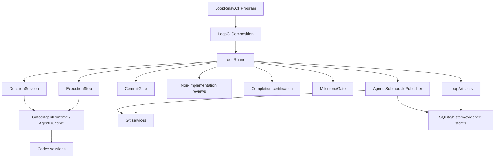
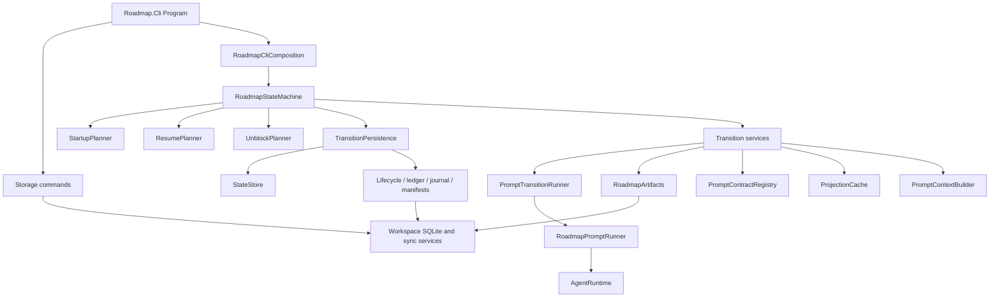
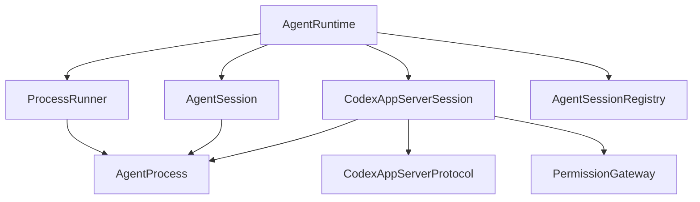

# LoopRelay.Cli and State Machine Refactor Discovery Audit

## 1. Executive Summary

This audit covers the current `LoopRelay.Cli` execution loop and the persisted workflow state machine in `LoopRelay.Roadmap.Cli`. The important architectural finding is that the repository contains two distinct forms of state-machine behavior:

- `LoopRelay.Cli` is an operational execution loop. Its "states" are mostly implicit branches, live artifacts, session state, git state, and terminal outcomes. The main controller is `LoopRunner`.
- `LoopRelay.Roadmap.Cli` is a persisted roadmap workflow. Its states are explicit values in `RoadmapState`, persisted through `.agents/state.json` or SQLite-backed stores. The main controller is `RoadmapStateMachine`.

The two systems are coupled through `.agents` artifacts, `.LoopRelay/persistence/looprelay.sqlite3`, completion evidence, milestone specs, active epic state, execution evidence, and the `.agents` submodule publication lifecycle. They should not be treated as one simple state machine.

The main CLI currently prioritizes execution continuity. It holds warm Codex sessions, manages handoff and decision artifacts, retries usage-limit failures for persistent turns, performs non-implementation reviews, publishes the `.agents` submodule, commits parent repository changes, and evaluates completion. Most of this behavior is not represented as a formal state enum.

The roadmap CLI prioritizes durable orchestration and provenance. It records prompt transitions, input snapshots, decision ledger entries, projection manifests, artifact lifecycle, split lineage, completion archives, workflow transactions, and recovery intents. Its enum contains active domain states, orchestration states, terminal report states, blocker states, cancellation/failure states, and legacy execution-preparation states.

Architecturally, the strongest qualities are:

- Explicit artifact provenance through transition snapshots, journals, lifecycle records, projection manifests, and evidence files.
- Clear Codex process/session abstraction below the CLIs.
- Strong prompt-contract and projection validation in the roadmap workflow.
- Explicit permission-gateway and review services separated from prompt execution.
- Recovery intent modeling for several blocked and failed states.

The main architectural liabilities are:

- State is distributed across memory, files, SQLite, git, submodules, Codex threads, telemetry rows, and comments.
- Manual composition constructs large dependency graphs with limited visible boundaries.
- `RoadmapState` mixes business workflow state, orchestration implementation state, blocker state, terminal state, and historical execution state.
- Several durable invariants are enforced by sequencing rather than type or state boundaries.
- Roadmap execution-preparation states remain in the model although current `Roadmap.Cli` stops before execution context generation.
- Main execution behavior is centered in implicit control flow rather than explicit transition objects.

This document is an audit and discovery artifact. It describes current responsibilities, coupling, complexity, hidden constraints, and regression risks. It does not propose a new architecture or implementation plan.

## 2. State Machine Purpose

### 2.1 Main CLI Purpose

`LoopRelay.Cli` runs the active implementation loop for an epic. Its purpose is to repeatedly:

- Ensure operational context exists.
- Decide the next execution direction when prior handoff exists.
- Run Codex execution in a persistent operational session.
- Require Codex to produce a handoff after the work turn.
- Review for non-implementation work.
- Persist `.agents` state into the `.agents` submodule.
- Commit and push real repository changes.
- Detect epic completion and certify completion.

Evidence:

- `src/LoopRelay.Cli/Program.cs` parses CLI arguments, creates `LoopCliComposition`, runs `LoopRunner.RunAsync`, and maps outcomes to process exit codes.
- `src/LoopRelay.Cli/Services/Execution/LoopRunner.cs` describes itself as the "LoopStart state machine" and runs serially until epic completion, failure, cancellation, or stall.
- `src/LoopRelay.Cli/Services/Execution/ExecutionStep.cs` runs one operational execution slice over a held-open Codex app-server session.

The main CLI state machine is operational rather than declarative. It is mostly encoded as ordered control flow and artifact conditions.

### 2.2 Roadmap CLI Purpose

`LoopRelay.Roadmap.Cli` manages durable roadmap-level workflow. Its purpose is to:

- Initialize or resume roadmap workflow state.
- Run project-context preflight.
- Select the next strategic initiative.
- Audit, create, split, retire, realign, or reimagine epics.
- Generate milestone deep dives.
- Evaluate completion and drift from execution evidence.
- Persist durable state, decisions, lifecycle, journals, and recovery intents.
- Support storage import/export/sync/verify commands.

Evidence:

- `src/LoopRelay.Roadmap.Cli/Program.cs` dispatches storage commands separately, then runs `RoadmapStateMachine.ExecuteAsync`.
- `src/LoopRelay.Roadmap.Cli/Primitives/State/RoadmapState.cs` defines explicit persisted states.
- `src/LoopRelay.Roadmap.Cli/Services/State/RoadmapStateMachine.cs` dispatches `status`, `run`, and `unblock`.
- `src/LoopRelay.Roadmap.Cli/Services/State/RoadmapTransitionPersistence.cs` persists state snapshots, decisions, journals, blockers, transition intents, and next transitions.

The roadmap state machine is persistent and evidence-oriented. It is formal enough to resume after process exit and to explain blocked states.

### 2.3 Purpose Boundary Between the Two

Current evidence indicates that `Roadmap.Cli` prepares and certifies roadmap artifacts, while `LoopRelay.Cli` performs the active implementation loop. The boundary is not completely clean:

- Roadmap states still include `GenerateOperationalContext`, `GenerateExecutionPrompt`, `ExecutionPromptReady`, `ExecutionLoop`, and `ExecutionBlocked`.
- `RoadmapResumePlanner` classifies several execution-preparation states as legacy or terminal/report-only.
- `RoadmapExecutionBridge`, `RoadmapExecutionOutcomeInterpreter`, `ExecutionDispositionProtocol`, and `ExecutionCompatibilityMaterializer` still exist and are tested, but the current `RoadmapStateMachine` does not call the bridge in normal run flow.

Evidence:

- `RoadmapResumePlanner` returns a terminal paused plan for `MilestoneSpecsReady` with the reason that the workflow stops before execution context generation.
- `RoadmapWorkflowStateClassifier` treats execution-preparation states as terminal pause/report states and labels them legacy execution preparation.
- `RoadmapExecutionBridge` exists under roadmap services, but `RoadmapStateMachine` does not inject or call it.

## 3. State Inventory

### 3.1 Main CLI Explicit Outcomes

`LoopRelay.Cli` exposes coarse terminal outcomes through `LoopOutcome`, consumed by `Program.cs`.

| Outcome | Meaning in current flow | Exit behavior |
| --- | --- | --- |
| `EpicCompleted` | Completion review and completion certification succeeded. | Exit 0 after a keypress prompt. |
| `CompletionBlocked` | Completion review or certification blocked closure. | Exit 4. |
| `Cancelled` | Ctrl+C or operation cancellation reached the runner. | Exit 130. |
| `Stalled` | Commit gate exceeded no-real-change threshold. | Exit 3. |
| `Failed` | Step failure, review failure, unexpected exception, or default failure path. | Exit 1. |

Evidence:

- `src/LoopRelay.Cli/Program.cs` maps these outcomes to console messages and exit codes.
- `src/LoopRelay.Cli/Services/Execution/LoopRunner.cs` returns the outcomes from completion, cancellation, failure, and stall branches.

### 3.2 Main CLI Implicit Operational States

The main execution loop has meaningful states even though most are not represented by an enum.

| Operational state | Owner | Entry condition | Exit condition | Key side effects |
| --- | --- | --- | --- | --- |
| `ProcessStartup` | `Program`, `LoopCliComposition` | CLI parse succeeds. | `LoopRunner` is created and invoked. | Loads settings, creates runtime, stores, permissions, telemetry, gates, sessions, and services. |
| `LoopStart` / `CompletionGate` | `LoopRunner` | Start of each while-loop iteration. | Epic complete, or continue into operational work. | Checks milestone completion before execution work. |
| `CompletionReview` | `LoopRunner`, completion review services | Milestone gate says epic complete. | Review approved or blocked/fails. | Runs non-implementation completion review. |
| `CompletionPublication` | `LoopRunner`, `AgentsSubmodulePublisher` | Completion review approved. | `.agents` publish succeeds/fails. | Publishes `.agents`, may export SQLite rows before submodule commit. |
| `CompletionRepositoryCommit` | `CommitGate` | Completion review may have changed non-agent files. | Commit/push succeeds or no changes. | Commits completion-review repository changes without mutating stall counter. |
| `CompletionCertification` | `CompletionCertificationService` | Completion review and publication completed. | Certified, blocked, or failed. | Certifies closure and clears decision resume state on success. |
| `OperationalContextReady` | `LoopArtifacts` | Loop continues after completion check. | Context present. | Creates `.agents/operational_context.md` from plan if missing. |
| `DecisionBypass` | `LoopRunner`, `LoopArtifacts` | Live `.agents/decisions/decisions.md` exists. | Execution prompt selected. | Reuses live decisions and skips the decision session. |
| `FirstExecution` | `LoopRunner` | No latest handoff exists. | Execution prompt selected. | Starts directly from plan without decision proposal. |
| `DecisionProposal` | `DecisionSession` | Latest handoff exists and no live decisions. | Decisions persisted. | Opens/resumes warm read-only decision session, proposes next work, writes decisions. |
| `DecisionTransfer` | `DecisionSession` | Router returns transfer and decision session is seeded. | New decision session ready. | Writes operational delta, closes old session, evolves and optimizes operational context. |
| `PreExecutionPublish` | `AgentsSubmodulePublisher` | Execution prompt chosen. | Publish succeeds/fails. | Publishes `.agents` before execution so context survives a crash. |
| `ExecutionWorkTurn` | `ExecutionStep` | Operational session opened. | Turn completed or throws. | Sends start/continue execution prompt to Codex. |
| `ExecutionHandoffTurn` | `ExecutionStep` | Work turn completed. | Handoff exists or throws. | Sends handoff-generation prompt; requires `.agents/handoffs/handoff.md`. |
| `PostExecutionReview` | `NonImplementationReviewService` | Execution step completed. | Approved or throws. | Reviews for non-implementation work and logs evidence. |
| `DecisionRetirement` | `LoopArtifacts` | Execution and review completed. | Live decisions deleted or absent. | Deletes live decisions so next iteration can make a new decision. |
| `PostExecutionPublish` | `AgentsSubmodulePublisher` | Decisions retired. | Publish succeeds/fails. | Publishes `.agents` after handoff and decision retirement. |
| `CommitAndStallEvaluation` | `CommitGate` | Post-execution publication completed. | Continue or stall. | Commits/pushes real repo changes, updates no-change counter. |
| `CancellationSalvage` | `LoopRunner` | Operation cancellation is caught. | Cancelled outcome. | Best-effort `.agents` publish with `CancellationToken.None`. |
| `FailureSalvage` | `LoopRunner` | Step/review/exception failure is caught. | Failed outcome. | Best-effort `.agents` publish with `CancellationToken.None`. |

Evidence:

- `LoopRunner.RunAsync` performs these phases in a single serial loop.
- `ExecutionStep.RunAsync` implements the two-turn execution slice and validates handoff existence.
- `DecisionSession.RunAsync` implements decision proposal, resume, transfer, and persistence.
- `LoopArtifacts` owns live/numbered handoff, decisions, delta, and operational-context operations.
- `CommitGate` owns real-change commit/push and stall counting.

### 3.3 Main CLI Supporting State

| State area | Owner | Persistence | Notes |
| --- | --- | --- | --- |
| Warm decision process | `DecisionSession` | In memory plus optional `decision_session_resume` SQLite row. | Tracks seeded/resume state, thread id, router accounting, transfer counts, and token/cost data. |
| Operational Codex process | `ExecutionStep`, `AgentRuntime`, `CodexAppServerSession` | Process/session memory. | Held open across work and handoff turn for one execution slice. |
| Milestone completion cache | `MilestoneGate` | In memory. | Caches incomplete milestone files by last write time. |
| No-change stall count | `CommitGate` | In memory. | Resets on real commit or milestone progress; stalls after more than two no-change iterations. |
| Live artifacts | `LoopArtifacts` | `.agents/...` files. | Live handoff, decisions, delta, operational context, plan, milestones. |
| History artifacts | `LoopArtifacts`, execution evidence stores | Numbered files or SQLite-backed stores. | Rotated histories for handoff/decision/delta/evidence. |
| Session telemetry | `SessionTelemetryRecorder` | SQLite plus JSONL compatibility export. | Best-effort recording; not part of control-flow correctness. |
| Git state | `CommitGate`, `AgentsSubmodulePublisher`, infrastructure git services | Parent repo and `.agents` submodule. | Real repo changes and `.agents` publication are intentionally separate. |

### 3.4 Roadmap Persisted States

`RoadmapState` contains the explicit persisted state inventory.

| State | Current meaning | Entry evidence | Exit or resume behavior | Notes |
| --- | --- | --- | --- | --- |
| `CoreReady` | Roadmap workflow can begin or resume core selection. | Fresh initialization, preflight recovery, or state reset. | `RunFromCoreReadyAsync` bootstraps completion context or selects next initiative. | Durable starting point. |
| `BootstrapRoadmapCompletionContext` | Completion context generation is in progress or was the current prompt state. | Bootstrap transition start. | Completion context ready or failure/blocker. | Mostly orchestration state. |
| `RoadmapCompletionContextReady` | Completion context exists and can support selection. | Bootstrap or update completion context transition. | Selection transition. | Domain-preparation state. |
| `SelectNextStrategicInitiative` | Selection prompt has run or selection is ready to continue. | `SelectNextEpicTransition`. | Continue according to parsed selection. | Requires active selection freshness/provenance. |
| `ExistingEpicSelected` | Selection chose an existing epic. | Selection continuation branch. | Epic preparation audit. | Short-lived branch state. |
| `NewEpicProposed` | Selection chose a new epic candidate. | Create-new transition prompt completion. | Candidate promotion to active epic. | Promotion-candidate state. |
| `SplitEpicProposed` | Selection chose an epic split. | Split transition prompt start/promotion candidate. | Split bundle interpretation and child selection. | Promotion-candidate state. |
| `EpicPreparationAudit` | Existing epic audit was produced. | `EpicPreparationAuditTransition`. | Retire, realign, reimagine, or block. | Decision-heavy state. |
| `RealignEpic` | Existing epic is being realigned. | Audit disposition. | Active epic promotion or block. | Rewrite branch state. |
| `ReimagineEpic` | Existing epic is being reimagined. | Audit disposition. | Active epic promotion or block. | Rewrite branch state. |
| `RetireEpic` | Existing epic was retired. | Audit disposition `Retire`. | Select next strategic initiative. | Persists retired epic identity. |
| `EvidenceBlocked` | Durable blocker requiring evidence repair or manual recovery. | Prompt transition failure, promotion block, split block, invariant failure, completion block, preflight recovery failure. | `unblock` planner may recover selected intents. | Central blocker state. |
| `EvidenceGathering` | Workflow needs more evidence. | Terminal/report-only path. | Report-only pause. | Domain terminal pause. |
| `CreateNewEpic` | Create-new-epic workflow is active. | Selection branch. | Candidate promotion. | Orchestration branch. |
| `SplitEpic` | Split workflow is active. | Selection branch. | Child selection/promotion. | Orchestration branch. |
| `SplitChildSelection` | Split bundle produced children and a selected child. | Split transition. | Active epic promotion or blocker. | Split lineage state. |
| `ActiveEpicReady` | A valid active epic exists. | New, rewrite, split, or existing promotion. | Generate milestone deep dives. | Major durable domain state. |
| `GenerateMilestoneDeepDives` | Milestone spec generation prompt is active. | Execution-prep branch from active epic. | `MilestoneSpecsReady` or blocker. | Orchestration state. |
| `MilestoneSpecsReady` | Milestone specs exist and are fresh for the active epic. | `GenerateMilestoneDeepDivesTransition`. | Current planner pauses before execution context generation. | Current boundary between roadmap and execution. |
| `GenerateOperationalContext` | Legacy execution-preparation state. | Historical workflow. | Current planner reports terminal pause. | Retained for compatibility/history. |
| `OperationalContextReady` | Legacy operational context state. | Historical workflow. | Current planner reports terminal pause. | Retained for compatibility/history. |
| `GenerateExecutionPrompt` | Legacy execution prompt generation state. | Historical workflow. | Current planner reports terminal pause. | Retained for compatibility/history. |
| `ExecutionPromptReady` | Legacy execution prompt ready state. | Historical workflow or recovery method. | Current planner reports terminal pause. | Some recovery code can save this state, but planner labels runtime recovery legacy. |
| `ExecutionLoop` | Legacy or external execution loop state. | Historical execution bridge or persisted execution evidence. | Current planner reports terminal pause unless completion evidence is evaluated from `EpicCompletionDetected`. | Execution now primarily lives in main CLI. |
| `ExecutionBlocked` | Execution produced a blocker. | Execution disposition or historical bridge. | `unblock` can recover malformed execution output; runtime repair currently legacy/report. | Durable execution blocker state. |
| `EpicCompletionDetected` | Execution produced a completion claim. | Execution disposition evidence. | Completion certification transition. | Bridge point into completion evaluation. |
| `CompletionEvaluationAndContextUpdate` | Completion evaluation/context update is active. | Completion certification flow. | Archive/context update/selection, or block. | Completion branch state. |
| `StrategicInvestigationRequired` | Selection determined strategy investigation is required. | Selection continuation. | Terminal/report-only pause. | Domain terminal pause. |
| `RoadmapRevisionRequired` | Selection determined roadmap revision is required. | Selection continuation. | Terminal/report-only pause. | Domain terminal pause. |
| `NoSuitableInitiative` | Selection found no suitable next initiative. | Selection continuation. | Terminal/report-only pause. | Domain terminal pause. |
| `Completed` | Roadmap workflow completed. | Terminal persistence. | Report completed. | Terminal state. |
| `Failed` | Workflow failed durably. | Cancellation/failure persistence or failed recovery. | `unblock` may recover selected intents. | Terminal/error state. |
| `Cancelled` | User cancellation was persisted. | `WriteCancelledStateAsync`. | Resume planner dispatches according to saved transition intent. | Cancellation state with recovery intent. |

Evidence:

- `src/LoopRelay.Roadmap.Cli/Primitives/State/RoadmapState.cs` defines all states above.
- `RoadmapResumePlanner.PlanForStateAsync` maps states to resume, terminal, or block actions.
- `RoadmapWorkflowStateClassifier` identifies terminal/report states and legacy execution-preparation states.

### 3.5 Roadmap Transition Status State

Roadmap transition persistence also stores transition-status state separate from `RoadmapState`.

| Status | Meaning |
| --- | --- |
| `Started` | A transition began and state was persisted before prompt execution. |
| `PromptCompleted` | A promotion-candidate prompt completed but post-processing/promotion has not finished. |
| `Completed` | A transition completed and durable outputs were saved. |
| `Paused` | Workflow paused intentionally or blocked for operator action. |
| `Failed` | A transition or recovery failed. |
| `Cancelled` | Workflow was cancelled and durable cancellation state was written. |

Evidence:

- `RoadmapPromptTransitionRunner` writes `Started`, `PromptCompleted`, and `Completed` state snapshots.
- `RoadmapTransitionPersistence.PersistWorkflowFailureAsync` writes failed state and blockers.
- `RoadmapStateMachine.WriteCancelledStateAsync` persists cancellation state.

### 3.6 Agent and Process State

The agent layer contributes additional state that influences both CLIs.

| State area | Owner | Notes |
| --- | --- | --- |
| Agent turn state | `AgentTurnResult`, `CodexAppServerTurnReader`, `AgentSession` | Turns can complete, fail, or cancel. Roadmap prompt runner throws on non-completion. Main CLI gated sessions may retry usage-limit failures. |
| Agent process state | `AgentProcess` | Tracks running, exited, cancelled, failed, stderr tail, and exit code. |
| App-server thread state | `CodexAppServerSession` | Starts or resumes threads, serializes turns, handles approval requests, and correlates JSON-RPC responses. |
| Registry state | `AgentSessionRegistry` | Tracks open sessions by repository/session id and disposes them on composition disposal. |

Evidence:

- `LoopRelay.Agents/Services/Sessions/AgentRuntime.cs` opens persistent sessions and runs one-shot sessions.
- `CodexAppServerSession` manages JSON-RPC app-server threads.
- `AgentProcess` owns process lifetime and forced process-tree kill on dispose.

## 4. Transition Inventory

### 4.1 Main CLI Transitions

| Transition | From | To | Classification | Evidence |
| --- | --- | --- | --- | --- |
| Parse and compose | CLI args | `LoopRunner` invocation | Bootstrapping | `Program.cs`, `LoopCliComposition`. |
| Completion check | Loop start | Completion branch or execution branch | Domain gate | `MilestoneGate.IsEpicCompleteAsync`. |
| Completion review | Complete milestone set | Approved/block/fail | Domain quality gate | `LoopRunner` completion branch. |
| Publish before certification | Approved completion review | `.agents` committed or failure | Persistence/git bookkeeping | `AgentsSubmodulePublisher.PublishAsync`. |
| Commit completion-review changes | Completion review path | Repo clean or committed | Git bookkeeping | `CommitGate.CommitPushIfChangedAsync`. |
| Completion certification | Completion review success | `EpicCompleted` or `CompletionBlocked` | Domain certification | `CompletionCertificationService`. |
| Ensure operational context | Execution branch | Context present | Artifact initialization | `LoopArtifacts.EnsureOperationalContextAsync`. |
| Skip decision on live decisions | Context ready | Execution using live decisions | Recovery/idempotency guard | `LoopRunner` checks `HasLiveDecisionsAsync`. |
| First execution without handoff | No handoff | Execution from plan | Bootstrap execution | `LoopRunner` checks `ReadLatestHandoffAsync`. |
| Decision proposal | Handoff exists | Live decisions persisted | Planning transition | `DecisionSession.RunAsync`. |
| Decision transfer | Warm session routed to transfer | New/updated decision context | Session lifecycle and context compaction | `DecisionSession.TransferAsync`. |
| Rotate live handoff after decision | Decision persisted | Handoff history updated and live deleted | Artifact bookkeeping | `LoopRunner` and `LoopArtifacts.RotateLiveHandoffAsync`. |
| Pre-execution publish | Prompt selected | `.agents` submodule state saved | Crash-resilience bookkeeping | `LoopRunner` before `ExecutionStep`. |
| Work turn | Execution prompt | Repo/artifact changes or failure | Implementation work | `ExecutionStep.RunAsync`. |
| Handoff turn | Work turn complete | Live handoff or failure | Continuity artifact generation | `ExecutionStep.RunAsync`. |
| Post-execution review | Handoff exists | Review approved/fail | Quality gate | `NonImplementationReviewService`. |
| Retire live decisions | Review success | Live decisions deleted | Idempotency reset | `LoopArtifacts.RetireLiveDecisionsAsync`. |
| Post-execution publish | Decisions retired | `.agents` published | Persistence/git bookkeeping | `LoopRunner`. |
| Commit/stall evaluation | Post publish | Continue or `Stalled` | Git and progress gate | `CommitGate.CommitPushAndEvaluateAsync`. |
| Cancellation salvage | Cancellation exception | `Cancelled` | Failure handling | `LoopRunner` catch block. |
| Failure salvage | Step/review/unexpected error | `Failed` | Failure handling | `LoopRunner` catch blocks. |

### 4.2 Roadmap CLI Command Transitions

| Command transition | Behavior | Classification |
| --- | --- | --- |
| `status` | Loads state, computes startup plan, reports blockers/intent/current state. | Observability. |
| `run` | Loads state, computes startup plan, runs preflight if required, resumes workflow. | Main durable workflow. |
| `unblock` | Loads state, asks `RoadmapUnblockPlanner`, dispatches supported recovery actions. | Recovery workflow. |
| Storage commands | Initialize/import/export/sync/verify workspace SQLite. | Persistence maintenance outside the state machine. |

Evidence:

- `RoadmapStateMachine.ExecuteAsync` dispatches `Status`, `Run`, and `Unblock`.
- `Program.cs` handles storage commands before constructing the roadmap state machine.

### 4.3 Roadmap Workflow Transitions

| Transition | From | To | Classification | Key persisted effects |
| --- | --- | --- | --- | --- |
| Fresh initialization | No state | `CoreReady` | Bootstrap | State snapshot. |
| Project context preflight | Startup plan | Continue or preflight blocker | Safety preflight | Contract emission, blocker report on failure. |
| Bootstrap roadmap completion context | `CoreReady` | `RoadmapCompletionContextReady` | Domain context | Completion context artifact, HITL capture, lifecycle. |
| Select next epic | `RoadmapCompletionContextReady` | `SelectNextStrategicInitiative` | Domain selection | Selection artifact, selection evidence, provenance, decision ledger. |
| Continue existing epic selection | `SelectNextStrategicInitiative` | `ExistingEpicSelected` / audit | Domain branch | Active selection validation. |
| Epic preparation audit | `ExistingEpicSelected` | `EpicPreparationAudit`, `RetireEpic`, `RealignEpic`, `ReimagineEpic`, or block | Domain assessment | Audit evidence, decision ledger, retired epic records. |
| Retire epic | `EpicPreparationAudit` | `RetireEpic`, then selection | Domain lifecycle | Retired epic state and selection supersession. |
| Realign/reimagine epic | Audit branch | `ActiveEpicReady` or block | Domain rewrite/promotion | Candidate artifact promotion, lifecycle, journal. |
| Create new epic | Selection branch | `NewEpicProposed`, then `ActiveEpicReady` or block | Domain creation/promotion | Candidate output, promotion, lifecycle, journal. |
| Split epic | Selection branch | `SplitChildSelection`, then `ActiveEpicReady` or block | Domain split/promotion | Split family, child artifacts, selected child promotion, lifecycle. |
| Generate milestone deep dives | `ActiveEpicReady` | `MilestoneSpecsReady` or block | Execution preparation | Specs bundle, manifest, lifecycle, execution-prep provenance. |
| Evaluate completion and drift | `EpicCompletionDetected` | archive/context update/selection or block | Completion certification | Review evidence, evaluation evidence, decision ledger, lifecycle/archive. |
| Update roadmap completion context | Completion archive path | `RoadmapCompletionContextReady` or selection path | Domain context update | Completion context artifact, evaluation evidence, selection supersession. |
| Persist cancellation | Any running state | `Cancelled` | Failure/cancellation handling | Blocker, transition intent, next transition. |
| Persist workflow failure | Transition failure | `EvidenceBlocked` or `Failed` | Failure handling | Journal failure record, blocker evidence, transition intent. |

Evidence:

- `RoadmapStateMachine.RunFromCoreReadyAsync`, `RunSelectionAndFollowingAsync`, and `ContinueAfterSelectionAsync`.
- Transition classes under `src/LoopRelay.Roadmap.Cli/Services/Transitions`.
- `RoadmapPromptTransitionRunner` and `RoadmapTransitionPersistence`.

### 4.4 Roadmap Recovery Transitions

| Recovery transition | Supported condition | Result behavior |
| --- | --- | --- |
| Resolve project-context preflight blocker | `EvidenceBlocked` with `Preflight` transition evidence. | Re-validates project context and recovers to `CoreReady`. |
| Resolve malformed execution output | `Failed`/`ExecutionBlocked` with execution evidence path. | Parses and validates execution disposition, saves routed execution state or blocker. |
| Resolve invalid completion certification | Completion certification blocker with evaluation evidence. | Revalidates evaluation and routes through completion recovery. |
| Repair execution runtime failure | `Failed` with runtime-failure intent. | Current planner reports legacy execution preparation no longer advanced by Roadmap CLI. |
| Unsupported recovery intents | Various artifact promotion, split, spec, projection, or transition failure intents. | Planner reports unsupported with reason. |

Evidence:

- `RoadmapUnblockPlanner.PlanAsync` and intent-specific handlers.
- `RoadmapStateMachine.RecoverPreflightBlockerAsync`, `RecoverExecutionDispositionAsync`, `RecoverCompletionCertificationAsync`, and `RecoverExecutionRuntimeFailureAsync`.

## 5. Responsibility Mapping

### 5.1 Main CLI Responsibilities

| Component | Responsibilities |
| --- | --- |
| `Program` | Parse args, set UTF-8 output, register Ctrl+C cancellation, map outcomes to exit codes. |
| `LoopCliComposition` | Manually assemble all CLI services, settings, permissions, runtimes, stores, gates, review services, and runner. |
| `LoopRunner` | Serial orchestration of completion gate, decision, execution, reviews, `.agents` publication, commits, cancellation/failure salvage. |
| `DecisionSession` | Warm read-only decision session, resume logic, router accounting, transfer, operational-context evolution, decision persistence, HITL capture. |
| `ExecutionStep` | One implementation slice, operational session lifecycle, work turn, handoff turn, handoff validation. |
| `LoopArtifacts` | Live/history artifact read/write/rotate/delete operations for handoff, decisions, delta, operational context. |
| `MilestoneGate` | Completion detection from milestone checkboxes and unticked item reporting. |
| `CommitGate` | Parent repo real-change commit/push and stall detection. |
| `WorkingTreeChangeDetector` | Definition of real repository changes excluding `.agents`. |
| `AgentsSubmodulePublisher` | Publish `.agents`, export SQLite-backed history/evidence first, record parent gitlink. |
| `GatedAgentRuntime` / `GatedAgentSession` | Turn telemetry and persistent usage-limit retry policy. |
| `SessionTelemetryRecorder` | Best-effort usage/cost/input-wait telemetry. |
| `NonImplementationReviewService` | Pre-slice and post-slice review gates and evidence. |
| `CompletionCertificationService` | Completion closure certification for main CLI. |

### 5.2 Roadmap CLI Responsibilities

| Component | Responsibilities |
| --- | --- |
| `Program` | Parse invocation, route storage commands, construct composition, map roadmap outcomes to exit codes. |
| `RoadmapCliComposition` | Manually assemble roadmap services, stores, prompt runner, projections, transitions, validators, and state machine. |
| `RoadmapStateMachine` | Command dispatch, startup/resume/unblock planning, workflow sequencing, cancellation/failure top-level handling. |
| `RoadmapStartupPlanner` | Classify startup action from persisted state. |
| `RoadmapResumePlanner` | Validate persisted state and decide resume action. |
| `RoadmapUnblockPlanner` | Validate supported recovery paths and produce unblock plans. |
| `RoadmapTransitionPersistence` | Save state snapshots, decision-ledger updates, failure states, blockers, transition intent, and next transitions. |
| `RoadmapPromptTransitionRunner` | Persist prompt transition boundaries around one-shot planning prompts. |
| `RoadmapPromptRunner` | Run read-only planning Codex prompts and throw on non-completion. |
| `TransitionInputResolver` | Build transition input snapshots and logical hashes. |
| `PromptContractRegistry` | Define required inputs, outputs, allowed decisions, writers, parsers, and stale projection policies. |
| `ProjectionCache` | Generate, validate, and persist projection manifest entries. |
| `RoadmapPromptContextBuilder` | Build prompt contexts without embedding forbidden raw project context markers. |
| Transition classes | Domain-specific prompt execution, parsing, artifact writes, lifecycle, journal, decision, blocker, and promotion behavior. |
| `InvariantValidator` | Validate project-context hash, projections, active epic, execution-prep freshness, and execution prerequisites. |
| `WorkspaceSqliteStore` and sync services | Persist and synchronize structured workflow domains in SQLite. |

### 5.3 Shared/Lower-Level Responsibilities

| Component | Responsibilities |
| --- | --- |
| `AgentRuntime` | Open persistent sessions, run one-shot sessions, register sessions, close sessions. |
| `CodexAppServerSession` | JSON-RPC app-server protocol, thread start/resume, turn serialization, approval handling. |
| `AgentSession` | Legacy/one-shot process turn loop, stdout pump, prompt writes, cancellation/disposal. |
| `AgentProcess` | Process lifetime, stderr tail, stdout line reads, process-tree kill on dispose. |
| `PermissionGateway` and evaluator | Parse permission requests, evaluate allow/review/deny rules, return approvals. |
| `GitPorcelain` and git services | Parse git status, commit/push parent repository and `.agents` submodule. |

## 6. Coupling Analysis

### 6.1 Main CLI Temporal Coupling

The main loop has several order-dependent operations:

- Completion is checked before operational context and before any execution work.
- Existing live decisions bypass the decision session and are executed directly.
- First execution bypasses decision when no handoff exists.
- When a decision is made from a handoff, the live handoff is rotated after decision persistence.
- `.agents` is published before execution to preserve context for crash recovery.
- Execution must produce a handoff before the step is considered complete.
- Decisions are retired only after execution and post-execution review succeed.
- `.agents` is published again after handoff and decision retirement.
- Parent repo commit/stall evaluation occurs only after `.agents` publication.
- Cancellation/failure salvage publishes `.agents` best-effort after errors.

These are behavioral dependencies, not merely implementation order. Changing the sequence changes crash recovery, idempotency, and what the next iteration sees.

Evidence:

- `LoopRunner.RunAsync` encodes this order directly.
- `LoopArtifacts` operations distinguish live artifacts from numbered history.
- `CommitGate` excludes `.agents` from parent repo real-change detection.

### 6.2 Roadmap Durable-State Coupling

Roadmap transitions couple several stores and artifacts:

- State snapshots must match transition journal entries.
- Decision ledger records must correspond to prompt outputs and state transitions.
- Projection manifest entries must correspond to prompt-contract inputs.
- Active selection provenance must remain fresh against roadmap source artifacts.
- Artifact lifecycle must match promoted, blocked, superseded, ready, and draft artifact paths.
- Execution-preparation manifest must match active epic and milestone specs.
- Split family records must match child artifact writes.
- Completion archives must match completion evaluation decisions and active epic lifecycle.
- SQLite workflow transaction markers must match completed or failed persistence units.

Evidence:

- `RoadmapTransitionPersistence`, `RoadmapPromptTransitionRunner`, `TransitionInputResolver`, `ProjectionCache`, `ArtifactLifecycleStore`, `ExecutionPreparationManifestStore`, `SelectionProvenanceManifestStore`, and `WorkspaceSqliteStore`.

### 6.3 Main/Roadmap Coupling

The CLIs are coupled through shared artifact names and persisted domains:

- `LoopRelay.Cli` consumes `.agents/plan.md`, `.agents/milestones/m*.md`, `.agents/operational_context.md`, handoffs, and decisions.
- `Roadmap.Cli` creates or validates active epic, milestone specs, execution-prep metadata, completion evaluation, archives, and roadmap completion context.
- Both can read/write evidence domains under `.agents/evidence`.
- Both can use `.LoopRelay/persistence/looprelay.sqlite3` for selected history/evidence/structured state.
- `.agents` submodule publication makes artifact state externally visible and versioned.

Evidence:

- `LoopArtifacts`, `RoadmapArtifacts`, `RoadmapArtifactPaths`, `LoopRelayWorkspaceDatabase`, `WorkspaceSqliteStore`, and `AgentsSubmodulePublisher`.

### 6.4 Git Coupling

Git behavior is part of correctness:

- `.agents` changes are committed/pushed through submodule publication.
- Real parent repo changes exclude `.agents`.
- Parent gitlink recording follows submodule commit.
- Completion review can create parent repo changes committed separately.
- Stalling is based on lack of real parent repo changes and lack of milestone progress.

Evidence:

- `CommitGate`, `WorkingTreeChangeDetector`, CLI `AgentsSubmodulePublisher`, infrastructure `AgentsSubmodulePublisher`, and `GitPorcelain`.

### 6.5 Codex Protocol Coupling

Both CLIs rely on Codex process behavior:

- Persistent sessions use `codex app-server --listen stdio://`.
- One-shot prompts use `codex exec --json`.
- App-server resume uses `thread/resume` with `excludeTurns=true`.
- Permission requests are handled through app-server approval responses.
- Turn completion and token usage are parsed from app-server events.

Evidence:

- `CodexAgentArgumentBuilder`, `CodexAppServerProtocol`, `CodexAppServerSession`, `CodexAppServerTurnReader`, and `AgentSession`.

### 6.6 Filesystem/SQLite Coupling

The system supports both file-backed and SQLite-backed persistence:

- Main CLI uses SQLite loop history/evidence stores when the workspace DB is usable.
- Roadmap CLI classifies SQLite as missing, empty, imported, canonical, corrupt, unsupported, or incompatible partial.
- Sync/import/export domains include core, metadata, journal, loop histories, and execution evidence.
- Domain hashes and sync markers prevent overwriting divergent changes.

Evidence:

- `LoopCliComposition`, `RoadmapCliComposition`, `WorkspaceSqliteStore.ValidateAsync`, `WorkspaceSyncService`, and `RoadmapLogicalArtifactServices`.

## 7. State Ownership

### 7.1 Main CLI Mutable State Ownership

| State | Owner | Visibility | Risk |
| --- | --- | --- | --- |
| Loop phase | `LoopRunner` control flow | In memory only | Hard to inspect externally. |
| Completion progress | `MilestoneGate` over milestone files | Files plus in-memory cache | Timestamp-based cache can hide same-timestamp changes. |
| Decision session seed/resume/accounting | `DecisionSession` | In memory plus SQLite resume row | Complex lifecycle around transfer and close. |
| Decision artifacts | `LoopArtifacts` | `.agents/decisions` live/history | Live decision presence changes route. |
| Handoff artifacts | `LoopArtifacts` | `.agents/handoffs` live/history | Missing handoff fails execution step. |
| Operational context | `LoopArtifacts`, `DecisionSession` transfer operations | `.agents/operational_context.md` | Generated from plan if missing; also evolved by artifact operations. |
| Operational delta | `DecisionSession` | `.agents/operational_delta.md` live/history | Used in transfer path. |
| No-change count | `CommitGate` | In memory only | Lost on process restart. |
| `.agents` publication | CLI/infrastructure publishers | Git submodule and parent gitlink | Requires git branch and push behavior. |
| Telemetry | `SessionTelemetryRecorder` | SQLite/JSONL | Best effort, not authoritative. |

### 7.2 Roadmap Durable State Ownership

| State | Owner | Persistence |
| --- | --- | --- |
| Current roadmap state | `RoadmapStateStore` / SQLite store | `.agents/state.json` or `roadmap_state`. |
| Last transition | `RoadmapTransitionPersistence` | State document and transition journal. |
| Blockers | `RoadmapTransitionPersistence`, planners, transition classes | State document plus evidence paths. |
| Transition intent | `RoadmapTransitionPersistence`, recovery methods | State document. |
| Decision ledger | `DecisionLedgerStore` | `.agents/decision-ledger.json` or SQLite domain. |
| Artifact lifecycle | `ArtifactLifecycleStore` | `.agents/artifacts/lifecycle.json` or SQLite domain. |
| Projection manifest | `ProjectionManifestStore` | `.agents/projections` metadata or SQLite domain. |
| Selection provenance | `SelectionProvenanceManifestStore` | `.agents/selection-provenance-manifest.json`. |
| Execution-prep manifest | `ExecutionPreparationManifestStore` | `.agents/execution-preparation-manifest.json`. |
| Split lineage | Split stores | `.agents/splits` and/or SQLite structured tables. |
| Completed epic archives | Completion archive stores | `.agents/archive/epics` and/or SQLite structured tables. |
| Workflow transaction markers | `WorkflowPersistenceCoordinator` | SQLite `workflow_transactions`. |
| Sync markers | `WorkspaceSyncService` | SQLite sync marker domain. |

### 7.3 Ownership Ambiguity

There are several state areas with shared or implicit ownership:

- `.agents` is owned operationally by both CLIs, but published by the main CLI during execution.
- Execution evidence can be file-backed or SQLite-backed and can be produced by main execution, roadmap bridge logic, or recovery workflows.
- Completion evaluation bridges execution evidence into roadmap closure.
- Legacy execution-preparation states remain in roadmap state even though main CLI handles current execution.
- Git state is a functional part of both artifact durability and implementation progress, but it is not represented in `RoadmapStateDocument`.

## 8. Execution Flow

### 8.1 Main CLI Flow

1. `Program` sets console output to UTF-8.
2. CLI arguments are parsed into repository and Codex executable values.
3. `LoopCliComposition` loads settings, registers services, selects file or SQLite history/evidence stores, builds permissions, runtime wrappers, review services, gates, and `LoopRunner`.
4. Ctrl+C is wired to cancel the shared token instead of immediately killing the process.
5. `LoopRunner.RunAsync` enters a serial while loop.
6. At the top of each iteration, `MilestoneGate` checks milestone files for completion.
7. If complete, the runner performs completion review, publishes `.agents`, commits completion-review repo changes, certifies completion, publishes again if needed, clears decision resume state, and returns a completion outcome.
8. If not complete, the runner ensures operational context exists.
9. If live decisions exist, execution uses those decisions directly.
10. If no handoff exists, execution starts from the plan.
11. Otherwise, the decision session proposes decisions from the latest handoff and the live handoff is rotated.
12. `.agents` is published before execution.
13. `ExecutionStep` opens a persistent operational session, sends the work prompt, then sends a handoff prompt.
14. The handoff file is required; absence fails the step.
15. Post-execution review runs and logs evidence.
16. Live decisions are retired.
17. `.agents` is published again.
18. Parent repository changes are committed/pushed and stall state is evaluated.
19. Cancellation and failures trigger best-effort `.agents` salvage publication.

### 8.2 Roadmap CLI Flow

1. `Program` sets console output to UTF-8.
2. `RoadmapCliInvocation` parses command, repository, elevation flags, domain filters, and storage options.
3. Storage commands bypass the state machine and call workspace storage services.
4. Non-storage commands construct `RoadmapCliComposition`.
5. `RoadmapStateMachine.ExecuteAsync` dispatches `status`, `run`, or `unblock`.
6. `status` loads persisted state and reports startup plan, blockers, transition intent, and current state.
7. `run` loads state and asks `RoadmapStartupPlanner` how to proceed.
8. If preflight is required, project context is loaded and prompt contracts are emitted.
9. `RoadmapResumePlanner` validates state, transition safety, projection freshness, active selection, and execution-prep readiness where applicable.
10. Resume action routes to core initialization, selection, selection continuation, milestone spec generation, completion evaluation, terminal pause, or block.
11. Prompt transitions persist started state, run a read-only one-shot Codex prompt, persist completion, then perform transition-specific parsing and artifact work.
12. Failures may persist blockers and transition intent.
13. Cancellation persists `Cancelled`.

### 8.3 Storage Flow

Storage commands operate outside `RoadmapStateMachine`:

- `storage-init` initializes the workspace SQLite database.
- `storage-import` imports selected domains from filesystem artifacts into SQLite.
- `storage-export` exports selected domains from SQLite to filesystem artifacts.
- `storage-sync` synchronizes domains using hashes and sync markers.
- `storage-verify` verifies workspace storage consistency.

Evidence:

- `Roadmap.Cli/Program.cs` handles storage commands before state-machine composition.
- `WorkspaceSyncService` manages domain-scoped import/export/sync and dependency validation.

## 9. Cognitive Complexity

### 9.1 Main CLI Complexity

`LoopRunner` is readable as a linear execution loop, but its simplicity is partly achieved by embedding important state-machine rules in branch order and comments. The cognitive load comes from understanding what each artifact means at that point in the sequence.

High-complexity areas:

- Decision route selection and warm session reuse in `DecisionSession`.
- Transfer flow that mutates operational context through scoped artifact operations.
- Live versus numbered handoff/decision/delta semantics.
- Crash/idempotency behavior around pre-execution publish, live decisions, and handoff rotation.
- Interaction between milestone completion, non-implementation reviews, completion certification, `.agents` publication, and parent repo commits.
- Git distinction between `.agents` submodule state and real parent repository changes.

Evidence:

- `DecisionSession` owns resume, seeded state, router accounting, transfer, artifact operations, prompt policy, HITL capture, and resume-state persistence.
- `LoopArtifacts` hides live/history details, but route decisions still depend on live file presence.
- `CommitGate` combines commit/push behavior with stall policy.

### 9.2 Roadmap CLI Complexity

`RoadmapStateMachine` delegates heavily, but the total workflow is cognitively large because many durable subsystems must agree.

High-complexity areas:

- Startup, resume, and unblock planning are separate from transition implementation.
- Prompt transitions have generic persistence wrappers plus transition-specific post-processing.
- `RoadmapState` includes domain, orchestration, blocker, terminal, cancellation, failure, and historical execution states.
- Artifact lifecycle, decision ledger, transition journal, projection manifest, selection provenance, split lineage, and SQLite workflow transactions all contribute to correctness.
- Recovery intent coverage is partial and state-dependent.
- Legacy execution-preparation states remain visible in resume logic and terminal reporting.

Evidence:

- `RoadmapCliComposition` constructs a large manual dependency graph.
- `RoadmapResumePlanner` contains state-specific validation and report-only handling.
- `RoadmapUnblockPlanner` supports only selected recovery intents and explicitly rejects others.

### 9.3 Lower-Level Agent Complexity

The agent layer hides important operational complexity:

- Persistent app-server sessions use JSON-RPC, request correlation, server approval requests, and turn serialization.
- One-shot sessions use stdout JSON/event parsing and process completion semantics.
- Process disposal kills process trees and handles stderr/stdout drain behavior.
- Main CLI wraps persistent sessions with usage-limit retry, while roadmap one-shot prompt runner does not use the same gated retry wrapper in current composition.

Evidence:

- `CodexAppServerSession`, `AgentSession`, `AgentProcess`, `GatedAgentRuntime`, and `RoadmapPromptRunner`.

## 10. Architectural Boundaries

### 10.1 Clear Boundaries

The codebase has several explicit boundaries:

- CLI entrypoint boundary: `Program` files keep process-level concerns outside services.
- Composition boundary: `LoopCliComposition` and `RoadmapCliComposition` create service graphs.
- Agent boundary: `IAgentRuntime` and session abstractions isolate Codex process mechanics.
- Artifact boundary: `IArtifactStore`, `LoopArtifacts`, and `RoadmapArtifacts`.
- Permission boundary: permission gateway/evaluator separate approval decisions from session protocol handling.
- Prompt contract boundary: roadmap prompt inputs/outputs are declared in `PromptContractRegistry`.
- Persistence boundary: state stores, workflow coordinator, logical artifact stores, and sync services.
- Git boundary: commit/publish services isolate git calls from workflow controllers.

### 10.2 Leaky Boundaries

Several boundaries leak behavioral assumptions:

- `LoopRunner` must know live artifact semantics exposed through `LoopArtifacts`.
- `DecisionSession` combines planning, session lifecycle, transfer, artifact operations, router accounting, prompt policy, and resume persistence.
- Roadmap transitions combine prompt execution, parsing, artifact writes, lifecycle updates, decision recording, HITL capture, and state persistence.
- `RoadmapStateMachine` still knows specific transition and recovery routing rather than relying entirely on transition metadata.
- SQLite and filesystem persistence coexist in ways that make source-of-truth status context-dependent.
- Git publication order is part of state-machine correctness but not represented as durable workflow state.

### 10.3 Boundary Between Domain and Implementation State

The domain state model and implementation state are intermixed:

- Domain states include `ActiveEpicReady`, `MilestoneSpecsReady`, `RetireEpic`, and completion states.
- Implementation/orchestration states include `BootstrapRoadmapCompletionContext`, `GenerateMilestoneDeepDives`, `GenerateOperationalContext`, and `GenerateExecutionPrompt`.
- Failure/report states include `EvidenceBlocked`, `Failed`, `Cancelled`, and terminal investigation/revision states.
- Historical states remain in the same enum as active states.

This mixture increases the cost of reading the state machine because state names do not all answer the same kind of question.

## 11. Dependency Graph

### 11.1 Main CLI Dependency Shape

### 11.2 Roadmap CLI Dependency Shape

### 11.3 Shared Lower-Level Dependency Shape

## 12. Lifecycle Analysis

### 12.1 Main CLI Lifecycle

The main CLI lifecycle is process-centered:

- Composition creates long-lived services for a single CLI run.
- `DecisionSession` can keep a warm planning session across loop iterations.
- `ExecutionStep` opens a separate operational session for one execution slice and closes it in `finally`.
- `AgentSessionRegistry` tracks open sessions for cleanup.
- `LoopRunner` salvages `.agents` state on cancellation or failure.
- Composition disposal closes runner, registry, and service provider.

Important lifecycle detail:

- `DecisionSession.DisposeAsync` keeps resume state by default, while explicit close can clear resume state depending on the path.
- Completion success clears the decision resume store.
- Transfer closes the old decision process after generating operational delta and before evolving operational context.

Evidence:

- `LoopRunner`, `DecisionSession.CloseAsync`, `DecisionSession.DisposeAsync`, `ExecutionStep`, and `AgentRuntime`.

### 12.2 Roadmap CLI Lifecycle

The roadmap CLI lifecycle is transition-centered:

- A command starts, loads persisted state, and computes startup/resume/unblock plan.
- Prompt transitions persist `Started` before Codex execution.
- Promotion-candidate transitions can persist `PromptCompleted` before post-processing.
- Completed transitions persist outputs, lifecycle, decisions, and next state.
- Failures persist blockers and transition intent where supported.
- Cancellation persists `Cancelled`.
- Storage commands have independent lifecycle around import/export/sync/verify.

Evidence:

- `RoadmapPromptTransitionRunner`, `RoadmapTransitionPersistence`, `RoadmapStateMachine`, and `WorkspaceSyncService`.

### 12.3 Artifact Lifecycle

Roadmap artifact lifecycle is explicit, while main CLI artifact lifecycle is mostly file-name convention and rotation:

- Roadmap lifecycle records paths as draft, ready, blocked, promoted, superseded, or related domain states.
- Main loop rotates live files into numbered history and deletes live files at specific points.
- `.agents` submodule publication provides external version history for both.
- SQLite can mirror or replace selected filesystem history domains.

Evidence:

- `ArtifactLifecycleStore`, `LoopArtifacts`, `RoadmapArtifacts`, `WorkspaceSqliteStore`, and `AgentsSubmodulePublisher`.

### 12.4 Codex Session Lifecycle

Agent lifecycle differs by use case:

- Main execution uses persistent app-server sessions for operational turns.
- Main decision proposal uses a warm persistent read-only app-server session with resume support.
- Roadmap planning prompts use one-shot read-only Codex execution.
- Usage-limit retry wraps main persistent turns but not roadmap one-shot prompts in the observed composition.

Evidence:

- `ExecutionStep`, `DecisionSession`, `RoadmapPromptRunner`, `GatedAgentRuntime`, and `RoadmapCliComposition`.

## 13. Failure Analysis

### 13.1 Main CLI Failure Behavior

| Failure type | Current behavior |
| --- | --- |
| CLI parse failure | Prints error and returns exit code 2. |
| Cancellation | Ctrl+C cancels token; `LoopRunner` catches cancellation, salvages `.agents`, returns `Cancelled`. |
| Execution work turn non-completion | `ExecutionStep` throws `LoopStepException`; runner salvages `.agents`, returns `Failed`. |
| Handoff turn non-completion | `ExecutionStep` throws. |
| Missing handoff after handoff turn | `ExecutionStep` throws. |
| Post-execution review failure | Runner logs review failure, salvages `.agents`, returns `Failed`. |
| Completion review block | Runner returns `CompletionBlocked`. |
| Completion certification block | Runner returns `CompletionBlocked`. |
| Git/submodule/publish failure | Propagates into runner failure path. |
| Usage-limit failure in persistent session | `GatedAgentSession` waits and retries up to three times if session remains running. |
| No real changes for repeated iterations | `CommitGate` returns stalled after more than two no-change iterations unless milestone progress resets the counter. |

### 13.2 Roadmap CLI Failure Behavior

| Failure type | Current behavior |
| --- | --- |
| CLI parse failure | Prints error and returns exit code 2. |
| Storage command cancellation | Returns exit 130. |
| Storage command failure | Prints error and returns exit 1. |
| Project-context preflight failure | Reports ephemeral blocker and returns `PreflightBlocked`; some recovery paths can persist resolved blocker state. |
| Prompt transition failure | Persists transition failure journal and `EvidenceBlocked` with intent, then throws AlreadyPersisted. |
| Promotion post-processing failure | Often persists blocker evidence and `EvidenceBlocked`. |
| Invariant failure | Persists failure evidence and throws AlreadyPersisted. |
| Cancellation | Persists `Cancelled` with transition intent and returns `Cancelled`. |
| Unsupported unblock intent | Reports blocker/reason and leaves workflow paused or failed. |
| Malformed execution output | Recovery planner can parse and route repaired disposition evidence. |
| Invalid completion certification | Recovery planner can validate repaired evaluation evidence and route through completion recovery. |
| Runtime execution recovery | Planner reports current legacy execution-preparation boundary and does not advance execution runtime failure. |

### 13.3 Failure Persistence Differences

Main CLI failures are mostly reported through process outcome and best-effort artifact salvage. Roadmap CLI failures are more often persisted as durable state, blocker evidence, transition intent, and journal entries.

This difference is important:

- Main CLI is optimized for ongoing operational work and external git state.
- Roadmap CLI is optimized for durable explanation and resumability.

### 13.4 Non-Transactional or Partially Transactional Areas

Evidence shows several persistence operations are coordinated, but not all cross-system effects are one transaction:

- SQLite workflow coordinator records units for selected roadmap persistence phases.
- Filesystem writes, git commits, submodule pushes, parent gitlink commits, and Codex session state cannot be one atomic transaction.
- Main CLI publication and parent repo commits are sequential operations with salvage on failure.
- Split lineage staging rolls back staged writes on catch, but external side effects depend on which writes already occurred.
- Completion archive/context update spans evidence, archive, lifecycle, decision, and state persistence.

The current architecture handles this through journals, blockers, idempotency checks, resume planning, and salvage rather than a global transaction.

## 14. Hidden Architectural Constraints

### 14.1 Sequencing Constraints

The following constraints are embedded in control flow:

- Main completion must be checked at the top of each loop before new execution.
- Existing live decisions must be executed before new decisions are generated.
- No-handoff bootstrap must skip decision proposal.
- A handoff produced by execution must exist before a step is considered successful.
- Decisions must be retired only after execution and review succeed.
- `.agents` must be published before and after execution for durability.
- Parent repo real-change commit must exclude `.agents`.
- Completion certification follows completion review and `.agents` publication.

### 14.2 Artifact Naming Constraints

Specific paths carry behavior:

- `.agents/decisions/decisions.md` changes decision routing.
- `.agents/handoffs/handoff.md` is required after execution.
- `.agents/operational_context.md` seeds and evolves execution context.
- `.agents/plan.md` can initialize operational context.
- `.agents/milestones/m*.md` are the only files counted by `MilestoneGate`; `plan.md` is excluded.
- `.agents/state.json` is the structured roadmap state file.
- `.agents/selection.md`, `.agents/epic.md`, `.agents/specs`, `.agents/projections`, `.agents/contracts`, `.agents/evidence`, and `.agents/archive` have specific roadmap semantics.

### 14.3 Persistence Mode Constraints

The same logical data can exist in filesystem artifacts, SQLite, or both. Code paths depend on database usability:

- Main CLI selects SQLite history/evidence stores only when the loop history DB is usable.
- Roadmap CLI uses SQLite-backed stores only for `ValidImported` or `ValidCanonical` validation results.
- Sync service refuses selected domains when referenced dependencies are omitted.
- Logical artifact resolution includes filesystem, migrated domain, structured SQLite, loop history, and execution evidence providers.

### 14.4 Prompt Contract Constraints

Roadmap prompt execution depends on prompt contracts:

- Required inputs must be present and fresh.
- Required outputs must be produced.
- Allowed decisions constrain what prompt output can mean.
- Projection stale policies determine whether cached projection data is acceptable.
- Context builders avoid embedding raw project context markers.

### 14.5 Git and Submodule Constraints

Correctness depends on git state:

- `.agents` is a submodule in the expected workflow.
- Submodule publication requires branch awareness and push behavior.
- Parent gitlink must be recorded after submodule commit.
- Parent repo implementation commits intentionally exclude `.agents`.
- Stall detection depends on git status after filtering `.agents`.

### 14.6 Codex Runtime Constraints

The system assumes:

- `codex app-server` JSON-RPC event shapes remain compatible with the protocol code.
- `codex exec --json` one-shot output remains parseable by the legacy session path.
- Usage-limit diagnostics contain recognizable text for retry detection.
- Permission request payloads can be parsed by the configured permission adapter.
- Persistent session resume thread ids remain valid when resume state is considered fresh.

## 15. Human Readability Assessment

### 15.1 Main CLI Readability

`LoopRunner` is approachable because it is serial and heavily named. A reader can follow one iteration top to bottom. The hidden cost is that the most important invariants are distributed among:

- Comments in `LoopRunner`.
- Live artifact checks in `LoopArtifacts`.
- Session behavior in `DecisionSession` and `ExecutionStep`.
- Git filtering in `WorkingTreeChangeDetector`.
- Commit/stall behavior in `CommitGate`.

`DecisionSession` is the hardest main CLI class to read because it mixes:

- Warm session lifecycle.
- Resume.
- Transfer.
- Router accounting.
- Cost accounting.
- Prompt policy.
- Artifact-scoped operations.
- HITL capture.
- Decision persistence.

### 15.2 Roadmap CLI Readability

The roadmap workflow is discoverable but wide. `RoadmapStateMachine` is a useful entry point, yet understanding one transition requires reading several collaborating services:

- Startup/resume/unblock planner.
- Prompt contract.
- Context builder.
- Transition input resolver.
- Prompt transition runner.
- Specific transition class.
- Persistence and lifecycle stores.
- Parser/policy classes for transition output.

The explicit state enum helps navigation, but the enum's mixed categories make it harder to infer behavior from state name alone.

### 15.3 Composition Readability

Both composition roots are large. This makes dependencies explicit, but it also makes ownership boundaries harder to see:

- `LoopCliComposition` constructs execution, decision, review, telemetry, gate, git, completion, permission, and artifact services in one method.
- `RoadmapCliComposition` constructs state, storage, projection, prompt, transition, invariant, completion, lifecycle, split, and sync services in one method.

The upside is local visibility. The downside is constructor and ordering complexity.

### 15.4 Test Readability

The test project names indicate coverage for CLI, roadmap, agents, permissions, infrastructure, projections, and persistence. The behavior is broad enough that tests are likely important documentation for refactor safety. The audit did not exhaustively inspect every test.

## 16. Architectural Debt

### 16.1 Main CLI Debt

Observed debt:

- The operational state machine is implicit rather than modeled.
- `DecisionSession` has multiple responsibilities and significant mutable internal state.
- `ExecutionStep` contains literal `"TODO"` placeholders in rendered prompt calls, which may be intentional prompt shape but is surprising.
- Stall counter state is in memory and not durable across process restart.
- Completion, publication, review, certification, and git commits are sequentially interwoven.
- Crash recovery depends on live artifact conventions and publication order.
- Usage-limit retry policy applies to persistent sessions but not uniformly to all prompt execution paths.

### 16.2 Roadmap CLI Debt

Observed debt:

- `RoadmapState` contains active states, legacy states, terminal states, failure states, and orchestration steps in one enum.
- Current roadmap flow stops at `MilestoneSpecsReady`, but execution-preparation and execution-loop states remain first-class.
- Recovery intent support is partial and explicit; unsupported intents are common enough to be modeled.
- Prompt transition classes often combine domain parsing, artifact writes, lifecycle, journaling, HITL, state persistence, and blocker behavior.
- Dual filesystem/SQLite persistence increases the number of possible source-of-truth states.
- Invariants and resume checks are spread across planner, validator, transition persistence, projection cache, and individual transitions.
- Some preflight blockers are reported without durable state mutation, while other failures are durably persisted.

### 16.3 Cross-Cutting Debt

Observed debt:

- `.agents` is simultaneously a working area, history area, submodule, workflow state store, and inter-CLI contract.
- Git operations are part of state-machine semantics but are external side effects.
- Codex runtime behavior is a protocol dependency below business workflow code.
- Human-in-the-loop capture is integrated into many transitions but not uniformly visible from state names.
- Telemetry is best-effort and orthogonal to control flow, but usage and cost data influence decision session routing/accounting.

## 17. Existing Refactoring Seams

This section identifies seams that already exist. It does not recommend a refactor plan.

### 17.1 Main CLI Seams

| Seam | Current abstraction |
| --- | --- |
| Agent runtime | `IAgentRuntime`, `IAgentSession`, `AgentRuntime`, `GatedAgentRuntime`. |
| Artifact operations | `LoopArtifacts`, `IArtifactStore`, history/evidence stores. |
| Decision routing | `IDecisionSessionRouter` and router accounting in `DecisionSession`. |
| Execution slice | `ExecutionStep`. |
| Milestone completion | `MilestoneGate`. |
| Real-change detection | `WorkingTreeChangeDetector`. |
| Commit/stall behavior | `CommitGate`. |
| `.agents` publication | `AgentsSubmodulePublisher` wrapper and infrastructure publisher. |
| Completion review/certification | Non-implementation review services and completion certification service. |
| Telemetry | `SessionTelemetryRecorder`, `CodexUsageProbe`, telemetry stores. |
| Permissions | `PermissionGateway`, evaluator, handlers, settings loader. |

### 17.2 Roadmap CLI Seams

| Seam | Current abstraction |
| --- | --- |
| Startup/resume/unblock decision | `RoadmapStartupPlanner`, `RoadmapResumePlanner`, `RoadmapUnblockPlanner`. |
| State persistence | `IRoadmapStateStore`, `RoadmapStatePersistenceDocument`, `RoadmapTransitionPersistence`. |
| Prompt transition wrapper | `RoadmapPromptTransitionRunner`. |
| Prompt execution | `RoadmapPromptRunner`. |
| Prompt contracts | `PromptContractRegistry`. |
| Transition inputs | `TransitionInputResolver`. |
| Projection generation/cache | `ProjectionCache`, projection registry, manifest store. |
| Context building | `RoadmapPromptContextBuilder`. |
| Domain transitions | Transition classes under roadmap services. |
| Artifact lifecycle | `ArtifactLifecycleStore`. |
| Decision ledger | Decision ledger store. |
| Split lineage | Split family stores and `SplitLineagePersistence`. |
| Completion archive | Completion archive and certification transition services. |
| Workflow transaction coordination | `IWorkflowPersistenceCoordinator`. |
| Storage import/export/sync | `WorkspaceSyncService`, validation and verification services. |
| Logical artifact resolution | `RoadmapLogicalArtifactServices`. |

### 17.3 Lower-Level Seams

| Seam | Current abstraction |
| --- | --- |
| Codex process launch | `ProcessRunner`, `CodexAgentArgumentBuilder`. |
| Persistent protocol | `CodexAppServerSession`, `CodexAppServerProtocol`, turn reader. |
| Legacy one-shot protocol | `AgentSession`. |
| Process lifetime | `AgentProcess`. |
| Session registry | `AgentSessionRegistry`. |
| Permission request handling | `PermissionGateway` and adapters. |

## 18. Regression Risk Inventory

### 18.1 Main CLI Regression Risks

| Risk area | Why it matters |
| --- | --- |
| Live decision bypass | If changed, retries after partial failure could generate duplicate or conflicting decisions. |
| Handoff rotation timing | If rotated too early or too late, next decision context may be lost or duplicated. |
| Pre-execution `.agents` publish | If removed/reordered, crash recovery may lose selected context. |
| Required handoff validation | If weakened, subsequent iterations may lack continuity. |
| Decision retirement timing | If done before successful execution/review, retries may lose decision intent. |
| `.agents` exclusion from parent commits | If broken, submodule and parent repo history can mix incorrectly. |
| Stall detection | If real-change filtering or milestone-progress reset changes, loop can stall too early or never stall. |
| Completion gate checkbox parsing | Changes can affect when completion certification runs. |
| Decision resume freshness | Resuming against stale projections can produce invalid decisions. |
| Transfer artifact operation rollback | Partial transfer failure can corrupt operational context or delta history. |
| Usage-limit retry behavior | Retry changes can duplicate turns or fail sessions prematurely. |
| Cancellation salvage | Removing best-effort publish can lose evidence after Ctrl+C. |

### 18.2 Roadmap CLI Regression Risks

| Risk area | Why it matters |
| --- | --- |
| State enum handling | Missing a state in resume/startup/unblock logic can strand workflows. |
| Transition status persistence | Incorrect `Started`/`PromptCompleted`/`Completed` handling can cause unsafe resume. |
| Projection freshness | Stale projections can drive wrong prompt decisions. |
| Prompt contract outputs | Missing output validation can allow invalid downstream artifacts. |
| Selection provenance | Continuing stale selection can act on outdated roadmap sources. |
| Active epic validation | Invalid active epic breaks milestone spec generation and execution prep. |
| Split lineage persistence | Partial child writes or manifest mismatch can corrupt split families. |
| Completion certification policy | Incorrect route mapping can archive, continue, or block the wrong epic. |
| Recovery intent support | Changes can make previously recoverable blockers unrecoverable. |
| SQLite/filesystem sync | Domain hash or dependency mistakes can overwrite divergent artifacts. |
| Workflow transaction markers | Misclassification of partial transactions can either block safe work or hide corruption. |
| Legacy execution states | Removing or changing them can break persisted older workflows. |

### 18.3 Shared Regression Risks

| Risk area | Why it matters |
| --- | --- |
| Codex app-server protocol | Event or request-shape mismatch can break persistent sessions and approvals. |
| One-shot JSON parsing | Roadmap prompt execution depends on non-interactive JSON output. |
| Permission evaluation | Overly broad allow or incorrect deny changes security posture. |
| Git branch/push behavior | Submodule and parent publication assume branch-aware git behavior. |
| Artifact path normalization | Case or slash changes can break lifecycle, status, and git filtering. |
| Logical artifact hashing | Hash changes affect sync, freshness, projection validity, and transition safety. |

## 19. Behavior Preservation Inventory

The following behaviors appear important to preserve during any future refactor analysis.

### 19.1 Main CLI Behaviors

- `Program` must preserve exit-code mapping: success, completion blocked, cancellation, stall, failure, parse error.
- Ctrl+C must request cancellation instead of immediately killing the process.
- Completion check must run before starting new execution work.
- Completion requires non-implementation completion review and completion certification.
- Existing live decisions must be honored before generating new decisions.
- First execution without handoff must start from plan.
- Decision proposals must persist live decisions and numbered decision history.
- Decision session resume must clear stale state when projections are stale or resume fails.
- Decision transfer must preserve operational context semantics and rotate operational delta.
- Execution work must be followed by handoff generation.
- Missing handoff after execution must fail the step.
- Post-execution review must run before retiring decisions.
- Live decisions must be retired after successful execution/review.
- `.agents` must be published before and after execution.
- Parent repo commits must exclude `.agents`.
- Stall detection must reset on real changes or milestone progress.
- Cancellation/failure must attempt `.agents` salvage publication.
- Usage-limit retry must not duplicate successful turns.

### 19.2 Roadmap CLI Behaviors

- Storage commands must continue to bypass normal roadmap state-machine execution.
- Missing persisted state must initialize through `CoreReady`.
- Report-only terminal states must not accidentally rerun prompts.
- Project-context preflight must run before active workflow resume when required.
- Prompt contracts must be emitted and enforced.
- Prompt transition start/completion/failure must be durably represented.
- Promotion-candidate transitions must preserve prompt-completed recovery semantics.
- Selection freshness must be validated before continuing active selection.
- Active epic promotion must validate artifact structure and record lifecycle.
- Retired epics and split families must preserve stable identity.
- Milestone specs must belong to the active epic and remain fresh.
- `MilestoneSpecsReady` currently pauses before execution context generation.
- Legacy execution-preparation states must remain readable/reportable for persisted workflows.
- Completion certification must run non-implementation completion review before evaluation.
- Invalid completion evaluation must produce blocker evidence and recovery intent.
- Cancellation must persist enough transition intent to resume or report safely.
- Unsupported unblock intents must remain explicit rather than silently mutating state.

### 19.3 Persistence Behaviors

- `.agents/state.json` migration from legacy markdown must remain strict.
- SQLite validation classifications must preserve safety distinctions.
- Workflow transaction markers must distinguish retryable partial, corrupt, completed, and failed states.
- Domain sync must avoid overwriting divergent filesystem/SQLite content.
- Logical artifact resolution must preserve precedence and hash stability.
- File-backed and SQLite-backed history/evidence must remain behaviorally compatible where both are supported.

### 19.4 Security and Runtime Behaviors

- Permission evaluation should remain closed-world deny after allow/review/deny classification.
- Hard-deny categories should continue to block privilege escalation, recursive force delete, system control, network fetch, force push, and indirect shell execution.
- App-server approval requests must be declined when no permission gateway is present.
- Session disposal must clean up child processes.
- Persistent turns must remain serialized per session.

## 20. Unknowns

The audit leaves these questions unresolved because they require product intent, historical context, or runtime observation beyond static code reading.

1. Whether `Roadmap.Cli` is intended to permanently stop at `MilestoneSpecsReady`, or whether legacy execution-preparation states are expected to become active again.
2. Whether the main CLI is the intended long-term owner of execution state, or a transitional owner while roadmap execution states remain in compatibility mode.
3. Which persistence source is intended to be canonical long term: filesystem `.agents`, SQLite, or a hybrid with domain-specific ownership.
4. How often real deployments use SQLite imported/canonical modes versus file-backed mode.
5. Whether the in-memory no-change stall counter should intentionally reset on process restart.
6. Whether `ExecutionStep` prompt `"TODO"` placeholders are semantically meaningful or historical leftovers.
7. What manual operator workflow is expected for unsupported unblock intents.
8. Whether completion archive/context-update operations are expected to be idempotent under all partial-failure cases.
9. How Codex app-server protocol version compatibility is monitored across CLI releases.
10. Whether usage-limit retry should intentionally differ between main persistent sessions and roadmap one-shot prompts.
11. What concurrency assumptions are guaranteed. The current orchestration appears single-process and serial, but shared files/SQLite/git state could be touched externally.
12. Whether `.agents` submodule publication is required in every supported deployment topology.
13. How HITL capture artifacts are consumed operationally after transitions complete.
14. Whether `Insufficient Evidence` from epic preparation audit should remain a thrown step exception rather than a durable blocker in all cases.
15. Which existing tests are considered golden behavior for future refactors versus incidental coverage of current implementation details.

