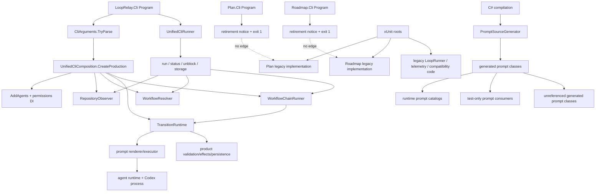

# Orphaned Production Code Audit

Date: 2026-07-10  
Repository: `C:\kernritsu\LoopRelay`  
Revision audited: `3ed77d9962ba181c11afa9dd8472938117ef3c4f` (`next`)  
Output scope: this report only; no production code was changed.

## 1. Executive Summary

The production application has one functional host: `src/LoopRelay.Cli/Program.cs`. It parses the unified command surface, creates `UnifiedCliComposition`, and runs the canonical observation/resolution/transition/chaining architecture. The other two executable projects still compile, but their entrypoints only print retirement notices and return `1`:

- `LoopRelay.Plan.Cli` stops at `Program.cs:12-15`.
- `LoopRelay.Roadmap.Cli` stops at `Program.cs:12-17`.

The retired projects are also `IsPublishable=false`, are not referenced by the unified CLI project, and have publish scripts that refuse to publish them. No reflection, assembly scanning, plugin loader, source-level dynamic activation, module initializer, native callback, or conditional-compilation route was found that can cross those boundaries.

The largest disconnected inventory is therefore conclusive:

- **219 Roadmap CLI implementation files, approximately 16,379 lines**, remain behind a retired entrypoint.
- **20 Plan CLI implementation files, approximately 987 lines**, remain behind a retired entrypoint.
- Both bodies are exercised by tests, so their strict classification is **Category C — Test Only**, even though they are production-project source and architecturally orphaned from production.

The active project graph also retains the pre-unification `LoopRunner` architecture, its telemetry/usage-limit/input-wait wrappers, multiple compatibility persistence implementations, test-only infrastructure, and unused generated prompt classes. The most important operational finding is not simply removable code: **the documented session telemetry and usage-limit wait/retry behavior is no longer composed in production**. Those implementations are now test-only after the unified CLI refactor. Product intent should decide whether they are reconnected or removed together with the stale documentation.

The audited non-production inventory is at least **21,000 lines across more than 300 source or prompt assets**. The exact total is intentionally stated as a lower bound because several findings are individual symbols inside otherwise reachable files.

No evidence was taken from pre-existing audit documents. The evidence set was limited to production/test source, project and solution files, runtime configuration, publish scripts, generated-code inputs, build/test output, and Git history.

## 2. Production Reachability Methodology

### 2.1 Closed-world production roots

The repository defines three executable projects:

| Entrypoint | Production behavior | Classification |
|---|---|---|
| `src/LoopRelay.Cli/Program.cs` | Parses commands, creates production composition, installs Ctrl+C cancellation, runs `UnifiedCliRunner`. | A |
| `src/LoopRelay.Plan.Cli/Program.cs` | Writes a retirement message and returns `1`. | A for the notice only |
| `src/LoopRelay.Roadmap.Cli/Program.cs` | Writes a retirement message and returns `1`. | A for the notice only |

No web host, API host, daemon, worker, scheduler host, UI host, COM host, native export, or separate tool entrypoint exists under `src`.

The audit used a closed-world repository model: arbitrary out-of-repository callers of public library APIs were not invented as entrypoints. That is appropriate here because the library projects have no package publication metadata or plugin contract, and the repository's publish path emits only `LoopRelay.Cli`.

### 2.2 Trace procedure

The trace proceeded as follows:

1. Enumerated all `.csproj` files, project references, output types, publish settings, `Program.cs` files, publish scripts, configuration, and the solution.
2. Followed the unified entrypoint through `CliArguments.TryParse`, `UnifiedCliComposition.CreateProduction`, `AddAgents`, transitive permissions DI registration, `UnifiedCliRunner`, repository observation, workflow resolution, workflow chaining, transition runtime, prompt rendering/execution, validation, effects, and persistence.
3. Followed every CLI command route: default/eval/traditional chains; bounded plan/execute/eval/traditional; status; unblock; and storage init/import/export/sync/verify.
4. Examined constructor sites, optional constructor parameters, DI registrations and resolutions, interface implementations, event subscriptions, process callbacks, JSON serialization/deserialization, factories, and static catalogs.
5. Searched `src`, project files, and build files for reflection, assembly loading, plugin discovery, `Activator`, `Type.GetType`, conditional compilation, module initializers, native interop, dynamic-dependency annotations, polymorphic JSON activation, hosted services, middleware, routing, and schedulers. None provided an alternate activation path.
6. Audited the prompt source generator and every `*.prompt` input. The generated classes were classified according to the runtime reachability of their generated `Template`, `Text`, `Render`, and `SourceHash` members—not merely according to participation in compilation.
7. Used repository-wide declaration/reference and file-dependency inventories to generate candidates, then manually verified each candidate against production composition. Static counts were candidate generators, not the basis of a finding.
8. Inspected Git commit `3ed77d99` and its parent to identify the exact refactor that removed `LoopCliComposition`, `PlanCliComposition`, and `RoadmapCliComposition` while retaining their implementation bodies.
9. Built and tested the complete solution to confirm that Category C code remains compilable and test-maintained.

### 2.3 Classification rules used

| Category | Meaning in this report |
|---|---|
| A — Proven Reachable | A complete path from a production root was demonstrated. |
| B — Conditionally Reachable | A complete path exists only for a command, configuration, repository state, or environment condition. |
| C — Test Only | No production path exists; a test or test-driven legacy root invokes the implementation. |
| D — Build-Time Only | Runs during source generation/compilation and not in the production runtime. |
| E — Orphaned | No production, test, build, or dynamic activation path was demonstrated, or a reachable contract contains an implementation type that is never constructed or consumed. |

## 3. Reachability Graph Overview

### 3.1 Category A and B coverage

The following major areas were demonstrated reachable and are not findings:

- Unified argument parsing, command status formatting, storage commands, unblock, workflow selection, and bounded/unbounded continuation.
- Canonical workflow definitions, repository observation, canonical persistence stores, transition runtime, chain entry/exit/product-transfer gates, and transition effects.
- Agent DI: `ProcessRunner`, token estimator, boundary detector, executable resolver, process launcher, session registry, `AgentRuntime`, and transitive permissions services.
- Codex app-server and one-shot process paths, approval request dispatch, process/session callbacks, cancellation, and disposal.
- Active planning, evaluation, projection, decision-session, execution, completion certification, non-implementation review, and publication paths used by `UnifiedPromptExecutor`.
- Explicit JSON DTOs used by reachable persistence and protocol code. Low reference counts were not treated as orphan evidence where `JsonSerializer.Deserialize<T>` or protocol parsing constructs the type.
- Forty-eight of the 65 generated prompt classes. They are reached through canonical, eval, projection, completion, or direct prompt call sites.

Important Category B activation conditions are:

- CLI mode selects eval, traditional, plan, or execute workflows.
- Repository products/state select individual transitions and continuation.
- `LoopRelay_DECISION_RESUME` controls decision resume behavior.
- `config/settings.default.json` and an installed `settings.json` control artifact and permission policy.
- Storage commands and repository database state select SQLite schema and verification paths.
- Completion, non-implementation review, prompt projection, and publication branches depend on workflow outputs and repository state.

## 4. Orphan Inventory — Category E

Category E is intentionally narrower than “not used by production.” Test-only implementation is inventoried separately in Section 4.2.

### 4.1 Strict Category E findings

| ID | File / symbol | Type and size | Apparent purpose | Why orphaned; attempted trace and termination | Dynamic discovery review | Confidence | Recommended disposition |
|---|---|---:|---|---|---|---|---|
| E-01 | `src/LoopRelay.Core/Prompts/StartDecisionSession.prompt` / generated `StartDecisionSession`; `StartDecisionSessionFromTransfer.prompt` / generated `StartDecisionSessionFromTransfer`; `GetNextDecisions.prompt` / generated `GetNextDecisions` | 3 prompt assets, 8 lines, plus generated classes | Former decision-session seed/continuation prompts | `DecisionSession` explicitly says the separate seed turn is gone and directly primes the proposal turn. No source or test calls `Render`, `Text`, `Template`, or `SourceHash`. Nearest reachable ancestor: active `DecisionSession`; reachability ends at its new direct proposal flow. | Prompt generation was inspected; generation creates types but does not invoke them. No reflection/catalog entry exists. | High | Remove |
| E-02 | `src/LoopRelay.Core/Prompts/NonImplementation/ArtifactCreationInstructions.prompt`, `ImplementationFirstThinking.prompt`, `InvalidContent.prompt` / generated classes of the same names | 3 prompt assets, 180 lines, plus generated classes | Generic implementation-first policy fragments | No production, retired-project, test, catalog, renderer, or hash reference exists. Nearest reachable ancestor: prompt generator at build time; runtime reachability terminates after type emission. | Generator and all prompt catalogs inspected; no name-based lookup exists. | High | Remove |
| E-03 | `src/LoopRelay.Core/Prompts/Planning/CreateNewRoadmap` | Uncompiled prompt-like asset, 258 lines | Create-roadmap prompt source | It lacks the `.prompt` extension required by `AdditionalFiles Include="Prompts/**/*.prompt"`; it is neither compiled nor read at runtime and has no textual call site. Nearest boundary: `LoopRelay.Core.csproj` AdditionalFiles glob, where inclusion terminates. | No file enumeration or runtime prompt directory scanning exists. | High | Verify then Remove (or rename and register intentionally) |
| E-04 | `src/LoopRelay.Cli/Services/Console/ConsoleCompletionObserver.cs` / `ConsoleCompletionObserver` | Adapter class, 13 lines | Forward completion phases to `ILoopConsole` | The old composition constructed it; current `UnifiedPromptExecutor` constructs nested `CompletionPhaseEvidenceObserver` instead. No current source or test constructor exists. Nearest reachable ancestor: completion certification construction in `UnifiedCliComposition`; it selects the replacement observer. | No DI registration or reflection. | High | Remove |
| E-05 | `src/LoopRelay.Cli/Services/Workflows/EvalRoadmapWorkflowDefinition.cs` / `EvalRoadmapWorkflowDefinition`; `ExecuteWorkflowDefinition.cs` / `ExecuteWorkflowDefinition` | 2 static wrappers, 18 lines | Forward to canonical workflow definition factories | `CreateCore` calls `CanonicalWorkflowDefinitionSketches.CreateAll()` directly; neither wrapper is referenced by source or tests. Nearest reachable boundary: workflow-definition registration. | No convention-based workflow discovery; definitions are an explicit list. | High | Remove |
| E-06 | `src/LoopRelay.Orchestration.Primitives/Models/NonImplementationReview/NonImplementationReviewOwnership.cs` / `NonImplementationReviewOwnership` | Constants-only class, 12 lines | Architectural ownership prose as constants | No source or test reference exists. Nearest reachable boundary: active non-implementation review model namespace; no consumer reads the constants. | Not configuration, attributes, serialization, or reflection metadata. | High | Remove |
| E-07 | `src/LoopRelay.Orchestration.Primitives/Workflows/WorkflowContracts.cs:294-313` / `WorkflowOutcome`, `StageOutcome`, `TransitionOutcome` | 3 record contracts, about 20 lines | Generic workflow outcome DTOs | Runtime uses `TransitionRuntimeResult`, `WorkflowControllerResult`, and `WorkflowChainRunResult`; these three records have no construction, parameter, return, serialization, or test site. Nearest boundary: reachable workflow contracts file; the active result model diverges before these declarations. | No polymorphic serializer or reflection activation. | High | Remove |
| E-08 | `src/LoopRelay.Cli/Services/Telemetry/TaskDelayScheduler.cs` / `TaskDelayScheduler` | Delay adapter, 10 lines | Wait for usage-limit reset | It was constructed by removed `LoopCliComposition`; it has no current source/test constructor. Nearest boundary: `CreateProduction`, which now builds raw `AgentRuntime` without a usage-limit decorator. | No DI registration, scheduler host, or timer registration. | High | Decide telemetry intent, then Remove or Reconnect intentionally |
| E-09 | `src/LoopRelay.Orchestration.Primitives/Resolution/ResolutionContracts.cs:91-99,180-186` / `HumanInteractionCategory`, `HumanInteractionRequirement` | Enum + record, about 17 lines | Model human-interaction requirements in observations | `RepositoryObservation` retains an `IReadOnlyList<HumanInteractionRequirement>`, but all four production construction sites pass `[]`; no item is ever constructed or consumed. Nearest reachable ancestor: `RepositoryObserver`; reachability terminates at the always-empty argument. | No deserialization or external callback fills the list. | Medium | Verify then Remove, or populate/consume intentionally |
| E-10 | `PlanWorkflowDefinition`; `TraditionalRoadmapWorkflowDefinition`; `RoadmapCompletionObserver`; `RoadmapExecutionEvidenceArtifact`; `CanonicalStorageVerifierAdapter` in their same-named files under the retired CLI projects | 5 top-level types/files, about 235 physical lines | Migration wrappers/adapters left inside retired projects | These names occur only at their declarations: no production source, retired-project peer, or test references them. The nearest project roots already terminate at retirement stubs, and even the test roots do not construct these five types. | No discovery mechanism crosses the retired project boundary or locates these types by name. | High | Remove independently, or delete with the retired project bodies |

### 4.2 Category C — production-project code reachable only from tests

These findings are not strict Category E because tests execute their subsystem roots. They are nevertheless outside every production flow and form most of the architectural disconnect. C-01 and C-02 are project-level classifications; E-10 identifies the five declarations inside those file sets that do not even have a test/peer reference.

| ID | File / symbol set | Type and approximate size | Last reachable architectural boundary | Production execution path | Confidence | Recommended disposition |
|---|---|---:|---|---|---|---|
| C-01 | `src/LoopRelay.Roadmap.Cli/{Abstractions,Models,Primitives,Services}/**/*.cs`; all declarations in that exact set | Retired roadmap host implementation: 219 files, 16,379 lines | `LoopRelay.Roadmap.Cli/Program.cs` | Process startup reaches UTF-8 setup, retirement messages, and `return 1`; it never reaches the implementation set. Unified CLI has no project reference to this assembly. | High | Verify behavior migration, migrate/delete legacy tests, then remove the project body |
| C-02 | `src/LoopRelay.Plan.Cli/{Abstractions,Models,Primitives,Services}/**/*.cs`; all declarations in that exact set | Retired planning host implementation: 20 files, 987 lines | `LoopRelay.Plan.Cli/Program.cs` | Process startup reaches UTF-8 setup, retirement messages, and `return 1`; it never reaches the implementation set. Unified CLI has no project reference to this assembly. | High | Verify behavior migration, migrate/delete legacy tests, then remove the project body |
| C-03 | `LoopRunner`, `ExecutionStep`, `LoopOutcome`, and generated `StartExecution` | Former loop state machine: 4 files/assets, about 381 lines | `LoopRelay.Cli/Program.cs` → `UnifiedCliComposition` | Current composition creates `TransitionRuntime` and `WorkflowChainRunner`; it never constructs `LoopRunner` or `ExecutionStep`. Tests construct them directly. | High | Verify legacy-vs-canonical behavioral coverage, then remove |
| C-04 | CLI telemetry/quota stack: `IClock`, `ICodexRolloutLocator`, `ICodexUsageProbe`, `ISessionTelemetryRecorder`, `IUsageDelay`, `IUsageLimitDetector`, `ISessionTelemetrySink`, telemetry models, `FileSystemCodexRolloutLocator`, `GatedAgentRuntime`, `GatedAgentSession`, and all `Services/Telemetry/*.cs` except E-08 | 25 files, about 1,278 lines | `UnifiedCliComposition.CreateProduction` | Production resolves raw `IAgentRuntime` from `AddAgents`; no gated/progress/telemetry decorator is constructed. Telemetry tests call `SessionTelemetryComposition` directly. | High | Reconnect intentionally if the documented feature remains required; otherwise remove stack and stale docs/config claims |
| C-05 | Input-wait diagnostics: `IInputWaitObservationSink`, `IInputWaitProgressRenderer`, `InputWaitObservation`, `InputWaitTurnPhase`, `ConsoleInputWaitProgressRenderer`, `InputWaitProgressAgentRuntime`, `InputWaitTurnTracker`, `NullInputWaitObservationSink` | 8 files, about 591 lines | Agent runtime composition | Only the removed composition wrapped the runtime in `InputWaitProgressAgentRuntime`. Tests construct the wrapper; production does not. | High | Reconnect with telemetry or remove as one unit |
| C-06 | `src/LoopRelay.Cli/Services/Execution/SqliteLoopHistoryStore.cs` / `LoopHistoryStoreFactory`, `LoopWorkspaceDatabase`, `SqliteLoopHistoryStore`; `AgentsSubmodulePublisher.cs:23-83` / `SqliteAgentsSubmodulePublishPreflight` | One 214-line file plus about 61 lines in a mixed reachable file | Active `LoopArtifacts` and `AgentsSubmodulePublisher` constructors | `LoopArtifacts` defaults directly to `FileBackedLoopHistoryStore`; the publisher defaults to `NullAgentsSubmodulePublishPreflight`. No production call uses the factory or injects the SQLite preflight. Tests do both. | High | Verify canonical SQLite/export expectations, then remove or reconnect |
| C-07 | `SqliteCompletedEpicArchiveMaterializer`, `CompletedEpicArchiveRecoveryService`, `CompletedEpicArchiveRecoveryResult` and `CompletedEpicArchiveRecord` | 3 files, about 476 lines | Completion service construction | Unified completion creates `CompletedEpicArchiveService` without a materializer, which selects `NullCompletedEpicArchiveMaterializer`; recovery is called only by retired Roadmap verification and tests. | High | Verify archive export/recovery requirements, then remove or reconnect |
| C-08 | `CanonicalArtifactHasher`, `FileBackedMigratedDomainLogicalArtifactProvider`, `RetainedFilesystemLogicalArtifactProvider` | 3 files, about 224 lines | Active logical-artifact resolver composition | Only retired `RoadmapLogicalArtifactServices` composes them. Active completion composition uses `SqliteCompletionLoopHistoryLogicalArtifactProvider` and `FileBackedExecutionEvidenceLogicalArtifactProvider`. | High | Remove after legacy Roadmap deletion, unless retained-file fallback remains a supported migration path |
| C-09 | Trust model: `TrustPolicy`, `TrustPolicyEvidence`, `ApprovalAuthority`, `ExecutionAuthority`, `NetworkAuthority`, `WorkspaceAuthority` | 6 files, about 76 lines | Retired roadmap execution bridge | Used by tests and the retired `RoadmapExecutionBridge`; the unified executor does not create trust evidence through this model. | High | Verify evidence compatibility, then remove |
| C-10 | `RepositoryArtifactStore`, `NumberedArtifactSequence` | 2 files, about 66 lines | Retired roadmap/test artifact composition | No active production construction; legacy Roadmap and tests use the facade/helper. | High | Remove after legacy tests are migrated |
| C-11 | `RuntimePrerequisiteDoctor`, `RuntimeDiagnostic`, `RuntimeDiagnosticSeverity` | 3 files, about 91 lines | Production CLI command dispatch | No `doctor` command or startup hook invokes it. Tests call `Inspect` directly. | High | Reconnect as an explicit command/startup gate or remove |
| C-12 | `ISandboxWorkspace`, `ISandboxWorkspaceFactory`, `TempSandboxWorkspaceFactory` | 3 files, about 76 lines | Unified decision/operational-context implementation | Current decision flow does not request a sandbox factory. Tests construct the temp factory and fakes. | High | Verify whether scoped transfer isolation is still required, then remove or reconnect |
| C-13 | `WorkflowDefinitionValidator`, `WorkflowDefinitionValidationResult` | 1 file, 273 lines | Canonical definition creation | Production calls `CreateAll` but not `Validate`; the validator is invoked only by tests. | High | Preserve as test-only validation, or move it to test/build tooling; do not describe it as runtime protection |
| C-14 | `CanonicalWorkflowChains` in `WorkflowChaining.cs:67-76` | Static duplicate chain catalog, about 10 lines | Chain registration | Production calls `CanonicalWorkflowDefinitionSketches.CreateChains`; tests call `CanonicalWorkflowChains`. | High | Merge tests onto the production factory, then remove duplicate catalog |
| C-15 | `NonImplementationReviewTerms` | Constants-only class, 14 lines | Non-implementation review models | Only a foundation test reads a constant; production logic uses its own strings/enums. | High | Remove or move into tests |
| C-16 | Ten prompt-specific non-implementation assets under `src/LoopRelay.Core/Prompts/NonImplementation` plus their generated classes; generated `StartExecution` is counted in C-03 | 10 prompt assets, 263 lines, plus generated classes | Retired Roadmap prompt catalog | Only retired Roadmap prompt-section code and tests reference their generated members. The unified canonical renderer uses the planning prompt templates directly and does not append these sections. | High | Verify prompt-policy parity, then remove or reconnect to unified prompt rendering |

### 4.3 Category D — build-time only

| File / symbol | Build path | Runtime status | Disposition |
|---|---|---|---|
| `src/LoopRelay.Prompts.Generator/**` / `PromptSourceGenerator`, generator models and `EquatableArray` | Analyzer project referenced by `LoopRelay.Core` with `OutputItemType="Analyzer"`, `ReferenceOutputAssembly="false"`, and `PrivateAssets="all"` | Executes during compilation only. The generator itself is not a runtime orphan. | Preserve |
| `src/LoopRelay.Core/Prompts/**/*.prompt` | `AdditionalFiles` consumed by the generator | Each generated class was separately classified: 48 A/B, 11 C, 6 E. | Preserve active inputs; address C/E inputs above |
| `Assembly.cs` `InternalsVisibleTo` attributes | Compiler/assembly metadata for tests | Test/build metadata, not production execution | Preserve while corresponding tests/projects exist |

## 5. Complete Legacy Project Inventory

### 5.1 Retired Roadmap CLI

The exact C-01 file set is every `.cs` file under the following prefixes, excluding only root `Program.cs` and root `Assembly.cs`:

| Prefix | Files | Lines |
|---|---:|---:|
| `Abstractions/` (including `Persistence/`) | 5 | 75 |
| `Models/` | 88 | 1,795 |
| `Primitives/` | 29 | 280 |
| `Services/` | 97 | 14,229 |
| **Total** | **219** | **16,379** |

Service-level contents include artifact bundles/management, artifacts, CLI parsing/rendering, decisions, derived artifacts, epic transitions, execution, execution preparation, persistence, projections, prompt policy/rendering, split lineage, state/resume/unblock machines, transition coordination/state, and the unused traditional-workflow wrapper. Model and primitive directories contain the corresponding DTOs, persistence documents, enums, status records, and workflow state contracts.

Attempted production trace:

`Roadmap.Cli process` → `Program.cs` → UTF-8 setup → retirement messages → `return 1`.

Reachability cannot proceed to CLI parsing, `RoadmapStateMachine`, storage services, state/resume/unblock planners, transition coordinators, execution bridge, prompt runner, projections, persistence, artifact promotion, or any model behavior. The historical `RoadmapCliComposition` constructor was deleted in `3ed77d99`.

### 5.2 Retired Plan CLI

The exact C-02 file set is every `.cs` file under the following prefixes, excluding only root `Program.cs` and root `Assembly.cs`:

| Prefix | Files | Lines |
|---|---:|---:|
| `Abstractions/` | 1 | 2 |
| `Models/` | 2 | 42 |
| `Primitives/` | 1 | 9 |
| `Services/` | 16 | 934 |
| **Total** | **20** | **987** |

The symbols are `ILoopConsole`, `ArtifactOperationPlan`, `PlanStepException`, `PlanOutcome`, `AgentsSubmodulePublisher`, `ProjectionPromptRunner`, `AgentSpecs`, `CliArguments`, `ConsoleLoopConsole`, `ConsoleTurnRenderer`, `MilestoneChecklist`, `OneShotSteps`, `PermissionedArtifactOperationStep`, `PlanPipeline`, `PlanSession`, `PreflightGate`, `ReviewStep`, `GitPorcelain`, `PlanArtifacts`, and `PlanWorkflowDefinition`.

Attempted production trace:

`Plan.Cli process` → `Program.cs` → UTF-8 setup → retirement messages → `return 1`.

Reachability cannot proceed to parsing, `PlanPipeline`, session/review steps, scoped artifact operations, projections, publication, or preflight. The historical `PlanCliComposition` constructor was deleted in `3ed77d99`.

## 6. Legacy and Refactor Remnants

Commit `3ed77d99` (“Refactor relay loop and UI state management”) is the common architectural break:

- It replaced the old `LoopRelay.Cli` entrypoint/composition with `UnifiedCliComposition` and `UnifiedCliRunner`.
- It deleted `LoopCliComposition`, `PlanCliComposition`, and `RoadmapCliComposition`.
- It changed Plan and Roadmap `Program.cs` files into retirement stubs.
- It added the canonical transition runtime, repository observer, workflow resolver, chaining, persistence, and unified workflow definitions.
- It retained most old implementation files and their tests.

The parent version of `LoopCliComposition` proves the historical role of several now-disconnected components. It constructed:

- `InputWaitObservationStore` and `InputWaitProgressAgentRuntime`;
- `CodexUsageProbe`, `SystemClock`, `UsageLimitDetector`, `TaskDelayScheduler`, and `SessionTelemetryComposition`;
- `GatedAgentRuntime`;
- `ConsoleCompletionObserver`;
- conditional `SqliteCompletedEpicArchiveMaterializer`;
- `ExecutionStep` and `LoopRunner`;
- `SqliteAgentsSubmodulePublishPreflight`.

The current production composition constructs none of those roots. This is positive historical evidence of a bypassing refactor, not an inference from low reference counts.

Other apparent remnants are:

- `CanonicalWorkflowChains` duplicates the active `CanonicalWorkflowDefinitionSketches.CreateChains` path for tests.
- `EvalRoadmapWorkflowDefinition` and `ExecuteWorkflowDefinition` were added as migration wrappers but production immediately used `CreateAll` instead.
- The old Roadmap logical-artifact providers coexist with a different active completion resolver composition.
- SQLite loop-history/archive materialization survives beside canonical workflow SQLite persistence, but is no longer selected by production constructors.
- Six generated prompt classes and one uncompiled prompt-like file have no consumer.

## 7. Architectural Disconnect Analysis

### 7.1 Major disconnected subsystems

1. **An entire pre-unification Roadmap product remains compiled and tested.** It contains its own state machine, persistence, projections, prompt policy, transition coordination, artifact lifecycle, execution bridge, and storage tooling, but no host can enter it.
2. **An entire pre-unification Plan pipeline remains compiled and tested.** Its warm session, scoped artifact operations, review, preflight, and publication path are disconnected.
3. **The pre-unification execute loop survives inside the active CLI project.** `LoopRunner`/`ExecutionStep` are easier to mistake for production because they share the published assembly with the unified runtime.
4. **Operational wrappers were dropped with the old composition.** Telemetry, usage-limit retry, and input-wait progress were decorators around the old runtime. The unified composition resolves the undecorated runtime.
5. **Two persistence architectures coexist.** Canonical workflow persistence is active; old loop-history selection, SQLite archive materialization/recovery, and export preflight are test-only.
6. **Generated prompt inputs outlived their consumers.** Generation guarantees compilation, not runtime reachability.

### 7.2 Dead extension points and stale abstractions

- Optional constructor seams for `ICompletedEpicArchiveMaterializer`, `IAgentsSubmodulePublishPreflight`, and sandbox factories make implementations look plausibly injectable, but no production composition supplies them.
- `HumanInteractionRequirements` is a reachable observation property with no producer and no consumer.
- Generic workflow outcome records coexist with the actual runtime/controller/chain result types.
- Public visibility of shared-library remnants does not establish a repository production path.

### 7.3 Documentation/configuration mismatch

`README.md` describes session telemetry as enabled by default and names `LoopRelay_SESSION_LOG`. The implementation still exists, including SQLite and JSONL sinks, but production does not call `SessionTelemetryComposition.IsEnabled` or `CreateRecorder`. This is a functional architecture mismatch requiring a product decision, not merely cleanup.

## 8. False Positive Review

The following activation mechanisms were explicitly checked:

- **Dependency injection:** `AddAgents` and `AddCodexPermissions` registrations were traced transitively from the resolved `IAgentRuntime` and `IProcessRunner`. Registered implementations required by that graph were retained as A/B. None of the C/E implementations is registered by current production composition.
- **Factories/service locators:** all production factory calls, optional constructor defaults, and `GetRequiredService`/`GetService` sites were inspected. The old SQLite and decorator factories are not called.
- **Reflection/plugin loading/convention discovery:** no `Assembly.Load`, `AssemblyLoadContext`, `GetTypes`, `Activator.CreateInstance`, `Type.GetType`, MEF, plugin loader, or name-based workflow discovery exists in production source.
- **Serialization:** reachable explicit generic JSON DTOs and private protocol DTOs were treated as reachable. No C/E finding depends on polymorphic or attribute-driven serialization.
- **Routing/commands:** every parsed unified command kind was followed. Retired Plan/Roadmap command parsers cannot be reached from their programs.
- **Events/callbacks:** `Console.CancelKeyPress`, agent process output pumps, permission callbacks, session progress callbacks, and disposal paths were included. No callback registers a legacy root.
- **Generated code:** all 65 prompt inputs were mapped to generated types and consumers. A generated class was not considered runtime-reachable merely because the generator emitted it.
- **Native interop/external framework callbacks:** none were found.
- **Conditional compilation/build properties:** no source `#if` path activates legacy code. `IsPublishable=false` further excludes Plan/Roadmap from the supported publish flow.
- **External consumers:** public APIs were not assumed to be entrypoints. Manual verification is still recommended before removal in case an undocumented out-of-repository consumer exists.

## 9. Recommended Cleanup Order

1. **Make the product decisions first.** Decide whether session telemetry, usage-limit wait/retry, input-wait progress, SQLite loop-history export, archive materialization/recovery, runtime doctor, and sandboxed transfer remain required behavior.
2. **Remove strict E-01 through E-08 after targeted review.** They have no current consumer and are small, high-confidence changes. Treat E-09 separately because it is embedded in a reachable public record contract.
3. **Resolve telemetry/documentation parity.** Either wrap the unified agent runtime with the retained decorators and certify the behavior, or remove C-04/C-05/E-08 and update `README.md` and related tests.
4. **Resolve persistence parity.** Determine whether C-06/C-07 are required compatibility/export features. Reconnect them explicitly or remove them before deleting the legacy Roadmap storage tests.
5. **Migrate valuable validation tests.** Point tests at the canonical production factories rather than `CanonicalWorkflowChains`, legacy workflow wrappers, or retired CLI implementations. Keep `WorkflowDefinitionValidator` as test/build tooling if its invariants remain valuable.
6. **Retire `LoopRunner`/`ExecutionStep`.** Compare their covered behavior with unified execute transition tests, move any missing assertions, then remove the old state machine and `StartExecution` prompt.
7. **Retire the Plan CLI body/project.** Preserve only tests that assert behavior still implemented by the unified Plan workflow.
8. **Retire the Roadmap CLI body/project.** This is the largest change; verify storage migration, prompt-policy parity, archive/recovery, and unblock/resume semantics before deleting legacy tests and project references.
9. **Prune shared remnants.** Remove C-08 through C-12 after the legacy projects no longer provide their only non-test references.
10. **Re-run build, all tests, publish, and a command-level smoke matrix** for status, storage, bounded workflows, default chained workflows, cancellation, permissions, and completion.

## 10. High-Confidence Removal Candidates

These candidates have no demonstrated production value and do not represent a documented behavior that was silently disconnected:

- E-01: three obsolete decision-session prompt assets and generated classes.
- E-02: three wholly unreferenced non-implementation prompt assets and generated classes.
- E-04: `ConsoleCompletionObserver`.
- E-05: unused eval/execute workflow factory wrappers.
- E-06: `NonImplementationReviewOwnership`.
- E-07: unused generic workflow outcome records.
- E-10: five declaration-only wrappers/adapters inside the retired projects.
- C-14: `CanonicalWorkflowChains`, after tests use the active `CreateChains` factory.
- C-15: `NonImplementationReviewTerms`, or move its sole assertion into test data.

E-03 is also high-confidence disconnected, but its 258-line content warrants a human check before deletion because the missing `.prompt` extension could be accidental.

## 11. Findings Requiring Manual Verification

1. **Telemetry and quota behavior:** confirm whether `LoopRelay_SESSION_LOG`, SQLite/JSONL session telemetry, usage-limit waiting, and input-wait progress are intended production features. Current documentation says yes; current composition says no.
2. **Legacy CLI behavior parity:** confirm that unified Plan, TraditionalRoadmap, EvalRoadmap, storage, resume/unblock, and completion paths intentionally replace all behavior covered by the 108 Plan and 496 Roadmap tests.
3. **SQLite compatibility:** confirm whether old loop-history export, agents-submodule preflight, archive materialization, and recovery must support existing workspaces.
4. **Prompt-policy parity:** confirm that the unified renderer intentionally omits the ten prompt-specific non-implementation policy fragments used by the retired Roadmap prompt catalog.
5. **Sandbox isolation:** confirm whether operational-context transfer still requires the isolated temp-workspace design represented by C-12.
6. **Human interaction contract:** confirm whether `HumanInteractionRequirements` is planned for near-term production population; otherwise remove the empty extension point.
7. **Out-of-repository consumers:** check private package feeds, deployment scripts, and downstream repositories before deleting public shared-library types. None is declared in this repository.
8. **Uncompiled `CreateNewRoadmap`:** determine whether the extension was accidentally omitted or the content is an abandoned asset.

## 12. Verification Performed

- `dotnet build LoopRelay.slnx --no-restore`: **succeeded**, 0 errors, 4 warnings. The warnings were three nullable warnings in `RuntimePrerequisiteDoctor` and one compiler-detected unreachable-code warning in retired `Plan.Cli/ReviewStep.cs`.
- `dotnet test LoopRelay.slnx --no-build --verbosity minimal`: **1,440 passed, 0 failed, 5 skipped**. The skipped tests are live Codex certification tests.
- Existing untracked files were left untouched.

The green test result strengthens the Category C conclusions: the disconnected systems are not accidental uncompilable debris; they remain actively test-maintained despite having no production activation path.
