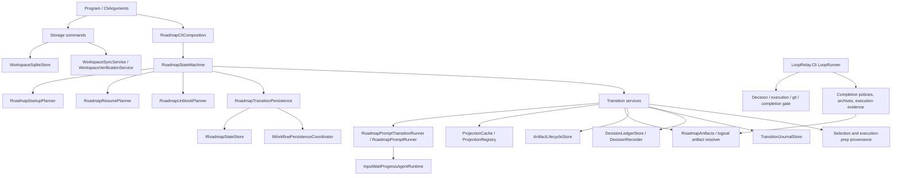

# LoopRelay.Roadmap.Cli and State Machine Refactor Discovery Audit

Audit target: `LoopRelay.Roadmap.Cli`, its roadmap state machine, orchestration-adjacent services, persistence, recovery, and external execution/completion boundaries.

Audit mode: discovery only. This document describes current behavior, coupling, mutable state, risks, seams, and unknowns. It does not propose an implementation plan, replacement design, or migration sequence.

Evidence convention:

- `[Evidence]` statements are grounded in inspected source files and line references.
- `[Inference]` statements are conclusions drawn from multiple code paths.
- `[Uncertainty]` statements identify facts not established by this audit.

## 1. Executive Summary

- `[Evidence]` The roadmap CLI is centered on `RoadmapStateMachine`, which dispatches only `Status`, `Run`, and `Unblock` commands after `Program` handles storage commands separately (`src/LoopRelay.Roadmap.Cli/Program.cs:31-86`, `src/LoopRelay.Roadmap.Cli/Services/State/RoadmapStateMachine.cs:45-54`).
- `[Evidence]` The state vocabulary is a single 33-value enum spanning durable workflow milestones, prompt execution markers, failure states, terminal pause states, and legacy or external execution states (`src/LoopRelay.Roadmap.Cli/Primitives/State/RoadmapState.cs:3-38`).
- `[Evidence]` The state machine constructor directly receives artifact services, project context, prompt contracts, the state store, transition persistence, seven transition services, selection reading, three planners, journal/lifecycle stores, and console output (`src/LoopRelay.Roadmap.Cli/Services/State/RoadmapStateMachine.cs:24-43`).
- `[Evidence]` Normal roadmap CLI execution currently advances through roadmap completion context creation, strategic initiative selection, active epic promotion/audit/split/create, and milestone spec generation, then pauses at `MilestoneSpecsReady`; the resume planner explicitly states that legacy execution preparation states are no longer advanced by this CLI (`src/LoopRelay.Roadmap.Cli/Services/State/RoadmapResumePlanner.cs:179-185`, `src/LoopRelay.Roadmap.Cli/Services/State/RoadmapResumePlanner.cs:198-217`).
- `[Evidence]` Execution loop ownership now lives primarily in the main `LoopRelay.Cli` path, where `LoopRunner` runs operational context generation, decision/execution turns, completion gate checks, git/submodule publishing, and certification (`src/LoopRelay.Cli/Services/Execution/LoopRunner.cs:42-184`).
- `[Evidence]` Persistence is not a single store. The roadmap CLI can use file-backed stores, SQLite-backed stores, logical artifact providers, structured JSON, legacy markdown migration, transition journals, workflow transaction markers, sync markers, and execution evidence providers depending on database integrity and artifact domain (`src/LoopRelay.Roadmap.Cli/Services/Cli/RoadmapCliComposition.cs:87-103`, `src/LoopRelay.Roadmap.Cli/Services/Persistence/RoadmapStateStore.cs:18-59`, `src/LoopRelay.Roadmap.Cli/Services/Persistence/WorkspaceSqlitePersistence.cs:166-233`).
- `[Evidence]` Recovery is intentionally narrow. `Unblock` supports preflight blocker recovery, malformed execution output repair, invalid completion certification repair, and a now-non-advancing execution runtime failure path; several durable blocker intents are reported as unsupported (`src/LoopRelay.Roadmap.Cli/Services/State/RoadmapUnblockPlanner.cs:61-85`, `src/LoopRelay.Roadmap.Cli/Services/State/RoadmapUnblockPlanner.cs:340-397`).
- `[Inference]` The state machine is not only a finite state transition coordinator. It is also a policy gateway for prompt contracts, project-context validation, artifact freshness, persistence summary capture, blocker semantics, and compatibility with the separate operational execution loop.
- `[Inference]` The highest refactor sensitivity is not isolated to the enum or the `RoadmapStateMachine` class. Behavior is distributed across planners, transition services, prompt runners, provenance stores, lifecycle stores, completion certification services, logical artifact resolvers, and the main CLI execution loop.
- `[Uncertainty]` The intended long-term ownership of legacy execution-preparation states, `RoadmapExecutionBridge`, and duplicated completion certification paths is not documented in the inspected code.

## 2. State Machine Purpose

- `[Evidence]` `RoadmapStateMachine.ExecuteAsync` is the public command entry point for roadmap state inspection, workflow execution, and unblock review (`src/LoopRelay.Roadmap.Cli/Services/State/RoadmapStateMachine.cs:45-54`).
- `[Evidence]` `RunAsync` loads persisted state, derives a startup plan, performs project context preflight only when required, emits prompt contracts, derives a resume plan, and dispatches one bounded workflow action (`src/LoopRelay.Roadmap.Cli/Services/State/RoadmapStateMachine.cs:109-162`).
- `[Evidence]` `StatusAsync` is read-only: it loads state, reports the startup plan, current state, last transition, next transitions, blockers, and transition intent without saving state (`src/LoopRelay.Roadmap.Cli/Services/State/RoadmapStateMachine.cs:56-76`).
- `[Evidence]` `UnblockAsync` does not generically resume all failed work. It asks `RoadmapUnblockPlanner` to classify a persisted blocker and routes only the supported recovery actions (`src/LoopRelay.Roadmap.Cli/Services/State/RoadmapStateMachine.cs:78-107`).
- `[Evidence]` Fresh initialization persists `CoreReady` before running normal workflow when the resume plan requests it (`src/LoopRelay.Roadmap.Cli/Services/State/RoadmapStateMachine.cs:164-176`).
- `[Evidence]` The prompt transition runner persists started/completed/failed transition records and failure blockers around prompt execution (`src/LoopRelay.Roadmap.Cli/Services/State/RoadmapPromptTransitionRunner.cs:45-100`, `src/LoopRelay.Roadmap.Cli/Services/State/RoadmapPromptTransitionRunner.cs:102-157`).
- `[Inference]` The state machine's practical purpose is to provide a durable, resumable, prompt-orchestration workflow up to active-epic and milestone-spec readiness, while preserving compatibility with completion/evidence states produced by the operational loop.
- `[Inference]` It also acts as a guardrail layer. Most transitions are allowed only when project context, prompt contracts, projections, artifact lifecycle, active selection provenance, and transition inputs are considered fresh enough.
- `[Uncertainty]` The inspected code does not establish whether the roadmap CLI is intended to own execution preparation again later or whether those states are retained only for persisted legacy workspaces.

## 3. State Inventory

`RoadmapState` currently declares 33 states (`src/LoopRelay.Roadmap.Cli/Primitives/State/RoadmapState.cs:3-38`). The table records observed current use, not an idealized taxonomy.

| State | Observed role | Main entry path | Main exit/resume behavior |
| --- | --- | --- | --- |
| `CoreReady` | Durable baseline after project context preflight and initialization. | Fresh initialization, `ResolveBlocker` recovery. | Bootstrap completion context or continue from core ready (`RoadmapStateMachine.cs:164-176`, `RoadmapUnblockPlanner.cs:92-155`). |
| `BootstrapRoadmapCompletionContext` | Transitional prompt state for completion context bootstrapping. | Resume planner treats it like a core-ready continuation. | `BootstrapRoadmapCompletionContextTransition` produces `RoadmapCompletionContextReady` (`RoadmapResumePlanner.cs:106-111`, `BootstrapRoadmapCompletionContextTransition.cs:25-45`). |
| `RoadmapCompletionContextReady` | Durable context ready for selecting next initiative. | Bootstrap completion context, completion route close/follow-up. | Select next strategic initiative after input validation (`RoadmapResumePlanner.cs:112-127`). |
| `SelectNextStrategicInitiative` | Durable state holding or awaiting active selection. | `SelectNextEpicTransition` writes selection and provenance. | Continue existing fresh selection, regenerate stale/missing selection, or route terminal decision (`RoadmapResumePlanner.cs:128-165`, `RoadmapStateMachine.cs:466-515`). |
| `ExistingEpicSelected` | Prompt routing state for auditing an existing selected epic. | Selection string `Select Existing Epic`. | `EpicPreparationAuditTransition` routes to retire/rewrite/active-ready/block (`RoadmapStateMachine.cs:470-480`, `EpicPreparationAuditTransition.cs:36-85`). |
| `NewEpicProposed` | Prompt candidate state for creating a new epic from selection. | Selection string `Select New Intermediary Epic`. | Promotion candidate may become `ActiveEpicReady` or `EvidenceBlocked` (`RoadmapStateMachine.cs:482-489`, `CreateNewEpicTransition.cs:23-45`). |
| `SplitEpicProposed` | Prompt candidate state for splitting an epic. | Selection string `Select Split Epic`. | Split output materializes children and promotes selected child, or blocks (`RoadmapStateMachine.cs:491-498`, `SplitEpicTransition.cs:64-112`). |
| `EpicPreparationAudit` | Audit result state for existing epic disposition. | Existing epic audit prompt. | Disposition routes to `RetireEpic`, rewrite, active-ready, or blocker (`EpicPreparationAuditTransition.cs:36-85`). |
| `RealignEpic` | Rewrite prompt state for realigning active/selected epic. | Audit disposition `Realign`. | Promotion candidate to `ActiveEpicReady` or blocker (`ActiveEpicRewriteTransition.cs:25-49`). |
| `ReimagineEpic` | Rewrite prompt state for reimagining active/selected epic. | Audit disposition `Reimagine`. | Promotion candidate to `ActiveEpicReady` or blocker (`ActiveEpicRewriteTransition.cs:25-49`). |
| `RetireEpic` | Durable state after selected epic is retired. | Audit disposition `Retire`. | Resume planner selects next strategic initiative (`EpicPreparationAuditTransition.cs:61-70`, `RoadmapResumePlanner.cs:112-127`). |
| `EvidenceBlocked` | Durable nonterminal blocker state. | Prompt failures, projection failures, split failures, promotion blockers, invalid completion certification, invariant failures, milestone generation failures. | `Run` reports only; `Unblock` may recover only selected intents (`RoadmapWorkflowStateClassifier.cs:7-10`, `RoadmapUnblockPlanner.cs:51-85`). |
| `EvidenceGathering` | Terminal pause route after completion evaluation asks for more evidence. | Completion route mapper. | Report-only terminal pause; no auto-resume (`RoadmapCompletionRouteMapper.cs:30-36`, `RoadmapWorkflowStateClassifier.cs:12-22`). |
| `CreateNewEpic` | Runtime prompt identity and transition state for new epic creation. | `CreateNewEpicTransition` promotion candidate. | Promotion coordinator attempts active epic promotion (`CreateNewEpicTransition.cs:23-45`). |
| `SplitEpic` | Runtime prompt identity and transition state for split epic generation. | `SplitEpicTransition` prompt runner. | Parses split bundle, writes lineage, then `SplitChildSelection` or blocker (`SplitEpicTransition.cs:64-112`). |
| `SplitChildSelection` | Intermediate state after split bundle creation and before selected child promotion. | Valid split bundle. | Promotion of selected child to `ActiveEpicReady` (`SplitEpicTransition.cs:83-112`). |
| `ActiveEpicReady` | Durable ready state for `.agents/epic.md`. | Promotion coordinator, audit routes, completion reopen. | Generate milestone specs if active epic inputs are valid (`RoadmapResumePlanner.cs:167-177`). |
| `GenerateMilestoneDeepDives` | Runtime prompt identity for spec generation. | `GenerateMilestoneDeepDivesTransition`. | Materializes specs and persists `MilestoneSpecsReady`, or `EvidenceBlocked` (`GenerateMilestoneDeepDivesTransition.cs:38-117`, `GenerateMilestoneDeepDivesTransition.cs:118-174`). |
| `MilestoneSpecsReady` | Durable pause after milestone specs are generated. | Spec generation. | Terminal paused; roadmap CLI stops before operational context generation (`RoadmapResumePlanner.cs:179-185`). |
| `GenerateOperationalContext` | Legacy/current artifact generation state outside current roadmap state machine progression. | `OperationalContextGenerator` can produce `.agents/operational_context.md`. | Resume planner returns terminal paused and does not advance (`RoadmapResumePlanner.cs:198-217`, `OperationalContextGenerator.cs:21-76`). |
| `OperationalContextReady` | Legacy/current readiness state for operational context. | `OperationalContextGenerator`. | Resume planner returns terminal paused (`RoadmapResumePlanner.cs:198-217`). |
| `GenerateExecutionPrompt` | Legacy/current artifact generation state for execution prompt. | `ExecutionPromptGenerator` can produce `.agents/execution-prompt.md`. | Resume planner returns terminal paused (`RoadmapResumePlanner.cs:198-217`, `ExecutionPromptGenerator.cs:16-110`). |
| `ExecutionPromptReady` | Legacy/current readiness state for execution prompt. | `ExecutionPromptGenerator`. | Resume planner returns terminal paused; tests assert it is no longer advanced (`RoadmapResumePlanner.cs:198-217`, `RoadmapResumePlannerTests.cs:178-190`). |
| `ExecutionLoop` | Operational execution route state. | Completion route `Continue Epic`, repaired execution disposition, or legacy persisted state. | Roadmap CLI reports terminal paused; main `LoopRunner` owns actual loop execution (`RoadmapCompletionRouteMapper.cs:16-22`, `LoopRunner.cs:42-184`). |
| `ExecutionBlocked` | Durable execution blocker state. | Execution disposition `Execution Blocked` repair or operational loop evidence. | Report-only in `Run`; `Unblock` can inspect some execution evidence intents but many are unsupported (`RoadmapWorkflowStateClassifier.cs:12-22`, `RoadmapUnblockPlanner.cs:51-85`). |
| `EpicCompletionDetected` | Completion certification entry state. | Execution disposition `Epic Complete`, completion claim, or repair. | Evaluate completion claim through `CompletionCertificationTransition` (`RoadmapStateMachine.cs:207-215`, `CompletionCertificationTransition.cs:49-117`). |
| `CompletionEvaluationAndContextUpdate` | Completion-evaluation prompt state and routing source. | Completion certification evaluation. | Route to close/continue/reopen/gather/block (`CompletionCertificationTransition.cs:90-147`, `RoadmapCompletionRouteMapper.cs:11-36`). |
| `StrategicInvestigationRequired` | Terminal decision route from selection. | Selection string `Strategic Investigation Required`. | Report-only terminal pause (`RoadmapStateMachine.cs:500-503`, `RoadmapWorkflowStateClassifier.cs:12-22`). |
| `RoadmapRevisionRequired` | Terminal decision route from selection. | Selection string `Roadmap Revision Required`. | Report-only terminal pause (`RoadmapStateMachine.cs:504-507`, `RoadmapWorkflowStateClassifier.cs:12-22`). |
| `NoSuitableInitiative` | Terminal route when selection does not match known decisions. | Unknown selection string fallback. | Report-only terminal pause (`RoadmapStateMachine.cs:508-511`, `RoadmapWorkflowStateClassifier.cs:12-22`). |
| `Completed` | Terminal completed state. | Startup classifier and terminal resume handling; completion route semantics can produce completed outcomes. | Report-only terminal state (`RoadmapStartupPlanner.cs:34-47`, `RoadmapResumePlanner.cs:53-59`). |
| `Failed` | Terminal or blocked recovery state after unhandled failures/invariant failures. | Exceptions, invariant failure, persisted failure. | Report-only for `Run`; `Unblock` only if recovery intent is recognized (`RoadmapStartupPlanner.cs:40-47`, `RoadmapUnblockPlanner.cs:51-85`). |
| `Cancelled` | Durable cancellation state for interrupted run. | `OperationCanceledException` handling. | Resume planner tries dispatch target from intent/last transition; otherwise blocks (`RoadmapStateMachine.cs:142-148`, `RoadmapStateMachine.cs:604-637`, `RoadmapResumePlanner.cs:61-75`). |

- `[Inference]` The enum mixes stable domain milestones, prompt execution phases, artifact generation states, terminal pause outcomes, and failure/recovery buckets. That mix increases the number of consumers that must understand each state.
- `[Inference]` Some states are active in the source model but inactive in current roadmap CLI progression. The resume planner is the clearest evidence for this boundary because it returns terminal pauses for execution-preparation and execution-loop states.
- `[Uncertainty]` The code does not make clear whether inactive states are retained for compatibility only, for operational CLI interop, or for planned future ownership.

## 4. Transition Inventory

The state transitions are spread across the state machine, resume/unblock planners, prompt transition runner, transition services, route mappers, and persistence services.

| Transition or route | Source | Target or outcome | Guard or side effects |
| --- | --- | --- | --- |
| CLI command routing | `Program` -> `RoadmapStateMachine.ExecuteAsync` | `Status`, `Run`, `Unblock`; storage commands bypass state machine | Storage commands construct storage services directly (`Program.cs:31-86`, `RoadmapStateMachine.cs:45-54`). |
| Fresh initialization | No persisted state | `CoreReady` | Startup/resume planners require preflight and state persistence (`RoadmapStartupPlanner.cs:10-17`, `RoadmapStateMachine.cs:164-176`). |
| Status reporting | Any persisted state | No mutation | Reports current state, transition, next transitions, blockers, intent (`RoadmapStateMachine.cs:56-76`). |
| Report-only run | `EvidenceBlocked`, terminal pause, `Completed`, `Failed` | No mutation | Startup planner returns report-only for these states (`RoadmapStartupPlanner.cs:19-47`). |
| Core continuation | `CoreReady` or bootstrap state | `RoadmapCompletionContextReady` if context missing | May skip bootstrap if completion context exists (`RoadmapStateMachine.cs:446-456`). |
| Completion-context bootstrap | `CoreReady`/bootstrap | `RoadmapCompletionContextReady` | Projection, prompt runner, artifact write, HITL capture, lifecycle ready (`BootstrapRoadmapCompletionContextTransition.cs:25-45`). |
| Select next epic | `RoadmapCompletionContextReady` or `RetireEpic` | `SelectNextStrategicInitiative` | Projection, retired epics context, selection write, provenance, lifecycle, decision ledger (`SelectNextEpicTransition.cs:32-61`). |
| Continue selected existing epic | Fresh selection value `Select Existing Epic` | `EpicPreparationAudit` then route | Active selection freshness is validated before use (`ActiveSelectionReader.cs:18-46`, `RoadmapStateMachine.cs:470-480`). |
| Existing epic audit retire route | `EpicPreparationAudit` | `RetireEpic` | Retired epic record, selection superseded, decision state saved (`EpicPreparationAuditTransition.cs:61-70`). |
| Existing epic audit realign/reimagine route | `EpicPreparationAudit` | `ActiveEpicReady` or blocker | Rewrite prompt and promotion coordinator (`EpicPreparationAuditTransition.cs:78-85`, `ActiveEpicRewriteTransition.cs:25-49`). |
| New epic route | Selection value `Select New Intermediary Epic` | `ActiveEpicReady` or pause/block | Promotion candidate and artifact promotion (`RoadmapStateMachine.cs:482-489`, `CreateNewEpicTransition.cs:23-45`). |
| Split epic route | Selection value `Select Split Epic` | `SplitChildSelection` then `ActiveEpicReady`, or blocker | Split parser, lineage persistence, HITL child capture, selected child promotion (`SplitEpicTransition.cs:64-112`). |
| Selection terminal decisions | Strategic investigation, roadmap revision, unknown selection | `StrategicInvestigationRequired`, `RoadmapRevisionRequired`, `NoSuitableInitiative` | Decision recorded and terminal pause persisted (`RoadmapStateMachine.cs:500-511`, `RoadmapStateMachine.cs:570-590`). |
| Active epic to specs | `ActiveEpicReady` | `MilestoneSpecsReady` | Generates spec files, manifest/provenance, lifecycle ready, HITL capture, invariant validation (`GenerateMilestoneDeepDivesTransition.cs:38-117`). |
| Specs ready pause | `MilestoneSpecsReady` | Paused outcome | Resume planner explicitly stops before operational context generation (`RoadmapResumePlanner.cs:179-185`). |
| Legacy execution prep states | `GenerateOperationalContext`, `OperationalContextReady`, `GenerateExecutionPrompt`, `ExecutionPromptReady`, `ExecutionLoop` | Paused outcome | Resume planner says legacy execution prep is no longer advanced (`RoadmapResumePlanner.cs:198-217`). |
| Completion claim evaluation | `EpicCompletionDetected` | `CompletionEvaluationAndContextUpdate` then route | Requires persisted execution evidence path (`RoadmapStateMachine.cs:207-215`, `RoadmapStateMachine.cs:517-535`). |
| Completion route close/follow-up | Completion evaluation | `SelectNextStrategicInitiative` | Archive/update effects may occur; lifecycle completed (`RoadmapCompletionRouteMapper.cs:11-15`, `CompletionCertificationTransition.cs:125-147`). |
| Completion route continue | Completion evaluation | `ExecutionLoop` | Lifecycle executing, next intent `ContinueExecution` (`RoadmapCompletionRouteMapper.cs:16-22`). |
| Completion route reopen | Completion evaluation | `EpicPreparationAudit` | Lifecycle ready, next intent `EpicPreparationAudit` (`RoadmapCompletionRouteMapper.cs:23-29`). |
| Completion route gather evidence | Completion evaluation | `EvidenceGathering` | Terminal pause with evidence-gathering intent (`RoadmapCompletionRouteMapper.cs:30-36`). |
| Prompt normal transition failure | Any prompt-run transition | `EvidenceBlocked` or `Failed` | Journal failure, blocker, `ResolveTransitionFailure` intent, exception marked already persisted (`RoadmapPromptTransitionRunner.cs:75-100`). |
| Promotion candidate failure | Candidate prompt transition | `EvidenceBlocked` or `Failed` | `PromptCompleted` is saved before promotion; prompt failure persists `ResolveTransitionFailure` (`RoadmapPromptTransitionRunner.cs:102-157`). |
| Artifact promotion blocked | Candidate output not promotable/valid | `EvidenceBlocked` | Evidence preserved, lifecycle blocked, `ResolveArtifactPromotionBlocker` intent (`ArtifactPromotionService.cs:10-37`, `ActiveEpicPromotionCoordinator.cs:73-113`). |
| Split parse/extraction block | Split output malformed | `EvidenceBlocked` | `ResolveSplitEpicBlocker` intent (`SplitEpicTransition.cs:114-168`). |
| Milestone spec generation block | Spec generation exception | `EvidenceBlocked` | `ResolveMilestoneSpecGenerationFailure` intent (`GenerateMilestoneDeepDivesTransition.cs:118-174`). |
| Invalid completion certification | Completion evaluation parse/policy failure | `EvidenceBlocked` | `ResolveInvalidCompletionCertification` intent (`CompletionCertificationTransition.cs:334-435`). |
| Non-implementation completion review block | Completion review rejects | `EvidenceBlocked` | `ResolveNonImplementationCompletionReview` intent (`CompletionCertificationTransition.cs:221-269`). |
| Preflight blocker recovery | `EvidenceBlocked` with `ResolveBlocker` | `CoreReady` | Project context and roadmap source validation (`RoadmapUnblockPlanner.cs:92-155`). |
| Malformed execution output recovery | `Failed`/`ExecutionBlocked` with matching intent | `ExecutionLoop`, `ExecutionBlocked`, or `EpicCompletionDetected` route | Parses repaired execution disposition and validates evidence relationship (`RoadmapUnblockPlanner.cs:158-246`, `RoadmapStateMachine.cs:252-305`). |
| Invalid completion certification recovery | Blocked completion certification | Completion route target | Parses repaired certification, validates policy, delegates route effects (`RoadmapUnblockPlanner.cs:248-338`, `RoadmapStateMachine.cs:307-329`). |
| Execution runtime failure repair | `Failed` with `RepairExecutionRuntimeFailure` | Reported failed by planner | Planner states legacy execution prep is no longer advanced (`RoadmapUnblockPlanner.cs:340-397`). |
| Cancellation | Any running transition | `Cancelled` | Saves interrupted state, blockers, recovery intent, evidence paths, returns exit code 130 through `Program` (`RoadmapStateMachine.cs:142-148`, `RoadmapStateMachine.cs:604-637`, `Program.cs:106-117`). |

- `[Inference]` There is no single transition table in source. The actual transition graph must be reconstructed from enum values, planner switch statements, transition service calls, route mappers, persistence helpers, parser policies, and tests.
- `[Inference]` `NextValidTransitions` is advisory and sparse, not authoritative; it is generated by `RoadmapTransitionPersistence.NextTransitions` for a subset of states (`src/LoopRelay.Roadmap.Cli/Services/TransitionCoordination/RoadmapTransitionPersistence.cs:307-320`).
- `[Uncertainty]` Some durable blocker intents have no unblock handler in the inspected planner. The code establishes their current unsupported behavior, but not whether that is intentional final behavior.

## 5. Responsibility Mapping

- `[Evidence]` `Program` owns argument parsing invocation, storage-command branching, Ctrl+C token wiring, and exit-code mapping (`src/LoopRelay.Roadmap.Cli/Program.cs:23-27`, `src/LoopRelay.Roadmap.Cli/Program.cs:31-117`).
- `[Evidence]` `CliArguments` owns command aliases, repo path defaults, storage domain flags, `--force`, `--full-roundtrip`, and elevated execution option parsing (`src/LoopRelay.Roadmap.Cli/Services/Cli/CliArguments.cs:102-235`).
- `[Evidence]` `RoadmapCliComposition` manually constructs all stores, prompt services, projections, review services, transition services, and the state machine (`src/LoopRelay.Roadmap.Cli/Services/Cli/RoadmapCliComposition.cs:66-384`).
- `[Evidence]` `RoadmapStartupPlanner` decides whether a run is fresh, report-only, or resume-active, and whether project context preflight is required (`src/LoopRelay.Roadmap.Cli/Services/State/RoadmapStartupPlanner.cs:10-57`).
- `[Evidence]` `RoadmapResumePlanner` decides safe continuation action from persisted state plus artifact snapshots, projection freshness, active selection provenance, and transition output readiness (`src/LoopRelay.Roadmap.Cli/Services/State/RoadmapResumePlanner.cs:41-258`).
- `[Evidence]` `RoadmapUnblockPlanner` decides whether persisted blockers can be reviewed or repaired and creates evidence hashes for recovery decisions (`src/LoopRelay.Roadmap.Cli/Services/State/RoadmapUnblockPlanner.cs:41-529`).
- `[Evidence]` `RoadmapStateMachine` performs command orchestration, planner dispatch, transition sequencing, catch blocks, cancellation persistence, and durable recovery routing (`src/LoopRelay.Roadmap.Cli/Services/State/RoadmapStateMachine.cs:45-637`).
- `[Evidence]` Transition classes own prompt-specific input preparation, prompt execution, output parsing, artifact writes, HITL capture, lifecycle updates, decision records, and route-specific persistence (`BootstrapRoadmapCompletionContextTransition.cs:25-45`, `SelectNextEpicTransition.cs:32-61`, `GenerateMilestoneDeepDivesTransition.cs:38-117`, `CompletionCertificationTransition.cs:49-147`).
- `[Evidence]` `RoadmapPromptTransitionRunner` owns common prompt-transition persistence and journal sequencing (`src/LoopRelay.Roadmap.Cli/Services/State/RoadmapPromptTransitionRunner.cs:45-157`).
- `[Evidence]` `RoadmapTransitionPersistence` owns state saves, decision-and-state coordinated saves, failure persistence, summary capture, blocker retention, and advisory next transitions (`src/LoopRelay.Roadmap.Cli/Services/TransitionCoordination/RoadmapTransitionPersistence.cs:32-320`).
- `[Evidence]` `ProjectionCache`, `ProjectionValidator`, and `ProjectionFreshnessEvaluator` own projection generation, required section validation, provenance, and staleness checks (`src/LoopRelay.Roadmap.Cli/Services/Projections/ProjectionCache.cs:21-120`, `src/LoopRelay.Roadmap.Cli/Services/Projections/ProjectionValidator.cs:7-80`, `src/LoopRelay.Roadmap.Cli/Services/Projections/ProjectionFreshnessEvaluator.cs:9-52`).
- `[Evidence]` The main `LoopRelay.Cli` owns the live implementation loop, Codex decision session, execution step, milestone gate, git/submodule publishing, and a separate completion certification service (`src/LoopRelay.Cli/Services/Execution/LoopRunner.cs:42-184`, `src/LoopRelay.Cli/Services/Completion/CompletionCertificationService.cs:28-174`).
- `[Inference]` Responsibility is cohesive at the service-class level but dispersed at the workflow-policy level. The meaning of a state is often determined by a planner, a transition service, and a persistence summary together.
- `[Uncertainty]` The boundary between roadmap CLI and main CLI appears intentional in current behavior, but the inspected code does not define it as a stable architectural contract.

## 6. Coupling and Interaction Surfaces

- `[Evidence]` `RoadmapStateMachine` has a wide constructor and directly references all major transition services and planners (`src/LoopRelay.Roadmap.Cli/Services/State/RoadmapStateMachine.cs:24-43`).
- `[Evidence]` `RoadmapCliComposition` constructs concrete services manually and chooses SQLite or file-backed stores based on workspace database integrity (`src/LoopRelay.Roadmap.Cli/Services/Cli/RoadmapCliComposition.cs:87-103`, `src/LoopRelay.Roadmap.Cli/Services/Cli/RoadmapCliComposition.cs:173-206`).
- `[Evidence]` Persisted state embeds current state, active artifacts, last transition, blockers, retired epics, projection manifest counts, transition intent, next transitions, and decision IDs (`src/LoopRelay.Roadmap.Cli/Models/RoadmapState/RoadmapStateDocument.cs:8-19`).
- `[Evidence]` Transition input snapshots hash runtime prompt content, projection identity, artifact inputs, rendered inputs, secondary inputs, and prompt policy identity (`src/LoopRelay.Roadmap.Cli/Services/Transitions/TransitionInputs.cs:163-195`).
- `[Evidence]` Selection reuse depends on active selection provenance, retired epic state, prompt policy identity, projection/context hashes, artifact inputs, and lifecycle state (`src/LoopRelay.Roadmap.Cli/Services/Selection/SelectionProvenanceService.cs:34-103`, `src/LoopRelay.Roadmap.Cli/Services/State/RoadmapResumePlanner.cs:327-348`).
- `[Evidence]` Completion certification logic is shared by policy/router classes but split across roadmap transition orchestration and main CLI services (`src/LoopRelay.Roadmap.Cli/Services/Transitions/CompletionCertificationTransition.cs:49-196`, `src/LoopRelay.Cli/Services/Completion/CompletionCertificationService.cs:28-174`).
- `[Evidence]` Execution evidence can be resolved through filesystem or SQLite logical artifact providers while persisted transition intents still carry logical path strings (`src/LoopRelay.Roadmap.Cli/Services/Artifacts/RoadmapArtifacts.cs:117-132`, `src/LoopRelay.Roadmap.Cli/Services/Persistence/RoadmapLogicalArtifactServices.cs:38-64`).
- `[Evidence]` Prompt names are used as contract keys, projection keys, transition input keys, runtime prompt catalog keys, and freshness identities (`src/LoopRelay.Roadmap.Cli/Services/Contracts/PromptContractRegistry.cs:15-27`, `src/LoopRelay.Roadmap.Cli/Services/Prompts/RoadmapPromptCatalog.cs:124-133`, `src/LoopRelay.Roadmap.Cli/Services/Transitions/TransitionInputs.cs:26-67`).
- `[Inference]` Refactor coupling is highest around state names, prompt names, artifact logical paths, lifecycle states, and evidence path strings. These values cross source boundaries without a single owner.
- `[Inference]` The persistence summary fields in `RoadmapStateDocument` make state documents useful for humans but also couple state writes to projections, decisions, lifecycle, split families, retired epics, and blockers.
- `[Uncertainty]` The code does not show a complete compatibility matrix for file and SQLite modes across every mutable domain, although verification and sync services enforce many cross-domain constraints.

## 7. State Ownership and Mutable State

- `[Evidence]` Durable roadmap state is stored as structured JSON with legacy markdown migration in file mode (`src/LoopRelay.Roadmap.Cli/Services/Persistence/RoadmapStateStore.cs:18-111`) and as a JSON payload in a SQLite `roadmap_state` row in SQLite mode (`src/LoopRelay.Roadmap.Cli/Services/Persistence/SqliteCoreDomainStores.cs:165-211`).
- `[Evidence]` `RoadmapTransitionPersistence.SaveCoreAsync` reloads existing state, captures summaries, retains blockers/retired epics when not explicitly provided, and writes a new `RoadmapStateDocument` (`src/LoopRelay.Roadmap.Cli/Services/TransitionCoordination/RoadmapTransitionPersistence.cs:69-102`).
- `[Evidence]` Mutable workflow artifacts include `.agents/selection.md`, `.agents/epic.md`, `.agents/specs`, `.agents/core/roadmap-completion-context.md`, projections, prompt contracts, evidence directories, lifecycle records, decision ledger, split families, transition journal, execution preparation manifest, completed epic archives, and SQLite workspace tables (`src/LoopRelay.Roadmap.Cli/Services/Artifacts/RoadmapArtifactPaths.cs:6-63`).
- `[Evidence]` Lifecycle state is a separate mutable record with values `Missing`, `Draft`, `Ready`, `Executing`, `Completed`, `Archived`, `Superseded`, and `Blocked` (`src/LoopRelay.Roadmap.Cli/Primitives/Artifacts/ArtifactLifecycleState.cs:3-12`).
- `[Evidence]` The artifact lifecycle store migrates markdown to JSON and upserts entries by case-insensitive path replacement (`src/LoopRelay.Roadmap.Cli/Services/Artifacts/ArtifactLifecycleStore.cs:12-64`).
- `[Evidence]` Selection provenance has its own manifest and can supersede selection independently of roadmap state (`src/LoopRelay.Roadmap.Cli/Services/Selection/SelectionProvenanceService.cs:53-117`, `src/LoopRelay.Roadmap.Cli/Services/Selection/SelectionSuperseder.cs:13-31`).
- `[Evidence]` Transition journal entries include event type, transition state, correlation ID, prompt/projection names, input hashes, output path, and optional state snapshots (`src/LoopRelay.Roadmap.Cli/Models/Transitions/TransitionJournalEntry.cs:5-20`).
- `[Evidence]` Workspace sync domains group mutable state as `Core`, `Metadata`, `Journal`, `LoopHistories`, and `ExecutionEvidence` (`src/LoopRelay.Roadmap.Cli/Services/Persistence/WorkspaceSyncService.cs:11-18`, `src/LoopRelay.Roadmap.Cli/Services/Persistence/WorkspaceSyncService.cs:338-371`).
- `[Inference]` There is no single owner for "the current workflow state." `RoadmapStateDocument.CurrentState` is central, but safe resume also depends on lifecycle state, provenance manifests, transition journal outputs, prompt contracts, projection freshness, decision ledger, and logical artifact resolution.
- `[Inference]` Mutable state is intentionally redundant. The redundancy supports human-readable exports and recovery diagnostics, but it increases the number of consistency checks needed before resume.
- `[Uncertainty]` The audit did not establish whether concurrent roadmap CLI invocations are prevented externally. The SQLite workflow coordinator records phases, but no inspected code showed a global execution lock for all file-mode operations.

## 8. Execution Flow and Lifecycle

- `[Evidence]` Normal CLI startup sets UTF-8 console output, parses args, creates a cancellation token from Ctrl+C, composes services, logs the executable and repo path, executes the state machine, and maps outcomes to exit codes (`src/LoopRelay.Roadmap.Cli/Program.cs:14-117`).
- `[Evidence]` Storage commands are handled before normal composition and call `InitializeAsync`, `ImportAsync`, `ExportAsync`, `SyncAsync`, or `VerifyAsync` directly (`src/LoopRelay.Roadmap.Cli/Program.cs:31-86`).
- `[Evidence]` For normal `Run`, startup planning can skip project context preflight for report-only states but requires it for fresh initialization and active resume (`src/LoopRelay.Roadmap.Cli/Services/State/RoadmapStartupPlanner.cs:10-57`, `src/LoopRelay.Roadmap.Cli/Services/State/RoadmapStateMachine.cs:109-162`).
- `[Evidence]` Project context loading requires canonical source files and rejects missing or extra numbered files before hashing rendered content (`src/LoopRelay.Roadmap.Cli/Services/Projections/ProjectContextLoader.cs:16-60`).
- `[Evidence]` Prompt contracts are emitted during run preflight before resume-plan execution (`src/LoopRelay.Roadmap.Cli/Services/State/RoadmapStateMachine.cs:125-134`, `src/LoopRelay.Roadmap.Cli/Services/Contracts/PromptContractRegistry.cs:48-65`).
- `[Evidence]` `ExecuteResumePlanAsync` handles a closed set of resume actions: continue from core, select next initiative, continue selection decision, generate specs, evaluate completion claim, terminal, and block (`src/LoopRelay.Roadmap.Cli/Services/State/RoadmapStateMachine.cs:164-225`).
- `[Evidence]` The main `LoopRunner` lifecycle is separate: milestone completion gate, non-implementation review, completion certification, context publish, decision/execution sequence, reviews, commit/push gate, cancellation salvage, and failed-run salvage (`src/LoopRelay.Cli/Services/Execution/LoopRunner.cs:42-223`).
- `[Inference]` A typical current roadmap CLI lifecycle is: initialize core -> bootstrap completion context -> select initiative -> audit/create/split/retire -> promote active epic -> generate milestone specs -> pause. Execution and completion may re-enter the roadmap state model through evidence and completion certification paths, but active implementation is not driven by `RoadmapStateMachine`.
- `[Uncertainty]` It is not clear from code alone whether users are expected to manually switch from roadmap CLI to main CLI after `MilestoneSpecsReady`, or whether another command surface coordinates that boundary.

## 9. Cognitive Complexity Hotspots

- `[Evidence]` `RoadmapStateMachine` combines command dispatch, startup handling, preflight, resume dispatch, selection routing, unblock recovery, blocker persistence, cancellation persistence, and console output (`src/LoopRelay.Roadmap.Cli/Services/State/RoadmapStateMachine.cs:45-637`).
- `[Evidence]` `RoadmapResumePlanner.PlanForStateAsync` is a large state switch with additional helper checks for incomplete transitions, projection freshness, prompt contract readiness, active selection freshness, execution prep readiness, and spec/epic relationships (`src/LoopRelay.Roadmap.Cli/Services/State/RoadmapResumePlanner.cs:101-469`).
- `[Evidence]` `RoadmapUnblockPlanner` has separate review paths for preflight blockers, malformed execution output, invalid completion certification, runtime failure repair, evidence hashing, and unsupported-intent reporting (`src/LoopRelay.Roadmap.Cli/Services/State/RoadmapUnblockPlanner.cs:41-529`).
- `[Evidence]` `RoadmapCliComposition` wires many concrete services in one method, including settings, agents, runtime prompts, stores, projections, review services, transition services, and state machine construction (`src/LoopRelay.Roadmap.Cli/Services/Cli/RoadmapCliComposition.cs:66-384`).
- `[Evidence]` Completion behavior is distributed between roadmap transition certification and main CLI certification service (`src/LoopRelay.Roadmap.Cli/Services/Transitions/CompletionCertificationTransition.cs:49-435`, `src/LoopRelay.Cli/Services/Completion/CompletionCertificationService.cs:28-334`).
- `[Evidence]` Workspace verification inspects database status, sync markers, missing exports, runtime resume state, telemetry events, unresolved paths, cross-domain references, archives, workflow recovery, and optional round trips (`src/LoopRelay.Roadmap.Cli/Services/Persistence/WorkspaceVerificationService.cs:79-168`, `src/LoopRelay.Roadmap.Cli/Services/Persistence/WorkspaceVerificationService.cs:275-508`).
- `[Inference]` Cognitive load is caused less by algorithmic complexity and more by distributed authority: a state transition can fail because of prompt output schema, projection provenance, artifact lifecycle, logical path resolution, SQLite/file sync status, project-context hash drift, or completion policy.
- `[Uncertainty]` The audit did not compute quantitative complexity metrics. The hotspot classification is based on dependency breadth, switch breadth, and cross-service behavior.

## 10. Boundaries and External Dependencies

- `[Evidence]` Roadmap planning prompts run through `InputWaitProgressAgentRuntime` using read-only planning specs with no network and high reasoning effort (`src/LoopRelay.Roadmap.Cli/Services/Cli/AgentSpecs.cs:11-18`, `src/LoopRelay.Roadmap.Cli/Services/State/RoadmapPromptRunner.cs:51-58`).
- `[Evidence]` Execution bridge specs exist with configurable sandbox, network, and approval settings, including an elevated option, but the current roadmap CLI composition does not construct or inject `RoadmapExecutionBridge` (`src/LoopRelay.Roadmap.Cli/Services/Cli/AgentSpecs.cs:20-36`, `src/LoopRelay.Roadmap.Cli/Services/Cli/RoadmapExecutionOptions.cs:3-24`, `src/LoopRelay.Roadmap.Cli/Services/Cli/RoadmapCliComposition.cs:365-384`).
- `[Evidence]` The main CLI execution step uses an operational Codex session with `DangerFullAccess` and network enabled (`src/LoopRelay.Cli/Services/Execution/ExecutionStep.cs:72-78`).
- `[Evidence]` Main CLI composition includes telemetry, usage limit detection, a gated agent runtime, loop history, completion certification, submodule publishing, git commit/push gating, and execution/decision services (`src/LoopRelay.Cli/Services/Cli/LoopCliComposition.cs:90-201`).
- `[Evidence]` `RoadmapLogicalArtifactServices` creates a logical resolver that can read retained filesystem paths, SQLite structured artifacts, loop history, migrated file domains, and execution evidence providers (`src/LoopRelay.Roadmap.Cli/Services/Persistence/RoadmapLogicalArtifactServices.cs:38-64`).
- `[Evidence]` Workspace storage uses SQLite through `WorkspaceSqliteStore`, with integrity statuses including missing, valid empty/imported/canonical, corrupt, unsupported schema, and incompatible partial state (`src/LoopRelay.Roadmap.Cli/Services/Persistence/WorkspaceSqlitePersistence.cs:24-33`, `src/LoopRelay.Roadmap.Cli/Services/Persistence/WorkspaceSqlitePersistence.cs:166-233`).
- `[Inference]` The roadmap state machine boundary is porous. It depends on external agent runtime behavior, local workspace artifact conventions, SQLite/file persistence mode, main CLI execution evidence, and completion certification outcomes.
- `[Uncertainty]` Git operations are visible in the main loop path, but not fully audited in this document beyond their role as external lifecycle side effects.

## 11. Dependency Graph

High-level dependency graph observed from composition and call paths:

- `[Evidence]` Composition creates the graph manually rather than through a container that can be inspected declaratively (`src/LoopRelay.Roadmap.Cli/Services/Cli/RoadmapCliComposition.cs:66-384`).
- `[Evidence]` Transition persistence depends on state store, manifest store, decision ledger, journal, split family store, and optional workflow coordinator (`src/LoopRelay.Roadmap.Cli/Services/TransitionCoordination/RoadmapTransitionPersistence.cs:20-30`).
- `[Evidence]` `WorkflowPersistenceCoordinator` writes workflow transaction markers in SQLite and classifies partial, failed, or corrupt phases (`src/LoopRelay.Roadmap.Cli/Services/Persistence/WorkflowPersistenceCoordinator.cs:93-212`).
- `[Inference]` The dependency graph has two centers: roadmap orchestration around `RoadmapStateMachine`, and workspace persistence around `WorkspaceSqliteStore` plus logical artifact resolution. The main CLI execution loop is a third adjacent center that shares artifacts and completion semantics.
- `[Uncertainty]` The graph does not capture runtime dependencies inside agent prompts, because prompt content and model outputs are external to the code.

## 12. Lifecycle and Persistence Behavior

- `[Evidence]` State saves can be simple saves, decision-and-state coordinated saves, refresh saves, or failure persistence; all can run through the workflow coordinator (`src/LoopRelay.Roadmap.Cli/Services/TransitionCoordination/RoadmapTransitionPersistence.cs:32-226`).
- `[Evidence]` Prompt transitions record `TransitionStarted` before running and `TransitionCompleted` after output; promotion candidates record `PromptCompleted` before artifact promotion (`src/LoopRelay.Roadmap.Cli/Services/State/RoadmapPromptTransitionRunner.cs:45-157`).
- `[Evidence]` `RoadmapResumePlanner` treats `Started` and `PromptCompleted` transitions as incomplete unless durable outputs for that prompt are present (`src/LoopRelay.Roadmap.Cli/Services/State/RoadmapResumePlanner.cs:77-83`, `src/LoopRelay.Roadmap.Cli/Services/State/RoadmapResumePlanner.cs:366-389`).
- `[Evidence]` Structured persistence rejects invalid JSON and unsupported schema versions for many JSON stores (`src/LoopRelay.Roadmap.Cli/Services/Persistence/StructuredPersistence.cs:16-61`).
- `[Evidence]` `ExecutionPreparationManifestStore` differs by returning empty on invalid JSON rather than throwing (`src/LoopRelay.Roadmap.Cli/Services/Artifacts/ExecutionPreparationManifestStore.cs:17-40`).
- `[Evidence]` SQLite import reads a filesystem snapshot, clears imported tables by domain, inserts the snapshot, writes metadata, then validates imported hashes before commit (`src/LoopRelay.Roadmap.Cli/Services/Persistence/WorkspaceSqlitePersistence.cs:112-164`).
- `[Evidence]` Sync protects against divergent changes using per-domain sync markers and blocks scoped operations that would leave unresolved cross-domain references (`src/LoopRelay.Roadmap.Cli/Services/Persistence/WorkspaceSyncService.cs:76-88`, `src/LoopRelay.Roadmap.Cli/Services/Persistence/WorkspaceSyncService.cs:252-268`).
- `[Evidence]` Verification checks sync drift, missing exports, runtime persistence, unresolved journal outputs, cross-domain references, archive recoverability, workflow recovery markers, and optional full roundtrip (`src/LoopRelay.Roadmap.Cli/Services/Persistence/WorkspaceVerificationService.cs:154-168`).
- `[Inference]` Persistence is designed for both machine recovery and human/export visibility. That dual goal explains the redundant summaries, logical paths, evidence files, and sync domains.
- `[Uncertainty]` The exact operational expectations around when users should run storage import/export/sync versus normal roadmap runs are not encoded in the state machine.

## 13. Failure, Retry, Cancellation, and Recovery Semantics

- `[Evidence]` Fresh preflight project-context failures are reported as `PreflightBlocked` without persisting a new blocker state (`src/LoopRelay.Roadmap.Cli/Services/State/RoadmapStateMachine.cs:125-134`; tests in `RoadmapStateMachineResumeTests.cs:88-101`).
- `[Evidence]` Active resume preflight failures preserve existing persisted state and return a preflight-blocked outcome (`src/LoopRelay.Roadmap.Cli/Services/State/RoadmapStateMachine.cs:125-134`; tests in `RoadmapStateMachineResumeTests.cs:103-142`).
- `[Evidence]` Prompt failures are persisted by `RoadmapPromptTransitionRunner` with a transition failure intent before rethrowing as already persisted (`src/LoopRelay.Roadmap.Cli/Services/State/RoadmapPromptTransitionRunner.cs:75-100`).
- `[Evidence]` `RoadmapStateMachine` avoids overwriting already-persisted failures by checking `RoadmapStepException.AlreadyPersisted` (`src/LoopRelay.Roadmap.Cli/Services/State/RoadmapStateMachine.cs:150-155`).
- `[Evidence]` Cancellation writes `Cancelled` with a blocker, inferred recovery state, transition intent, last transition summary, and parsed evidence paths, then exits with outcome `Cancelled` (`src/LoopRelay.Roadmap.Cli/Services/State/RoadmapStateMachine.cs:604-637`).
- `[Evidence]` `Unblock` appends review evidence and a blocker when repair fails, without overwriting the current blocked recovery state (`src/LoopRelay.Roadmap.Cli/Services/State/RoadmapStateMachine.cs:365-444`).
- `[Evidence]` Some unsupported recovery intents include artifact promotion, split epic, transition failure, invariant violation, and execution blocker; tests assert report-only behavior for several of them (`src/LoopRelay.Roadmap.Cli/Services/State/RoadmapUnblockPlanner.cs:74-82`, `tests/LoopRelay.Roadmap.Cli.Tests/StateMachine/RoadmapStateMachineUnblockTests.cs:380-407`).
- `[Evidence]` Main `LoopRunner` cancellation and failure paths attempt to publish the submodule with `CancellationToken.None` before returning cancelled or failed outcomes (`src/LoopRelay.Cli/Services/Execution/LoopRunner.cs:187-223`).
- `[Inference]` Retry is mostly resumptive, not automatic. The planners block unsafe continuation and require durable outputs, fresh projections, valid lifecycle, and recognized recovery intents.
- `[Inference]` Recovery paths rely heavily on persisted evidence paths. Path parsing and logical resolver behavior are therefore part of failure semantics, not merely diagnostics.
- `[Uncertainty]` The recovery story for blocker intents emitted by `GenerateMilestoneDeepDivesTransition` and non-implementation completion review is unclear because these intents are emitted but no specific unblock route was found.

## 14. Hidden Constraints and Implicit Contracts

- `[Evidence]` Selection decisions are matched by exact strings such as `Select Existing Epic`, `Select New Intermediary Epic`, `Select Split Epic`, `Strategic Investigation Required`, and `Roadmap Revision Required` (`src/LoopRelay.Roadmap.Cli/Services/State/RoadmapStateMachine.cs:466-515`).
- `[Evidence]` Execution disposition parsing requires a `## Execution Disposition` section and fields `Status`, `Confidence`, `Evidence Summary`, and `Next Step` (`src/LoopRelay.Roadmap.Cli/Services/Execution/ExecutionDispositionParser.cs:11-53`).
- `[Evidence]` Execution disposition status/command pairs are validated against a complete route table (`src/LoopRelay.Roadmap.Cli/Services/Execution/ExecutionDispositionProtocol.cs:39-59`, `src/LoopRelay.Roadmap.Cli/Services/Execution/ExecutionDispositionPolicy.cs:15-111`).
- `[Evidence]` Projection documents must contain required sections and must not include runtime-state headings (`src/LoopRelay.Roadmap.Cli/Services/Projections/ProjectionValidator.cs:7-80`).
- `[Evidence]` Prompt contexts reject raw project-context markers before sending content downstream (`src/LoopRelay.Roadmap.Cli/Services/Prompts/RoadmapPromptContextBuilder.cs:211-219`).
- `[Evidence]` Active epic validation requires specific markdown structure, metadata, strategic purpose/continuity, acceptance criteria, and milestone roadmap columns (`src/LoopRelay.Roadmap.Cli/Services/Artifacts/EpicArtifactValidator.cs:11-129`).
- `[Evidence]` Invariant validation treats multiple ready/executing active epics as failure and requires active epic artifacts for active/downstream states (`src/LoopRelay.Roadmap.Cli/Services/Validation/InvariantValidator.cs:95-108`, `src/LoopRelay.Roadmap.Cli/Services/Validation/InvariantValidator.cs:194-233`).
- `[Evidence]` State transition evidence paths are encoded as comma-separated strings in `TransitionIntent.EvidencePaths` and parsed by splitting commas (`src/LoopRelay.Roadmap.Cli/Models/RoadmapState/RoadmapTransitionIntent.cs:3-8`, `src/LoopRelay.Roadmap.Cli/Services/TransitionCoordination/RoadmapTransitionPersistence.cs:259-271`).
- `[Evidence]` Milestone completion in the main CLI is based on checkbox completion across `.agents/milestones/m*.md`, with at least one checkbox required; `plan.md` is ignored (`src/LoopRelay.Cli/Services/Execution/MilestoneGate.cs:8-39`, `src/LoopRelay.Cli/Services/Execution/MilestoneGate.cs:69-99`).
- `[Evidence]` Workspace sync domains have cross-domain dependency validation; scoped import/export/sync can be blocked if referenced paths live in omitted domains (`src/LoopRelay.Roadmap.Cli/Services/Persistence/WorkspaceSyncService.cs:252-268`, `src/LoopRelay.Roadmap.Cli/Services/Persistence/WorkspaceSyncService.cs:425-497`).
- `[Inference]` Many critical contracts are string and path based. This includes state names, prompt names, selection values, route commands, markdown headings, artifact paths, evidence path strings, sync domains, and lifecycle paths.
- `[Inference]` The current behavior depends on the assumption that prompts obey exact output vocabularies and markdown section formats. Parser/policy failures become workflow states.
- `[Uncertainty]` The prompt texts themselves were not audited in detail, so this document does not verify whether every prompt fully communicates the implicit contracts enforced by parsers.

## 15. Human Readability and Observability

- `[Evidence]` The state document stores human-readable summaries such as current state, active artifacts, last transition, blockers, next transitions, and projection manifest counts (`src/LoopRelay.Roadmap.Cli/Models/RoadmapState/RoadmapStateDocument.cs:8-19`).
- `[Evidence]` Status output prints current state, last transition, next transitions, blockers, and transition intent (`src/LoopRelay.Roadmap.Cli/Services/State/RoadmapStateMachine.cs:56-76`).
- `[Evidence]` Prompt contracts are emitted to `.agents/contracts/prompt-contracts.md` (`src/LoopRelay.Roadmap.Cli/Services/Contracts/PromptContractRegistry.cs:48-65`).
- `[Evidence]` Transition journal JSONL entries preserve correlation IDs, transition events, prompts, projections, input hashes, output paths, and optional state snapshots (`src/LoopRelay.Roadmap.Cli/Models/Transitions/TransitionJournalEntry.cs:5-20`).
- `[Evidence]` Blocker and orchestration evidence are written as numbered files in evidence directories (`src/LoopRelay.Roadmap.Cli/Services/Artifacts/RoadmapArtifacts.cs:101-124`, `src/LoopRelay.Roadmap.Cli/Services/Validation/InvariantValidator.cs:328-363`).
- `[Evidence]` Workspace verification returns structured findings with kind, domain, identity, rule, severity, current/expected state, and recommended action text (`src/LoopRelay.Roadmap.Cli/Services/Persistence/WorkspaceVerificationService.cs:22-60`).
- `[Inference]` The system is highly observable when artifacts remain consistent and paths resolve. It exposes enough information to diagnose many resume and storage failures without reading code.
- `[Inference]` Human readability comes with a cost: there are multiple sources of truth-like summaries, and humans may edit exported files in ways that require sync/verification to reconcile.
- `[Uncertainty]` The audit did not review typical generated evidence content for clarity, only the mechanisms that create and reference it.

## 16. Technical Debt and Architectural Pressure Points

- `[Evidence]` Roadmap CLI parses `RoadmapExecutionOptions` and exposes `--elevated`, but current composition does not connect execution options to any active execution transition (`src/LoopRelay.Roadmap.Cli/Services/Cli/CliArguments.cs:132-235`, `src/LoopRelay.Roadmap.Cli/Services/Cli/RoadmapExecutionOptions.cs:3-24`, `src/LoopRelay.Roadmap.Cli/Services/Cli/RoadmapCliComposition.cs:365-384`).
- `[Evidence]` `RoadmapExecutionBridge` exists and can call Codex using `.agents/execution-prompt.md`, but it is not wired into `RoadmapStateMachine` construction (`src/LoopRelay.Roadmap.Cli/Services/Execution/RoadmapExecutionBridge.cs:21-69`, `src/LoopRelay.Roadmap.Cli/Services/Cli/RoadmapCliComposition.cs:365-384`).
- `[Evidence]` Resume planner explicitly pauses execution-preparation states as legacy behavior (`src/LoopRelay.Roadmap.Cli/Services/State/RoadmapResumePlanner.cs:198-217`).
- `[Evidence]` Some generated blocker intents have no specific unblock planner handler, including at least milestone spec generation failure and non-implementation completion review blocker in the inspected code paths (`src/LoopRelay.Roadmap.Cli/Services/Transitions/GenerateMilestoneDeepDivesTransition.cs:118-174`, `src/LoopRelay.Roadmap.Cli/Services/Transitions/CompletionCertificationTransition.cs:221-269`, `src/LoopRelay.Roadmap.Cli/Services/State/RoadmapUnblockPlanner.cs:61-85`).
- `[Evidence]` Completion certification behavior exists in both roadmap transition orchestration and the main CLI completion service (`src/LoopRelay.Roadmap.Cli/Services/Transitions/CompletionCertificationTransition.cs:49-435`, `src/LoopRelay.Cli/Services/Completion/CompletionCertificationService.cs:28-334`).
- `[Evidence]` `RoadmapTransitionPersistence.NextTransitions` covers only a subset of states and contains string next-transition names rather than deriving from the full planner graph (`src/LoopRelay.Roadmap.Cli/Services/TransitionCoordination/RoadmapTransitionPersistence.cs:307-320`).
- `[Evidence]` `InvariantValidator.ValidateSplitChildPromotionAsync` exists, while split promotion logic is handled in `SplitEpicTransition` and `ActiveEpicPromotionCoordinator`; this audit did not find a call site for that validator method in the inspected paths (`src/LoopRelay.Roadmap.Cli/Services/Validation/InvariantValidator.cs:151-192`, `src/LoopRelay.Roadmap.Cli/Services/Transitions/SplitEpicTransition.cs:83-112`).
- `[Inference]` The strongest architectural pressure is around partially retired execution ownership. The state enum, execution bridge, execution disposition repair, completion routes, and main CLI execution loop all refer to execution, but only some paths are active in roadmap CLI.
- `[Inference]` The second pressure point is persistence duality: file exports, SQLite canonical/imported states, logical artifact resolution, and sync markers are powerful but increase the number of conditions that can block continuation.
- `[Uncertainty]` This section identifies pressure points, not defects. Some may be deliberate transitional compatibility choices.

## 17. Existing Seams and Extension Points

- `[Evidence]` Startup, resume, and unblock planning are already separated from command execution (`RoadmapStartupPlanner.cs`, `RoadmapResumePlanner.cs`, `RoadmapUnblockPlanner.cs`).
- `[Evidence]` Prompt transition persistence is centralized in `RoadmapPromptTransitionRunner`, which separates normal prompt transitions from promotion-candidate prompt transitions (`src/LoopRelay.Roadmap.Cli/Services/State/RoadmapPromptTransitionRunner.cs:45-157`).
- `[Evidence]` Prompt contracts and projection definitions are registered centrally (`src/LoopRelay.Roadmap.Cli/Services/Contracts/PromptContractRegistry.cs:15-27`, `src/LoopRelay.Roadmap.Cli/Services/Projections/ProjectionRegistry.cs:12-24`).
- `[Evidence]` Prompt input snapshots are resolved through `TransitionInputResolver` rather than each transition independently inventing hashes (`src/LoopRelay.Roadmap.Cli/Services/Transitions/TransitionInputs.cs:26-108`).
- `[Evidence]` Artifact promotion is encapsulated by `ArtifactPromotionService` and `ActiveEpicPromotionCoordinator` (`src/LoopRelay.Roadmap.Cli/Services/Artifacts/ArtifactPromotionService.cs:10-37`, `src/LoopRelay.Roadmap.Cli/Services/Transitions/ActiveEpicPromotionCoordinator.cs:19-113`).
- `[Evidence]` Completion route mapping is centralized in `RoadmapCompletionRouteMapper` for roadmap transition persistence (`src/LoopRelay.Roadmap.Cli/Services/Transitions/RoadmapCompletionRouteMapper.cs:11-48`).
- `[Evidence]` Logical artifact resolution abstracts retained filesystem paths, SQLite artifacts, loop histories, migrated file domains, and execution evidence (`src/LoopRelay.Roadmap.Cli/Services/Persistence/RoadmapLogicalArtifactServices.cs:38-149`).
- `[Evidence]` Workflow persistence coordination has a null implementation and SQLite-backed implementation, giving a seam around coordinated state writes (`src/LoopRelay.Roadmap.Cli/Services/Persistence/WorkflowPersistenceCoordinator.cs:68-152`).
- `[Inference]` The existing seams are mostly service seams rather than state-machine seams. They make specific concerns testable, while the overall graph still requires cross-service reasoning.
- `[Uncertainty]` The audit did not validate whether all seams have equivalent test coverage.

## 18. Regression Risk Areas

- `[Evidence]` Tests assert that existing blocked states are reported without mutation, even when project context preflight would fail (`tests/LoopRelay.Roadmap.Cli.Tests/StateMachine/RoadmapStateMachineResumeTests.cs:20-86`).
- `[Evidence]` Tests assert that fresh missing project context does not write a preflight blocker/state (`tests/LoopRelay.Roadmap.Cli.Tests/StateMachine/RoadmapStateMachineResumeTests.cs:88-101`).
- `[Evidence]` Tests assert stale, missing, archived, or superseded selection provenance regenerates selection rather than driving downstream planning (`tests/LoopRelay.Roadmap.Cli.Tests/StateMachine/RoadmapResumePlannerTests.cs:77-137`).
- `[Evidence]` Tests assert `ActiveEpicReady` resumes to milestone generation and not the execution loop (`tests/LoopRelay.Roadmap.Cli.Tests/StateMachine/RoadmapStateMachineResumeTests.cs:184-208`).
- `[Evidence]` Tests assert `MilestoneSpecsReady` and `ExecutionPromptReady` pause rather than advancing execution (`tests/LoopRelay.Roadmap.Cli.Tests/StateMachine/RoadmapResumePlannerTests.cs:163-190`).
- `[Evidence]` Tests assert partial transitions without durable outputs block resume (`tests/LoopRelay.Roadmap.Cli.Tests/StateMachine/RoadmapResumePlannerTests.cs:312-326`).
- `[Evidence]` Tests assert `Unblock` recovery for malformed execution output and invalid completion certification checks evidence path relationships and parser/policy validity (`tests/LoopRelay.Roadmap.Cli.Tests/StateMachine/RoadmapStateMachineUnblockTests.cs:116-323`).
- `[Evidence]` Tests assert `RepairExecutionRuntimeFailure` is not recovered by roadmap CLI (`tests/LoopRelay.Roadmap.Cli.Tests/StateMachine/RoadmapStateMachineUnblockTests.cs:325-378`).
- `[Inference]` Regression risk is highest where behavior is negative or preserving: no mutation, no auto-resume, do not reuse stale selection, do not overwrite blocked state, do not advance legacy execution states, do not trust partial prompt outputs.
- `[Inference]` Path and string contracts are sensitive regression areas because they are shared across prompt outputs, persisted state, evidence files, tests, and logical artifact providers.
- `[Uncertainty]` The audit did not run the full test suite, so risk areas are based on inspected tests and code rather than fresh execution results.

## 19. Behavior Preservation Checklist

Behavior that appears intentional and should be treated as existing contract during any future refactor:

- `[Evidence]` `Status` is read-only and must not mutate persisted state (`src/LoopRelay.Roadmap.Cli/Services/State/RoadmapStateMachine.cs:56-76`).
- `[Evidence]` `Run` must report existing blocked or terminal/report-only states without rewriting them (`src/LoopRelay.Roadmap.Cli/Services/State/RoadmapStartupPlanner.cs:19-47`).
- `[Evidence]` Fresh preflight blockers are ephemeral and return `PreflightBlocked` rather than creating `EvidenceBlocked` (`src/LoopRelay.Roadmap.Cli/Services/State/RoadmapStateMachine.cs:125-134`).
- `[Evidence]` Active preflight failures preserve the previously persisted state (`tests/LoopRelay.Roadmap.Cli.Tests/StateMachine/RoadmapStateMachineResumeTests.cs:103-142`).
- `[Evidence]` Startup/resume must validate project context, prompt contracts, projection freshness, transition input readiness, lifecycle, selection provenance, and active epic/spec relationships before unsafe continuation (`src/LoopRelay.Roadmap.Cli/Services/State/RoadmapResumePlanner.cs:260-469`).
- `[Evidence]` Fresh active selection can be reused only if provenance is active and fresh (`src/LoopRelay.Roadmap.Cli/Services/Selection/SelectionProvenanceService.cs:70-103`, `src/LoopRelay.Roadmap.Cli/Services/Selection/ActiveSelectionReader.cs:18-46`).
- `[Evidence]` Prompt failures that already persisted blockers must not be overwritten by outer catch blocks (`src/LoopRelay.Roadmap.Cli/Services/State/RoadmapStateMachine.cs:150-155`).
- `[Evidence]` `MilestoneSpecsReady`, execution-preparation states, and `ExecutionLoop` pause in current roadmap CLI behavior (`src/LoopRelay.Roadmap.Cli/Services/State/RoadmapResumePlanner.cs:179-217`).
- `[Evidence]` Completion certification recovery must validate repaired certification through parser and policy before routing (`src/LoopRelay.Roadmap.Cli/Services/State/RoadmapUnblockPlanner.cs:248-338`).
- `[Evidence]` Cancellation must persist `Cancelled` and map to exit code 130 (`src/LoopRelay.Roadmap.Cli/Services/State/RoadmapStateMachine.cs:604-637`, `src/LoopRelay.Roadmap.Cli/Program.cs:106-117`).
- `[Evidence]` Storage verify must be read-only enough to guard against database mutation by comparing the database hash before/after verification (`src/LoopRelay.Roadmap.Cli/Services/Persistence/WorkspaceVerificationService.cs:87-90`, `src/LoopRelay.Roadmap.Cli/Services/Persistence/WorkspaceVerificationService.cs:167-168`).
- `[Evidence]` Storage sync/import/export must respect domain drift, sync markers, force flags, and scoped dependency validation (`src/LoopRelay.Roadmap.Cli/Services/Persistence/WorkspaceSyncService.cs:76-88`, `src/LoopRelay.Roadmap.Cli/Services/Persistence/WorkspaceSyncService.cs:136-150`, `src/LoopRelay.Roadmap.Cli/Services/Persistence/WorkspaceSyncService.cs:226-249`, `src/LoopRelay.Roadmap.Cli/Services/Persistence/WorkspaceSyncService.cs:252-268`).
- `[Inference]` Future changes that simplify the state graph but alter any of the above "do nothing" or "pause instead of advance" behaviors would likely be observable regressions even if they reduce code size.
- `[Uncertainty]` This checklist is based on inspected code and tests, not an external product contract.

## 20. Unknowns and Questions for Future Refactor Planning

- `[Uncertainty]` Is `RoadmapExecutionBridge` intended to be retired, reactivated, or kept as compatibility scaffolding? It exists with sandbox options, but current roadmap CLI composition does not use it.
- `[Uncertainty]` Should `GenerateOperationalContext`, `OperationalContextReady`, `GenerateExecutionPrompt`, `ExecutionPromptReady`, and `ExecutionLoop` remain in `RoadmapState`, or are they persisted-workspace compatibility states only?
- `[Uncertainty]` Which command surface is the intended user-facing handoff from `MilestoneSpecsReady` to main `LoopRelay.Cli` execution?
- `[Uncertainty]` Are blocker intents emitted by milestone spec generation and non-implementation completion review intentionally unsupported by `Unblock`, or are they incomplete recovery coverage?
- `[Uncertainty]` Should completion certification remain split between roadmap transition orchestration and main CLI completion service, or is one path intended to become canonical?
- `[Uncertainty]` What is the intended concurrency model for simultaneous roadmap CLI, main CLI, and storage sync operations in file-backed mode?
- `[Uncertainty]` Are human edits to exported `.agents` files expected during SQLite canonical mode, and if so which storage command is the authority for reconciliation?
- `[Uncertainty]` Should advisory `NextValidTransitions` become authoritative, remain human-readable only, or be removed from behavioral reasoning?
- `[Uncertainty]` Are all prompt output schemas reflected in prompt text with the same strictness enforced by parsers and validators?
- `[Uncertainty]` How should legacy markdown migration behavior be treated once structured JSON/SQLite stores are standard?
- `[Uncertainty]` Is the silent-empty behavior of `ExecutionPreparationManifestStore` on invalid JSON deliberate compatibility behavior or inconsistent with other strict structured stores?
- `[Uncertainty]` How much of workspace verification's recommended-action text is considered user-facing product behavior versus diagnostic support?
- `[Uncertainty]` Are git/submodule publish failures part of roadmap state semantics, main CLI semantics only, or shared workflow recovery semantics?
- `[Uncertainty]` Should stale projections block resume in every case, or are there cases where advisory stale state is acceptable?
- `[Uncertainty]` What external invariants are guaranteed by agent runtime sessions, especially around cancellation, partial output, and input-wait behavior?

End of audit.
