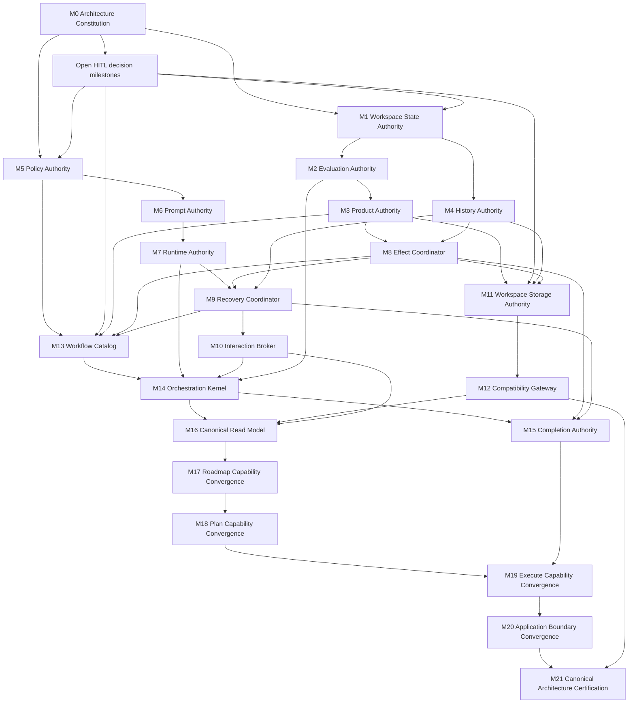

# Canonical Architecture Convergence Program

Status: proposed implementation program  
Architecture contract: canonical architecture version 1.0, pending HITL ratification  
Baseline convergence: Hybrid, 2.12/5 (42%)  
Target: Legacy-Free, 5/5 in every subsystem

## 1. Executive Summary

LoopRelay will converge from a hybrid system into one canonical automation architecture. The destination is a single application boundary backed by one orchestration kernel, one versioned workflow catalog, one logical workspace state authority, one product lifecycle, one evidence history, one effect protocol, one recovery protocol, one completion authority, one interaction model, and one expiring compatibility boundary.

This program is organized by architectural authority dependencies. It does not traverse projects, directories, or historical implementations. Each implementation milestone establishes one durable canonical capability as a complete vertical slice: its contract is ratified, its behavior is routed through the authority, its compatibility obligations are explicit, its evidence is produced through the production boundary, and its certification is complete before dependent capabilities advance.

Legacy behavior remains an executable behavioral specification until its convergence bundle reaches production-only proof. Legacy implementation is not a target architecture, a fallback authority, or an acceptable location for new behavior. It becomes eligible for retirement only after the canonical owner exists, preserved and intentionally changed behavior is certified, compatibility and recovery obligations are satisfied, production routing is target-only, and post-retirement certification passes. Deletion is therefore an outcome of convergence, never a milestone objective.

The global sequence is:

```text
Ratify authority and decisions
  -> establish durable workspace identity and state
  -> establish evaluation, product, and history authority
  -> establish policy, prompt, and runtime authority
  -> establish effect, recovery, and interaction authority
  -> establish storage and compatibility authority
  -> establish the universal catalog, kernel, completion, and read model
  -> converge Roadmap, Plan, and Execute behavior through those authorities
  -> route every product surface through one application boundary
  -> certify the single canonical architecture and allow gated retirement
```

The program begins at 42% weighted convergence. It does not claim progress from code presence or green legacy tests. Score advances only when required proof is accepted.

## 2. Current Convergence Assessment

### 2.1 Current architectural state

The repository has a credible canonical nucleus: one supported product surface already reaches a shared workflow catalog, resolver, transition runtime, controller, chain runner, and canonical workflow persistence. This provides real architectural value and is the foundation of the program.

The system remains Hybrid because canonical and alternate ownership coexist:

- Mutable workflow state, execution history, completion inputs, archives, and projections do not yet share one logical authority.
- External effects may be declared without being durably executed, ordered, reconciled, and proven.
- Restart continuity depends in places on live in-memory session state; cancellation and unknown outcomes lack a universal recovery protocol.
- Storage commands and verification do not yet fulfill the complete import, export, sync, conflict, repair-planning, and round-trip contract.
- Completion can conflate blocked and failed outcomes and does not yet own one closure plan.
- Configuration, prompt policy, telemetry, usage-limit handling, input-wait reporting, runtime diagnostics, isolation, trust evidence, and human interaction have bypassed or distributed ownership.
- Legacy Roadmap, Plan, and Execute implementations remain compiled and test-maintained. They are outside production reachability but still contain unique behavioral specification.
- Compatibility obligations exist without a complete owner, support window, usage evidence, or objective retirement trigger.

### 2.2 Baseline scorecard

| Subsystem | Weight | Baseline | Principal convergence blocker |
|---|---:|---:|---|
| Application boundary | 5% | 4/5 | Historical deployable surfaces remain and composition does not enforce every authority |
| Workflow catalog | 8% | 3/5 | Duplicate access paths and legacy workflow specifications remain |
| Resolution and chaining | 7% | 4/5 | Explainability and structured human-action evidence are incomplete |
| Transition execution | 10% | 3/5 | Hidden workflow sequencing and live-session dependencies remain |
| Products, gates, and evaluation | 8% | 3/5 | Representation and detailed validation ownership are incomplete |
| Persistence and history | 12% | 1/5 | Competing state and history representations remain |
| Effects, publication, and Git | 8% | 2/5 | Some required effects are evidence-only or bypass a durable effect protocol |
| Recovery and resume | 10% | 1/5 | No universal attempt, unknown-outcome, restart, and cancellation protocol |
| Completion | 7% | 2/5 | Decision, closure, archive, cleanup, and outcome mapping remain split |
| Storage and compatibility | 8% | 1/5 | Data movement, semantic verification, and support windows are incomplete |
| Prompt and policy authority | 5% | 2/5 | Policy sources and prompt composition are distributed or bypassed |
| Runtime and operability | 5% | 1/5 | Operational wrappers and prerequisite evidence are not canonically composed |
| Human interaction and explainability | 3% | 1/5 | Required actions are not durable interaction objects |
| Behavioral certification | 4% | 2/5 | Many tests prove legacy owners rather than canonical equivalence |
| **Weighted total** | **100%** | **2.12/5 (42%)** | **Durable authority and proof are the limiting factors** |

### 2.3 Current behavioral classification

| Behavior family | Preserved intent | Intentional change requiring decision | Behavior that may retire only after proof |
|---|---|---|---|
| Roadmap | Product convergence, rigor, provenance, lifecycle, blocker/recovery, storage and migration semantics | Exact prompt-policy profile and full-roadmap generation intent | Independent roadmap orchestration and implementation-specific sequencing |
| Plan | Warm authoring, review, scoped mutation, validation, publication, parent repository recording, restart semantics | Accepted restart behavior where provider capabilities differ | Independent Plan pipeline and implementation-identity tests |
| Execute | Decision routing, implementation, handoff, publication, Git evaluation, stall handling, review, completion | First-run sequencing, salvage, review order, and provider fallback policy | Independent execution loop and obsolete prompt flow |
| Operations | Telemetry, quota behavior, input-wait reporting, diagnostics, isolation, trust evidence | Retain, modify, or intentionally retire each policy | Bypassed wrappers after the policy authority owns the chosen behavior |
| Persistence | Complete state, history, archive, recovery, and truthful storage operations | Physical representation and declared legacy support window | Feature-specific authoritative stores and runtime fallback paths |
| Interaction | Explainable waiting, blocking, approval, and required human action | Allowed request/response and timeout policy | Empty placeholder contracts and embedded interaction paths |

Nothing in the third column may disappear implicitly. Each disposition requires an accepted decision record and a P5 convergence bundle.

## 3. Canonical End-State Vision

The canonical end state has these properties:

1. Operators, automation, and future interactive clients use one application boundary. Clients submit commands and queries, render canonical read models, forward cancellation, and map typed outcomes; they do not own orchestration.
2. A single versioned workflow catalog declares Traditional Roadmap, Evaluation Roadmap, Plan, and Execute in terms of products, gates, policies, effects, recovery semantics, successors, and terminal outcomes.
3. A single orchestration kernel interprets every workflow through the same lifecycle from authoritative observation to gate evaluation, attempt recording, runtime execution, validation, product promotion, state transition, effect reconciliation, and evidence emission.
4. One logical workspace state authority owns mutable orchestration state, stable identities, attempts, sessions, products, history, effects, blockers, recovery, interactions, compatibility receipts, and schema evolution.
5. Product bodies are immutable and causally identified. Collaboration files are candidate or materialized projections, never an implicit database or latest-file fallback.
6. Completed, waiting, blocked, failed, cancelled, stalled, ambiguous, and recovery-required outcomes remain distinct through execution, persistence, status, and client exit mapping.
7. Publication, repository mutation, archive, export, and other external work are ordered, journaled, idempotent effects. Unknown outcomes are reconciled before retry.
8. Recovery starts from durable evidence and can resume, fork, reconcile, retry, compensate, wait, block, or request a human decision without requiring an undiscoverable live object.
9. Compatibility detects and translates supported legacy representations through explicit canonical import transactions. Runtime never silently falls back or normalizes dual authority.
10. Every architectural decision is explainable by authority, causal evidence, ignored alternatives, conflicts, uncertainty, and required human action.
11. Every production behavior has exactly one registered owner; every owner is enforced by architecture certification.
12. The final repository contains no compiled historical workflow authority, unowned runtime asset, expired adapter, or test whose only behavioral value is exercising a legacy owner.

## 4. Guiding Architectural Principles

### 4.1 Authority before behavior routing

Establish the canonical contract and sole owner before routing behavior. Route behavior before using the old implementation as anything other than executable specification.

### 4.2 Architecture before retirement

The mandatory order is authority establishment, behavior implementation, convergence proof, production routing, retirement eligibility, and post-retirement certification. Removal cannot substitute for any earlier gate.

### 4.3 One behavior, one owner

Zero owners and multiple owners are architectural defects. Adapters, prompts, tests, projections, and clients may consume authority but cannot acquire it.

### 4.4 Universal mechanics, declarative workflows

Workflow-specific behavior declares products, gates, policies, effects, and recovery. Scheduling, persistence, retry, chaining, interaction, and client dispatch remain universal mechanics.

### 4.5 Durable causal identity

Every attempt, session, turn, candidate, product, effect, recovery action, interaction, and compatibility import is linked by stable identity and causal evidence before dependent features converge.

### 4.6 Effects are not state claims

Declaring or recording an intended external effect is not executing it. Required effects must have journaled intent, idempotency, receipt, reconciliation, and typed failure behavior.

### 4.7 Compatibility is one-way and expiring

Compatibility exists to move supported inputs into the canonical model. It cannot create runtime fallback, dual write, silent merge, or an indefinite second authority.

### 4.8 Legacy is executable specification

Until a behavior reaches P4, its legacy implementation and fixtures may be used for differential evidence. No new product behavior may be added there. At P4 it ceases to be a maintained authority; at P5 it has no remaining architectural role.

### 4.9 Proof is part of the capability

Implementation without success, failure, restart, idempotency, compatibility, explainability, reachability, and removal evidence is incomplete architecture.

### 4.10 Invariants change only by decision milestone

The thirty canonical architecture invariants remain binding throughout the program. A proposed exception or semantic change creates a separate HITL architecture decision and a versioned contract; it is never buried in implementation.

## 5. Architectural Dependency Graph



Architectural decisions are placed on the dependency edges they control. They need not all conclude before M0 begins, but no dependent milestone may pass its entry gate while its decision remains open.

## 6. Convergence Strategy

### 6.1 Implementation program phases

The phases provide the macro execution view; milestones remain the atomic certification units. A phase closes only when every included milestone has passed its own proof and acceptance gates.

| Phase | Milestones | Objective-centric outcome | Phase exit state |
|---|---|---|---|
| 1. Constitution | M0 and D1–D7 as gated inputs | Make architectural ownership, decisions, invariants, and proof explicit | Every behavior and open decision has an accountable architectural home |
| 2. Foundations | M1–M6 | Make state, decisions, products, history, policy, and prompts singular and causally identifiable | Canonical truth and agent inputs can no longer be selected by representation or local convention |
| 3. Runtime | M7–M10 | Make external execution, effects, recovery, and human control durable and restart-safe | External work and human action cannot disappear, duplicate, or become ambiguous across interruption |
| 4. Persistence and Compatibility | M11–M12 | Make storage truthful and legacy support one-way, observable, and expiring | Supported legacy state enters canonical authority explicitly; runtime fallback is absent |
| 5. Kernel | M13–M16 | Make workflow intent, progression, completion, and explanation universal | One catalog and kernel decide behavior; one completion authority and read model explain it |
| 6. Behavioral Convergence | M17–M19 | Make Roadmap, Plan, and Execute behavior canonical end to end | No preserved workflow behavior is uniquely owned or proved by a legacy implementation |
| 7. Surface and Certification | M20–M21 | Make every surface target-only and prove the architecture after retirement | One supported application boundary and one P5 canonical architecture remain |

The phases are dependency ordered, but decision work and proof-fixture preparation may proceed earlier where they do not create a second authority. No phase may route behavior around an incomplete prerequisite to accelerate apparent progress.

### 6.2 Vertical authority slices

Each milestone completes one capability across contract, durable state, behavior, production routing, compatibility, documentation, proof, and certification. A milestone may introduce temporary bridging only when the bridge is registered, one-way, owned, observable, and has an objective retirement gate.

### 6.3 Behavior-first crosswalk

Before a legacy behavior is touched, its convergence bundle records whether it is preserved, intentionally changed, or intentionally retired. Preserved behavior receives differential fixtures. Intentional change receives an accepted decision, operator impact, migration semantics, and new target proof. Intentional retirement receives evidence that the product contract and supported consumers no longer require it.

### 6.4 Production-first proof

Certification invokes the same catalog, composition, application boundary, and selected authorities used by production. Handler-only tests and green legacy suites can support diagnosis but cannot satisfy a routing or retirement gate.

### 6.5 Entropy budget

Every milestone must leave a measurable reduction in at least one of these dimensions:

- behaviors with zero or multiple authorities;
- orchestration paths;
- authoritative mutable stores;
- direct external-effect paths;
- workflow-local recovery paths;
- unregistered compatibility branches;
- hidden policy sources;
- behavior tested only through legacy owners;
- unowned runtime or generated assets.

Temporary complexity is accepted only with a named owner, measured payoff, and removal condition in the same milestone record.

### 6.6 Invariant control

Every milestone certification evaluates ACI-01 through ACI-30. An invariant may be marked not yet achieved where the baseline already violates it, but no milestone may worsen it. Any proposed change to an invariant blocks the milestone pending a separate decision.

## 7. Milestone Overview

| ID | Capability established | Principal prerequisites | Minimum proof on exit | Entropy result |
|---|---|---|---|---|
| M0 | Architecture Constitution | Relevant HITL decisions opened | Authority registry and architecture gates are authoritative | Unowned behavior becomes visible and prohibited |
| M1 | Workspace State Authority | M0, D1, D7 | One logical mutable-state owner in production | Competing state authority begins to collapse |
| M2 | Evaluation Authority | M1 | Typed gates and validation decide outcomes | Prompt/file success ceases to be authority |
| M3 | Product Authority | M1, M2, D7 | Candidates promote to immutable causal products | Latest-file and fallback product ambiguity falls |
| M4 | History Authority | M1, M3 | One append-only evidence lineage | Numbered/file/export history loses authority |
| M5 | Policy Authority | M0, D3, D4, D5, D6 | One resolved, versioned policy per attempt | Ambient and call-site policy choices collapse |
| M6 | Prompt Authority | M3, M5, D6 | Versioned rendered prompt provenance | Hidden fragments and unowned prompts disappear |
| M7 | Runtime Authority | M4, M5, M6, D5 | Normalized provider-neutral execution evidence | Direct and policy-selecting provider paths disappear |
| M8 | Effect Coordinator | M3, M4 | All required external mutations use one ledger | Direct/evidence-only effect paths collapse |
| M9 | Recovery Coordinator | M4, M7, M8, D5, D6 | Restart and unknown outcomes are durably classified | Workflow-local recovery and live-only continuity fall |
| M10 | Interaction Broker | M1, M5, M9, D4 | Human requests and responses are durable | Embedded prompts and empty action placeholders fall |
| M11 | Workspace Storage Authority | M3, M4, M8, M9, D2 | Truthful verify/import/export/migrate/sync/repair planning | Storage coordinators and ambiguous authority fall |
| M12 | Compatibility Gateway | M11, D2 | Supported legacy inputs migrate one-way | Runtime fallbacks become quarantined and expiring |
| M13 | Workflow Catalog | M3, M5, M8, M9, D1 | One validated versioned definition source | Duplicate catalogs and private workflow mechanics fall |
| M14 | Orchestration Kernel | M2, M7, M9, M10, M13 | One universal lifecycle routes transitions | Alternate scheduling/retry/chaining paths lose authority |
| M15 | Completion Authority | M2, M8, M9, M14, D6 | One typed completion decision and closure plan | Split completion and block/failure conflation fall |
| M16 | Canonical Read Model | M4, M8–M15 | All clients receive explainable canonical status | Console-only and workflow-specific status logic falls |
| M17 | Roadmap Capability | M12–M16, D6 | Both roadmap intents converge on the same products | Roadmap legacy behavior ceases to be uniquely authoritative |
| M18 | Plan Capability | M17, M12–M16, D6 | Planning products and effects converge | Plan pipeline ceases to be uniquely authoritative |
| M19 | Execute Capability | M15, M18, M12–M16, D6 | Execution and completion converge under fault/restart | Old execution loop ceases to be uniquely authoritative |
| M20 | Application Boundary | M17–M19, M16 | Every supported surface routes target-only | Historical product surfaces and local dispatch disappear |
| M21 | Canonical Architecture Certification | M20 and all compatibility gates | P5 for every subsystem after gated retirement | Exactly one canonical architecture remains |

## 8. Detailed Milestones

### M0 — Architecture Constitution

**Permanent system property:** Every production behavior, invariant, compatibility obligation, and convergence claim has an explicit, versioned, enforceable architectural home.

#### Architectural State Transition

Before: ownership and proof can remain implicit or be inferred from surviving implementation.  
After: the architecture constitution is the sole source of ownership, invariant, compatibility, and proof rules.

#### Impossible Afterward

- A behavior can be introduced without a named authority.
- A compatibility obligation can exist without an owner and retirement gate.
- An architecture exception can remain invisible or indefinite.

#### Objective

Establish the versioned architectural constitution as the sole authority for ownership, invariants, compatibility governance, and convergence proof.

#### Architectural Motivation

Current behavior can be reachable, tested, and still lack a declared canonical owner. A machine-verifiable constitution prevents migration work from creating new ambiguity.

#### Target Authorities

Architecture governance authority, authority registry, invariant registry, compatibility registry, and convergence scorecard.

#### Architectural Contracts

One-owner rule; ACI-01 through ACI-30; P0–P5 proof rubric; behavior classification; architecture change and exception protocol.

#### Behavioral Scope

- Preserved: all intentional product behavior pending explicit classification.
- Changed: architectural ownership becomes explicit, versioned, and enforceable.
- Retired: undocumented ownership, implicit architecture exceptions, and proof by code presence.

#### Dependencies

The three authoritative audits and opened D1–D7 decision records.

#### Compatibility

Every known legacy obligation enters the compatibility registry with an owner and unresolved fields made blocking rather than silently defaulted.

#### Convergence Impact

Moves every behavior from implicit history toward a named target authority and proof level.

#### Architectural Entropy Reduction

Makes zero-owner, multi-owner, unowned asset, and undated compatibility conditions measurable and non-expandable.

#### Required Proof

Registry completeness review; architecture-rule dry run; trace from each production behavior to exactly one target owner; trace from each invariant to a certification check or an explicit planned check.

#### Acceptance Criteria

- The same authority and workflow definitions govern production certification and CI.
- Every known behavior, compatibility obligation, and decision has one accountable owner.
- No architecture exception can exist without an expiry, evidence, and decision record.

#### Retirement Gates

No behavior-bearing legacy implementation becomes eligible. Declaration-only debris with no product-intent or proof dependency may become eligible after the registry confirms it is unowned and non-authoritative.

#### Successor Milestones

M1 Workspace State Authority and M5 Policy Authority.

### M1 — Workspace State Authority

**Permanent system property:** All mutable orchestration state is governed by exactly one logical transactional authority and one stable causal identity model.

#### Architectural State Transition

Before: mutable state and identity are split, selected by features, or inferred from representations.  
After: exactly one transactional authority determines mutable orchestration truth.

#### Impossible Afterward

- Two supported mutable stores can both claim current orchestration truth.
- A derived file or projection can silently outrank canonical state.
- A new orchestration fact can exist without stable causal identity.

#### Objective

Establish one logical transactional owner for mutable orchestration state and stable causal identities.

#### Architectural Motivation

Recovery, product promotion, history, effects, interaction, storage, and proof cannot converge while state identity is split or implicit.

#### Target Authorities

Workspace State Authority and its canonical identity model.

#### Architectural Contracts

Atomic state transition; stable workspace/run/workflow/transition/attempt/session/turn identities; monotonic schema evolution; explicit concurrency; no authoritative sidecar or projection fallback.

#### Behavioral Scope

- Preserved: current workflow state, blockers, attempts, sessions, and continuation semantics.
- Changed: every mutable fact acquires canonical identity and transactional ownership.
- Retired: feature-selected authoritative stores and ambiguous “latest” state selection.

#### Dependencies

M0, D1 architecture/versioning, and D7 physical-topology constraints.

#### Compatibility

Legacy representations remain read-only specifications until M12. New canonical writes cannot create or depend on dual authority.

#### Convergence Impact

Creates the durable foundation required by every subsequent authority.

#### Architectural Entropy Reduction

Reduces mutable state ownership toward one and prevents new feature-specific databases or sidecars from becoming authoritative.

#### Required Proof

Atomicity, concurrency, schema migration, backup/restore, identity stability, restart, and current-read-model consistency evidence through production composition.

#### Acceptance Criteria

- Every new or changed orchestration fact is written through one state authority.
- The selected current state is explainable by canonical identity and transaction sequence.
- Derived files and external repository history cannot outrank state records.

#### Retirement Gates

Feature-specific state stores become eligible only after their supported records have a certified canonical mapping and production no longer selects them.

#### Successor Milestones

M2 Evaluation Authority, M3 Product Authority, and M4 History Authority.

### M2 — Evaluation Authority

**Permanent system property:** Every product and gate decision is made through one typed, evidence-bearing evaluation model.

#### Architectural State Transition

Before: prompt success, file existence, and local checks can independently imply completion.  
After: exactly one evaluation authority decides validity, satisfaction, blocking, waiting, invalidity, or ambiguity.

#### Impossible Afterward

- Prompt transport success can complete a transition by itself.
- Blocked and failed can be collapsed by a local evaluator.
- A gate can decide without naming its requirements and evidence.

#### Objective

Establish one authority for product validation, gate decisions, uncertainty, and typed non-success outcomes.

#### Architectural Motivation

Prompt success, file existence, effect success, and workflow-local checks must not independently complete transitions.

#### Target Authorities

Gate and Validation Authority.

#### Architectural Contracts

Satisfied, Unsatisfied, Blocked, Waiting, Invalid, and Ambiguous gate outcomes; requirement-level evidence; pure evaluation; explicit conflicts, uncertainty, and remediation.

#### Behavioral Scope

- Preserved: detailed roadmap, plan, execution, and completion validation intent.
- Changed: all validation decisions use one typed vocabulary and evidence model.
- Retired: prompt-success completion, untyped file-existence gates, and duplicated outcome classification.

#### Dependencies

M1 and ratified product/outcome versions from D1.

#### Compatibility

Legacy validators may provide differential specification, but only canonical evaluation results may drive production state.

#### Convergence Impact

Separates candidate generation from authoritative acceptance and establishes end-to-end outcome fidelity.

#### Architectural Entropy Reduction

Removes duplicate gate semantics and local translations between blocked, failed, and missing.

#### Required Proof

Golden valid/invalid/blocked/waiting/ambiguous cases; uncertainty and conflict reporting; production reachability; proof that provider or prompt success alone cannot promote state.

#### Acceptance Criteria

- Every workflow gate resolves through one authority.
- Every decision names requirements, evidence, missing inputs, conflicts, uncertainty, and remediation.
- Typed outcomes remain distinguishable to the application boundary.

#### Retirement Gates

Legacy validation paths become eligible when their preserved cases have canonical golden proof and no production or certification consumer requires the old evaluator.

#### Successor Milestones

M3 Product Authority and M14 Orchestration Kernel.

### M3 — Product Authority

**Permanent system property:** Every authoritative product is immutable, versioned, causally identified, validated, and representation-independent.

#### Architectural State Transition

Before: files, rows, archives, or exports can compete to be the latest product truth.  
After: exactly one product authority promotes canonical versions and all materializations resolve to them.

#### Impossible Afterward

- “Latest file wins” can select an authoritative product.
- A revision can overwrite authoritative product history.
- Equivalent downstream behavior can depend on which upstream workflow produced the product.

#### Objective

Establish one immutable, versioned, causally identified product lifecycle from candidate registration through promotion and materialization.

#### Architectural Motivation

Files, rows, archives, and exports can currently appear to be competing product truth. Downstream workflows require one representation-independent contract.

#### Target Authorities

Product Authority.

#### Architectural Contracts

Candidate versus promoted state; immutable body; identity and schema version; content hash; producer and causal inputs; validation result; freshness and invalidation; supersession; materialization provenance.

#### Behavioral Scope

- Preserved: roadmap, plan, operational context, execution detail, milestone, decision, handoff, evidence, and completion products.
- Changed: revisions create versions; collaboration edits enter through explicit candidate validation.
- Retired: implicit latest-file wins, silent representation fallback, and overwriting product history.

#### Dependencies

M1, M2, and D7 representation decision.

#### Compatibility

Legacy product layouts remain non-authoritative inputs pending registered import; materialized legacy views retain provenance.

#### Convergence Impact

Creates the common contract that allows different roadmap intents to feed Plan and Plan to feed Execute without producer-specific branching.

#### Architectural Entropy Reduction

Collapses multiple product selection concepts into one lifecycle.

#### Required Proof

Candidate/promotion atomicity; immutable versioning; freshness/invalidation; causal lineage; materialization round-trip; conflicting representation behavior; downstream producer-neutral consumption.

#### Acceptance Criteria

- Every promoted product resolves to one canonical identity and immutable body.
- No downstream workflow branches on the equivalent product’s producer.
- Every materialization is candidate or projection, never an implicit authority.

#### Retirement Gates

Legacy product stores and logical resolvers become eligible after all supported products import or resolve through canonical identity and runtime fallback is absent.

#### Successor Milestones

M4 History Authority, M6 Prompt Authority, M8 Effect Coordinator, M11 Storage Authority, and M13 Workflow Catalog.

### M4 — History Authority

**Permanent system property:** All orchestration facts share one append-only, causally ordered, integrity-verifiable evidence history.

#### Architectural State Transition

Before: execution, completion, recovery, exports, and files can observe different histories.  
After: exactly one evidence ledger determines fact identity, order, and lineage.

#### Impossible Afterward

- Execution can write a history that completion cannot discover.
- A numbered file, export, or console log can act as authoritative history.
- A correction can erase prior evidence rather than supersede it.

#### Objective

Establish one append-only evidence ledger for attempts, outcomes, lineage, observations, and replay order.

#### Architectural Motivation

Execution writes and completion reads must not disagree about history. Exports, numbered files, console output, and repository history are projections, not orchestration journals.

#### Target Authorities

History Authority within the Workspace State Authority.

#### Architectural Contracts

Append-only facts; superseding corrections; canonical transaction sequence; integrity validation; stable evidence identity; causal lineage; rebuildable or transactionally checked projections.

#### Behavioral Scope

- Preserved: decision, handoff, delta, transition, telemetry, blocker, recovery, publication, and completion evidence.
- Changed: all facts share one identity and order; projections become derived.
- Retired: numbered files, exports, or console logs acting as history authority.

#### Dependencies

M1 and M3.

#### Compatibility

Legacy histories are retained as fixtures until their ordering, hashing, and semantic import are certified through M12.

#### Convergence Impact

Supplies the evidence spine for effects, recovery, completion, read models, and convergence proof.

#### Architectural Entropy Reduction

Reduces competing history authorities and duplicate correlation models.

#### Required Proof

Append/order integrity; correction semantics; cross-process reads; execution-to-completion history parity; projection rebuild; corruption detection; causal trace from status to evidence.

#### Acceptance Criteria

- Execution, completion, recovery, and status consume the same history identities.
- Exported or materialized history cannot change canonical ordering.
- Every production decision links to durable evidence in one lookup chain.

#### Retirement Gates

File-backed and alternate historical stores become eligible after supported histories import with stable semantics and all production readers use the ledger.

#### Successor Milestones

M7 Runtime Authority, M8 Effect Coordinator, M9 Recovery Coordinator, and M16 Canonical Read Model.

### M5 — Policy Authority

**Permanent system property:** Every attempt executes under one resolved, versioned, validated policy with complete provenance.

#### Architectural State Transition

Before: configuration and policy can be ignored, ambient, or independently selected by workflows and providers.  
After: exactly one policy authority supplies every consumer with the same effective policy identity.

#### Impossible Afterward

- A configured value can appear supported while having no production effect.
- A provider or workflow can silently choose its own model, permission, retry, or isolation policy.
- Two consumers in the same attempt can observe different effective policy.

#### Objective

Establish one versioned authority for effective configuration and execution policy per attempt.

#### Architectural Motivation

Prompt, artifact, permission, model/effort, approval, retry, isolation, telemetry, and interaction policy cannot be chosen independently by factories, workflows, providers, or ambient defaults.

#### Target Authorities

Configuration Resolver and Policy Authority.

#### Architectural Contracts

Single resolution per attempt; layered provenance; validation and conflict handling; versioned policy identity; explicit permissions, model/effort, approval, retry, isolation, artifact, telemetry, and interaction settings.

#### Behavioral Scope

- Preserved: all policy safeguards and supported configuration behavior selected by D3–D6.
- Changed: defaults and overrides become explicit causal inputs.
- Retired: ignored settings, hidden defaults, provider-selected policy, and free-form policy appendages.

#### Dependencies

M0 and D3 operational policy, D4 interaction/security policy, D5 provider policy, and D6 behavior/prompt decisions.

#### Compatibility

Supported legacy settings map to canonical profiles with provenance; unknown or conflicting values block rather than silently degrade.

#### Convergence Impact

Gives prompts, runtime, recovery, interaction, and certification one policy truth.

#### Architectural Entropy Reduction

Eliminates scattered configuration reads and per-call-site policy choices.

#### Required Proof

Precedence, provenance, conflict, unsupported capability, opt-out, retention, retry, isolation, and approval cases; production attempt evidence contains the resolved policy identity.

#### Acceptance Criteria

- Every attempt has exactly one validated policy identity.
- All policy consumers receive the same resolved values.
- A configured value is either demonstrably effective or explicitly rejected.

#### Retirement Gates

Bypassed policy wrappers and settings become eligible after the chosen behavior is canonical, documentation is aligned, and compatibility notice obligations pass.

#### Successor Milestones

M6 Prompt Authority, M7 Runtime Authority, M10 Interaction Broker, and M13 Workflow Catalog.

### M6 — Prompt Authority

**Permanent system property:** Every production prompt is versioned, owned, policy-complete, reproducible, and included in causal evidence.

#### Architectural State Transition

Before: hidden fragments, generated remnants, and workflow-local prompt policy can influence or confuse behavior.  
After: exactly one prompt authority determines rendered content and provenance.

#### Impossible Afterward

- An unowned prompt asset can participate in production.
- Hidden instructions can be appended without changing prompt identity.
- A policy change can affect a prompt without changing its recorded rendered evidence.

#### Objective

Establish one authority for versioned prompt identity, policy composition, rendering, and provenance.

#### Architectural Motivation

Prompt assets and hidden fragments must not outlive their owners or produce behavior outside the recorded policy and causal identity.

#### Target Authorities

Prompt Authority.

#### Architectural Contracts

Prompt identity/version/hash; declared variables; explicit policy sections; rendered provenance; catalog ownership; source-hash validation; no hidden workflow/provider append.

#### Behavioral Scope

- Preserved: roadmap rigor, planning review, implementation, decision, handoff, completion, and selected artifact-policy intent.
- Changed: prompt-specific policy is explicit, versioned, and testable.
- Retired: unowned generated prompts, uncompiled prompt-like assets without a product owner, obsolete seed turns, and hidden fragments.

#### Dependencies

M3, M5, and D6.

#### Compatibility

Historical layouts are accepted only through versioned product/prompt import mappings; old prompt content is differential evidence, not runtime fallback.

#### Convergence Impact

Makes agent inputs reproducible and ties behavioral proof to prompt and policy identity.

#### Architectural Entropy Reduction

Reduces duplicate prompt catalogs, fragments, and workflow-embedded policy.

#### Required Proof

Rendered snapshots for every policy profile; source ownership validation; hash stability; variable completeness; proof that configuration changes rendered behavior; inventory with zero unowned prompt assets.

#### Acceptance Criteria

- Every production prompt is cataloged, versioned, owned, and included in causal evidence.
- Every policy section contributing to behavior contributes to the rendered identity.
- No generated or runtime prompt asset lacks a registered consumer.

#### Retirement Gates

Legacy prompt catalogs and fragments become eligible once preserved outcomes have canonical prompt-policy proof and intentional differences are accepted.

#### Successor Milestones

M7 Runtime Authority and workflow capability milestones M17–M19.

### M7 — Runtime Authority

**Permanent system property:** All agent execution is provider-neutral, capability-negotiated, policy-bound, and normalized into durable evidence.

#### Architectural State Transition

Before: provider paths and bypassed wrappers can select behavior or expose incompatible outcomes.  
After: exactly one runtime gateway executes the resolved session specification for every provider.

#### Impossible Afterward

- A workflow can branch on provider identity.
- A provider can silently reinterpret execution policy.
- Missing runtime capability can trigger an unrecorded fallback.

#### Objective

Establish one provider-neutral runtime gateway for policy-bound sessions, capability negotiation, normalized outcomes, usage, and cancellation evidence.

#### Architectural Motivation

Providers must execute a resolved specification without choosing workflow, policy, or domain outcome. Operational behavior must be composed once at the runtime boundary.

#### Target Authorities

Agent Runtime Gateway.

#### Architectural Contracts

Stable session/turn identity; capability negotiation; one-shot and persistent execution; resume/read/fork policy; normalized diagnostics; usage evidence; cancellation; telemetry and quota behavior selected by policy.

#### Behavioral Scope

- Preserved: agent execution, session continuity, selected telemetry/export, quota wait/retry, input-wait reporting, and prerequisite behavior.
- Changed: unsupported capabilities yield typed policy outcomes rather than hidden fallback.
- Retired: direct provider calls, provider-string domain classification, and runtime-local policy selection.

#### Dependencies

M4, M5, M6, D3, and D5.

#### Compatibility

Provider-specific evidence is retained diagnostically but normalized before domain consumption. Compatibility exports are effects or projections, not runtime truth.

#### Convergence Impact

Separates provider mechanics from workflow behavior and prepares durable recovery.

#### Architectural Entropy Reduction

Collapses wrapper chains and provider-specific execution paths into one governed boundary.

#### Required Proof

Capability matrix; one-shot/persistent/resume/read/fork cases; quota policy; cancellation; telemetry opt-in/out and export; input-wait evidence; provider failure normalization; production composition uniqueness.

#### Acceptance Criteria

- Workflows cannot branch on provider identity.
- Every external run records the effective runtime specification before launch.
- Missing capabilities produce explainable typed outcomes.

#### Retirement Gates

Bypassed operational wrappers, runtime doctors, and direct provider paths become eligible after selected behaviors and compatibility exports are certified through the gateway.

#### Successor Milestones

M9 Recovery Coordinator and M14 Orchestration Kernel.

### M8 — Effect Coordinator

**Permanent system property:** Every required external mutation is durable, ordered, idempotent, recoverable, and supported by an authoritative receipt.

#### Architectural State Transition

Before: external work can be merely declared, executed directly, duplicated, reordered, or lost across interruption.  
After: exactly one effect coordinator owns intent, ordering, execution, reconciliation, and receipts.

#### Impossible Afterward

- Publication can be recorded as complete without execution.
- Duplicate invocation can create duplicate semantic effects.
- Dependent effects can be reordered or retried before unknown outcomes are reconciled.

#### Objective

Establish one durable authority for ordered, journaled, idempotent external mutations and reconciliation.

#### Architectural Motivation

Publication, repository recording, archive, export, and context updates cannot be claimed complete from metadata or direct calls.

#### Target Authorities

Effect Coordinator.

#### Architectural Contracts

Declared trigger, inputs, ordering group, dependencies, deterministic idempotency key, expected postcondition, retry, reconciliation, compensation legality, receipts, and progression semantics.

#### Behavioral Scope

- Preserved: publication, parent repository recording, archive, export, and other required repository mutations.
- Changed: all effects execute from durable intent and report success, failure, or unknown distinctly.
- Retired: evidence-only completion claims, direct unjournaled effects, and required null/no-op effect paths.

#### Dependencies

M3 and M4.

#### Compatibility

Legacy exporters may implement registered effect contracts during their support window but cannot mutate workflow state or become an alternate coordinator.

#### Convergence Impact

Closes declared-versus-executed gaps and makes interruption between ordered effects recoverable.

#### Architectural Entropy Reduction

Reduces direct effect paths and duplicate sequencing logic.

#### Required Proof

Success/failure/unknown matrices; restart between ordered effects; duplicate invocation; reconciliation; illegal compensation; required-effect capability checks; status of pending effects.

#### Acceptance Criteria

- Every required external mutation has one effect identity and durable receipt.
- Unknown outcomes reconcile before retry.
- Required effect failure cannot be reported as workflow completion.

#### Retirement Gates

Direct publication, repository mutation, archive, export, and preflight implementations become eligible only after their behavior executes and reconciles through the coordinator.

#### Successor Milestones

M9 Recovery Coordinator, M11 Workspace Storage Authority, M13 Workflow Catalog, and M15 Completion Authority.

### M9 — Recovery Coordinator

**Permanent system property:** Every interruption and uncertain external outcome has one durable, evidence-based, idempotent recovery plan.

#### Architectural State Transition

Before: restart can require live objects, provider strings, or workflow-local recovery state.  
After: exactly one recovery coordinator classifies durable evidence and selects the allowed next action.

#### Impossible Afterward

- Restart can require an undiscoverable in-memory session to determine legality.
- Unknown external work can be blindly repeated as though it never started.
- Cancellation can discard already-observed evidence or become generic failure.

#### Objective

Establish one authority for restart, cancellation, failure, unknown outcomes, partial effects, and recovery lineage.

#### Architectural Motivation

The next legal transition must be discoverable from durable state without a hidden live session, exception-string branch, or workflow-local repair path.

#### Target Authorities

Recovery Coordinator.

#### Architectural Contracts

Not-started, in-flight, succeeded-uncommitted, failed, cancelled, unknown, and partially-effected classifications; bounded evidence gathering; reconcile/resume/fork/retry/compensate/wait/block/human-decision plans; recorded lineage before action.

#### Behavioral Scope

- Preserved: restart continuity, cancellation evidence, salvage intent, blocker/recovery semantics, resume cleanup, and bounded retry.
- Changed: recovery decisions are durable, typed, provider-neutral, and centrally applied.
- Retired: live-object prerequisites, workflow-local error-string recovery, and blind replay of unknown work.

#### Dependencies

M4, M7, M8, D5, and D6.

#### Compatibility

Legacy recovery markers may be imported through M12; they cannot remain a parallel runtime recovery engine.

#### Convergence Impact

Enables safe workflow migration, effect execution, storage mutation, and completion across interruption boundaries.

#### Architectural Entropy Reduction

Eliminates workflow-specific retry and recovery state machines.

#### Required Proof

Restart at every durable boundary; cancellation before/during/after external work; unknown provider and effect outcomes; idempotent recovery; stale session cleanup; bounded evidence; human escalation.

#### Acceptance Criteria

- No legal next transition requires an undiscoverable in-memory object.
- Unknown outcomes are never treated as not-started without reconciliation.
- Cancellation preserves all observed evidence and remains a distinct outcome.

#### Retirement Gates

Legacy resume, unblock, archive-recovery, and local retry implementations become eligible after their supported cases produce equivalent canonical recovery plans.

#### Successor Milestones

M10 Interaction Broker, M11 Storage Authority, M13 Workflow Catalog, M14 Orchestration Kernel, and M15 Completion Authority.

### M10 — Interaction Broker

**Permanent system property:** Every required human action is a durable, typed, client-neutral request with a validated response and resume path.

#### Architectural State Transition

Before: human action can exist only as console text, an embedded prompt, or an empty placeholder.  
After: exactly one interaction broker owns request, response, timeout, waiting, blocking, and resume semantics.

#### Impossible Afterward

- Status can claim user action is required without a request identity.
- Workflow progression can depend on direct console input.
- Restart can lose an outstanding human decision.

#### Objective

Establish durable human interaction as a canonical workflow capability independent of any client.

#### Architectural Motivation

Required action cannot be represented only by console text, an empty observation list, or an embedded prompt. Future clients need the same request and response authority.

#### Target Authorities

Interaction Broker.

#### Architectural Contracts

Typed request identity, category, question, response shape, reason, requesting authority, deadline, default policy, correlation, response validation, timeout, waiting, blocking, and resume.

#### Behavioral Scope

- Preserved: approvals, HITL review, unblock/resume, and explainable user action.
- Changed: interaction becomes durable and client-neutral.
- Retired: embedded console interaction, empty structured-action placeholders, and client-owned resolution.

#### Dependencies

M1, M5, M9, and D4.

#### Compatibility

Legacy decision and review requests map to typed canonical requests when supported; ambiguous requests block for explicit resolution.

#### Convergence Impact

Unifies waiting and blocked behavior and enables reliable interactive and automated clients.

#### Architectural Entropy Reduction

Reduces workflow-specific prompts, status-only action hints, and separate resume semantics.

#### Required Proof

Request/response identity; invalid/late/duplicate response; timeout/default; restart while waiting; client substitution; status correlation; recovery escalation.

#### Acceptance Criteria

- Every required human action has a durable request identity.
- Any authorized client can render and answer through the application boundary.
- Workflows cannot directly consume console input.

#### Retirement Gates

Legacy HITL capture, embedded prompts, and placeholder interaction contracts become eligible after all supported requests round-trip through the broker.

#### Successor Milestones

M14 Orchestration Kernel and M16 Canonical Read Model.

### M11 — Workspace Storage Authority

**Permanent system property:** Storage authority is singular, explicit, truthful, and safe across verification, movement, migration, synchronization, and repair planning.

#### Architectural State Transition

Before: storage commands can overstate behavior and multiple representations can appear authoritative.  
After: exactly one storage authority selects truth and every operation has explicit mutation semantics.

#### Impossible Afterward

- Two supported storage authorities can govern the same workspace.
- Verification can mutate state or silently repair it.
- Import, export, migration, or sync can report work that did not occur.

#### Objective

Establish one truthful authority for verify, initialize, import, export, migrate, sync, and repair planning.

#### Architectural Motivation

Storage commands must describe actual authority and data movement, detect conflict without mutation, and recover from interruption.

#### Target Authorities

Workspace Storage Authority.

#### Architectural Contracts

Read-only verification; explicit mutation commands; selected authoritative format; semantic round-trip; conflict/corruption/unsupported-version handling; durable migration and repair plans; publish-time safety.

#### Behavioral Scope

- Preserved: complete legacy verification, data movement, stale/conflict/reference checks, archive recovery awareness, and round-trip semantics.
- Changed: operations act on canonical identities and report actual mutations.
- Retired: commands that claim unsupported work, verification that repairs, and feature-selected storage authority.

#### Dependencies

M3, M4, M8, M9, and D2.

#### Compatibility

Storage detects supported legacy states read-only and delegates translation to M12; it never runs mixed-authority mutation.

#### Convergence Impact

Makes persistence authority operationally truthful and safe for workflow routing and publication.

#### Architectural Entropy Reduction

Collapses multiple storage coordinators, verifiers, history selectors, and publish preflights into one authority.

#### Required Proof

Representative round-trip; stale export, conflict, duplicate identity, unresolved reference, corruption, unsupported schema, interrupted mutation, nondeterminism, archive discovery, and publish-boundary verification.

#### Acceptance Criteria

- Verification is read-only and identifies the selected authority.
- Import, export, migration, sync, and repair behavior is explicitly defined and truthfully reported.
- Mutation cannot begin while authority is ambiguous.

#### Retirement Gates

Legacy storage coordinators, verification adapters, history factories, and publish preflights become eligible only after every supported fixture passes canonical production-path certification.

#### Successor Milestones

M12 Compatibility Gateway and M16 Canonical Read Model.

### M12 — Compatibility Gateway

**Permanent system property:** Every supported legacy representation crosses one observable, one-way, expiring boundary into canonical authority.

#### Architectural State Transition

Before: legacy readers and formats can persist as fallback, dual-write, or undated alternate authority.  
After: exactly one compatibility gateway detects, previews, imports, receipts, observes, and retires bounded obligations.

#### Impossible Afterward

- Runtime can silently fall back to a legacy source after canonical import.
- A compatibility adapter can become an alternate store or workflow authority.
- A new compatibility obligation can ship without version bounds, fixtures, usage evidence, and retirement criteria.

#### Objective

Establish one quarantined, one-way, observable, and expiring boundary for all supported legacy representations.

#### Architectural Motivation

Compatibility must enable convergence into canonical authority without normalizing fallback, dual write, or permanent alternate stores.

#### Target Authorities

Compatibility Gateway.

#### Architectural Contracts

Version-bounded detection; migration preview; explicit import transaction; semantic verification and receipt; non-authoritative legacy marker; usage evidence; deprecation; objective retirement gate.

#### Behavioral Scope

- Preserved: supported old roadmap state, partial planning products, decision sessions, histories, completion archives, telemetry exports, command aliases, and historical layouts.
- Changed: all supported runtime use follows successful canonical import.
- Retired: silent fallback, bidirectional merge, indefinite dual write, and unregistered adapters.

#### Dependencies

M11 and D2.

#### Compatibility

This milestone is the compatibility boundary. Every obligation must have owner, versions, semantic mapping, known losses, fixtures, usage evidence, support window, and retirement trigger.

#### Convergence Impact

Separates compatibility obligations from runtime authority and makes their eventual disappearance objective.

#### Architectural Entropy Reduction

Moves scattered readers and compatibility branches behind one registry and removes fallback from production flow.

#### Required Proof

Detection without mutation; preview; conflict and corruption; import receipts; post-import canonical-only execution; rollback boundary; usage observation; unsupported version; adapter retirement simulation.

#### Acceptance Criteria

- Every active compatibility obligation is registered and bounded.
- Runtime never reads a legacy source after successful import.
- No adapter can become a store, workflow, effect, or recovery authority.

#### Retirement Gates

Each adapter becomes eligible when all certified fixtures migrate, consumer usage satisfies its threshold, the not-before window passes, and post-removal migration certification succeeds.

#### Successor Milestones

M16 Canonical Read Model, M17–M19 workflow convergence, and M21 certification.

### M13 — Workflow Catalog

**Permanent system property:** All workflow intent is expressed once as immutable, versioned, production-validated declarations.

#### Architectural State Transition

Before: workflow intent can be duplicated across catalogs, wrappers, tests, or private orchestration mechanics.  
After: exactly one workflow catalog defines every supported workflow and chain.

#### Impossible Afterward

- Production and CI can validate different workflow definitions.
- Adding a workflow can require a private runner or selector.
- Duplicate catalogs can disagree about stages, successors, effects, or recovery.

#### Objective

Establish one immutable, versioned, production-validated catalog for all workflow intent.

#### Architectural Motivation

Adding or changing workflow behavior must not add a private runner, selector, persistence path, or executable.

#### Target Authorities

Workflow Catalog.

#### Architectural Contracts

Stable workflow/stage/transition/product/gate/effect/policy/recovery identities; entry and exit contracts; freshness; successors; terminal outcomes; capability requirements; failure and compatibility versions; identical production and CI validation.

#### Behavioral Scope

- Preserved: Traditional Roadmap, Evaluation Roadmap, Plan, Execute, and their product chain.
- Changed: semantic changes create new versions and migration rules.
- Retired: duplicate catalogs, forwarding wrappers, workflow-local scheduling metadata, and definition paths used only by tests.

#### Dependencies

M3, M5, M8, M9, and D1.

#### Compatibility

Definitions declare accepted input/output compatibility versions; translation remains owned by M12.

#### Convergence Impact

Makes workflow intent a single declarative source consumable by the universal kernel.

#### Architectural Entropy Reduction

Reduces catalogs, chain sources, workflow identities, and private progression concepts to one.

#### Required Proof

Catalog uniqueness; version/hash; invalid definition cases; dependency/freshness/effect/recovery completeness; exact production/CI equivalence; extension without kernel branching.

#### Acceptance Criteria

- All supported workflows and chains resolve from one catalog.
- Production fails closed on an invalid catalog.
- A workflow definition cannot own mechanics assigned to another authority.

#### Retirement Gates

Duplicate catalogs, workflow wrappers, and legacy workflow-definition access paths become eligible after production and certification consume only this catalog.

#### Successor Milestones

M14 Orchestration Kernel and workflow convergence M17–M19.

### M14 — Orchestration Kernel

**Permanent system property:** Every workflow transition executes through one universal, product-driven, evidence-complete lifecycle.

#### Architectural State Transition

Before: workflows and clients can retain private progression, retry, chaining, or completion mechanics.  
After: exactly one orchestration kernel owns eligibility and lifecycle state changes.

#### Impossible Afterward

- A workflow-specific runner, pipeline, or state machine can acquire production progression authority.
- A client can select or advance workflow state independently.
- A transition can bypass attempt recording, evaluation, promotion, effects, recovery, or evidence emission.

#### Objective

Establish one universal execution lifecycle for workflow resolution, transition eligibility, attempts, evaluation, promotion, effects, recovery, chaining, and outcomes.

#### Architectural Motivation

Workflow intent can converge only when every workflow is interpreted by the same mechanics and no client or handler owns progression.

#### Target Authorities

Orchestration Kernel and execution authority.

#### Architectural Contracts

Observe, resolve, gate, record intent, render/execute, record raw result, validate, promote/state-commit, enqueue/reconcile effects, emit evidence/read model; typed outcome propagation; product-driven chaining.

#### Behavioral Scope

- Preserved: current canonical resolution, transition, controller, and chain semantics plus selected legacy recovery behavior.
- Changed: all transitions use the complete universal lifecycle.
- Retired: workflow-specific runners, pipelines, state machines, retry, chaining, and CLI-owned selection.

#### Dependencies

M2, M7, M9, M10, and M13.

#### Compatibility

The kernel consumes canonical products only. Compatibility must complete before eligibility; adapters cannot participate in scheduling.

#### Convergence Impact

Creates the single mechanical authority through which all workflow behavior will be proven.

#### Architectural Entropy Reduction

Reduces orchestration paths and outcome translations toward one.

#### Required Proof

Lifecycle success and every non-success outcome; restart at each durable boundary; cancellation; unknown result; effect ordering; chained producer substitution; invalid catalog; interaction waiting; production reachability.

#### Acceptance Criteria

- Every production transition follows the same lifecycle.
- Prompt completion never directly completes workflow state.
- Clients, workflows, providers, and adapters cannot independently select or progress a workflow.

#### Retirement Gates

Historical runners, controllers, pipelines, and state machines become eligible per behavior only after their workflow convergence milestone reaches P4.

#### Successor Milestones

M15 Completion Authority, M16 Canonical Read Model, and M17–M19 workflow convergence.

### M15 — Completion Authority

**Permanent system property:** Completion is one typed, evidence-complete decision followed by one recoverable closure plan.

#### Architectural State Transition

Before: review, certification, archive, cleanup, and client mapping can disagree about completion.  
After: exactly one completion authority decides completion and one coordinated effect plan closes it.

#### Impossible Afterward

- A blocked completion can be reported as generic failure or success.
- Archive or publication failure can be reported as completed closure.
- Two services can independently decide whether an epic is complete.

#### Objective

Establish one authority for certified completion decisions and one closure plan whose mutations execute as coordinated effects.

#### Architectural Motivation

Completion evaluation, review, certification, archive, context update, cleanup, and client mapping must not disagree or conflate blocked with failed.

#### Target Authorities

Completion Authority.

#### Architectural Contracts

Validated milestone and repository inputs; required non-implementation review; typed certificate/block/failure; causal evidence; one closure transaction; ordered closure effects; cleanup and recovery semantics.

#### Behavioral Scope

- Preserved: completion review, certification, archive, recovery, roadmap-context update, and resume cleanup.
- Changed: blocked certification remains blocked; closure effects cannot masquerade as completion.
- Retired: alternate completion observers/evaluators, split archive ownership, and generic prompt-failure mapping.

#### Dependencies

M2, M8, M9, M14, and D6.

#### Compatibility

Supported historical completion evidence and archives enter through M12 and participate by canonical identity.

#### Convergence Impact

Closes the final lifecycle boundary required by Execute and exact outcome mapping.

#### Architectural Entropy Reduction

Reduces completion decisions and closure paths to one.

#### Required Proof

Certified, blocked, failed, cancelled, and recovery-required cases; restart between decision and each closure effect; archive/materialization recovery; stale resume cleanup; idempotent closure; client outcome fidelity.

#### Acceptance Criteria

- Exactly one authority decides completion.
- The completion certificate contains all causal evidence and policy identities.
- Required closure-effect failure remains a non-success outcome.

#### Retirement Gates

Legacy completion, archive materialization/recovery, and cleanup paths become eligible after all supported live and imported fixtures certify through this authority.

#### Successor Milestones

M19 Execute Capability Convergence and M21 certification.

### M16 — Canonical Read Model

**Permanent system property:** Every client receives the same evidence-linked explanation of state, authority, policy, uncertainty, pending work, and required action.

#### Architectural State Transition

Before: status and diagnostics can be reconstructed differently by workflows or clients.  
After: exactly one canonical read model explains every architectural decision and unfinished obligation.

#### Impossible Afterward

- Console-only text can become the sole record of operational truth.
- Two clients can disagree about selected workflow state from the same canonical facts.
- A blocker, pending effect, recovery action, compatibility conflict, or human request can be invisible to status.

#### Objective

Establish one explainable status and diagnostics authority for all clients.

#### Architectural Motivation

Operators must see the same selected authority, workflow state, evidence, pending effects, recovery, compatibility, uncertainty, and human action regardless of client.

#### Target Authorities

Canonical Read Model and observability authority.

#### Architectural Contracts

Selected workflow/stage/transition; satisfied and unsatisfied gates; blockers; attempts; pending effects; recovery lineage; storage authority; compatibility state; policy provenance; interaction requests; alternatives, conflicts, uncertainty, and evidence identities.

#### Behavioral Scope

- Preserved: status, progress, telemetry facts, usage, wait diagnostics, and recovery guidance selected by policy.
- Changed: observability derives from canonical facts and is client-neutral.
- Retired: console-only truth, workflow-specific status reconstruction, and action text without request identity.

#### Dependencies

M4 and M8–M15.

#### Compatibility

Read models expose active compatibility obligations and migration actions without reading legacy sources as current truth.

#### Convergence Impact

Makes every architectural decision and unfinished obligation observable, enabling safe production routing and retirement.

#### Architectural Entropy Reduction

Collapses status formatters, ad hoc diagnostics, and divergent progress views.

#### Required Proof

Golden read models for every outcome; authority/evidence trace; pending effect and recovery; compatibility conflict; human request; policy provenance; client parity; stale projection handling.

#### Acceptance Criteria

- Every client consumes one read-model contract.
- Every state and action is traceable to stable evidence.
- Ambiguity and uncertainty are rendered rather than guessed away.

#### Retirement Gates

Workflow-specific status logic, standalone diagnostic surfaces, and console-only progress authorities become eligible after their facts are present in the canonical model.

#### Successor Milestones

M17 Roadmap, M18 Plan, M19 Execute, and M20 Application Boundary convergence.

### M17 — Roadmap Capability Convergence

**Permanent system property:** Both roadmap intents produce the same rigorously validated, producer-neutral prepared products through canonical authorities alone.

#### Architectural State Transition

Before: detailed roadmap behavior remains uniquely specified by a disconnected alternate architecture.  
After: canonical Roadmap behavior owns products, rigor, policy, lifecycle, storage interaction, blocking, and recovery.

#### Impossible Afterward

- Downstream planning can depend on which roadmap intent produced equivalent products.
- Generic evidence prose can substitute for required roadmap rigor.
- New or recovered Roadmap work can require the legacy state machine or storage coordinator.

#### Objective

Establish canonical Roadmap behavior that transforms both roadmap intents into the same validated prepared-epic and milestone-specification products.

#### Architectural Motivation

Roadmap legacy code contains the broadest executable specification for rigor, lifecycle, storage, migration, blockers, and recovery. The product capability must converge through target authorities before that specification can cease to be necessary.

#### Target Authorities

Traditional Roadmap and Evaluation Roadmap domain definitions interpreted by the Workflow Catalog and Orchestration Kernel.

#### Architectural Contracts

Equivalent entry products, validation rigor, provenance, freshness, promotion, lifecycle, decision and split lineage, blocker/recovery evidence, policy profile, and successor contract.

#### Behavioral Scope

- Preserved: all product-significant roadmap rigor, storage/migration semantics, prompt-policy safeguards, HITL, failure persistence, status, unblock, and recovery.
- Changed: both intents produce producer-neutral canonical products through the universal lifecycle.
- Retired: independent roadmap orchestration, implementation-specific coordination, and legacy state as production authority.

#### Dependencies

M12–M16 and D6.

#### Compatibility

Every supported roadmap state and artifact layout migrates explicitly; unsupported or ambiguous states block with actionable reports.

#### Convergence Impact

Transfers the largest remaining behavioral specification into canonical products, gates, effects, recovery, and evidence.

#### Architectural Entropy Reduction

Eliminates the need for a second roadmap state machine, storage coordinator, prompt catalog, and lifecycle model.

#### Required Proof

Cross-implementation golden cases for projection freshness/provenance, promotion, lifecycle, decision ledger, split lineage, transition journal, failures, cancellation, blockers, recovery, prompt policy, storage round-trip, and product equivalence through production composition.

#### Acceptance Criteria

- Both roadmap intents produce the same declared downstream contract.
- Every preserved legacy behavior has canonical differential or intentional-difference evidence.
- New roadmap work and all production recovery use only target authorities.

#### Retirement Gates

The legacy Roadmap body becomes eligible only at P4 after all supported storage, compatibility, and behavior bundles pass. It remains the last large executable specification eligible for retirement.

#### Successor Milestones

M18 Plan Capability Convergence and M20 Application Boundary convergence.

### M18 — Plan Capability Convergence

**Permanent system property:** Planning produces complete, validated readiness products and executes all required ordered publication effects through canonical authorities.

#### Architectural State Transition

Before: planning continuity and external publication behavior remain partly owned by a disconnected pipeline.  
After: canonical Plan owns authoring, review, revision, recovery, product promotion, and required effects.

#### Impossible Afterward

- Plan can claim publication or parent recording without executing the effects.
- Restart after authoring can require a lost live session.
- Scoped mutation failure can escape the canonical rollback and outcome model.

#### Objective

Establish canonical planning behavior that converts prepared roadmap products into validated executable planning products and completed ordered effects.

#### Architectural Motivation

Planning is incomplete while warm-session behavior, restart, scoped mutation, publication, and parent repository recording do not share canonical state, recovery, and effect authority.

#### Target Authorities

Plan domain definition interpreted by the Workflow Catalog and Orchestration Kernel.

#### Architectural Contracts

Executable plan, operational context, execution details, milestone set, readiness, review, scoped mutation, publication, parent repository recording, restart, and failure semantics.

#### Behavioral Scope

- Preserved: warm authoring, adversarial review, revision, scoped permissions and rollback, validation, milestone semantics, publication, and parent repository recording.
- Changed: continuity is durable and publication is a journaled effect rather than a declaration.
- Retired: independent Plan pipeline, CLI-specific sequencing, and implementation-identity assertions.

#### Dependencies

M17 and M12–M16 plus D6.

#### Compatibility

Supported partial planning artifacts import as candidates or explicit blockers; post-import planning is canonical-only.

#### Convergence Impact

Completes the middle product boundary and proves ordered effect behavior required by Execute readiness.

#### Architectural Entropy Reduction

Eliminates the need for a fixed Plan pipeline, separate publication path, and live-only revision ownership.

#### Required Proof

Author/review/revise success; restart between authoring and revision; scoped mutation and rollback; invalid outputs; publication and parent recording ordering; interruption and duplicate invocation; partial legacy state; chain consumption.

#### Acceptance Criteria

- All required planning products are promoted before readiness.
- Required publication effects are executed, reconciled, and visible.
- Restart never requires an undiscoverable authoring session.

#### Retirement Gates

The legacy Plan body becomes eligible at P4 after every retained behavioral assertion has a production-path canonical counterpart and partial-state compatibility is certified.

#### Successor Milestones

M19 Execute Capability Convergence and M20 Application Boundary convergence.

### M19 — Execute Capability Convergence

**Permanent system property:** Execution remains correct, recoverable, idempotent, and explainable from readiness through certified completion across every interruption boundary.

#### Architectural State Transition

Before: continuity, salvage, effect ordering, history, review, and completion semantics remain partly unique to an old loop.  
After: canonical Execute and Completion authorities own the entire lifecycle.

#### Impossible Afterward

- Unknown implementation work can be repeated without reconciliation.
- Implementation-to-handoff restart can fail solely because a live session vanished.
- Review, publication, stall, or completion outcomes can bypass the canonical outcome and effect model.

#### Objective

Establish canonical execution from readiness through decisions, implementation, handoff, publication, repository evaluation, stall handling, review, and certified completion.

#### Architectural Motivation

Execution is the highest-risk workflow because external work, live sessions, repository mutation, review, and completion cross interruption boundaries.

#### Target Authorities

Execute domain definition interpreted by the Workflow Catalog and Orchestration Kernel, with Completion Authority for closure.

#### Architectural Contracts

Decision and transfer lineage; implementation and handoff continuity; publication and repository effects; commit/stall gates; cancellation; review order; typed completion; cleanup; successor/terminal outcomes.

#### Behavioral Scope

- Preserved: selected first-run behavior, decisions, continuation, handoff, cancellation evidence or salvage, publication, repository evaluation, stall detection, review, completion, archive, recovery, and resume cleanup.
- Changed: live continuity becomes durable capability-aware recovery; blocked remains distinct from failed.
- Retired: independent execution loop, obsolete execution prompt flow, direct effects, and live-session-only progression.

#### Dependencies

M15, M18, M12–M16, and D6.

#### Compatibility

Supported decision sessions, histories, evidence, and archives import before execution or completion; conflicting state blocks.

#### Convergence Impact

Closes the final workflow and proves the full architecture under external side effects, interruption, and completion.

#### Architectural Entropy Reduction

Eliminates the need for an alternate loop, separate history selection, workflow-local recovery, and split completion behavior.

#### Required Proof

Decision/transfer/implementation/handoff flows; restart after every external and durable boundary; cancellation/failure with partial mutation; unknown provider outcome; review ordering; stall and milestone-only progress; effect idempotency; blocked completion and client outcome; cleanup; history/archive compatibility.

#### Acceptance Criteria

- Execution never repeats unknown external work without reconciliation.
- Implementation-to-handoff continuity is recoverable from durable identity.
- Every required effect and completion condition is reflected in canonical outcome and status.

#### Retirement Gates

The old execution loop becomes eligible at P4 after every selected behavior is certified through production. Shared history and completion remnants require their own compatibility and completion gates even if the loop is eligible.

#### Successor Milestones

M20 Application Boundary Convergence and M21 Canonical Architecture Certification.

### M20 — Application Boundary Convergence

**Permanent system property:** Every supported product surface invokes the same application commands, queries, outcomes, and canonical read models.

#### Architectural State Transition

Before: historical surfaces and clients can retain local dispatch, state reconstruction, or outcome semantics.  
After: exactly one supported application boundary mediates all product behavior.

#### Impossible Afterward

- A supported client can reach an alternate workflow or store.
- Client-specific dispatch can change workflow selection or progression.
- Equivalent commands can produce different domain outcomes because of their surface.

#### Objective

Establish one supported application boundary through which every command, query, workflow, recovery action, effect reconciliation, storage operation, and interaction is routed.

#### Architectural Motivation

One kernel is insufficient if clients can still select workflow state, run effects, read alternate stores, or own outcome mapping.

#### Target Authorities

Application Boundary as the sole product-facing authority; clients remain thin adapters.

#### Architectural Contracts

Client-neutral commands and queries; canonical cancellation; read-model rendering; typed outcome mapping; no workflow selection, persistence, effect execution, or state reconstruction in clients.

#### Behavioral Scope

- Preserved: supported run modes, bounded operation, status, unblock, storage, cancellation, and automation behavior.
- Changed: all surfaces receive the same canonical results and evidence.
- Retired: historical product entrypoints, client-local orchestration, and duplicate command semantics.

#### Dependencies

M16–M19.

#### Compatibility

Old command names or scripts may remain only as time-bounded migration aids that invoke the same boundary and hold no runtime state.

#### Convergence Impact

Makes target-only production reachability observable and prepares whole-system retirement certification.

#### Architectural Entropy Reduction

Reduces supported deployables, dispatch paths, outcome mappers, and product-specific composition roots toward one.

#### Required Proof

Command and query matrix; client parity; cancellation; typed exit mapping; target-only reachability; absence of client-side state/effect authority; old-name compatibility usage and expiry evidence.

#### Acceptance Criteria

- There is one supported product boundary and one production composition.
- Every client renders canonical read models and maps canonical outcomes.
- No supported surface reaches a legacy workflow or alternate store.

#### Retirement Gates

Historical executable projects and entrypoint migration aids become eligible after target-only reachability, support-window, and downstream-consumer gates pass.

#### Successor Milestones

M21 Canonical Architecture Certification.

### M21 — Canonical Architecture Certification

**Permanent system property:** The repository has exactly one proven canonical architecture, and removing all remaining legacy implementation cannot change supported observable behavior.

#### Architectural State Transition

Before: canonical authorities are production-default but alternate implementations or proof dependencies may remain.  
After: every subsystem is P5, every invariant passes, and no alternate authority remains plausible or necessary.

#### Impossible Afterward

- A production behavior can have zero or multiple registered owners.
- A required behavior can be proven only through a legacy implementation.
- An expired adapter, direct effect, alternate store, or historical workflow authority can re-enter without failing permanent architecture gates.

#### Objective

Certify that exactly one canonical architecture satisfies every product contract and invariant after all eligible legacy authorities and expired compatibility obligations have retired.

#### Architectural Motivation

The program is complete only when canonical behavior remains correct after alternate implementations are absent and permanent governance prevents their return.

#### Target Authorities

The complete authority registry, with exactly one owner for every production behavior.

#### Architectural Contracts

ACI-01 through ACI-30; P5 convergence bundles; weighted 5/5 score; target-only production reachability; zero expired adapters; permanent architecture gates.

#### Behavioral Scope

- Preserved: every behavior classified for preservation and every active compatibility promise.
- Changed: every accepted semantic difference, with versioning and operator migration evidence.
- Retired: only behaviors explicitly accepted for retirement and all alternate architectural authorities.

#### Dependencies

M20, every relevant decision, every P4 behavior bundle, and every compatibility retirement gate associated with the retirement set.

#### Compatibility

Active compatibility may remain only if bounded, canonical-only after import, and not an alternate authority. Expired obligations must be absent and pass post-removal fixtures.

#### Convergence Impact

Moves every subsystem from Fully Canonical to Legacy-Free.

#### Architectural Entropy Reduction

Achieves one application boundary, catalog, kernel, state/history owner, product lifecycle, effect protocol, recovery coordinator, completion authority, interaction broker, storage authority, and compatibility gateway.

#### Required Proof

Full post-retirement build, tests, publish, command matrix, migration matrix, fault matrix, restart matrix, idempotency matrix, compatibility matrix, explainability review, authority/reachability audit, public-surface audit, and architecture CI gates.

#### Acceptance Criteria

- Every subsystem scores 5/5 and has a P5 bundle.
- Behaviors with zero or multiple registered owners equal zero.
- Required behavior tested only through a legacy owner equals zero.
- Direct external effects, workflow-local persistence/recovery, silent fallbacks, expired adapters, and required null/no-op dependencies equal zero.
- Exactly one canonical architecture remains plausible to production and maintainers.

#### Retirement Gates

This is the post-retirement certification gate. Failure reopens the relevant authority milestone; it does not authorize behavior loss or a permanent compatibility fallback.

#### Successor Milestones

None. Subsequent changes operate under permanent architecture governance and versioned evolution contracts.

## 9. Cross-Cutting Compatibility Strategy

### 9.1 Compatibility flow

```text
Read-only detection
  -> exact version and authority-conflict identification
  -> migration preview
  -> explicit canonical import transaction
  -> semantic equivalence verification and receipt
  -> legacy representation marked non-authoritative
  -> support-window usage observation
  -> objective retirement gate
  -> post-retirement fixture certification
```

Verification never repairs. Import never silently merges. Runtime never falls back after import. Export is a versioned projection effect and cannot create shared authority.

### 9.2 Required compatibility portfolio

| Obligation | Canonical destination | Required certification | Retirement condition |
|---|---|---|---|
| Pre-unification roadmap state, lifecycle, journals, blockers, and recovery markers | Workspace state, products, history, and recovery | All supported versions, conflicts, corruption, and semantic golden cases | Fixtures import; usage threshold and support window pass; no runtime reader remains |
| Partial planning artifacts | Product Authority | Candidate/promotion or explicit block for every supported partial state | All supported states map canonically; observed use passes threshold |
| Legacy decision sessions | Runtime/session history and recovery | Identity, conflict, resume/fork policy, stale cleanup | No supported workspace requires the legacy source |
| Filesystem and older database histories/exports | History Authority | Stable order/hash, completion context, corruption and conflict | Completion parity and consumer migration pass |
| Completion archives and indexes | Completion Authority and product/history identities | Discovery, collision, partial archive, recovery, idempotent import | Old-format usage reaches the declared retirement threshold |
| Telemetry stream consumers | Explicit export effect | Production event parity, opt-out, rotation, consumer inventory | Consumers are migrated or explicitly retired after notice |
| Old command names and scripts | Application Boundary migration aid | Identical command semantics and usage observation | Successor available for the declared window; no state dependency remains |
| Historical prompt/product layouts | Product and Prompt Authorities | Versioned import, policy identity, semantic product outcome | No supported layout remains in use and no active workflow emits it |

### 9.3 Compatibility governance

Every entry includes accountable owner, producer and versions, detection and conflict rules, allowed operations, semantic mapping and known losses, migration and rollback boundary, introduction and deprecation, not-before retirement, usage evidence, fixtures, objective trigger, and removal proof. An entry with undefined ownership or retirement conditions cannot pass M12.

## 10. Cross-Cutting Proof Strategy

### 10.1 Convergence bundle

Every preserved, changed, or retired behavior has a versioned bundle containing:

1. Observable contract for success, non-success, effects, and recovery.
2. Old owner, target owner, consumers, dependencies, and applicable invariants.
3. Representative real and synthetic fixtures, including every supported legacy version.
4. Tests through the production catalog and application composition.
5. Differential evidence for preserved behavior.
6. Accepted decision record for intentional differences or retirement.
7. Fault matrix before, during, and after runtime, validation, commit, effects, archive, and export.
8. Restart matrix at every durable boundary and unknown external outcome.
9. Idempotency and reconciliation proof.
10. Compatibility import, conflict, corruption, unsupported-version, and retirement proof.
11. Explainability proof covering authority, evidence, ignored alternatives, conflict, uncertainty, and action.
12. Target-only reachability proof.
13. Post-retirement build, full test, publish, command, migration, and architecture proof.

### 10.2 Proof levels

| Level | Required evidence | Architectural permission |
|---:|---|---|
| P0 | Behavior or owner unspecified | No migration or retirement |
| P1 | Contract and target owner ratified | Implement through target boundary |
| P2 | Success and validation parity | Route opt-in or new work; keep old recovery isolated |
| P3 | Failure, restart, effects, and compatibility parity | Make target the production default |
| P4 | Production reachability and observation prove target-only behavior | Stop maintaining old implementation; evaluate retirement |
| P5 | Legacy absent and complete post-retirement certification passes | Declare Legacy-Free |

### 10.3 Authority uniqueness proof

Certification must demonstrate both positive and negative reachability: every supported entrypoint reaches the registered target owner, and no entrypoint, test-only production assembly, adapter, convention, fallback, optional default, or null implementation can acquire the same authority.

### 10.4 Invariant proof

Every milestone records the status of ACI-01 through ACI-30 as achieved, unchanged baseline violation with a named successor, or explicitly blocked by a decision. “Not tested” is not an accepted completion status.

## 11. Architectural Decision Milestones

These are HITL gates. They establish decisions, not implementation. Each accepted decision is versioned and records preserved, changed, and retired behavior. A dependent implementation milestone cannot absorb or silently choose an unresolved value.

### D1 — Architecture, Workflow, Product, and Outcome Versioning

**Permanent system property:** Every architectural and behavioral semantic change has an explicit version boundary and migration meaning.

#### Architectural State Transition

Before: compatible evolution, migration, and regression can share ambiguous contract identities.  
After: version rules distinguish compatible extension, migration, and breaking change.

#### Impossible Afterward

- A semantic contract can change silently within one version.
- An old outcome meaning can be mistaken for the current meaning.
- A breaking change can bypass an explicit migration decision.

#### Objective

Ratify the initial architecture version and the evolution rules for workflow, product, gate, effect, recovery, and outcome contracts.

#### Architectural Motivation

Semantic change cannot be distinguished from regression without stable version boundaries.

#### Target Authorities

Architecture governance and Workflow Catalog.

#### Architectural Contracts

Version identity, compatibility range, immutability within a version, migration rule, and canonical outcome vocabulary.

#### Behavioral Scope

- Preserved: current intentional meanings.
- Changed: semantic changes require new versions.
- Retired: silent contract mutation.

#### Dependencies

Authoritative audits only.

#### Compatibility

Defines how old contract versions enter the compatibility register.

#### Convergence Impact

Unblocks M0, M1, M2, and M13 with durable identities.

#### Architectural Entropy Reduction

Prevents incompatible meanings from sharing one name.

#### Required Proof

HITL-ratified decision with examples of compatible, migratable, and breaking changes.

#### Acceptance Criteria

Every enduring contract has an explicit versioning rule and outcome meanings are unambiguous.

#### Retirement Gates

None directly; enables proof that obsolete contract versions are no longer supported.

#### Successor Milestones

M0, M1, M2, and M13.

### D2 — Compatibility Portfolio and Support Window

**Permanent system property:** The complete compatibility promise is finite, evidence-backed, owned, and objectively retireable.

#### Architectural State Transition

Before: supported formats, consumers, dates, and retirement thresholds are unknown or implicit.  
After: every legacy obligation is explicitly supported or explicitly unsupported with operator impact.

#### Impossible Afterward

- “Just in case” compatibility can be treated as a permanent requirement.
- An unknown downstream consumer can be silently assumed away.
- A calendar date alone can authorize compatibility retirement without semantic evidence.

#### Objective

Decide the supported legacy formats, real consumer/workspace inventory, not-before releases, usage thresholds, and semantic retirement gates.

#### Architectural Motivation

Compatibility cannot be implemented safely or retired objectively while its consumers and obligations are unknown.

#### Target Authorities

Compatibility Gateway and Workspace Storage Authority.

#### Architectural Contracts

Supported version bounds, consumer evidence, mapping losses, support notice, usage measure, and objective retirement trigger.

#### Behavioral Scope

- Preserved: declared legacy inputs and consumers.
- Changed: support becomes explicit and one-way.
- Retired: unsupported formats and indefinite “just in case” compatibility.

#### Dependencies

M0 registry model may be drafted in parallel.

#### Compatibility

This decision defines the complete compatibility portfolio.

#### Convergence Impact

Unblocks truthful storage and compatibility milestones.

#### Architectural Entropy Reduction

Converts implicit obligations into a bounded set.

#### Required Proof

HITL-approved inventory backed by downstream, deployment, private distribution, and representative workspace evidence.

#### Acceptance Criteria

Every known format and consumer is supported with a gate or explicitly unsupported with operator impact.

#### Retirement Gates

Provides the not-before and semantic gates used by M12 and M21.

#### Successor Milestones

M11 and M12.

### D3 — Operational Resilience and Observability Policy

**Permanent system property:** Runtime resilience and operational observability have one deliberate, documented product policy.

#### Architectural State Transition

Before: documented telemetry and resilience behavior can be bypassed while tested code remains disconnected.  
After: every operational behavior is explicitly preserved, changed, or retired with one owner.

#### Impossible Afterward

- Documentation and production can disagree without an explicit policy violation.
- Quota, telemetry, wait reporting, or prerequisite behavior can remain accidentally bypassed.
- Operational behavior can be retired without consumer and operator impact review.

#### Objective

Decide telemetry retention/export, usage-limit wait/retry, input-wait reporting, and runtime prerequisite behavior.

#### Architectural Motivation

These behaviors are implemented and tested but bypassed; documentation and runtime currently disagree.

#### Target Authorities

Policy Authority, Runtime Authority, and Canonical Read Model.

#### Architectural Contracts

Default/opt-out, retention, export consumers, retry bounds, wait reporting, prerequisite failure timing, and evidence requirements.

#### Behavioral Scope

- Preserved: selected operational guarantees.
- Changed: policy becomes explicit and production-composed.
- Retired: only behavior deliberately rejected with documentation and compatibility notice.

#### Dependencies

None beyond product/operator input.

#### Compatibility

Defines whether legacy telemetry export consumers remain supported and for how long.

#### Convergence Impact

Unblocks M5 and M7 without reconnecting historical composition.

#### Architectural Entropy Reduction

Selects one operational behavior set and removes ambiguous documentation claims.

#### Required Proof

HITL decision with operator scenarios, failure budgets, retention/privacy constraints, and consumer inventory.

#### Acceptance Criteria

Each behavior is preserve, intentionally change, or retire, with one owner and observable outcome.

#### Retirement Gates

Bypassed operational code becomes eligible only after the selected policy is certified and notices pass.

#### Successor Milestones

M5, M7, and M16.

### D4 — Human Interaction, Isolation, Approval, and Trust Policy

**Permanent system property:** Human control and execution trust guarantees are explicit, measurable, and governed as one product posture.

#### Architectural State Transition

Before: HITL, isolation, approval, and trust guarantees are distributed or only implied by surviving code.  
After: the accepted trust-boundary policy names every guarantee, authority, and evidence requirement.

#### Impossible Afterward

- Physical isolation can be assumed from write scoping without evidence.
- Required approval or human review can exist without a durable policy meaning.
- Trust evidence can disappear without a decision about its audit consumers.

#### Objective

Decide durable HITL behavior, workspace isolation guarantees, approval posture, and whether trust evidence is an audit product.

#### Architectural Motivation

Current write scoping does not automatically prove physical isolation, structured interaction, or audit-equivalent trust evidence.

#### Target Authorities

Policy Authority, Interaction Broker, Runtime Authority, and Canonical Read Model.

#### Architectural Contracts

Request categories, response authority, timeout/default, isolation guarantee, read/write scope, approval, trust evidence, and explainability.

#### Behavioral Scope

- Preserved: selected security, cost-control, approval, and operator guarantees.
- Changed: guarantees become policy-bound and evidenced.
- Retired: only explicitly rejected guarantees with assessed product/security impact.

#### Dependencies

Security and operator HITL review.

#### Compatibility

Determines mapping for legacy interaction, sandbox, and trust records.

#### Convergence Impact

Unblocks M5, M7, M10, and workflow prompt/HITL convergence.

#### Architectural Entropy Reduction

Replaces overlapping permission, sandbox, trust, and console concepts with one policy and interaction model.

#### Required Proof

HITL decision with threat model, operational-cost evidence, approval flows, audit consumers, and failure behavior.

#### Acceptance Criteria

Every guarantee has one authority, measurable evidence, and explicit unsupported behavior.

#### Retirement Gates

Legacy sandbox, trust, and interaction implementations become eligible after selected guarantees certify through target authorities.

#### Successor Milestones

M5, M7, and M10.

### D5 — Provider Capability and Session-Recovery Policy

**Permanent system property:** Every provider capability gap has one explicit, deterministic, evidence-bearing product outcome.

#### Architectural State Transition

Before: workflows can rely on provider-specific resume, read, fork, output, cancellation, or isolation assumptions.  
After: a ratified capability matrix governs negotiation and fallback behavior.

#### Impossible Afterward

- Missing provider capability can trigger silent degradation.
- Workflow code can invent provider-specific recovery policy.
- Session compatibility can be guessed from transport behavior.

#### Objective

Decide the supported provider capability matrix and allowed behavior when resume, read, fork, structured output, cancellation, usage, or isolation is unavailable.

#### Architectural Motivation

Durable recovery cannot rely on provider-specific assumptions or silent fallback.

#### Target Authorities

Policy Authority, Runtime Authority, and Recovery Coordinator.

#### Architectural Contracts

Required and optional capabilities, negotiation, block/fallback policy, lineage, and unknown-outcome reconciliation.

#### Behavioral Scope

- Preserved: supported session continuity and provider portability.
- Changed: capability gaps produce explicit typed policy outcomes.
- Retired: unrecorded provider-specific fallback.

#### Dependencies

Provider and product support input.

#### Compatibility

Defines whether historical session identities can resume, import, fork, or only block.

#### Convergence Impact

Unblocks M7 and M9.

#### Architectural Entropy Reduction

Prevents workflow-specific provider branches and duplicate recovery behavior.

#### Required Proof

HITL-ratified provider matrix with operational impact for each missing capability.

#### Acceptance Criteria

Every capability gap has one deterministic policy outcome and evidence requirement.

#### Retirement Gates

Provider-specific workflow/recovery paths become eligible after the gateway and coordinator certify the selected matrix.

#### Successor Milestones

M7 and M9.

### D6 — Product Behavior Semantics

**Permanent system property:** Every audited behavioral ambiguity has one accepted product meaning, outcome, recovery rule, and migration consequence.

#### Architectural State Transition

Before: product intent can be inferred differently from canonical and legacy implementations.  
After: each disputed behavior is explicitly preserved, changed, or retired.

#### Impossible Afterward

- Workflow implementation can silently decide first-run, salvage, review-order, or completion semantics.
- An unused but substantial prompt can become product intent by accident.
- A legacy difference can disappear without an intentional-difference record.

#### Objective

Decide all audited semantic ambiguities before workflow convergence: full-roadmap generation, roadmap-specific policy, first execution sequencing, cancellation salvage, review order, completion block mapping, resume cleanup, and related behavior differences.

#### Architectural Motivation

The target architecture cannot determine product intent from whichever implementation happens to survive.

#### Target Authorities

Product Contract Authority and the relevant workflow and Completion Authorities.

#### Architectural Contracts

Observable success, non-success, ordering, side-effect, recovery, and operator-impact semantics for every disputed behavior.

#### Behavioral Scope

- Preserved: behavior explicitly selected as product intent.
- Changed: accepted canonical semantics with migration impact.
- Retired: only explicitly rejected behavior with rationale and consumer impact.

#### Dependencies

Product, operator, and compatibility review.

#### Compatibility

Every change states how historical products, sessions, and in-flight work are interpreted.

#### Convergence Impact

Prevents workflow milestones from hiding design choices in implementation.

#### Architectural Entropy Reduction

Eliminates contradictory behavioral authorities.

#### Required Proof

Accepted decision record per behavior, including fixtures, affected users, outcome mapping, recovery, and versioning.

#### Acceptance Criteria

No audited behavioral ambiguity remains classified as unknown when M6, M9, M15, or M17–M19 enters certification.

#### Retirement Gates

Legacy behavior embodying an intentional difference becomes eligible only after the new semantics and migration impact certify.

#### Successor Milestones

M5, M6, M9, M15, and M17–M19.

### D7 — Physical Topology Within Canonical Authority

**Permanent system property:** Physical storage and deployment choices remain replaceable mechanisms that cannot create architectural authority.

#### Architectural State Transition

Before: physical representation or historical packaging can imply ownership.  
After: the selected topology demonstrably enforces one logical authority and inward dependencies.

#### Impossible Afterward

- A physical representation can become a second source of product truth.
- Historical product identity alone can justify a production boundary.
- Replacing storage mechanics can require changing product semantics.

#### Objective

Select the replaceable physical representation for immutable product bodies and the deployment/build boundaries that enforce the logical architecture without changing authority.

#### Architectural Motivation

The audits require these inputs before implementation specifications, while this roadmap must not prescribe code organization or storage mechanics.

#### Target Authorities

Workspace State Authority and architecture governance.

#### Architectural Contracts

One logical owner regardless of representation; inward dependency direction; one supported deployable; no boundary justified solely by historical product identity.

#### Behavioral Scope

- Preserved: all product and deployment behavior.
- Changed: physical choices become replaceable behind canonical contracts.
- Retired: physical representation or packaging as a source of behavioral authority.

#### Dependencies

D1 and the logical end-state architecture.

#### Compatibility

The selected topology must support explicit import/export and rollback boundaries without dual authority.

#### Convergence Impact

Unblocks implementation specifications for M1 and M3 while keeping this program architecture-first.

#### Architectural Entropy Reduction

Prevents historical packaging and storage choices from recreating conceptual duplication.

#### Required Proof

HITL decision showing transaction, integrity, deployment, trust, migration, and dependency-direction compliance.

#### Acceptance Criteria

The choice satisfies canonical contracts and remains replaceable without changing product semantics or authority.

#### Retirement Gates

Historical physical stores and product-identity boundaries become eligible after canonical migration and post-removal proof.

#### Successor Milestones

M1 and M3. Detailed mechanics belong in their implementation specifications, not this roadmap.

## 12. Legacy Retirement Strategy

### 12.1 Retirement is per behavior

A legacy project or subsystem is not the retirement unit until every behavior it specifies has a P4 bundle. Individual behaviors can reach P5 earlier when they have no remaining compatibility, proof, or fixture dependency. Whole historical workflow bodies retire only when their last contained behavior is target-only.

### 12.2 Eligibility sequence

1. The target authority and contract are ratified at P1.
2. Success and validation converge at P2.
3. Failure, restart, effects, and compatibility converge at P3.
4. Production and operational observation prove target-only routing at P4.
5. Relevant compatibility gates pass.
6. The legacy implementation becomes eligible for retirement.
7. Full post-retirement certification establishes P5.

If post-retirement proof fails, the program reopens the canonical authority or migration gap. It does not normalize the legacy implementation as a permanent fallback.

### 12.3 Large-authority order

The old Execute authority becomes eligible before the Plan authority when M19 and its test crosswalk pass. The Plan authority becomes eligible after M18. The Roadmap authority remains last because it contains the broadest executable specification for storage, migration, validation rigor, lifecycle, blockers, and recovery. This ordering follows behavioral dependencies and proof value, not source size.

### 12.4 Shared remnants

Shared persistence, archive, logical-resolution, trust, sandbox, diagnostics, test/build validation, helpers, contracts, and prompt assets are evaluated by their last canonical behavior and compatibility consumer. They do not retire merely because a historical workflow body has retired.

### 12.5 Immediate non-behavioral debris

Strictly unowned, declaration-only artifacts may become eligible after M0 confirms they contain no product intent, compatibility obligation, external consumer, or required proof fixture. This is an exception only in timing; it still requires authority and post-removal certification.

## 13. Convergence Score Progression

The scorecard is evidence-driven. The values below are program thresholds, not automatic credit for completing work items.

| Program state | Expected evidence threshold | Weighted planning threshold | Required subsystem floor |
|---|---|---:|---:|
| Baseline Hybrid | Current audited state | 42% | 1/5 |
| Constitution ratified | All behaviors P1 or explicitly blocked by a decision | At least 45% | 1/5 |
| Durable authority foundation | State, evaluation, product, and history production-routed | At least 55% | 2/5 |
| Universal mechanics | Policy, prompt, runtime, effects, recovery, interaction, catalog, and kernel production-routed | At least 70% | 3/5 |
| Compatibility quarantined | Storage truthful; supported legacy inputs import canonical-only | At least 80% | 3/5 |
| Behavioral convergence | Roadmap, Plan, Execute, completion, and read model are P3+ | At least 88% | 3/5 |
| Fully Canonical | Every supported production path and compatibility path is P4 | At least 95% | 4/5 |
| Legacy-Free | Post-retirement P5 and permanent governance | 100% | 5/5 |

The weighted score may not hide a critical subsystem. M21 requires 5/5 in every row, not merely a favorable average.

Progress reporting also tracks these hard metrics:

| Metric | Baseline direction | Final target |
|---|---|---:|
| Behaviors with zero or multiple registered owners | Establish at M0, then monotonically decrease | 0 |
| Production orchestration kernels | Do not increase | 1 |
| Production workflow catalogs | Do not increase | 1 |
| Logical authoritative mutable stores | Decrease after M1 | 1 |
| Direct external effects outside Effect Coordinator | Decrease after M8 | 0 |
| Workflow-specific persistence/retry/recovery | Decrease after M9/M14 | 0 |
| Required behavior tested only through legacy owner | Decrease per workflow convergence bundle | 0 |
| Compatibility branches without usage and expiry evidence | Decrease after M12 | 0 |
| Required dependencies satisfied by null/no-op behavior | Decrease after M8 | 0 |
| Unowned runtime or generated assets | Decrease from M0 onward | 0 |

## 14. Final End-State Validation

The program is complete only when one certification record demonstrates all of the following:

### 14.1 Authority and reachability

- Exactly one registered authority owns every production behavior.
- One supported application boundary reaches one orchestration kernel and one workflow catalog.
- Positive reachability proves every target owner is used; negative reachability proves no legacy, test-only, optional-default, reflection, adapter, or client path can acquire authority.
- No historical product implementation remains a plausible place to change production behavior.

### 14.2 Product behavior

- Traditional Roadmap and Evaluation Roadmap converge on the same prepared products.
- Plan consumes those products and produces complete readiness products with executed publication effects.
- Execute consumes readiness and reaches typed, certified completion through durable decision, implementation, handoff, effect, review, and recovery semantics.
- Every behavior is explicitly preserved, intentionally changed, or intentionally retired, with no implicit disappearance.

### 14.3 State, history, effects, and recovery

- One logical transactional authority owns mutable orchestration state and history.
- Every promoted product is immutable, versioned, causally identified, validated, and materializable without authority ambiguity.
- Every external attempt is recorded before execution; every required mutation is a journaled idempotent effect.
- Restart and cancellation at every durable boundary preserve evidence and produce correct typed outcomes.
- Unknown external outcomes reconcile before retry.

### 14.4 Policy, runtime, interaction, and explainability

- Every attempt has one resolved policy and one versioned prompt identity.
- Provider capabilities are negotiated; missing capabilities produce explicit outcomes.
- Every required human action has a durable request identity and can be served by any client.
- Status explains authority, evidence, policy, alternatives, conflicts, uncertainty, compatibility, recovery, pending effects, and required action.

### 14.5 Storage and compatibility

- Verification is read-only and storage commands truthfully implement their declared semantics.
- Every supported legacy fixture detects, previews, imports, verifies, and then runs canonical-only.
- No runtime fallback, bidirectional merge, or indefinite dual write exists.
- Every remaining adapter is active, bounded, observed, and not yet eligible; every expired adapter is absent.

### 14.6 Governance and certification

- ACI-01 through ACI-30 pass permanent architecture checks.
- Every subsystem has a P5 convergence bundle and scores 5/5.
- Full build, tests, publish, command, migration, fault, restart, idempotency, compatibility, and explainability matrices pass after retirement.
- Public runtime and generated assets all have registered owners and consumers.
- The final architecture can add workflows, providers, storage implementations, policy profiles, compatibility adapters, and interactive clients only through the canonical extension contracts.

At that point, legacy retirement is no longer a cleanup claim. It is the observable consequence of a proven single-authority architecture.
