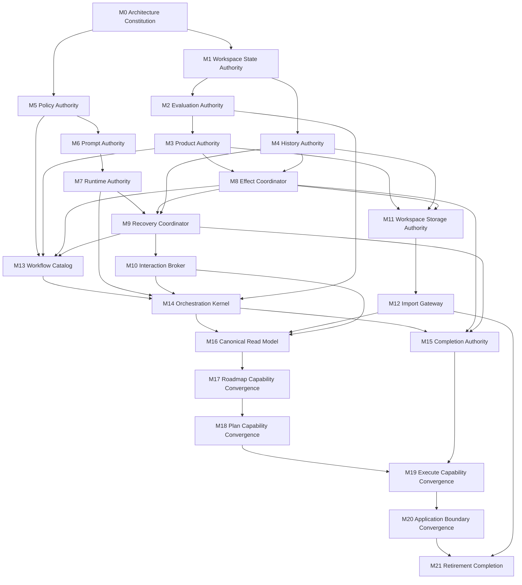

# Canonical Architecture Convergence Program

Version: 2.0 (supersedes v1; v1 retrievable from git history)
Status: ratified by owner review, 2026-07-10
Posture: pre-MVP, high-pace greenfield, single operator, no external consumers
Baseline convergence: Hybrid, 2.12/5 (42%) — per the three root audits, approved
Target: one canonical architecture, legacy-free, in every subsystem

## 0. How This Program Runs

This document and the code are the only durable artifacts. Everything else produced
during execution — scorecards, P-level tracking, verification notes, crosswalks,
proof checklists — is an ephemeral epic-scoped instrument that agents maintain to
hold themselves to the spirit of this program and that is discarded when the epic
closes.

Rigor is executed, not institutionalized:

- Agents perform best-effort verification of their own work during execution,
  pursuing the spirit of the convergence discipline (contract before behavior,
  behavior before routing, routing before retirement).
- There is no CI, no certification runner, no fixture corpus, no durable proof
  bundle, and no governance tooling. Holes surface through iteration.
- The owner is the sole acceptance authority. A milestone is done when the owner
  accepts it.
- Semantic content (contracts, invariants, ownership) lives in this document and
  in code structure. Operational enforcement is agent practice plus owner review.
  Neither may masquerade as the other.

## 1. Executive Summary

LoopRelay converges from a hybrid system into one canonical automation
architecture: a single application boundary backed by one orchestration kernel,
one versioned workflow catalog, one workspace state authority, one product
lifecycle, one evidence history, one effect protocol, one recovery protocol, one
completion authority, one interaction model, and a one-way import boundary for
the owner's existing workspaces.

The program is organized by architectural authority dependencies, not by
projects or directories. Each milestone establishes one durable capability as a
vertical slice: contract stated, behavior routed through the authority, evidence
produced through the production boundary, owner acceptance obtained.

Legacy behavior is executable specification: it documents intent worth
consulting while the canonical owner is built. It is not a fallback authority
and receives no new behavior. Each legacy body is deleted when its convergence
milestone completes and the owner accepts; git history is the recovery path.

The global sequence:

```text
Ratify decisions (done for most; residue resolved in-flow)
  -> durable workspace identity and state
  -> evaluation, product, and history authority
  -> policy, prompt, and runtime authority
  -> effect, recovery, and interaction authority
  -> storage and import
  -> universal catalog, kernel, completion, and read model
  -> converge Roadmap, Plan, and Execute through those authorities
  -> one application boundary
  -> retire legacy and accept the end state
```

## 2. Baseline

### 2.1 Baseline scorecard (approved)

| Subsystem | Weight | Baseline | Principal convergence blocker |
|---|---:|---:|---|
| Application boundary | 5% | 4/5 | Historical deployable surfaces remain |
| Workflow catalog | 8% | 3/5 | Duplicate access paths and legacy workflow specifications remain |
| Resolution and chaining | 7% | 4/5 | Explainability and structured human-action evidence incomplete |
| Transition execution | 10% | 3/5 | Hidden workflow sequencing and live-session dependencies remain |
| Products, gates, and evaluation | 8% | 3/5 | Representation and validation ownership incomplete |
| Persistence and history | 12% | 1/5 | Competing state and history representations remain |
| Effects, publication, and Git | 8% | 2/5 | Effects declared without durable execution and reconciliation |
| Recovery and resume | 10% | 1/5 | No universal attempt/unknown-outcome/restart/cancellation protocol |
| Completion | 7% | 2/5 | Blocked and failed conflated; closure split |
| Storage and compatibility | 8% | 1/5 | Data movement and verification incomplete |
| Prompt and policy authority | 5% | 2/5 | Policy sources and prompt composition distributed or bypassed |
| Runtime and operability | 5% | 1/5 | Operational wrappers bypassed |
| Human interaction and explainability | 3% | 1/5 | Required actions are not durable interaction objects |
| Behavioral certification | 4% | 2/5 | Behavior proven only through legacy owners |
| **Weighted total** | **100%** | **2.12/5 (42%)** | |

Score tracking during execution is an ephemeral instrument. The hard metrics in
§5.3 are the north star.

### 2.2 Behavioral classification

Legacy Roadmap, Plan, and Execute implementations remain compiled and are
outside production reachability. They contain unique behavioral specification
(rigor rules, lifecycle, storage, blockers, recovery, review, completion) that
agents consult as the spec of intent while implementing canonical behavior.
Nothing disappears implicitly: each behavior is preserved, intentionally
changed, or intentionally retired, with the owner as judge. Disputed semantics
are listed as open decisions in §10 and resolved in-flow.

## 3. Canonical End-State Vision

1. Operators and automation use one application boundary. Clients submit
   commands and queries, render canonical read models, forward cancellation,
   and map typed outcomes; they do not own orchestration.
2. A single versioned workflow catalog declares Traditional Roadmap, Evaluation
   Roadmap, Plan, and Execute in terms of products, gates, policies, declared
   filesystem input/output surfaces, effects, recovery semantics, successors,
   and terminal outcomes.
3. A single orchestration kernel interprets every workflow through the same
   lifecycle from observation through gate evaluation, attempt recording,
   execution, validation, product handling, state transition, effect
   reconciliation, and evidence emission.
4. One logical workspace state authority owns mutable orchestration state,
   stable identities, attempts, sessions, history, effects, blockers, recovery,
   interactions, and schema evolution.
5. Collaboration files (hand-editable planning artifacts under `.agents/**`)
   are **filesystem-authoritative**. Content is read from disk at the moment it
   is consumed; later edits affect only the next read. Every read records a
   provenance receipt: git commit, per-file content hash, and input-surface
   tree hash. A uniform clean-input gate guarantees every read resolves to a
   commit. System-owned facts (journals, ledgers, archives, evidence) are
   ledger-authoritative; files carrying them are exports, never inputs.
6. Completed, waiting, blocked, failed, cancelled, stalled, ambiguous, and
   recovery-required outcomes remain distinct through execution, persistence,
   status, and client exit mapping.
7. Publication, repository mutation, archive, export, and other external work
   are ordered, journaled, idempotent effects. Unknown outcomes are reconciled
   before retry. Commits of written surfaces are blocking at step boundaries;
   pushes are required-but-asynchronous and must complete before closure.
8. Recovery starts from durable evidence and can resume, fork, reconcile,
   retry, compensate, wait, block, or request a human decision without
   requiring an undiscoverable live object.
9. The owner's existing workspaces enter the canonical model through explicit
   one-way import. Runtime never silently falls back to a legacy source after
   import.
10. Every architectural decision is explainable by authority, causal evidence,
    conflicts, uncertainty, and required human action.
11. Every production behavior has exactly one owner.
12. The final repository contains no compiled historical workflow authority and
    no unowned runtime asset.

## 4. Guiding Principles

1. **Authority before behavior routing.** Establish the canonical contract and
   sole owner before routing behavior through it.
2. **Architecture before retirement.** Authority, then behavior, then routing,
   then retirement. Deletion is an outcome of convergence plus owner
   acceptance, never a milestone objective.
3. **One behavior, one owner.** Zero owners and multiple owners are defects.
4. **Universal mechanics, declarative workflows.** Workflows declare products,
   gates, policies, surfaces, effects, and recovery. Scheduling, persistence,
   retry, chaining, interaction, and dispatch are universal mechanics.
5. **Durable causal identity.** Attempts, sessions, turns, products, effects,
   recovery actions, and interactions are linked by stable identity.
6. **Effects are not state claims.** Required effects have journaled intent,
   idempotency, receipts, reconciliation, and typed failure behavior.
7. **Import is one-way.** Compatibility exists to move the owner's supported
   inputs into the canonical model. No runtime fallback, dual write, or silent
   merge.
8. **Legacy is executable specification.** Consult it; never extend it; delete
   it on milestone acceptance.
9. **Verification is part of execution.** Agents verify their own work
   best-effort as they build, through the production composition where
   practical. Judgment-based evaluation is first-class: agent-executed
   verdicts are recorded with their evidence; no purity or replayability
   mandate.
10. **Invariants are design rules.** The canonical invariants (audit §5) bind
    agent implementation choices. Exceptions surface to the owner; they are
    never buried in implementation.

## 5. Working Practice

### 5.1 Vertical slices over a live bridge

Each milestone completes one capability across contract, durable state,
behavior, production routing, and owner acceptance. Until M14, the existing
canonical nucleus — shared workflow catalog access, resolver, transition
runtime, controller, and chain runner — is the registered production routing
target and bridge for every earlier authority milestone. Each authority routes
production behavior through that nucleus as it is established; M14 replaces the
mechanics in place under a live system. The nucleus bridge retires at M14.

### 5.2 Structural guarantees (not per-workflow diligence)

- Every catalog step declares its filesystem **input surface** and **output
  surface**.
- The kernel evaluates the **clean-input gate** over each step's declared input
  surface: any dirty file in scope blocks the step. Interactive runs notify the
  operator and offer to commit the dirty files in scope as one grouped commit.
  Files outside every declared scope never block anything.
- The kernel auto-appends **commit (blocking) and push (required-async)
  effects** to every step that declares an output surface. Workflow authors
  cannot forget them because they do not write them.
- **Headless invariant:** an unattended run must never encounter unexpected
  dirty input. If it does, the system has failed — the gate yields a typed
  system-fault outcome (evidence of a write outside the effect protocol),
  never an auto-commit and never an indefinite wait.
- Declared input surfaces double as the read-scope boundary for step execution.

### 5.3 North-star metrics

Tracked ephemerally during epics; these are the directions that matter:

| Metric | Final target |
|---|---:|
| Behaviors with zero or multiple owners | 0 |
| Production orchestration kernels | 1 |
| Production workflow catalogs | 1 |
| Logical authoritative mutable stores | 1 |
| Direct external effects outside the Effect Coordinator | 0 |
| Workflow-specific persistence/retry/recovery paths | 0 |
| Behavior reachable only through legacy owners | 0 |
| Unowned runtime or generated assets | 0 |

### 5.4 Entropy budget

Every milestone leaves a measurable reduction in at least one dimension:
duplicate authorities, orchestration paths, authoritative stores, direct effect
paths, workflow-local recovery, hidden policy sources, unowned assets.
Temporary complexity requires a named owner and a removal condition.

## 6. Dependency Graph and Phases



| Phase | Milestones | Outcome |
|---|---|---|
| 1. Constitution | M0 | Ownership and open decisions written down; debris deleted |
| 2. Foundations | M1–M6 | State, evaluation, products, history, policy, prompts singular |
| 3. Runtime | M7–M10 | Execution, effects, recovery, interaction durable and restart-safe |
| 4. Storage and Import | M11–M12 | Storage truthful; owner workspaces imported one-way |
| 5. Kernel | M13–M16 | One catalog and kernel decide behavior; one completion and read model explain it |
| 6. Behavioral Convergence | M17–M19 | Roadmap, Plan, Execute canonical end to end |
| 7. Boundary and Retirement | M20–M21 | One surface; legacy deleted; owner acceptance |

Open decisions (§10) are resolved by owner prose ruling at the moment the
gating milestone is being specified. No dedicated decision sessions.

## 7. Milestones

Each milestone below records: the permanent property it establishes, what
becomes impossible afterward, key contracts, decisions already encoded, and a
verification brief — the concerns the executing agents attend to best-effort
during implementation.

### M0 — Architecture Constitution

**Permanent property:** every production behavior has an explicit owner; this
document is the sole source of ownership and convergence rules.

**Impossible afterward:** introducing behavior without a named authority;
invisible architecture exceptions.

**Scope:** write the authority ownership map into this document (which
authority owns which behavior family); confirm the nucleus bridge registration;
delete declaration-only debris identified by the orphaned-code audit after
confirming it carries no product intent.

**Encoded decisions:** rigor is ephemeral practice (§0); the headless invariant
(§5.2); durable = planning docs + code.

**Verification brief:** every behavior family in the audits maps to exactly one
target authority; debris deletion breaks no build or intent.

### M1 — Workspace State Authority

**Permanent property:** all mutable orchestration state has one logical
transactional owner and one stable causal identity model.

**Impossible afterward:** two stores claiming current orchestration truth; a
projection outranking canonical state; orchestration facts without stable
identity.

**Contracts:** atomic transitions; stable workspace/run/workflow/transition/
attempt/session/turn identities; monotonic schema evolution; no authoritative
sidecar.

**Encoded decisions:** orchestration state lives in the existing SQLite-backed
store (replaceable mechanism, not an authority); collaboration file *content*
is out of scope here — it is git-authoritative (§3.5); one active run per
workspace is the working assumption (concurrency deferred).

**Open at spec time:** the identity model is the most irreversible artifact in
the program — the owner rules on it when this milestone is specified.

**Verification brief:** atomicity, restart, identity stability, and
current-read consistency through the production composition.

### M2 — Evaluation Authority

**Permanent property:** every product and gate decision flows through one typed,
evidence-bearing evaluation model.

**Impossible afterward:** prompt transport success completing a transition;
blocked and failed collapsing; a gate deciding without naming requirements and
evidence.

**Contracts:** Satisfied / Unsatisfied / Blocked / Waiting / Invalid / Ambiguous
gate outcomes; requirement-level evidence; explicit conflicts, uncertainty, and
remediation.

**Encoded decisions:** evaluation may be **agent-executed** — long-horizon
automation is implicitly agent-judged; the verdict and its evidence are
recorded; no purity or replayability mandate. The clean-input gate (§5.2) is a
standard requirement kind evaluated here.

**Open at spec time:** the gate-outcome ↔ workflow-outcome mapping (six gate
outcomes vs. eight workflow outcomes) — owner rules when specified.

**Verification brief:** valid/invalid/blocked/waiting/ambiguous behave
distinctly end to end; provider or prompt success alone can never promote
state.

### M3 — Product Authority

**Permanent property:** every consumed product is identified, validated, and
retrievable exactly as consumed.

**Impossible afterward:** "latest file wins" ambiguity across *representations*
(file vs. row vs. archive); consuming content that cannot later be retrieved;
downstream behavior branching on which workflow produced an equivalent product.

**Contracts:** product identity and schema version; **read-at-use semantics**
— content is read from disk at consumption; **read receipts** record commit,
per-file content hashes, and input-surface tree hash; validation results link
to receipts; passive staleness (a consumer can see that its input has since
changed); producer-neutral consumption.

**Encoded decisions:** hand-editable collaboration artifacts are
filesystem-authoritative — there is **no candidate/promotion content store**
(judged no-op at best, distortion at worst). Product bodies live in git; the
clean-input gate guarantees every read resolves to a commit. The per-type
split: planning artifacts are inputs (git-authoritative); system-owned facts
are ledger-authoritative (M4).

**Verification brief:** every consumption produces a receipt; receipts resolve
to exact content via git; staleness is visible; no alternate representation is
ever selected as authority.

### M4 — History Authority

**Permanent property:** all orchestration facts share one append-only, causally
ordered evidence history.

**Impossible afterward:** execution writing history completion cannot read; a
numbered file or console log acting as history; corrections erasing prior
evidence.

**Contracts:** append-only facts; superseding corrections; canonical ordering;
stable evidence identity; causal lineage; read receipts stored here;
projections always derived.

**Verification brief:** execution-to-completion history parity; corrections
supersede rather than erase; every decision links to durable evidence.

### M5 — Policy Authority

**Permanent property:** every attempt executes under one resolved, versioned
policy with provenance.

**Impossible afterward:** a configured value with no production effect; a
provider or workflow silently choosing its own policy; two consumers in one
attempt observing different policy.

**Contracts:** single resolution per attempt; layered provenance capped at
three layers (built-in defaults → workspace config → invocation overrides);
validation and conflict handling; versioned policy identity.

**Encoded decisions (D3 — resolved):** telemetry retention/export, usage-limit
wait/retry, input-wait reporting, and runtime prerequisite diagnostics are all
**product intent: active and functional**. The bypassed wrappers get
reconnected through this authority and the Runtime Authority — none are
retired.

**Verification brief:** a configured value is either demonstrably effective or
explicitly rejected; every attempt records one policy identity.

### M6 — Prompt Authority

**Permanent property:** every production prompt is versioned, owned,
policy-complete, and reproducible.

**Impossible afterward:** unowned prompt assets in production; hidden appended
instructions; policy affecting a prompt without changing its recorded identity.

**Contracts:** prompt identity/version/hash; declared variables; explicit
policy sections; rendered provenance that **embeds the read receipts of every
collaboration file that fed the prompt** — any agent invocation is reproducible
from (prompt version, policy identity, input commits and hashes).

**Open at spec time (from D6):** prompt-policy profiles per workflow; retain or
retire the audited unused-but-substantial prompts.

**Verification brief:** zero unowned prompt assets; rendered output is a pure
function of recorded identity and inputs.

### M7 — Runtime Authority

**Permanent property:** all agent execution is capability-negotiated,
policy-bound, and normalized into durable evidence.

**Impossible afterward:** a workflow branching on provider identity; a provider
silently reinterpreting policy; missing capability triggering unrecorded
fallback.

**Contracts:** stable session/turn identity; capability negotiation; one-shot
and persistent execution; resume/read/fork policy; normalized diagnostics;
usage evidence; cancellation.

**Encoded decisions (D5 — resolved):** **Codex is the sole supported provider
at this stage.** The gateway contract remains provider-neutral so future
providers are additive, but no multi-provider fallback policy exists: a missing
capability yields a typed blocked outcome. Operational behaviors selected in D3
compose here.

**Verification brief:** every run records its effective specification before
launch; capability gaps produce typed outcomes; no direct provider calls remain
outside the gateway.

### M8 — Effect Coordinator

**Permanent property:** every required external mutation is durable, ordered,
idempotent, and receipted.

**Impossible afterward:** publication recorded complete without execution;
duplicate invocation creating duplicate semantic effects; retrying unknown
outcomes before reconciliation.

**Contracts:** declared trigger, inputs, ordering group, idempotency key,
expected postcondition, retry, reconciliation, receipts.

**Encoded decisions:** kernel-inserted **commit effects are blocking** at the
step boundary (provenance-critical, local, cheap); **push effects are
required-but-asynchronous** — journaled, retried, reconciled, visible while
pending; closure cannot complete while required effects are outstanding.

**Verification brief:** success/failure/unknown behave distinctly; restart
between ordered effects; duplicate invocation yields one semantic mutation;
journal receipts match actual repository mutations exactly (the headless
invariant's detector).

### M9 — Recovery Coordinator

**Permanent property:** every interruption and uncertain outcome has one
durable, evidence-based recovery plan.

**Impossible afterward:** restart requiring an undiscoverable live session;
unknown work blindly repeated; cancellation collapsing into generic failure.

**Contracts:** not-started / in-flight / succeeded-uncommitted / failed /
cancelled / unknown / partially-effected classification; reconcile / resume /
fork / retry / compensate / wait / block / human-decision plans; lineage
recorded before action.

**Encoded decisions:** commit-per-step-boundary (§5.2) means durable git state
exists at every boundary — recovery classifies from receipts and the ledger.

**Open at spec time (from D6):** cancellation salvage semantics.

**Verification brief:** restart at every durable boundary; cancellation
preserves observed evidence; unknown is never treated as not-started.

### M10 — Interaction Broker

**Permanent property:** every required human action is a durable, typed request
with a validated response and resume path.

**Impossible afterward:** status claiming action is required without a request
identity; progression depending on direct console input; restart losing an
outstanding human decision.

**Contracts:** typed request identity, category, question, response shape,
deadline, default policy, correlation, timeout, waiting, blocking, resume.

**Encoded decisions:** the clean-input **offer-to-commit is the first concrete
request type** (interactive runs only; headless runs fault instead — §5.2).

**Open at spec time (from D4):** timeout/default policy per request category;
isolation guarantee depth; whether trust evidence is an audit product.

**Verification brief:** requests survive restart; late/invalid/duplicate
responses handled; workflows never consume console input directly.

### M11 — Workspace Storage Authority

**Permanent property:** storage operations are truthful — they do what they
say, report what they did, and never mutate during verification.

**Impossible afterward:** verification that repairs; import/export/migrate/sync
reporting work that did not occur; mutation beginning while authority is
ambiguous.

**Contracts:** read-only verification; explicit mutation commands; semantic
round-trip for exports; conflict/corruption/unsupported-version handling;
durable migration plans.

**Encoded decisions (D2 — scoped):** no external consumers exist. Scope is the
owner's own workspaces plus export as a projection effect. No support windows,
usage thresholds, or deprecation machinery.

**Verification brief:** verify is read-only; every mutation is truthfully
reported; interrupted mutation recovers.

### M12 — Import Gateway

**Permanent property:** the owner's existing workspaces cross one explicit,
one-way boundary into canonical authority.

**Impossible afterward:** runtime reading a legacy source after import; an
import adapter becoming an alternate store or workflow authority.

**Contracts:** detection without mutation; migration preview; explicit import
transaction; semantic verification and receipt; legacy marked non-authoritative
after import.

**Encoded decisions (D2 — resolved):** **existing workspaces are imported**,
not regenerated. The portfolio is exactly: the owner's pre-unification roadmap
state, partial planning artifacts, decision sessions, histories, and completion
archives — imported once, one-way. Conflicting or ambiguous state blocks with
an actionable report rather than guessing.

**Verification brief:** each owned workspace imports with semantic fidelity the
owner accepts; post-import execution is canonical-only.

### M13 — Workflow Catalog

**Permanent property:** all workflow intent is expressed once as immutable,
versioned, validated declarations.

**Impossible afterward:** adding a workflow requiring a private runner or
selector; duplicate catalogs disagreeing about stages, successors, effects, or
recovery.

**Contracts:** stable workflow/stage/transition/product/gate/effect/policy/
recovery identities; **declared filesystem input and output surfaces per
step** (§5.2); entry and exit contracts; successors; terminal outcomes;
capability requirements. Production fails closed on an invalid catalog.

**Encoded decisions:** contract versioning is liberal pre-MVP — semantic
changes cut cheap new versions; no migration ceremony until there are users.

**Verification brief:** all supported workflows resolve from one catalog;
extension requires no kernel branching.

### M14 — Orchestration Kernel

**Permanent property:** every workflow transition executes through one
universal, product-driven, evidence-complete lifecycle.

**Impossible afterward:** a workflow-specific runner acquiring progression
authority; a client selecting or advancing workflow state; a transition
bypassing attempt recording, evaluation, effects, recovery, or evidence.

**Contracts:** observe → resolve → gate (including clean-input) → record intent
→ render/execute → record raw result → validate → state-commit → enqueue and
reconcile effects (including auto-inserted commit/push) → emit evidence and
read model. Typed outcome propagation; product-driven chaining.

**Encoded decisions:** this milestone retires the nucleus bridge (§5.1) —
mechanics are replaced in place under a live system.

**Verification brief:** lifecycle success and every non-success outcome;
restart at each durable boundary; prompt completion never directly completes
workflow state.

### M15 — Completion Authority

**Permanent property:** completion is one typed, evidence-complete decision
followed by one recoverable closure plan.

**Impossible afterward:** blocked completion reported as failure or success;
archive or publication failure reported as completed closure; two services
independently deciding an epic is complete.

**Contracts:** validated inputs; required non-implementation review; typed
certificate/block/failure; one closure transaction; ordered closure effects
(closure waits for required async pushes); cleanup and recovery semantics.

**Open at spec time (from D6):** legacy block/failure conflation mapping;
resume cleanup semantics.

**Verification brief:** certified, blocked, failed, cancelled, and
recovery-required cases stay distinct through to client exit codes; closure is
idempotent.

### M16 — Canonical Read Model

**Permanent property:** the client receives one evidence-linked explanation of
state, authority, policy, pending work, and required action.

**Impossible afterward:** console-only text as sole operational truth; a
blocker, pending effect, recovery action, import conflict, or human request
invisible to status.

**Contracts:** selected workflow/stage/transition; gates; blockers; attempts;
pending effects (including pending pushes); recovery lineage; interaction
requests; conflicts and uncertainty rendered rather than guessed away.

**Verification brief:** every state and action traces to stable evidence; the
CLI renders canonical facts and nothing else.

### M17 — Roadmap Capability Convergence

**Permanent property:** both roadmap intents produce the same validated,
producer-neutral prepared products through canonical authorities alone.

**Impossible afterward:** downstream planning depending on which roadmap intent
produced equivalent products; roadmap work requiring the legacy state machine
or storage coordinator.

**Scope:** the legacy Roadmap body is the broadest executable specification in
the repo — rigor, lifecycle, storage, migration, blockers, recovery. Agents
consult it as the spec of intent; the owner judges preservation.

**Open at spec time (from D6):** full-roadmap generation intent; roadmap
prompt-policy profile.

**Verification brief:** both intents produce the same downstream contract; new
roadmap work and recovery use only target authorities. On owner acceptance,
**delete the legacy Roadmap body.**

### M18 — Plan Capability Convergence

**Permanent property:** planning produces complete, validated readiness
products and executes all required publication effects through canonical
authorities.

**Impossible afterward:** Plan claiming publication or parent recording without
executing the effects; restart after authoring requiring a lost live session.

**Scope:** warm authoring, adversarial review, revision, scoped mutation and
rollback, validation, milestone semantics, publication, parent repository
recording.

**Open at spec time (from D6):** restart behavior where Codex capabilities
differ from what legacy Plan assumed.

**Verification brief:** required planning products exist before readiness;
publication effects execute and reconcile; restart never requires an
undiscoverable session. On owner acceptance, **delete the legacy Plan
pipeline.**

### M19 — Execute Capability Convergence

**Permanent property:** execution remains correct, recoverable, idempotent, and
explainable from readiness through certified completion across every
interruption boundary.

**Impossible afterward:** unknown implementation work repeated without
reconciliation; implementation-to-handoff restart failing because a live
session vanished; review, publication, stall, or completion bypassing the
canonical outcome and effect model.

**Scope:** decision routing, implementation, handoff, publication, repository
evaluation, stall handling, review, certified completion — the highest-risk
workflow; commit-per-step-boundary materially de-risks its restart semantics.

**Open at spec time (from D6):** first-run sequencing; review order.

**Verification brief:** restart after every external boundary; cancellation
and salvage; blocked completion distinct at the client. On owner acceptance,
**delete the old execution loop.**

### M20 — Application Boundary Convergence

**Permanent property:** the CLI invokes the same application commands, queries,
outcomes, and read models for everything.

**Impossible afterward:** the client reaching an alternate workflow or store;
client dispatch changing workflow selection; equivalent commands producing
different outcomes by surface.

**Scope:** one composition root; delete historical entrypoints; CLI renders
read models and maps typed exit codes; no old-command migration aids (no
users).

**Verification brief:** command and query matrix through the one boundary;
typed exit mapping; no client-side state or effect authority.

### M21 — Retirement Completion

**Permanent property:** exactly one canonical architecture remains; removing
legacy changed no supported behavior.

**Scope:** confirm every legacy body eligible under M17–M19 is deleted; delete
expired import adapters whose workspaces are imported; sweep for unowned
assets; owner walks the acceptance review (§11).

**Verification brief:** full build and test pass post-deletion; north-star
metrics (§5.3) at final targets; nothing plausible remains as a second place to
change production behavior.

## 8. Import Strategy

```text
Read-only detection
  -> version and conflict identification
  -> migration preview
  -> explicit one-way import transaction
  -> semantic verification and receipt
  -> legacy marked non-authoritative
  -> adapter deleted once its workspaces are imported
```

Verification never repairs. Import never silently merges. Runtime never falls
back after import. Export is a projection effect and cannot create shared
authority. Scope is the owner's own workspaces only (D2).

## 9. Retirement

Delete each legacy body when its convergence milestone completes and the owner
accepts. Git history is the recovery path if a deletion proves premature.
Shared remnants (persistence helpers, trust, sandbox, diagnostics, prompt
assets) are evaluated by their last canonical consumer — they do not retire
merely because a workflow body did. Declaration-only debris goes at M0.

## 10. Decisions

### Resolved (encoded in the milestones above)

| Decision | Ruling |
|---|---|
| Collaboration file authority | Filesystem-authoritative; read-at-use; no promotion store |
| Provenance | Commit + content hash + input-surface tree hash per read |
| Clean-input gate | Uniform, per-step declared input surface (blast radius); grouped offer-to-commit interactively |
| Output surfaces | Declared; kernel auto-inserts blocking commit + required-async push |
| Headless invariant | Unexpected dirty input in unattended runs = typed system fault |
| D2 compatibility scope | No external consumers; **owner workspaces are imported**, one-way, once |
| D3 operational policy | Telemetry, quota wait/retry, input-wait reporting, prerequisites: **all active and functional**, reconnected through Policy/Runtime authorities |
| D5 providers | **Codex only**; provider-neutral gateway contract retained; capability gaps block with typed outcomes |
| D7 physical topology | Product bodies in git; orchestration state in the existing SQLite-backed store (replaceable); one deployable; concurrency deferred (one active run per workspace) |
| Rigor posture | Ephemeral epic-scoped instruments; agent best-effort verification; owner is acceptance authority; no CI, fixtures, cert tooling |
| Evaluation | Agent-executed judgment is first-class; verdicts + evidence recorded; no purity mandate |

### Open — resolved by owner prose ruling when the gating milestone is specified

| Item | Gates |
|---|---|
| Identity model (workspace/run/workflow/transition/attempt/session/turn) | M1 |
| Gate-outcome ↔ workflow-outcome mapping | M2 |
| Prompt-policy profiles; unused-prompt retain/retire | M6 |
| Cancellation salvage semantics | M9 |
| Interaction timeout/default policy; isolation depth; trust evidence disposition | M10 |
| Completion block/failure mapping; resume cleanup | M15 |
| Full-roadmap generation intent; roadmap prompt-policy profile | M17 |
| Plan restart semantics under Codex capabilities | M18 |
| First-run sequencing; review order | M19 |

## 11. End-State Acceptance

The program is complete when the owner walks this review and accepts:

1. **Authority:** one registered owner per behavior; one boundary, one kernel,
   one catalog; no historical implementation remains a plausible place to
   change production behavior.
2. **Behavior:** both roadmap intents converge; Plan consumes their products
   and publishes; Execute reaches typed, certified completion through durable
   decision, implementation, handoff, effect, review, and recovery semantics.
3. **State and effects:** one state/history owner; every read has a receipt
   resolving to exact content; every required mutation journaled and
   reconciled; restart and cancellation preserve evidence everywhere.
4. **Policy and runtime:** one resolved policy and prompt identity per attempt;
   Codex capability gaps produce typed outcomes; operational behaviors (D3)
   demonstrably active.
5. **Import:** owner workspaces imported one-way with accepted fidelity; no
   runtime fallback; adapters deleted.
6. **Repository:** legacy bodies deleted; no unowned assets; full build and
   tests pass after deletion.

At that point, retirement is not a cleanup claim — it is the observable
consequence of a proven single-authority architecture.
