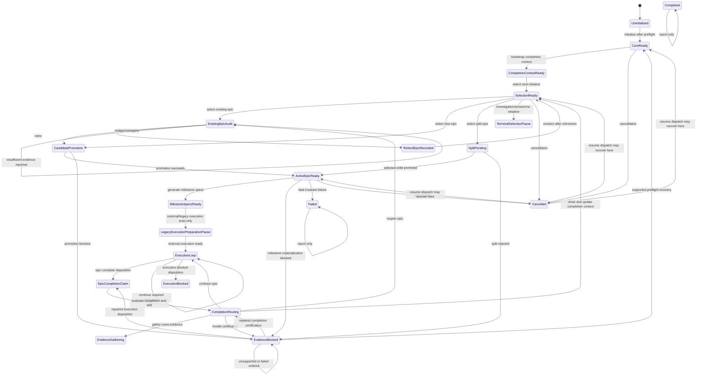

# Secondary State Machine Audit

## Recover the Canonical Machine

Scope: this report recovers the conceptual state machine implemented by `LoopRelay.Roadmap.Cli`. It treats the current implementation as evidence, not as the conceptual boundary. It assumes the primary implementation audit is accurate.

Core evidence:

- The durable state surface is `RoadmapState`, `RoadmapStateDocument`, `RoadmapTransitionSummary`, `RoadmapTransitionIntent`, and `TransitionStatus` (`src/LoopRelay.Roadmap.Cli/RoadmapState.cs:3`, `src/LoopRelay.Roadmap.Cli/RoadmapStateDocument.cs:3`, `src/LoopRelay.Roadmap.Cli/RoadmapStateDocument.cs:41`).
- Runtime command authority starts in `RoadmapStateMachine.ExecuteAsync`, then splits into `status`, `run`, and `unblock` (`src/LoopRelay.Roadmap.Cli/RoadmapStateMachine.cs:35`).
- Startup and resume are separate route authorities (`src/LoopRelay.Roadmap.Cli/RoadmapStartupPlanner.cs:5`, `src/LoopRelay.Roadmap.Cli/RoadmapResumePlanner.cs:14`).
- Prompt-backed transition contracts are centralized in `PromptContractRegistry` (`src/LoopRelay.Roadmap.Cli/PromptContractRegistry.cs:13`-`src/LoopRelay.Roadmap.Cli/PromptContractRegistry.cs:22`).
- The main transition executor has 24 direct `SaveStateAsync(...)` call sites and a 1,983-line state-machine file (`src/LoopRelay.Roadmap.Cli/RoadmapStateMachine.cs:165`, `src/LoopRelay.Roadmap.Cli/RoadmapStateMachine.cs:1718`).
- Recovery is keyed by persisted transition-intent strings (`src/LoopRelay.Roadmap.Cli/RoadmapUnblockPlanner.cs:42`).

The discovered machine is a strategic-roadmap workflow that repeatedly turns project context and roadmap source into a ready active epic, then into milestone specs, then pauses before execution preparation. It still carries a legacy execution/completion submachine: execution states are present and partially supported by evidence interpreters and completion certification, but current Roadmap CLI resume planning does not advance the legacy execution-preparation states.

## Deliverable 1: Canonical State Inventory

### S0. Uninitialized Workflow

- Merged implementation states: no persisted `RoadmapStateDocument`.
- Purpose: represent absence of durable roadmap state.
- Entry conditions: `.agents/state.json` is absent and legacy `.agents/state.md` cannot provide a migrated state.
- Owned artifacts: none yet.
- Invariants: project context must be loadable before it can leave this state.
- Expected outputs: `CoreReady` state document after successful run preflight.
- Completion condition: project context and prompt-contract snapshot are emitted, then core readiness is persisted.

### S1. Core Ready

- Merged implementation states: `CoreReady`.
- Purpose: record that base project context preflight has succeeded and the roadmap workflow can inspect or bootstrap strategic context.
- Entry conditions: fresh initialization, successful preflight recovery, or cancelled workflow recovery to core.
- Owned artifacts: `.agents/state.json`, `.agents/contracts/prompt-contracts.md`.
- Invariants: current project context is valid; prompt contracts can be emitted; no prompt output is required yet.
- Expected outputs: either a roadmap completion context or direct selection if that context already exists.
- Completion condition: roadmap completion context is present and usable.

### S2. Roadmap Completion Context Ready

- Merged implementation states: `BootstrapRoadmapCompletionContext`, `RoadmapCompletionContextReady`.
- Purpose: hold the strategic memory used to choose the next roadmap initiative.
- Entry conditions: `CreateRoadmapCompletionContext` prompt completes and `.agents/core/roadmap-completion-context.md` is written, or the artifact already exists.
- Owned artifacts: `.agents/core/roadmap-completion-context.md`; optional completed-epic input evidence from `.agents/archive/epics/*.md`.
- Invariants: completion context exists; projection for `CreateRoadmapCompletionContext` is valid and fresh when generated; lifecycle is ready.
- Expected outputs: a selection decision.
- Completion condition: `SelectNextEpic` is runnable with completion context and roadmap source.

### S3. Selection Decision Ready

- Merged implementation states: `SelectNextStrategicInitiative`.
- Purpose: hold the current selected next initiative and branch the machine.
- Entry conditions: `SelectNextEpic` prompt completes, writes `.agents/selection.md`, records selection evidence, records selection provenance, and appends a decision ledger entry.
- Owned artifacts: `.agents/selection.md`, `.agents/evidence/selection/*`, `.agents/selection-provenance-manifest.json`.
- Invariants: selection belongs to the current selection cycle; roadmap completion context and roadmap source are current; retired-epic state is included in provenance.
- Expected outputs: one of six accepted outcomes: existing epic, new intermediary epic, split epic, strategic investigation, roadmap revision, or no suitable initiative.
- Completion condition: selection is either consumed into an active-epic branch or persisted as a terminal pause.

### S4. Terminal Selection Pause

- Merged implementation states: `StrategicInvestigationRequired`, `RoadmapRevisionRequired`, `NoSuitableInitiative`.
- Purpose: stop when the selector says the machine should not author or prepare an epic.
- Entry conditions: selection parser accepts one of the terminal selection outcomes.
- Owned artifacts: selection artifact, decision ledger entry, durable state.
- Invariants: state is report-only; `run` does not continue it.
- Expected outputs: status text and blockers/next valid transitions if any.
- Completion condition: external roadmap change or manual state repair makes selection runnable again.

### S5. Existing Epic Under Audit

- Merged implementation states: `ExistingEpicSelected`, `EpicPreparationAudit`.
- Purpose: validate an existing roadmap epic before making it active.
- Entry conditions: selection outcome is `Select Existing Epic`; `EpicPreparationAudit` runs against the selected epic evidence.
- Owned artifacts: `.agents/evidence/audits/*`, decision ledger entry.
- Invariants: selection must still be fresh; audit output must parse into one of `Realign`, `Reimagine`, `Retire`, or `Insufficient Evidence`.
- Expected outputs: retire decision, rewrite decision, or evidence insufficiency.
- Completion condition: branch is taken into retirement, rewrite/promotion, or an error path.

### S6. Retired Epic Recorded

- Merged implementation states: `RetireEpic`.
- Purpose: record that a selected existing epic should be excluded from future selection cycles.
- Entry conditions: audit disposition is `Retire`.
- Owned artifacts: retired-epic records inside state document; audit evidence; decision ledger entry; superseded selection provenance.
- Invariants: retired epic must have a stable identity; selection provenance is invalidated because retired-epic state changed.
- Expected outputs: updated retired-epics list and return to selection.
- Completion condition: selection is rerun with the retired epic excluded.

### S7. Candidate Epic Pending Promotion

- Merged implementation states: `NewEpicProposed`, `CreateNewEpic`, `RealignEpic`, `ReimagineEpic`.
- Purpose: hold model-authored candidate epic content until it is classified, validated, and promoted.
- Entry conditions: selection chooses new epic, or audit chooses realign/reimagine.
- Owned artifacts: prompt output in memory until promotion; blocker evidence if rejected; `.agents/epic.md` if promoted.
- Invariants: candidate must be promotable, structurally valid, and pass epic validation before overwriting active epic.
- Expected outputs: active epic or evidence blocker.
- Completion condition: candidate becomes `ActiveEpicReady` or `EvidenceBlocked`.

### S8. Split Family Pending Promotion

- Merged implementation states: `SplitEpicProposed`, `SplitEpic`, `SplitChildSelection`.
- Purpose: split a selected initiative into child epics, choose one child, and promote only that child.
- Entry conditions: selection outcome is `Select Split Epic`; `SplitEpic` output is extracted and interpreted.
- Owned artifacts: `.agents/epic-*.md` child drafts, `.agents/splits/split-family-*.json`, bundle manifest, blocker evidence if invalid.
- Invariants: bundle paths must be repository-safe split child paths; children must validate as epics; exactly one selected child is required; direct writes to `.agents/epic.md` are rejected before overwrite.
- Expected outputs: selected child promoted to `.agents/epic.md`, or split blocker evidence.
- Completion condition: selected child is promoted or split is blocked.

### S9. Active Epic Ready

- Merged implementation states: `ActiveEpicReady`.
- Purpose: represent the single active roadmap epic ready for milestone-spec generation.
- Entry conditions: successful promotion from create, realign, reimagine, or split child.
- Owned artifacts: `.agents/epic.md`, lifecycle entry marked `Ready`, promotion journal record.
- Invariants: active epic exists, validates structurally, and is the only ready/executing active epic.
- Expected outputs: milestone deep-dive spec bundle.
- Completion condition: milestone specs are materialized and proven fresh.

### S10. Milestone Specs Ready

- Merged implementation states: `GenerateMilestoneDeepDives`, `MilestoneSpecsReady`.
- Purpose: represent execution preparation at the point where milestone specs have been generated for the active epic.
- Entry conditions: `GenerateMilestoneDeepDivesForEpic` prompt completes, bundle is extracted, specs are written, provenance is recorded, and invariants pass.
- Owned artifacts: `.agents/specs/*.md`, `.agents/specs/bundle-manifest.md`, execution-preparation manifest, lifecycle entries.
- Invariants: specs are fresh with respect to active epic; each active spec belongs to `.agents/epic.md`; project context hash did not drift during the run.
- Expected outputs: paused Roadmap CLI state; no operational context or execution prompt is generated by current Roadmap CLI.
- Completion condition: report-only pause until another workflow advances execution preparation outside the current resume path.

### S11. Legacy Execution Preparation Pause

- Merged implementation states: `GenerateOperationalContext`, `OperationalContextReady`, `GenerateExecutionPrompt`, `ExecutionPromptReady`.
- Purpose: preserved execution-preparation chain: operational context, execution prompt, execution plan, and compatibility milestone artifacts.
- Entry conditions: legacy or external state persists these states; current Roadmap CLI resume classifies them as paused and no longer advances them.
- Owned artifacts: `.agents/operational_context.md`, `.agents/execution-prompt.md`, `.agents/plan.md`, `.agents/milestones/m*.md`, execution-preparation manifest.
- Invariants: active epic and specs must be fresh; execution prompt depends on operational context; compatibility artifacts depend on execution prompt.
- Expected outputs: status/report only in current Roadmap CLI.
- Completion condition: external execution-preparation authority or manual state repair, not current `run`.

### S12. Execution Loop Pause

- Merged implementation states: `ExecutionLoop`.
- Purpose: preserved state for an execution turn that may continue, complete, or block.
- Entry conditions: execution disposition route says `Continue Required`, or completion certification says `Continue Epic`.
- Owned artifacts: execution evidence and active epic lifecycle marked `Executing`.
- Invariants: active epic, specs, operational context, execution prompt, and compatibility artifacts must be fresh if execution is actually resumed.
- Expected outputs: execution disposition evidence.
- Completion condition: execution disposition routes to completion claim, continuation, or execution blocker.

### S13. Execution Blocked

- Merged implementation states: `ExecutionBlocked`.
- Purpose: report a domain execution blocker from execution disposition.
- Entry conditions: execution output validates as `Execution Blocked -> ResolveExecutionBlocker`.
- Owned artifacts: execution evidence, blockers in state, active epic lifecycle marked `Executing`.
- Invariants: blocker evidence must be preserved; current unblock planner has no deterministic handler for `ResolveExecutionBlocker`.
- Expected outputs: report-only pause.
- Completion condition: manual repair or future execution-blocker recovery support.

### S14. Epic Completion Claim

- Merged implementation states: `EpicCompletionDetected`.
- Purpose: hold a validated execution claim that the active epic may be complete and requires independent certification.
- Entry conditions: execution disposition validates as `Epic Complete -> EvaluateEpicCompletionAndDrift`.
- Owned artifacts: execution evidence path in transition intent/output.
- Invariants: execution evidence must be present; active epic and milestone specs must be fresh enough for certification.
- Expected outputs: completion evaluation evidence.
- Completion condition: `EvaluateEpicCompletionAndDrift` runs and enters completion routing.

### S15. Completion Certification Routing

- Merged implementation states: `CompletionEvaluationAndContextUpdate`.
- Purpose: parse and semantically validate completion evaluation, then route closure, continuation, reopening, or evidence gathering.
- Entry conditions: completion evaluation prompt output is written to `.agents/evidence/evaluations/*`.
- Owned artifacts: evaluation evidence, completion decision ledger entry, optional completed-epic synthesis and updated roadmap completion context.
- Invariants: completion evaluation must parse; closure recommendation must satisfy completion policy; route table must cover the recommendation.
- Expected outputs: one of close, close-with-follow-up, continue, reopen, gather more evidence, or invalid-certification blocker.
- Completion condition: route is persisted and lifecycle/context mutations are complete.

### S16. Evidence Gathering Pause

- Merged implementation states: `EvidenceGathering`.
- Purpose: pause when completion certification cannot close, continue, or reopen without more evidence.
- Entry conditions: completion route is `Gather More Evidence`.
- Owned artifacts: evaluation evidence and decision ledger entry.
- Invariants: state is report-only; next transition text includes evidence gathering and re-evaluation.
- Expected outputs: status/report only.
- Completion condition: additional evidence is supplied and certification is rerun outside the current automatic path.

### S17. Evidence Blocked Recovery

- Merged implementation states: `EvidenceBlocked`.
- Purpose: durable recoverable blocker state with evidence paths and transition intent.
- Entry conditions: prompt failure, projection block, promotion rejection, split rejection, milestone post-processing failure, invalid completion certification, invariant violation that is recoverable, or unblock review failure.
- Owned artifacts: `.agents/evidence/blockers/*`, sometimes `.agents/evidence/orchestration/*`, state blockers, transition intent.
- Invariants: blocker evidence must be preserved; transition intent names the intended recovery; unsupported intents remain report-only.
- Expected outputs: unblock review evidence or status report.
- Completion condition: supported unblock handler validates repaired evidence and persists a target state.

### S18. Cancelled

- Merged implementation states: `Cancelled`.
- Purpose: preserve enough information to resume after cancellation.
- Entry conditions: `OperationCanceledException` reaches `RunAsync`.
- Owned artifacts: state document with `ResumeCancelledTransition` intent and evidence paths parsed from interrupted output.
- Invariants: recovery dispatch state must be either prior current state or last transition source.
- Expected outputs: resume planning rewrites source to the recovery state.
- Completion condition: rerun plans from recovered dispatch state.

### S19. Failed

- Merged implementation states: `Failed`.
- Purpose: terminal failure state for invariant failures that cannot be safely represented as evidence-blocked, or already persisted fatal failures.
- Entry conditions: failure state returned by invariant validation is `Failed`, or legacy failure is persisted.
- Owned artifacts: orchestration evidence, transition journal, state blockers.
- Invariants: report-only until repaired; some legacy runtime recovery intent exists but current planner does not advance it.
- Expected outputs: status/report only.
- Completion condition: external repair and supported/manual state movement.

### S20. Completed Terminal

- Merged implementation states: `Completed`.
- Purpose: report an already completed workflow if such a state is persisted.
- Entry conditions: persisted state is `Completed`.
- Owned artifacts: state document.
- Invariants: report-only; `run` does not advance it.
- Expected outputs: completed outcome.
- Completion condition: none inside current Roadmap CLI.

Important merge note: `GenerateOperationalContext`, `OperationalContextReady`, `GenerateExecutionPrompt`, `ExecutionPromptReady`, and `ExecutionLoop` are not active Roadmap CLI states today. They are fossil states preserved by enum, validators, generators, and route tables, while `RoadmapResumePlanner` reports them as legacy pauses (`src/LoopRelay.Roadmap.Cli/RoadmapResumePlanner.cs:206`-`src/LoopRelay.Roadmap.Cli/RoadmapResumePlanner.cs:214`, `src/LoopRelay.Roadmap.Cli/RoadmapWorkflowStateClassifier.cs:10`-`src/LoopRelay.Roadmap.Cli/RoadmapWorkflowStateClassifier.cs:20`).

## Deliverable 2: Canonical Transition Inventory

| ID | Current State | Transition | Preconditions | Outputs | Next State |
|---|---|---|---|---|---|
| T01 | Any persisted state | Report status | `status` command; state can load | Console report of state, intent, blockers | Same state |
| T02 | Uninitialized | Initialize core | `run`; no state; project context preflight succeeds | State document, prompt contracts | Core Ready |
| T03 | Any report-only state | Report only | Startup classifier says blocked, terminal, completed, or failed | CLI outcome; no mutation | Same state |
| T04 | Core Ready | Bootstrap completion context | Completion context absent; projection valid/fresh | `.agents/core/roadmap-completion-context.md` | Roadmap Completion Context Ready |
| T05 | Completion Context Ready or Retired Epic Recorded | Select next initiative | Completion context and roadmap source ready; projection valid/fresh | Selection artifact, selection evidence, provenance, decision ledger | Selection Decision Ready |
| T06 | Selection Decision Ready | Select existing epic | Selection outcome is `Select Existing Epic` | Audit prompt execution begins | Existing Epic Under Audit |
| T07 | Selection Decision Ready | Select new intermediary epic | Selection outcome is `Select New Intermediary Epic` | Candidate epic prompt output | Candidate Epic Pending Promotion |
| T08 | Selection Decision Ready | Select split epic | Selection outcome is `Select Split Epic` | Split prompt output | Split Family Pending Promotion |
| T09 | Selection Decision Ready | Pause for strategic non-epic outcome | Selection outcome is strategic investigation, roadmap revision, or no suitable initiative | Decision ledger, terminal state | Terminal Selection Pause |
| T10 | Existing Epic Under Audit | Retire selected epic | Audit disposition is `Retire` | Retired epic record, superseded selection | Retired Epic Recorded |
| T11 | Existing Epic Under Audit | Rewrite existing epic | Audit disposition is `Realign` or `Reimagine` | Candidate active epic output | Candidate Epic Pending Promotion |
| T12 | Existing Epic Under Audit | Reject insufficient audit evidence | Audit disposition is `Insufficient Evidence` | Error report; no durable recovery state in current path | Prior durable state remains |
| T13 | Candidate Epic Pending Promotion | Promote active epic | Candidate classified promotable and validates | `.agents/epic.md`, lifecycle ready, journal | Active Epic Ready |
| T14 | Candidate Epic Pending Promotion | Block candidate promotion | Candidate blocked, malformed, ambiguous, or invalid | Blocker evidence, lifecycle blocked, recovery intent | Evidence Blocked Recovery |
| T15 | Split Family Pending Promotion | Materialize split and promote child | Bundle extraction and interpretation valid; selected child exists | Child drafts, split family, promoted active epic | Active Epic Ready |
| T16 | Split Family Pending Promotion | Reject split output | Bundle invalid, unsafe, blocked, or no selected child | Split blocker evidence, recovery intent | Evidence Blocked Recovery |
| T17 | Active Epic Ready | Generate milestone specs | Active epic ready; projection valid/fresh | Specs, bundle manifest, provenance, lifecycle ready | Milestone Specs Ready |
| T18 | Active Epic Ready | Block milestone materialization | Prompt output cannot be extracted/materialized | Blocker evidence, recovery intent | Evidence Blocked Recovery |
| T19 | Any validating state | Persist invariant failure | Invariant validator fails | Orchestration evidence, journal, blockers | Evidence Blocked Recovery or Failed |
| T20 | Execution Loop Pause | Interpret epic complete disposition | Execution disposition is valid `Epic Complete -> EvaluateEpicCompletionAndDrift` | Execution evidence intent | Epic Completion Claim |
| T21 | Execution Loop Pause | Interpret continuation disposition | Execution disposition is valid `Continue Required -> ContinueExecution` | Execution evidence, active epic executing | Execution Loop Pause |
| T22 | Execution Loop Pause | Interpret execution blocker disposition | Execution disposition is valid `Execution Blocked -> ResolveExecutionBlocker` | Execution blocker row/evidence | Execution Blocked |
| T23 | Epic Completion Claim | Evaluate completion and drift | Execution evidence present; active epic/spec inputs available | Evaluation evidence, completion decision | Completion Certification Routing |
| T24 | Completion Certification Routing | Close epic | Certification route is `Close Epic` or `Close With Follow-Up` | Archive/synthesis, updated completion context, active epic completed | Selection Decision Ready path via selection target |
| T25 | Completion Certification Routing | Continue epic | Certification route is `Continue Epic` | Active epic executing, next transition `ContinueExecution` | Execution Loop Pause |
| T26 | Completion Certification Routing | Reopen epic | Certification route is `Reopen Epic` | Active epic ready, next transition `EpicPreparationAudit` | Existing Epic Under Audit |
| T27 | Completion Certification Routing | Gather more evidence | Certification route is `Gather More Evidence` | Evaluation evidence and decision preserved | Evidence Gathering Pause |
| T28 | Completion Certification Routing | Reject invalid certification | Parsed evaluation violates semantic policy | Invalid certification blocker evidence | Evidence Blocked Recovery |
| T29 | Evidence Blocked Recovery or Failed | Supported unblock recovery | Transition intent is supported and repaired evidence validates | Unblock review evidence, journal, target state | Target state from recovery plan |
| T30 | Evidence Blocked Recovery or Failed | Unsupported/failed unblock review | State is blocked but intent unsupported or repaired evidence still invalid | Unblock review evidence appended to blockers | Same blocked/failed state |
| T31 | Any active run state | Cancel run | Cancellation reaches run boundary | Cancelled state with resume intent | Cancelled |
| T32 | Cancelled | Resume cancelled transition | Rerun; resume planner derives recovery dispatch state | Resume plan for recovered state | Recovered dispatch state |

## Deliverable 3: State Ownership

| State | Entering | Validation | Persistence | Execution | Reporting | Recovery | Exit |
|---|---|---|---|---|---|---|---|
| S0 Uninitialized | Startup/resume planners | Project context loader | State machine | State machine | Status path | Not applicable | Resume action |
| S1 Core Ready | State machine | Project context loader, contract registry | `SaveStateAsync` | State machine | Startup/status | Unblock preflight handler | Bootstrap/selection |
| S2 Completion Context Ready | State machine plus projection cache | Projection cache, prompt contract | `SaveStateAsync`, artifacts, lifecycle | Prompt runner | Status/state document | Projection/blocker paths | Selection |
| S3 Selection Decision Ready | State machine | Selection parser, provenance service, resume planner | State, artifacts, selection provenance, decision ledger | Prompt runner | Status/state document | Supersede/regenerate selection | Selection branch |
| S4 Terminal Selection Pause | State machine branch | Selection parser | State, decision ledger | None after entry | Workflow classifier | External/manual | External/manual |
| S5 Existing Epic Under Audit | State machine | Audit parser, selection freshness | Audit evidence, decision ledger, state | Prompt runner | State/status | Error path is mostly ephemeral | Retire/rewrite/block |
| S6 Retired Epic Recorded | State machine | Retired epic identity validation in state persistence | State, decision ledger, selection provenance | None | Status/state document | Selection regeneration | Selection |
| S7 Candidate Epic Pending Promotion | State machine and promotion service | Classifier, epic validator | State, active epic, blocker evidence, lifecycle, journal | Prompt runner | State/status | Promotion blocker intent | Promote/block |
| S8 Split Family Pending Promotion | State machine, bundle services | Bundle extractor/interpreter, epic validator | Child files, split family, lifecycle, state, journal | Prompt runner | State/status | Split blocker intent unsupported | Promote/block |
| S9 Active Epic Ready | Promotion service plus state machine | Epic validator, invariant validator, resume planner | Active epic, lifecycle, state, journal | State machine | State/status | Promotion or invariant blockers | Milestone generation |
| S10 Milestone Specs Ready | State machine | Bundle extractor, provenance service, invariant validator | Specs, manifest, lifecycle, state, journal | Prompt runner plus materializer path | Workflow classifier/status | Milestone failure intent unsupported | Pause |
| S11 Legacy Execution Preparation Pause | Legacy generators/services | Execution-preparation provenance, invariant validator | Operational/execution artifacts, lifecycle | Not advanced by current Roadmap CLI | Workflow classifier | External/manual | External/manual |
| S12 Execution Loop Pause | Execution disposition/completion route | Execution disposition policy, invariant validator | State, lifecycle, execution evidence | Legacy/external execution bridge | Workflow classifier | Malformed-output unblock supported | Disposition route |
| S13 Execution Blocked | Execution disposition route | Execution disposition policy | State blockers, lifecycle | None after entry | Workflow classifier | `ResolveExecutionBlocker` unsupported | External/manual |
| S14 Epic Completion Claim | Execution disposition route | Execution evidence presence | State intent/output | Completion evaluator | State/status | Malformed execution recovery can target it | Completion evaluation |
| S15 Completion Certification Routing | State machine, completion router | Completion parser, policy, route mapper | Evaluation evidence, archive/context, state, decision ledger | Prompt runner, archive service | State/status | Invalid-certification unblock supported | Completion route |
| S16 Evidence Gathering Pause | Completion route mapper | Completion policy/router | State, evaluation evidence | None after entry | Workflow classifier | External/manual | External/manual |
| S17 Evidence Blocked Recovery | Many transition/failure paths | Specific blocker producer, unblock planner | State, blocker evidence, journal | None except unblock review | Status/unblock | Unblock planner plus recovery methods | Target state or same state |
| S18 Cancelled | Run boundary | Resume planner recovery-state derivation | State | None after entry | Startup/resume report | Rerun | Recovered dispatch state |
| S19 Failed | Invariant/failure persistence | Invariant validator or legacy failure source | State, orchestration evidence, journal | None after entry | Workflow classifier | Mostly external/manual | External/manual |
| S20 Completed Terminal | External/legacy persisted state | Startup classifier | State | None | Workflow classifier | None | None |

Ownership is fragmented in every non-trivial state. Entry and execution live mostly in `RoadmapStateMachine`; validation is split across parsers, policies, projection cache, resume planner, provenance services, promotion service, and invariant validator; persistence is a mix of state, artifacts, lifecycle, journal, decision ledger, manifests, and provenance stores.

## Deliverable 4: Transition Anatomy

| Transition | Internal stages |
|---|---|
| T01 Status report | Load state -> startup classification -> print state/intent/blockers -> return report outcome |
| T02 Initialize core | Load missing state -> startup plan -> project context preflight -> emit prompt contracts -> resume plan -> persist `CoreReady` |
| T03 Report only | Load state -> startup classification -> return report outcome without preflight |
| T04 Bootstrap completion context | Get contract -> ensure projection -> build bootstrap context -> render completed-epic evidence -> resolve inputs -> persist started -> run prompt -> journal complete -> persist complete -> write completion context -> lifecycle ready |
| T05 Select next initiative | Get contract -> ensure projection -> build selection context -> resolve inputs -> persist started -> run prompt -> persist complete -> write selection -> write selection evidence -> record selection provenance -> lifecycle ready -> parse selection -> append decision |
| T06 Select existing epic | Parse selection -> read fresh selection -> enter audit transition |
| T07 Select new intermediary epic | Parse selection -> build create context -> prompt-for-promotion lifecycle |
| T08 Select split epic | Parse selection -> build split context -> prompt transition -> split bundle interpretation |
| T09 Selection terminal pause | Parse terminal outcome -> append decision -> save terminal state -> return paused |
| T10 Retire selected epic | Parse audit -> construct retired epic -> upsert retired list -> append decision -> save retired state -> supersede selection provenance/lifecycle |
| T11 Rewrite existing epic | Parse audit -> select realign/reimagine prompt -> build rewrite context -> prompt-for-promotion lifecycle |
| T12 Reject insufficient audit evidence | Parse audit -> throw step exception -> run boundary reports failure; no transition-specific blocker is materialized |
| T13 Promote active epic | Classify output -> validate epic -> write active epic -> lifecycle ready -> journal promoted -> save `ActiveEpicReady` |
| T14 Block candidate promotion | Classify/validate rejection -> write blocker evidence -> lifecycle blocked -> journal blocked -> save `EvidenceBlocked` with promotion recovery intent |
| T15 Materialize split and promote child | Prompt complete -> extract bundle -> interpret/validate children -> write child files -> write bundle manifest -> lifecycle draft -> write split family -> promote selected child |
| T16 Reject split output | Prompt complete -> extraction/interpretation failure -> write split blocker evidence -> lifecycle blocked -> journal rejected -> save `EvidenceBlocked` |
| T17 Generate milestone specs | Get contract -> ensure projection -> build milestone context -> prompt-for-promotion lifecycle -> extract bundle -> require files -> write specs -> write manifest -> lifecycle ready -> record provenance -> run invariants -> journal materialized -> save `MilestoneSpecsReady` |
| T18 Block milestone materialization | Prompt completed -> post-processing exception -> write blocker evidence with raw output -> journal failed -> save `EvidenceBlocked` |
| T19 Persist invariant failure | Validator returns failure -> ensure evidence path -> build workflow failure -> journal invariant failed -> save failure state and recovery intent |
| T20 Epic complete disposition | Parse execution evidence -> validate status/command pair -> save target state and transition intent |
| T21 Continue disposition | Parse execution evidence -> validate continuation pair -> lifecycle executing -> save execution loop pause |
| T22 Execution blocked disposition | Parse execution evidence -> validate blocker pair -> lifecycle executing -> save execution blocker pause |
| T23 Evaluate completion and drift | Optionally persist completion claim -> ensure projection -> build completion context -> prompt transition -> write evaluation evidence -> parse evaluation -> validate policy -> append decision |
| T24 Close epic | Route certification -> archive and synthesize completed epic -> update completion context via prompt -> supersede selection -> lifecycle active epic completed -> persist completion route |
| T25 Continue epic | Route certification -> lifecycle active epic executing -> persist route to execution loop |
| T26 Reopen epic | Route certification -> lifecycle active epic ready -> persist route to audit |
| T27 Gather more evidence | Route certification -> persist evidence-gathering pause |
| T28 Reject invalid certification | Policy rejects parsed evaluation -> write invalid-certification blocker -> resolve routing inputs -> journal rejected -> save `EvidenceBlocked` |
| T29 Supported unblock recovery | Load blocked state -> check eligible intent -> hash evidence -> validate repaired evidence/project context -> write review evidence -> journal review -> save recovered target or persist completion route |
| T30 Unsupported/failed unblock | Load blocked state -> classify unsupported or failed repair -> write review evidence -> journal blocked review -> append blocker and `unblock` next transition |
| T31 Cancel run | Catch cancellation at run boundary -> read interrupted transition -> derive recovery state -> save `Cancelled` with resume intent |
| T32 Resume cancelled transition | Resume planner maps cancelled state to dispatch state -> run normal resume safety checks -> execute recovered resume action |

## Deliverable 5: Hidden Microstates

The implementation exposes coarse state names, but the machine actually moves through these implicit microstates.

### Bootstrap Completion Context

Core ready -> contract resolved -> projection lookup/generated -> projection validated -> completed-epic evidence rendered -> prompt input snapshot recorded -> prompt started -> prompt completed -> state completed -> completion context file written -> lifecycle ready.

### Select Next Initiative

Completion context ready -> projection ready -> selection context assembled from completion context, roadmap source, retired epics -> prompt input snapshot recorded -> prompt started -> prompt completed -> selection artifact written -> selection evidence written -> selection provenance recorded -> lifecycle ready -> selection parsed -> decision ledger appended -> branch ready.

### Existing Epic Audit

Selection fresh -> audit projection ready -> audit context assembled -> prompt input snapshot recorded -> prompt started -> prompt completed -> audit evidence written -> audit parsed -> decision ledger appended -> disposition interpreted -> retire/rewrite/error branch.

### Candidate Epic Promotion

Candidate context ready -> prompt input snapshot recorded -> source state saved as `Started` -> prompt executed -> source state saved as `PromptCompleted` -> output classified -> candidate validated -> active epic written or blocker evidence preserved -> lifecycle updated -> promotion journaled -> target state saved.

### Split Epic

Selection fresh -> split projection ready -> split prompt completed -> bundle extraction -> repository-safe path validation -> child epic validation -> selected child determination -> child drafts written -> bundle manifest written -> child lifecycles marked draft -> split family written -> selected child promoted -> milestone generation begins. Failure can stop at extraction, interpretation, validation, or child selection and writes blocker evidence before any child overwrite.

### Milestone Spec Generation

Active epic ready -> projection ready -> milestone context assembled -> prompt completed -> bundle extracted -> non-empty spec set required -> specs written -> bundle manifest written -> spec lifecycles ready -> milestone spec provenance recorded -> invariant validation -> materialization journal -> `MilestoneSpecsReady`. Failure after prompt completion preserves raw output in blocker evidence.

### Completion Certification

Completion claim optionally persisted -> completion projection ready -> evaluation context assembled from active epic, execution evidence, and specs -> prompt completed -> evaluation evidence written -> evaluation parsed -> certification policy applied -> route selected -> optional archive/synthesis -> optional completion context update -> active epic lifecycle mutated -> route persisted.

### Unblock Review

Blocked state loaded -> intent checked -> evidence paths hashed -> project context checked if needed -> primary evidence relationship checked against last transition output -> repaired evidence parsed -> policy/route validation -> review evidence written -> review journaled -> recovery state persisted or blocker appended.

### Save State

Every durable state write reloads existing state -> loads projection manifest -> recalculates active artifact rows -> fetches last decision id -> keeps or replaces retired epics/blockers -> counts split families -> calculates projection manifest counts -> chooses transition intent and next-transition text -> saves structured state.

## Deliverable 6: Transition Archetypes

| Archetype | Evidence in machine | Transitions | Estimated share |
|---|---|---|---|
| Report/resume planning transition | Startup/resume planners classify state before execution | T01, T02, T03, T32 | About 12 percent |
| Prompt transition with immediate state completion | Generic prompt helper saves target state as started/completed around prompt | T04, T05, T23, part of T24 | About 15 percent |
| Prompt transition with deferred promotion | Promotion helper saves source as started/prompt-completed, then promotion decides target | T07, T11, T13, T14 | About 15 percent |
| Bundle materialization transition | Prompt output is extracted, interpreted, written, proven, and then persisted | T15, T16, T17, T18 | About 15 percent |
| Output-routing transition | Parsed model/evidence output selects a branch or route | T06, T09, T10, T20, T21, T22, T24, T25, T26, T27, T28 | About 30 percent |
| Recovery/failure transition | Blocker/cancellation/invariant paths preserve evidence and recovery intent | T19, T29, T30, T31 | About 13 percent |

These categories are not imposed externally. They correspond to different executor shapes already present: generic prompt helper, promotion prompt helper, bundle post-processing, route tables, unblock planner, and invariant failure persistence.

## Deliverable 7: Execution Stage Model

The common run lifecycle is:

1. Load persisted state.
2. Classify startup: initialize, resume, report blocked, report terminal, report completed, or report failed.
3. If active, preflight project context and emit prompt contracts.
4. Build resume plan from persisted state plus artifact snapshot, lifecycle, projection manifest, selection provenance, and execution-preparation provenance.
5. Execute the selected transition.
6. Persist state, journal, lifecycle, decisions, and artifacts according to the transition result.
7. Return CLI outcome.

Stage presence:

| Stage | Always present in `run` | Optional | Transition-specific |
|---|---|---|---|
| State load | Yes | No | No |
| Startup classification | Yes | No | No |
| Project context preflight | For initialize/resume | Skipped for report-only states | No |
| Resume safety planning | For active states | Skipped for report-only states | State-specific validation differs |
| Projection readiness | No | Yes | Prompt-backed transitions |
| Prompt context assembly | No | Yes | Prompt-backed transitions |
| Transition input snapshot | No | Yes | Prompt-backed transitions and completion routing |
| Prompt execution | No | Yes | Projection/runtime prompt transitions |
| Output interpretation | No | Yes | Selection, audit, split, execution disposition, completion certification |
| Materialization/promotion | No | Yes | Active epic, split child, milestone specs, completion context |
| Invariant validation | No | Yes | Milestone-ready and legacy execution states |
| Persistence | For durable transitions | No | Shape varies heavily |
| Reporting | Yes through console/status | No | Content varies |
| Recovery | No | Yes | Blocked, failed, cancelled, invalid evidence |

The common lifecycle exists, but it is not one uniform pipeline. Prompt-backed transitions share the most structure. Promotion and bundle transitions split after prompt completion because prompt output is not durable state until post-processing succeeds.

## Deliverable 8: Canonical Machine Topology

Key topology observations:

- The current active happy path stops at `MilestoneSpecsReady`.
- Completion certification is reachable when `EpicCompletionDetected` is already persisted or recovered from execution disposition evidence.
- Close routes do not persist `Completed`; they map back to selection target state while returning a completed CLI outcome (`src/LoopRelay.Roadmap.Cli/RoadmapCompletionRoute.cs:28`-`src/LoopRelay.Roadmap.Cli/RoadmapCompletionRoute.cs:63`).
- `NextValidTransitions` is descriptive, not execution authority.

## Deliverable 9: Navigation Model

A new engineer should begin with the conceptual authority chain, not file order:

1. `RoadmapState.cs` and `RoadmapStateDocument.cs` for the durable vocabulary.
2. `PromptContractRegistry.cs` for prompt-backed operations and their inputs/outputs.
3. `RoadmapStartupPlanner.cs` and `RoadmapResumePlanner.cs` for what `run` is allowed to do next.
4. `RoadmapStateMachine.cs` for transition execution, read by transition region rather than top to bottom.
5. `SelectionParser.cs`, `EpicPreparationAuditParser.cs`, `RoadmapCompletionRoute.cs`, and `CompletionCertificationRouter.cs` for branch authority.
6. `ArtifactPromotion.cs`, `BundleFileExtractor.cs`, `SplitEpicBundleInterpreter.cs`, and `ExecutionPreparationProvenanceService.cs` for materialization boundaries.
7. `RoadmapUnblockPlanner.cs` for recovery.

Concepts that deserve first-class specification space:

- Canonical states and merged implementation states.
- Transition inventory with source, preconditions, outputs, and target.
- Prompt transition pipeline.
- Promotion/materialization pipeline.
- Recovery intents and supported unblock matrix.
- Artifact ownership by state.
- Resume safety rules.

Concepts currently requiring excessive mental reconstruction:

- Whether a state is active, terminal, legacy-paused, or recoverable.
- Whether prompt completion itself is durable completion.
- Which artifacts must be fresh to resume from a given state.
- Which blocker intents are actually supported by `unblock`.
- Which route tables are authoritative and which persisted fields are display-only.

Hardest transitions to follow:

- Split epic: prompt output, bundle interpretation, child lifecycle, split family, and promotion all combine.
- Milestone spec generation: prompt output is only halfway through the transition; bundle extraction, provenance, invariants, and failure persistence decide the final state.
- Completion certification: evaluation prompt, semantic policy, shared route, roadmap route, archive/synthesis, completion context update, lifecycle, and state persistence all participate.
- Resume from `SelectNextStrategicInitiative`: selection artifact presence, lifecycle, and selection provenance decide reuse versus regeneration.
- Unblock: intent strings dispatch to evidence-specific repair logic, with several unsupported intents.

Hidden conceptual boundaries:

- State ownership versus artifact lifecycle ownership.
- Prompt output production versus artifact promotion.
- Projection readiness versus transition readiness.
- Durable state persistence versus reporting metadata.
- Recovery intent versus recovery implementation.
- Selection cycle provenance versus selection artifact presence.

## Deliverable 10: Cognitive Compression

Current implementation estimate:

- 33 enum state names in `RoadmapState`.
- 1,983 lines in `RoadmapStateMachine.cs`.
- 27 collaborators injected into `RoadmapStateMachine`.
- 67 `.cs` files under `src/LoopRelay.Roadmap.Cli`.
- 24 direct `SaveStateAsync(...)` call sites in `RoadmapStateMachine`.
- 10 prompt contracts in `PromptContractRegistry`.
- At least 7 persistence families: state, lifecycle, projection manifest, selection provenance, execution-preparation manifest, decision ledger, transition journal.

Recovered machine estimate:

- 21 conceptual states including uninitialized, legacy pauses, recovery, failed, and completed.
- 32 canonical transitions.
- 6 transition archetypes.
- 14 execution stages, with only the first 4 common to active `run`.
- 4 main durable artifact domains: strategic context/selection, active epic, milestone/execution preparation, recovery/evidence.
- 3 authoritative route systems: resume planner, selection/audit parsers, completion/execution route tables.

Accidental complexity estimate:

- The persisted enum is not wildly larger than the conceptual state count, but conceptual duplication exists in bootstrap/ready pairs, proposal/promotion pairs, split proposal/selection pairs, and legacy execution pairs.
- The larger accidental cost is authority fragmentation: the next state can be determined by persisted state, artifact presence, lifecycle, projection freshness, selection provenance, prompt output strings, bundle interpretation, promotion validation, completion policy, execution disposition policy, invariant validation, or unblock intent.

## Deliverable 11: Natural Architectural Boundaries

These boundaries already exist in the implementation, although they are obscured by organization:

- State persistence boundary: `RoadmapStateDocument`, `RoadmapStateStore`, and `SaveStateAsync`.
- Startup/resume boundary: `RoadmapStartupPlanner` and `RoadmapResumePlanner`.
- Prompt contract boundary: `PromptContractRegistry`, `ProjectionRegistry`, and prompt catalog.
- Projection readiness boundary: `ProjectionCache`, projection manifest, validator, and provenance factory.
- Transition input boundary: `TransitionInputResolver` and `TransitionInputSnapshot`.
- Prompt execution boundary: `RoadmapPromptRunner`.
- Selection provenance boundary: `SelectionProvenanceService`.
- Artifact promotion boundary: `ArtifactPromotionService`.
- Bundle materialization boundary: `BundleFileExtractor`, `SplitEpicBundleInterpreter`, `BundleManifestWriter`, and split family store.
- Execution-preparation provenance boundary: `ExecutionPreparationProvenanceService`.
- Completion certification boundary: completion parser, policy, router, roadmap route mapper, and archive service.
- Recovery boundary: `RoadmapUnblockPlanner` plus recovery persistence methods.
- Invariant boundary: `InvariantValidator` and `RoadmapWorkflowFailure`.
- Reporting/history boundary: console output, decision ledger, lifecycle store, and transition journal.

The natural boundaries are visible, but transition methods often cross many of them in one control path.

## Deliverable 12: State Machine Smells

| Smell | Evidence | Machine consequence |
|---|---|---|
| Hidden transitions | Selection and audit branches are string switches in executor methods (`src/LoopRelay.Roadmap.Cli/RoadmapStateMachine.cs:498`, `src/LoopRelay.Roadmap.Cli/RoadmapStateMachine.cs:625`) | State graph is not recoverable from the enum or a transition table |
| Duplicated prompt pipelines | Generic prompt helper completes target state; promotion helper leaves target undecided until promotion (`src/LoopRelay.Roadmap.Cli/RoadmapStateMachine.cs:1167`, `src/LoopRelay.Roadmap.Cli/RoadmapStateMachine.cs:1332`) | "Prompt completed" means different things by transition |
| Implicit states | Split and milestone generation contain extraction, validation, materialization, provenance, and persistence after prompt completion (`src/LoopRelay.Roadmap.Cli/RoadmapStateMachine.cs:687`, `src/LoopRelay.Roadmap.Cli/RoadmapStateMachine.cs:863`) | Persisted state hides several failure points |
| Fragmented ownership | Main state machine injects artifacts, contracts, manifests, projections, parsers, lifecycle, promotion, journal, completion, unblock, invariants, and console (`src/LoopRelay.Roadmap.Cli/RoadmapStateMachine.cs:6`) | No single owner for transition completion semantics |
| Transition logic scattered across files | Resume planner, prompt contracts, transition input resolver, parsers, route mappers, promotion, and invariant validator each decide part of the transition | Adding a transition requires reconstructing multiple authority sources |
| Persistence coupled to execution | `SaveStateAsync` is called throughout transition execution and recalculates reporting metadata (`src/LoopRelay.Roadmap.Cli/RoadmapStateMachine.cs:1718`) | Execution order and reporting metadata are hard to separate conceptually |
| Reporting coupled to execution | Console phases, decision ledger, journal, lifecycle, and state writes are interleaved in transition methods | It is hard to identify the minimal state mutation for a transition |
| Validation coupled to orchestration | Projection cache, resume planner, promotion service, parsers, completion policy, and invariant validator all block transitions | Failure state depends on where validation occurs |
| Recovery coupled to transition execution | Blocker producers choose string transition intents; unblock planner later switches on those strings (`src/LoopRelay.Roadmap.Cli/RoadmapUnblockPlanner.cs:42`) | Unsupported recovery intents can be persisted by active transitions |
| Display state mistaken for authority | `NextValidTransitions` is persisted but execution authority is resume planning and branch logic (`src/LoopRelay.Roadmap.Cli/RoadmapStateMachine.cs:1775`) | A reader can overtrust the displayed next-transition list |
| Legacy states remain active in vocabulary | Execution-preparation states remain in enum and validators but current resume planning reports them as no longer advanced | Conceptual topology includes a suspended submachine |
| Ephemeral failure path | Audit `Insufficient Evidence` throws without durable blocker persistence (`src/LoopRelay.Roadmap.Cli/RoadmapStateMachine.cs:639`) | Not every semantic blocker becomes a recoverable state |

## Deliverable 13: Refactor Readiness

The implementation appears compressible into:

Small State -> Explicit Transition -> Small State

Evidence for compressibility:

- Prompt contracts already list runtime prompt, inputs, outputs, allowed decisions, writer, stale policy, and parser.
- Resume actions already form a coarse transition dispatch layer.
- Completion and execution disposition route tables already encode explicit target states.
- Promotion and bundle materialization already have recognizable post-prompt pipelines.
- State persistence already records from-state, to-state, prompt, projection, output, decision, status, and timing.
- Transition journal already captures correlation id, input hashes, outputs, result, parser decision, and error.

Evidence that compression is not merely mechanical:

- Transition authority is split across planners, prompt strings, parsers, policies, promotion services, provenance stores, invariants, and recovery intent strings.
- Some persisted states are conceptual duplicates, while some conceptual microstates are not persisted at all.
- Recovery support is incomplete relative to the intents that can be persisted.
- Current Roadmap CLI deliberately stops before execution preparation, while related execution-preparation and execution evidence machinery remains present.
- Prompt completion, artifact materialization, lifecycle mutation, state persistence, journaling, and reporting do not have one uniform order across transitions.

Assessment: the machine is highly recoverable but not yet conceptually explicit. Its natural states and transition archetypes are already present, and the current code contains enough artifacts to specify the machine precisely. The main obstacle is not missing behavior; it is that the behavior is encoded across multiple partial authorities rather than a single canonical state-transition model.
