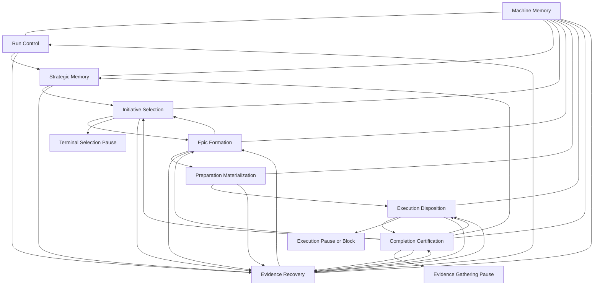

# Third State Machine Audit

## Recover the Canonical Architecture

This audit treats the recovered machine in `secondary-state-machine-audit.md` as the authoritative evidence. It does not treat the implementation as authoritative. State IDs `S0` through `S20` and transition IDs `T01` through `T32` refer to the recovered canonical machine.

The recovered architecture is a strategic-roadmap machine. It turns project context, roadmap source, completed-work memory, and execution evidence into a selected initiative, an active epic, milestone specifications, execution disposition, completion certification, and updated strategic memory. The machine is not one undifferentiated state machine. It is a set of cooperating capabilities joined by shared transition, evidence, artifact, decision, lifecycle, and recovery contracts.

## Deliverable 1: Canonical Vocabulary

### Machine

Meaning: the whole strategic-roadmap workflow from absent state through strategic memory, initiative selection, epic formation, preparation materialization, execution disposition, completion certification, and recovery.

Responsibilities: preserve current position, choose the next authorized transition, maintain durable memory, and expose paused, blocked, failed, cancelled, and completed conditions.

Relationships: contains capabilities, state machines, transitions, artifacts, evidence, decisions, invariants, lifecycles, and recovery paths.

Boundaries: it owns workflow authority, not the content semantics of external project work.

### Capability

Meaning: a bounded architectural function that owns a purpose, state subset, artifacts, decisions, evidence, and invariants.

Responsibilities: decide when its states may advance, validate its inputs, produce its outputs, and hand off to downstream capabilities.

Relationships: capabilities collaborate through artifacts, evidence, decisions, and state transitions.

Boundaries: a capability may consume another capability's artifacts, but it does not own their lifecycle unless explicitly handed authority.

### State Machine

Meaning: a coherent graph of states and transitions owned by one capability or by a tightly coupled capability pair.

Responsibilities: define entry states, exit states, transition authority, pause states, failure states, and handoff points.

Relationships: the recovered machine partitions into multiple state machines joined at shared artifacts and boundary states.

Boundaries: a state machine owns transition authority for its graph, not global persistence or all cross-cutting evidence.

### State

Meaning: a durable or conceptual position in the machine that constrains what may happen next.

Responsibilities: represent readiness, pause, block, cancellation, failure, completion, or a pending branch.

Relationships: states are entered by transitions, validated by invariants, and interpreted by control and recovery.

Boundaries: a state is not the same as an artifact lifecycle stage; state describes workflow position.

### Transition

Meaning: an authorized movement from one state to another, including its input requirements, execution form, validation, outputs, persistence, reporting, and recovery semantics.

Responsibilities: consume current state and required information, perform or interpret work, materialize outputs, record evidence and decisions, and persist the next state.

Relationships: transitions are owned by capabilities and normalized by one canonical transition contract.

Boundaries: a transition is not complete merely because an external or prompt-backed action returned output; completion includes interpretation, validation, materialization, and persistence where required.

### Artifact

Meaning: durable information used or produced by the machine.

Responsibilities: carry strategic memory, selections, epics, split families, preparation bundles, execution inputs, archives, and machine memory.

Relationships: artifacts have owners, lifecycle states, validation rules, consumers, and archival or supersession paths.

Boundaries: artifacts are not evidence unless they prove an event, decision, blocker, or transition result.

### Evidence

Meaning: durable proof that a transition, decision, blocker, validation, or recovery event occurred.

Responsibilities: support replay, validation, recovery, certification, reporting, and lineage.

Relationships: evidence is produced by transitions, consumed by validators and recovery, and can be promoted from raw observation into authoritative blocker, decision, or certification input.

Boundaries: evidence records facts about machine behavior; it should not silently mutate the artifact it explains.

### Decision

Meaning: an authoritative choice that changes transition direction, lifecycle, or recovery target.

Responsibilities: select an initiative, classify an audit disposition, accept or reject promotion, route execution disposition, certify completion, or choose recovery outcome.

Relationships: decisions consume evidence and artifacts, are validated by policy or parser rules, and are persisted for lineage.

Boundaries: display text and next-transition hints are not decision authority.

### Invariant

Meaning: a rule that must hold for a state, transition, artifact, decision, evidence record, lifecycle, or recovery path.

Responsibilities: prevent unsafe advancement, reject invalid materialization, preserve lineage, and constrain recovery.

Relationships: invariants are checked at entry, readiness, interpretation, materialization, persistence, and recovery boundaries.

Boundaries: an invariant failure is not always recoverable; the failure semantics are part of the transition contract.

### Lifecycle

Meaning: the allowed progression of a stateful subject such as an artifact, transition, evidence record, decision, epic, preparation bundle, recovery, or certification.

Responsibilities: describe how something is created, validated, promoted, consumed, superseded, archived, blocked, or retired.

Relationships: lifecycles run alongside state transitions and often explain readiness more precisely than state names.

Boundaries: lifecycle state does not replace machine state; both must agree where they overlap.

### Projection

Meaning: a transition-specific view of source information prepared for decision or materialization.

Responsibilities: make required input context explicit, fresh, and validated before a prompt-backed or interpretation-backed transition proceeds.

Relationships: projection readiness feeds transition readiness and input snapshots.

Boundaries: a projection is not source authority; it is a prepared view with freshness and provenance.

### Promotion

Meaning: the act of turning a candidate or draft artifact into an authoritative artifact.

Responsibilities: classify candidate output, validate it, write the promoted artifact, update lifecycle, and record promotion or blocker evidence.

Relationships: promotion bridges decision output and owned artifact lifecycle.

Boundaries: raw output is not promoted until validation and ownership transfer complete.

### Materialization

Meaning: the act of extracting, validating, writing, and proving a bundle or family of artifacts.

Responsibilities: create concrete artifacts from a transition output, record manifests and provenance, and enforce artifact invariants.

Relationships: materialization is used by split families, milestone specs, completion-context updates, and archival.

Boundaries: materialization includes validation; it is not just writing files.

### Certification

Meaning: independent validation that a completion claim can safely close, continue, reopen, or request more evidence.

Responsibilities: evaluate completion evidence, validate route policy, update lifecycle and strategic memory when closure is accepted, and preserve evidence when closure is not accepted.

Relationships: certification consumes execution evidence and preparation artifacts, then routes back to selection, execution, audit, evidence gathering, or recovery.

Boundaries: execution's claim of completion is not final authority.

### Recovery

Meaning: the bounded process for moving from cancellation, blocked evidence, or failure toward a safe target state.

Responsibilities: preserve blocker evidence, validate repaired evidence, distinguish supported from unsupported recovery, and persist a safe target or remain blocked.

Relationships: recovery is entered from many capabilities and consumes transition intent plus evidence lineage.

Boundaries: unsupported recovery remains report-only; recovery cannot invent a safe transition target.

### Authority

Meaning: the power to decide a next state, mutate an artifact, validate a decision, or recover from a blocker.

Responsibilities: keep decisions, validation, ownership, and mutation from becoming ambiguous.

Relationships: authority flows from run control to capability state machines to transition contracts, then to artifact/evidence/lifecycle ownership.

Boundaries: reporting metadata and descriptive next actions are not execution authority.

## Deliverable 2: Capability Discovery

The recovered machine contains nine cooperating capabilities. Seven are domain workflow capabilities; two are cross-cutting capabilities that every durable transition depends on.

### C1. Run Control

Purpose: decide whether the machine initializes, resumes, reports, cancels, fails, completes, or dispatches recovery.

Inputs: command intent, absence or presence of persisted state, current state, cancellation signal, recovery dispatch state, artifact readiness summary.

Outputs: initialized core state, report-only outcome, active resume action, cancelled state, failed state, completed report, recovered dispatch.

Owned states: `S0 Uninitialized Workflow`, `S1 Core Ready`, `S18 Cancelled`, `S19 Failed`, `S20 Completed Terminal`.

Owned artifacts: machine state record, prompt-contract snapshot, reportable transition intent.

Owned transitions: `T01`, `T02`, `T03`, `T31`, `T32`, and the control side of `T19`.

Owned invariants: no active transition before preflight; report-only states do not mutate; cancellation preserves a recoverable dispatch state when possible.

Owned decisions: initialize versus resume versus report; cancellation dispatch; failed or completed reporting.

Owned evidence: state summary, blockers, cancellation evidence, failure evidence.

Owned recovery: cancellation resume and failed-state reporting boundaries.

### C2. Machine Memory

Purpose: preserve the durable memory that lets other capabilities resume, replay, report, and recover.

Inputs: transition results, artifact lifecycle changes, decisions, evidence paths, blockers, projection freshness, split-family counts, retired-epic state.

Outputs: state record, transition history, decision lineage, lifecycle rows, manifests, provenance records, reportable summaries.

Owned states: none exclusively; this capability participates in every durable state.

Owned artifacts: state record, transition journal, decision ledger, lifecycle index, projection and provenance manifests.

Owned transitions: persistence and history portion of every durable transition.

Owned invariants: persisted state must reflect last transition, active artifact set, blockers, decisions, and lifecycle summaries consistently enough for resume and recovery.

Owned decisions: none; it records decisions made by other capabilities.

Owned evidence: transition history, input hashes, output paths, blocker paths, decision lineage.

Owned recovery: replay and inspection support; it does not choose recovery targets.

### C3. Strategic Memory

Purpose: maintain the strategic context used to select future initiatives and absorb completed-work learning.

Inputs: project context, roadmap source, completed epic archive, completion certification closure outputs.

Outputs: roadmap completion context and updated strategic memory.

Owned states: `S2 Roadmap Completion Context Ready`; participates in the closure route out of `S15`.

Owned artifacts: completion context, completed-epic synthesis, completed-epic archive input.

Owned transitions: `T04` and the strategic-memory update portion of `T24`.

Owned invariants: completion context exists before selection; context is fresh when generated; closure updates strategic memory before returning to selection.

Owned decisions: no primary branch decisions; it accepts certified completion updates.

Owned evidence: completed-epic evidence rendered into strategic context; context-update evidence.

Owned recovery: projection or materialization blockers that prevent context readiness.

### C4. Initiative Selection

Purpose: choose the next strategic initiative or intentionally pause when no epic should be formed.

Inputs: strategic memory, roadmap source, retired-epic exclusions, current selection cycle provenance.

Outputs: selected existing epic, new intermediary epic, split epic, terminal strategic pause, or no suitable initiative.

Owned states: `S3 Selection Decision Ready`, `S4 Terminal Selection Pause`, `S6 Retired Epic Recorded`.

Owned artifacts: selection artifact, selection evidence, selection provenance, retired-epic records.

Owned transitions: `T05`, `T06`, `T07`, `T08`, `T09`, and the retired-epic return loop `T10`.

Owned invariants: selection belongs to the current cycle; strategic memory and roadmap source are current; retired-epic state is included in provenance; terminal selection outcomes are report-only.

Owned decisions: strategic selection outcome, terminal pause outcome, exclusion of retired epics from future cycles.

Owned evidence: selection evidence, selection provenance, retirement evidence consumed for reselection.

Owned recovery: selection regeneration or supersession after retired-epic changes; terminal pauses require external or manual change.

### C5. Epic Formation

Purpose: turn a selected initiative into one authoritative active epic or a preserved blocker.

Inputs: selection decision, selected existing epic evidence, audit output, candidate epic output, split bundle output.

Outputs: active epic, retired-epic signal, split-family records, promotion blockers, split blockers, or audit insufficiency.

Owned states: `S5 Existing Epic Under Audit`, `S7 Candidate Epic Pending Promotion`, `S8 Split Family Pending Promotion`, `S9 Active Epic Ready`.

Owned artifacts: active epic, audit evidence, candidate epic output until promotion, split child drafts, split family record, promotion journal.

Owned transitions: `T11`, `T12`, `T13`, `T14`, `T15`, `T16`; consumes selection branches `T06` through `T08`; emits retired-epic signal through `T10`.

Owned invariants: existing epic audit must produce an accepted disposition; candidate must classify and validate before promotion; split paths are safe; split children validate; exactly one child is selected; only one active epic is ready or executing.

Owned decisions: audit disposition, promotion acceptance or rejection, selected split child.

Owned evidence: audit evidence, promotion evidence, split bundle evidence, blocker evidence.

Owned recovery: promotion blocker recovery, split blocker reporting, and audit insufficiency reporting.

### C6. Preparation Materialization

Purpose: turn an active epic into execution-preparation artifacts and pause at the current preparation boundary.

Inputs: active epic, project context, prepared transition input, materialization output.

Outputs: milestone specs, bundle manifest, preparation provenance, lifecycle-ready spec set, legacy execution-preparation pause.

Owned states: `S10 Milestone Specs Ready`, `S11 Legacy Execution Preparation Pause`.

Owned artifacts: milestone specs, specs bundle manifest, preparation manifest, operational context, execution prompt, execution plan, compatibility milestone artifacts.

Owned transitions: `T17`, `T18`, and the external-only handoff from `S10` to `S11`.

Owned invariants: milestone specs are non-empty, fresh against the active epic, owned by the active epic, and created without project-context drift; legacy operational artifacts depend on ready specs.

Owned decisions: materialization success versus blocker.

Owned evidence: spec materialization evidence, preparation provenance, milestone blocker evidence.

Owned recovery: milestone materialization blockers; legacy preparation states are external/manual in the current architecture.

### C7. Execution Disposition

Purpose: interpret execution evidence into continuation, blocker, or completion claim.

Inputs: execution evidence, active epic lifecycle, preparation artifacts.

Outputs: execution loop pause, execution blocked pause, or epic completion claim.

Owned states: `S12 Execution Loop Pause`, `S13 Execution Blocked`, `S14 Epic Completion Claim`.

Owned artifacts: execution evidence, execution blocker records, active-epic executing lifecycle.

Owned transitions: `T20`, `T21`, `T22`.

Owned invariants: execution disposition status and command must form an accepted pair; evidence must be preserved; completion claim requires execution evidence.

Owned decisions: operational disposition to continue, block, or claim completion.

Owned evidence: execution evidence, execution blocker evidence, completion-claim evidence.

Owned recovery: malformed execution evidence can be repaired into a supported target; execution blockers are report-only without deterministic recovery.

### C8. Completion Certification

Purpose: independently certify or reject an execution completion claim.

Inputs: completion claim, execution evidence, active epic, milestone specs, strategic memory.

Outputs: close route, close-with-follow-up route, continue route, reopen route, evidence-gathering pause, or invalid-certification blocker.

Owned states: `S15 Completion Certification Routing`, `S16 Evidence Gathering Pause`; consumes `S14` and routes to `S3`, `S12`, `S5`, `S16`, or `S17`.

Owned artifacts: completion evaluation evidence, completion decision, completed-epic synthesis, archived completed epic, updated completion context.

Owned transitions: `T23`, `T24`, `T25`, `T26`, `T27`, `T28`.

Owned invariants: evaluation must parse; closure must satisfy certification policy; every certification recommendation must map to a route; closure updates lifecycle and strategic memory.

Owned decisions: certification route.

Owned evidence: evaluation evidence, certification decision evidence, archive and synthesis evidence.

Owned recovery: invalid-certification recovery; evidence gathering is a report-only pause.

### C9. Evidence Recovery

Purpose: preserve failure evidence and recover only when the machine has a safe, supported repair path.

Inputs: blocked or failed state, recovery intent, evidence paths, repaired evidence, project context where needed.

Outputs: recovered target state, same blocked or failed state with appended review evidence, or report-only unsupported recovery.

Owned states: `S17 Evidence Blocked Recovery`; participates in `S18 Cancelled` and `S19 Failed`.

Owned artifacts: blocker evidence, orchestration evidence, unblock review evidence, recovery intent, recovery journal.

Owned transitions: `T19`, `T29`, `T30`, and the recovery side of `T31` and `T32`.

Owned invariants: blocker evidence is preserved; recovery intent names the intended recovery; repaired evidence must validate against the intent; unsupported intents remain blocked.

Owned decisions: supported versus unsupported recovery; recovery target; failed review outcome.

Owned evidence: blocker paths, hashes, review evidence, recovery lineage.

Owned recovery: all supported unblock flows and all unsupported recovery reporting.

## Deliverable 3: Capability Interaction Graph



| Producer | Consumers | Produced information | Dependency |
|---|---|---|---|
| Run Control | All capabilities | active command, initialized core, resume target, report-only outcome | every transition depends on control classification |
| Machine Memory | All capabilities | state, lifecycle, decisions, evidence lineage, transition history | every resume, report, recovery, and handoff depends on durable memory |
| Strategic Memory | Initiative Selection, Completion Certification | completion context and completed-work memory | selection cannot run without strategic memory |
| Initiative Selection | Epic Formation, Run Control | selected initiative or terminal pause | epic formation cannot choose its own initiative |
| Epic Formation | Preparation Materialization, Initiative Selection, Recovery | active epic, retired-epic signal, blockers | preparation requires an active epic |
| Preparation Materialization | Execution Disposition, Completion Certification, Recovery | milestone specs and preparation provenance | execution and certification depend on prepared artifacts |
| Execution Disposition | Completion Certification, Recovery, Run Control | continue/block/complete disposition and execution evidence | certification requires an epic completion claim |
| Completion Certification | Strategic Memory, Initiative Selection, Epic Formation, Execution Disposition, Recovery | closure, continuation, reopen, gather-evidence, or invalid-certification route | strategic memory update requires certified closure |
| Evidence Recovery | Run Control and target capabilities | recovered state or persistent blocker | recovery depends on transition intent and evidence lineage |

## Deliverable 4: State Machine Partitioning

The recovered monolith contains seven state machines plus one cross-cutting memory substrate.

| State machine | Purpose | Owned states | Entry states | Exit states | Transition authority | Interaction points |
|---|---|---|---|---|---|---|
| Control Machine | Start, report, resume, cancel, fail, or complete | `S0`, `S1`, `S18`, `S19`, `S20` | absent state, persisted state, cancellation, failure | `S1`, recovered dispatch state, report-only outcome | Run Control | initializes Strategic Memory; dispatches Recovery |
| Strategic Memory Machine | Establish and update strategic context | `S2` | `S1`, certified closure | `S3` through selection readiness | Strategic Memory | consumes completion archive; feeds Selection |
| Selection Machine | Select the next initiative or pause strategically | `S3`, `S4`, `S6` | `S2`, `S6`, certified closure | `S5`, `S7`, `S8`, `S4` | Initiative Selection | hands selected branches to Epic Formation; consumes retired-epic feedback |
| Epic Formation Machine | Audit, create, rewrite, split, promote, or block an epic | `S5`, `S7`, `S8`, `S9` | selection branches | `S9`, `S6`, `S17`, audit insufficiency report | Epic Formation | feeds Preparation; returns retired epics to Selection |
| Preparation Machine | Materialize milestone specs and preserve legacy preparation pauses | `S10`, `S11` | `S9` | `S10`, `S11`, `S17`, `S19` | Preparation Materialization | feeds external or legacy execution and later certification |
| Execution Disposition Machine | Interpret execution evidence | `S12`, `S13`, `S14` | external/legacy execution, continue route | `S12`, `S13`, `S14` | Execution Disposition | feeds Completion Certification or blocks |
| Certification Machine | Certify completion and route closure, continuation, reopen, evidence gathering, or invalid certification | `S15`, `S16` plus consumed `S14` | `S14` | `S3`, `S12`, `S5`, `S16`, `S17` | Completion Certification | updates Strategic Memory, Selection, Epic Formation, and Execution |
| Recovery Machine | Preserve blockers and recover supported failures | `S17` plus recovery participation in `S18` and `S19` | any blocked, cancelled, or failed transition | target state or same blocked/failed state | Evidence Recovery | consumes evidence from every capability |

Shared artifacts: state records, lifecycle index, transition history, decision ledger, strategic context, active epic, specs, evidence, and blockers.

Shared evidence: selection evidence, audit evidence, promotion evidence, split evidence, materialization evidence, execution evidence, completion evaluation evidence, invariant evidence, unblock review evidence.

Shared invariants: source state readiness, artifact freshness, evidence preservation, decision parseability, lifecycle consistency, and recovery intent safety.

Shared lifecycle: state lifecycle and artifact lifecycle intersect at ready, executing, completed, blocked, retired, superseded, archived, and report-only states.

## Deliverable 5: Canonical Transition Model

Every recovered transition can be described with one schema:

| Field | Meaning | Required by |
|---|---|---|
| Identity | stable transition id and name | all transitions |
| Owner | capability with transition authority | all transitions |
| Source | allowed source state or state class | all transitions |
| Trigger | command, resume plan, decision output, external evidence, cancellation, or recovery request | all transitions |
| Requires | preconditions, readiness, freshness, lifecycle state, and invariants | all active transitions |
| Consumes | state, artifacts, evidence, projections, decisions, or recovery intent read by the transition | all transitions except simple reports |
| Prepares | context/projection/input snapshot when needed | prompt-backed, materializing, certification, and recovery transitions |
| Executes | prompt run, external interpretation, route decision, materialization, report, or recovery review | all transitions |
| Interprets | parsed output, policy route, disposition, or review result | output-routing, certification, execution, and recovery transitions |
| Validates | parser, policy, artifact, lifecycle, freshness, and invariant checks | all mutating transitions |
| Produces | new artifacts, evidence, decisions, lifecycle rows, state, or report | all transitions |
| Mutates | artifacts, lifecycle, strategic memory, retired-epic set, blockers, state, or history | durable transitions |
| Persists | state summary, transition status, evidence paths, decisions, lifecycle, journal, and provenance | durable transitions |
| Reports | current state, pause, blocker, failure, cancellation, completion, or next reportable action | all command-facing transitions |
| Target | next state, same state, report-only outcome, or recovery target | all transitions |
| Failure semantics | block, fail, cancel, report-only, or ephemeral error | all active transitions |
| Recovery semantics | recovery intent, supported repair, unsupported repair, or no recovery | all failure-capable transitions |

Canonical form:

```text
Transition {
  id
  owner
  source
  trigger
  requires
  consumes
  prepares
  executes
  interprets
  validates
  produces
  mutates
  persists
  reports
  target
  failureSemantics
  recoverySemantics
}
```

The model is recovered from the six transition archetypes: report/resume planning, immediate prompt completion, deferred promotion, bundle materialization, output routing, and recovery/failure.

## Deliverable 6: Canonical Execution Pipeline

The recovered machine has one conceptual pipeline with optional branches. It is not a single mandatory linear pipeline for every transition.

| Stage | Role | Status |
|---|---|---|
| Control classification | determine initialize, resume, report, unblock, cancel, fail, or complete | universal for command-facing transitions |
| Readiness validation | check source state, preflight, artifact lifecycle, freshness, and report-only constraints | universal for active transitions |
| Input preparation | build projection/context and capture input snapshot | optional; common to prompt-backed, materializing, certification, and recovery transitions |
| Execution | run prompt, interpret external evidence, route a decision, materialize, report, or review recovery | universal, but execution form varies |
| Interpretation | parse selection, audit, split, execution disposition, completion evaluation, or recovery review | optional; required for output-routing transitions |
| Validation | apply policy, artifact validation, lifecycle validation, invariant validation, or recovery validation | universal for mutating transitions |
| Materialization or promotion | write, promote, retire, archive, update, or block artifacts | optional; required for artifact-changing transitions |
| Decision recording | persist branch, route, certification, operational disposition, or recovery result | optional but present where decisions exist |
| Evidence recording | preserve output, blocker, evaluation, journal, or review evidence | present for durable transition claims and all blockers |
| State persistence | record target state, transition status, lifecycle summary, blockers, and reportable next action | universal for durable transitions |
| Reporting | return paused, blocked, failed, cancelled, completed, or status outcome | universal for command-facing transitions |
| Recovery preparation | emit recovery intent and evidence paths when a safe recovery path exists or a blocker must remain report-only | optional; required for recoverable blockers |

Capability-specific stages:

- Strategic Memory owns context creation and certified context updates.
- Initiative Selection owns selection interpretation and terminal strategic pause decisions.
- Epic Formation owns audit interpretation, promotion, split materialization, and active-epic readiness.
- Preparation Materialization owns spec bundle extraction, preparation provenance, and readiness invariants.
- Execution Disposition owns status/command interpretation from execution evidence.
- Completion Certification owns evaluation interpretation, certification policy, closure/update routes, and evidence-gathering routes.
- Evidence Recovery owns recovery review and target-state validation.

## Deliverable 7: Artifact Architecture

| Artifact family | Creation | Ownership | Validation | Promotion or mutation | Consumption | Retirement or archival |
|---|---|---|---|---|---|---|
| Machine state | initialized by Run Control; updated by durable transitions | Machine Memory with current capability authority | source state, target state, transition status, blockers, lifecycle summary | mutated after each durable transition | all capabilities, reporting, recovery | completed, failed, cancelled, or superseded by next durable state |
| Strategic context | created at `S2`; updated on certified closure | Strategic Memory | context existence, freshness, completed-work input | updated after close routes | Initiative Selection, Completion Certification | superseded by newer context; completed epics archived |
| Selection | created at `S3` | Initiative Selection | current cycle, roadmap source freshness, retired-epic provenance | consumed into branch or terminal pause; superseded after retirement or closure | Epic Formation, reporting, decision lineage | terminal pause, superseded selection, or reselection |
| Retired-epic records | created from audit retire disposition | Initiative Selection | stable epic identity, selection provenance invalidation | appended or updated to exclude future selection | selection cycle | retained as exclusion memory |
| Audit evidence | created during existing epic audit | Epic Formation | accepted audit disposition | may produce retire, rewrite, or insufficiency | Initiative Selection, Epic Formation, Recovery | retained as decision evidence |
| Candidate epic | created by new, realign, or reimagine branch | Epic Formation | promotable classification and epic validation | promoted to active epic or converted to blocker evidence | Preparation Materialization after promotion | raw candidate is not authoritative after promotion or block |
| Active epic | promoted from candidate or split child | Epic Formation until active; then shared with Preparation, Execution, Certification | single active ready/executing epic, structural validity | lifecycle moves ready, executing, completed, reopened, or blocked | Preparation, Execution, Certification | completed archive, reopened audit, or superseded active epic |
| Split family | created by split materialization | Epic Formation | safe paths, child validation, exactly one selected child | selected child promoted; others retained as drafts/family evidence | Epic Formation, reporting, recovery | superseded or retained as split lineage |
| Preparation bundle | created from active epic | Preparation Materialization | non-empty specs, ownership by active epic, freshness, project-context stability | specs and manifests marked ready | Execution Disposition, Completion Certification | legacy/external preparation may supersede; specs remain certification input |
| Execution evidence | created by external or legacy execution | Execution Disposition | accepted disposition pair and evidence presence | routes to continue, block, or completion claim | Completion Certification, Recovery | retained for certification and replay |
| Completion evaluation | created from completion claim | Completion Certification | parseable evaluation and policy-valid recommendation | routes closure, continue, reopen, gather evidence, or block | Strategic Memory, Selection, Epic Formation, Execution | archived with completion decision or retained as evidence-gathering/blocker evidence |
| Recovery evidence | created by blocker, invariant failure, cancellation, or unblock review | Evidence Recovery | intent/evidence relationship and repaired-evidence validity | target state persisted or blocker appended | recovery, reporting, future review | retained until manually repaired, superseded, or resolved |
| Decision history | appended by selection, audit, certification, and recovery decisions | Machine Memory records; producing capability owns decision authority | decision allowed by parser/policy/route | decisions are acted on, superseded, retired, or replayed | reporting, recovery, strategic lineage | retained as lineage |
| Transition history | appended by durable transition events | Machine Memory | correlation of inputs, outputs, status, target, and evidence | grows with each transition | resume, recovery, audit, reporting | retained as replayable history |

## Deliverable 8: Evidence Architecture

Evidence has its own lifecycle:

```text
Observed -> Captured -> Validated -> Bound to transition or decision -> Promoted or rejected -> Consumed by downstream capability -> Archived, superseded, or replayed
```

| Evidence role | Producers | Consumers | Validation | Persistence | Promotion | Recovery |
|---|---|---|---|---|---|---|
| Selection evidence | Initiative Selection | Epic Formation, reporting, decision lineage | selection output parse and cycle freshness | selection evidence and provenance | promoted to branch authority | superseded when selection cycle changes |
| Audit evidence | Epic Formation | Epic Formation, Initiative Selection, Recovery | audit disposition parse | audit evidence and decision | promoted to retire/rewrite route | insufficiency is weakly durable compared with other blockers |
| Promotion evidence | Epic Formation | Preparation, Recovery, reporting | candidate classification and epic validation | promotion journal or blocker evidence | promoted to active epic | blocker recovery may review candidate |
| Split evidence | Epic Formation | Epic Formation, Recovery, reporting | bundle extraction, safe paths, child validation, selected child | split family, child drafts, blocker evidence | selected child promoted | invalid split remains blocked or manual |
| Preparation evidence | Preparation Materialization | Execution, Certification, Recovery | bundle extraction, spec ownership, freshness, invariants | spec manifest and preparation provenance | specs become certification inputs | materialization blocker may be reviewed if supported |
| Execution evidence | Execution Disposition | Completion Certification, Recovery | valid disposition pair and evidence presence | execution evidence paths | completion claim or continue/block route | malformed execution evidence can be repaired |
| Certification evidence | Completion Certification | Strategic Memory, Selection, Execution, Epic Formation, Recovery | evaluation parse and policy route | evaluation evidence and decision | route becomes closure/continue/reopen/gather/block authority | invalid certification can be repaired |
| Invariant evidence | Any validating capability | Evidence Recovery, reporting | invariant failure classification | orchestration evidence and blockers | blocks or fails machine | recoverability depends on failure target |
| Unblock review evidence | Evidence Recovery | Run Control, target capability, reporting | repaired evidence and intent validation | review evidence and journal | target state if supported | failed review appends blocker |

Evidence is not passive logging. In the recovered architecture, evidence can become transition authority when it is validated and bound to a decision or recovery target. That makes evidence lifecycle and evidence ownership first-class architectural concerns.

## Deliverable 9: Decision Architecture

Decision lifecycle:

```text
Produced -> Parsed or classified -> Validated -> Persisted -> Consumed -> Superseded, retired, replayed, or archived
```

| Decision class | Producers | Validators | Persistence | Consumers | Retirement or replay | Authority |
|---|---|---|---|---|---|---|
| Strategic decisions | Initiative Selection, Completion Certification on closure | selection parser, selection freshness, certification route | decision ledger and state | Epic Formation, Strategic Memory, reporting | superseded by reselection, retired-epic change, or certified closure | determines what strategic work is eligible |
| Operational decisions | Run Control, Epic Formation, Preparation Materialization, Execution Disposition | readiness checks, parsers, artifact validators, invariants | state, lifecycle, transition journal, evidence | next capability, resume, reporting | replayed by resume/recovery; superseded by next transition | determines immediate state movement |
| Recovery decisions | Evidence Recovery, Run Control cancellation resume | recovery intent validation, evidence review, target safety | blocker/review evidence, state, journal | target capability, reporting | failed reviews remain blockers; supported reviews recover target | determines whether blocked work can safely move |
| Certification decisions | Completion Certification | evaluation parser, certification policy, route table | completion decision, evaluation evidence, state | Strategic Memory, Selection, Execution, Epic Formation, Evidence Recovery | archived on closure, replayed for recovery, superseded by evidence gathering or continuation | determines whether an execution completion claim is accepted |

Decision lineage:

- Strategic selection lineage begins with strategic context and roadmap source, then carries selection evidence, retired-epic state, and branch outcome.
- Audit lineage begins with selected existing epic evidence and ends in retire, rewrite, or insufficiency.
- Promotion lineage begins with candidate output and ends in active epic or blocker.
- Execution lineage begins with execution evidence and ends in continue, block, or completion claim.
- Certification lineage begins with completion claim and ends in close, continue, reopen, evidence gathering, or invalid certification.
- Recovery lineage begins with transition intent and blocker evidence and ends in recovered target or same blocked state.

## Deliverable 10: Invariant Architecture

| Invariant category | Owner | Validation timing | Failure semantics | Recovery semantics |
|---|---|---|---|---|
| Machine invariants | Run Control | startup, resume, report, cancellation | report-only, cancelled, failed, or initialized | cancellation resume or manual repair |
| State invariants | owning state machine | state entry and resume | block, fail, pause, or report-only | target-specific recovery if modeled |
| Transition invariants | transition owner | before execution, after interpretation, before persistence | block, fail, or ephemeral error depending on transition | recovery intent if safe target exists |
| Artifact invariants | artifact owner | promotion, materialization, resume, certification | blocker or failed materialization | artifact-specific unblock or manual repair |
| Evidence invariants | Evidence Recovery and evidence producer | capture, binding, recovery review | evidence blocked, unsupported recovery, or failed review | repaired evidence must validate against intent |
| Decision invariants | decision producer and validator | parse/classification and route selection | terminal pause, blocker, retry through reselection, or report-only | replay or repair only when evidence supports it |
| Lifecycle invariants | Machine Memory plus artifact owner | state persistence, resume, handoff | block, fail, or stale readiness | regenerate, supersede, or manual repair |
| Recovery invariants | Evidence Recovery | unblock planning and review | same blocked/failed state or unsupported report | supported target only; no invented recovery |
| Certification invariants | Completion Certification | after completion evaluation and before route persistence | invalid-certification blocker or evidence gathering | invalid-certification repair or additional evidence |

Recovered invariant examples:

- Selection must belong to the current cycle and include retired-epic state.
- Candidate epic output must validate before it overwrites the active epic.
- Split output must contain safe child paths and exactly one selected child.
- Milestone specs must be fresh against the active epic and non-empty.
- Execution completion claim must preserve execution evidence.
- Completion closure requires certification policy acceptance.
- Recovery intent must match preserved evidence and supported target semantics.
- Report-only states do not mutate on run.

## Deliverable 11: Ownership Architecture

| Owned subject | Primary owner | Shared with | Fragmentation points |
|---|---|---|---|
| States | owning state machine | Run Control, Machine Memory, Recovery | boundary states such as active epic, completion claim, cancelled, failed, and blocked |
| Transitions | capability owner | Machine Memory, Recovery, Reporting | transition execution, validation, persistence, and recovery may be owned by different capabilities |
| Artifacts | producing capability | downstream consumers | active epic, strategic context, and preparation artifacts cross capability boundaries |
| Evidence | producer until bound; Evidence Recovery for blockers | validators, downstream capabilities, reporting | evidence can be data, decision support, and recovery authority |
| Decisions | producing capability | Machine Memory records and consumers replay | strategic, operational, certification, and recovery decisions use different validators |
| Recovery | Evidence Recovery | source capability and target capability | source produces intent; Recovery validates; target state machine resumes |
| Persistence | Machine Memory | every capability | state writes also carry lifecycle, blockers, decisions, and reportable summary |
| Validation | subject owner | transition owner and Recovery | validation occurs at readiness, parsing, policy, materialization, invariant, and recovery stages |
| Reporting | Run Control and Machine Memory | every capability | reportable next actions are descriptive, not execution authority |
| Lifecycle | artifact owner and Machine Memory | transition owner and downstream consumers | artifact lifecycle and workflow state can duplicate readiness or execution meaning |

Ownership becomes fragmented where:

- A transition's decision authority differs from its artifact owner.
- A blocker producer emits a recovery intent that Recovery may not support.
- A durable state write also aggregates artifact, lifecycle, blocker, decision, and reporting data.
- Certification closes an epic, updates strategic memory, and returns to selection in one route.
- Legacy execution states remain part of the canonical graph but are not advanced by the current active path.

## Deliverable 12: Lifecycle Architecture

### Machine Lifecycle

Absent -> initialized core -> active workflow -> paused, blocked, cancelled, failed, completed, or resumed.

Evidence: `S0`, `S1`, `S17`, `S18`, `S19`, `S20`.

### State Lifecycle

Entry -> readiness validation -> active transition or report-only pause -> target state -> resume or terminal report.

Evidence: every state inventory entry and `T01` through `T03`.

### Transition Lifecycle

Planned -> prepared -> started -> output produced -> interpreted -> validated -> materialized or routed -> persisted -> reported -> recovered if needed.

Evidence: transition anatomy and the six transition archetypes.

### Artifact Lifecycle

Absent -> draft or candidate -> validated -> ready -> executing or consumed -> completed, blocked, retired, superseded, or archived.

Evidence: active epic, split children, specs, strategic context, and completed-epic archive.

### Evidence Lifecycle

Observed -> captured -> validated -> bound to transition or decision -> promoted to authority or preserved as blocker -> consumed -> archived, superseded, or replayed.

Evidence: selection, audit, promotion, split, preparation, execution, certification, invariant, and unblock evidence.

### Decision Lifecycle

Produced -> parsed/classified -> validated -> persisted -> consumed by transition authority -> superseded, retired, replayed, or archived.

Evidence: selection outcomes, audit dispositions, execution dispositions, certification routes, recovery reviews.

### Selection Lifecycle

Strategic memory ready -> selection produced -> branch consumed or terminal pause -> superseded by retired-epic update, closure, or external change.

Evidence: `S2`, `S3`, `S4`, `S6`, `T05` through `T10`.

### Epic Lifecycle

Candidate or selected existing epic -> audited, created, rewritten, or split -> promoted active ready -> executing -> completed, reopened, retired, superseded, or blocked.

Evidence: `S5`, `S7`, `S8`, `S9`, `S12`, `S15`, `T11` through `T16`, `T24` through `T26`.

### Preparation Lifecycle

Active epic ready -> milestone specs materialized -> legacy/external operational preparation -> execution evidence -> certification input.

Evidence: `S9`, `S10`, `S11`, `S12`, `S14`.

### Certification Lifecycle

Completion claim -> evaluation -> policy route -> close, continue, reopen, gather evidence, or block -> strategic memory or workflow state updated.

Evidence: `S14`, `S15`, `S16`, `T23` through `T28`.

### Recovery Lifecycle

Failure or cancellation observed -> evidence and intent captured -> review requested -> repaired evidence validated -> target recovered or blocker retained.

Evidence: `S17`, `S18`, `S19`, `T19`, `T29`, `T30`, `T31`, `T32`.

## Deliverable 13: Canonical Architectural Layers

```text
Strategic Source and Project Context
  -> Run Control
  -> Capability State Machines
  -> Canonical Transition Contract
  -> Projection and Input Readiness
  -> Execution, Interpretation, and Decision
  -> Validation and Invariants
  -> Artifact, Evidence, and Lifecycle Materialization
  -> Machine Memory
  -> Reporting and Recovery Interface
```

| Layer | Responsibilities | Dependencies | Direction of authority | Information flow |
|---|---|---|---|---|
| Strategic Source and Project Context | provide source facts and roadmap intent | external source and project context | source authority below machine decisions | into Strategic Memory, Selection, Preparation |
| Run Control | initialize, resume, report, cancel, fail, complete, unblock dispatch | machine state and command intent | authorizes whether any capability may run | state and report summaries outward |
| Capability State Machines | own bounded state graphs and handoffs | Run Control and Machine Memory | own domain transition authority | artifacts/evidence to downstream capabilities |
| Canonical Transition Contract | normalize source, trigger, requirements, execution, target, failure, recovery | owning capability | constrains every transition | transition inputs and outputs recorded |
| Projection and Input Readiness | prepare fresh transition-specific context | source artifacts, provenance, lifecycle | can block prompt-backed or materializing transitions | prepared inputs to execution |
| Execution, Interpretation, and Decision | produce or parse transition outputs and choose route | transition contract and prepared inputs | branch authority for output-driven transitions | decisions to validation and memory |
| Validation and Invariants | enforce parser, policy, artifact, lifecycle, evidence, and recovery rules | decisions, artifacts, evidence | can block, fail, pause, or allow advancement | validated facts to materialization |
| Artifact, Evidence, and Lifecycle Materialization | write, promote, retire, archive, block, and update lifecycle | validated decisions and outputs | owns durable information changes | materialized artifacts and evidence to memory |
| Machine Memory | persist state, history, lifecycle, decisions, manifests, blockers | all prior layers | records authority; does not replace it | resume/recovery/report data upward |
| Reporting and Recovery Interface | expose current status, blockers, pause reasons, and recovery results | Machine Memory and Recovery | reports but does not create execution authority | human or external repair back into Recovery |

Authority flows from Run Control into capability-owned state machines and transition contracts. Information flows back through artifacts, evidence, decisions, lifecycle, and machine memory.

## Deliverable 14: Architectural Compression

Recovered machine estimate:

- 21 conceptual states.
- 32 canonical transitions.
- 6 transition archetypes.
- 14 execution stages.
- 4 main durable artifact domains.
- 3 authoritative route systems.

Recovered architecture estimate:

- 9 capabilities.
- 7 owned state machines plus Machine Memory substrate.
- 1 canonical transition contract.
- 1 conceptual execution pipeline with optional branches.
- 13 artifact families.
- 4 decision classes.
- 9 invariant categories.
- 10 lifecycles.

Compression:

- State compression: 21 states -> 7 state machines, about 3:1.
- Transition compression: 32 transitions -> 6 archetypes plus 1 transition contract, about 4.6:1.
- Pipeline compression: 14 observed stages -> 1 ordered pipeline with optional capability-owned stages, about 14:1 for execution shape.
- Overall architectural compression: about 67 observed machine units (states, transitions, stages) -> about 28 architectural primitives (capabilities, state machines, contract, pipeline, lifecycles, decision and invariant classes), about 2.4:1.

The strongest compression is not fewer state names. It is the recovery of one transition contract and one execution pipeline that can express all six transition archetypes without losing behavior.

## Deliverable 15: Architectural Seams

Strongest natural seams recovered from the machine:

- Run Control versus capability execution: `T01` through `T03`, `T31`, and `T32` decide whether work may happen before any domain capability runs.
- Strategic Memory versus Selection: `S2` must be ready before `T05`; closure updates strategic memory before returning to selection.
- Selection versus Epic Formation: `S3` branches to existing, new, split, or terminal outcomes; Epic Formation does not own strategic selection.
- Prompt output versus promotion: `S7` and `T13`/`T14` show raw candidate output is not authoritative until promotion.
- Bundle output versus materialization: `S8`, `S10`, `T15` through `T18` show extraction, validation, writing, manifests, and provenance form a separate boundary after output.
- Active epic versus preparation artifacts: `S9` hands a single active epic to spec materialization; specs must remain fresh against that epic.
- Preparation versus execution: `S10` pauses before execution; `S11` and `S12` are preserved legacy/external boundaries.
- Execution disposition versus completion certification: `S14` is only a claim; `S15` owns independent certification.
- Completion certification versus strategic update: `T24` must close and update memory before selection can continue.
- Evidence/blocker production versus recovery: many transitions create blockers, but `S17`, `T29`, and `T30` own recovery review.
- State persistence versus transition authority: Machine Memory records state and reportable next actions, but capability transitions decide actual movement.
- Decision authority versus reporting: `Next` style reportability is descriptive; decisions come from selection, audit, disposition, certification, or recovery validation.

## Deliverable 16: Architectural Smells

| Smell | Evidence from recovered machine | Architectural consequence |
|---|---|---|
| Capability leakage | `S3` selection branches immediately drive epic formation and then milestone generation in the active path | selection, formation, and preparation are conceptually separate but tightly chained |
| Ownership ambiguity | active epic is created by Epic Formation, executed by Execution Disposition, certified by Completion Certification, and can be reopened or completed | lifecycle ownership crosses multiple capabilities |
| Transition authority fragmentation | next state can come from startup classification, selection output, audit disposition, promotion validation, bundle interpretation, execution disposition, certification route, invariant failure, or recovery intent | no single architectural table owns all transition authority |
| Artifact ownership ambiguity | strategic context is owned by Strategic Memory but mutated by certified closure; active epic is owned by Formation then shared broadly | artifacts need clear owner plus consumer lifecycle boundaries |
| Recovery ownership ambiguity | many transitions can persist blockers, but only some intents have supported recovery in `T29`; unsupported paths remain blocked in `T30` | blocker production is broader than deterministic recovery capability |
| Evidence coupling | execution evidence is both historical proof and certification input; blocker evidence is both report data and recovery authority | evidence lifecycle must be explicit or evidence becomes hidden control flow |
| Lifecycle duplication | workflow state and artifact lifecycle both encode readiness, execution, completion, and block conditions | state and lifecycle can diverge unless validated together |
| Decision duplication | branch decisions appear in selection, audit, execution disposition, certification, and recovery; some are also reflected in state and history | decision lineage is real architecture, not incidental metadata |
| Pipeline divergence | immediate prompt transitions complete differently from promotion and bundle transitions | "output produced" and "transition complete" are not the same event |
| Layer mixing | durable state persistence also carries active artifacts, blockers, decisions, lifecycle summaries, and reportable next actions | memory, reporting, and execution authority can be mistaken for one another |
| State machine overlap | execution preparation and execution states remain in the canonical graph, but the current active path stops at milestone specs | the architecture contains an active preparation machine and a preserved legacy/external execution submachine |
| Incomplete blocker durability | `T12` audit insufficiency reports an error without the same durable recovery shape as `S17` blockers | not every semantic blocker has equal recovery semantics |
| Close route does not mean completed terminal | `T24` closes an epic and returns to selection rather than persisting `S20` | workflow completion and epic completion are different lifecycle concepts |

## Deliverable 17: Canonical Architecture

### Architectural Specification

The canonical architecture is a strategic-roadmap state architecture composed of Run Control, Machine Memory, Strategic Memory, Initiative Selection, Epic Formation, Preparation Materialization, Execution Disposition, Completion Certification, and Evidence Recovery.

Run Control is the outer authority. It decides whether the machine initializes, resumes, reports, cancels, fails, completes, or dispatches recovery. It owns the absence-to-core path, report-only behavior, cancellation resume, and terminal reporting. It does not own strategic selection, epic formation, completion certification, or artifact semantics.

Machine Memory is the durable substrate. It records state, transition history, lifecycle, decisions, manifests, blockers, and evidence lineage. It records authority exercised by other capabilities; it is not itself the source of branch decisions. Every capability depends on Machine Memory for resume, reporting, recovery, and replay.

Strategic Memory owns the completion context that makes selection meaningful. It creates strategic context from project and roadmap information, and it accepts certified completed-work updates from Completion Certification. Selection cannot proceed without this context. Closure cannot return to selection until strategic memory has been updated where required.

Initiative Selection owns the choice of what strategic work should happen next. It consumes strategic memory, roadmap source, and retired-epic exclusions. It may choose an existing epic, a new intermediary epic, a split epic, a strategic investigation pause, a roadmap revision pause, or no suitable initiative. It also owns retired-epic exclusion as selection-cycle memory.

Epic Formation owns the transformation from selected initiative to active epic. It audits selected existing epics, creates or rewrites candidates, splits initiatives into child epics, validates promotion, and produces exactly one authoritative active epic or a blocker. Raw candidate output and split output are not authoritative until promotion or materialization validates them.

Preparation Materialization owns the transformation from active epic to execution-preparation artifacts. It materializes milestone specs, manifests, and preparation provenance. The active path pauses after milestone specs are ready. Legacy operational context, execution prompt, execution plan, and compatibility milestone artifacts remain part of the canonical graph but are not advanced by the active preparation path.

Execution Disposition owns interpretation of execution evidence. It can route to continuation, execution block, or epic completion claim. A completion claim is not final authority; it is only the input to Completion Certification.

Completion Certification owns independent validation of completion. It evaluates completion evidence against active epic and preparation artifacts, then routes to close, close with follow-up, continue, reopen, gather more evidence, or invalid-certification recovery. A close route updates strategic memory and returns to selection. It does not make the whole machine terminal-completed.

Evidence Recovery owns blocker review and supported recovery. Any capability may produce blocker evidence, but recovery authority belongs to the Recovery capability. Recovery consumes transition intent, evidence lineage, and repaired evidence. It may restore a safe target state only when the recovery path is supported and validates; otherwise the machine remains blocked or failed.

### Authority Flow

Authority flows in this order:

```text
Run Control
  -> Capability State Machine
  -> Canonical Transition Contract
  -> Prepared Inputs and Projection Freshness
  -> Decision or Execution Output
  -> Validation and Invariants
  -> Artifact/Evidence/Lifecycle Mutation
  -> Machine Memory Persistence
  -> Reporting or Recovery
```

Reporting never creates execution authority. Reportable next actions describe the current state; transition authority comes from Run Control, capability state machines, parsed decisions, validated policies, invariant outcomes, and recovery review.

### Transition Semantics

Every transition consumes a source state or state class, validates readiness, executes one of the recovered archetypes, interprets any output that affects routing, validates artifacts and decisions, materializes or promotes durable information when required, persists state and evidence, reports the outcome, and defines failure and recovery semantics.

Prompt-backed transitions split into two architectural families. Immediate prompt transitions can persist the target after prompt completion. Promotion and bundle transitions cannot, because prompt output must still be classified, validated, extracted, materialized, promoted, or blocked. Therefore prompt completion is not a universal transition-completion boundary.

### Artifact Evolution

Artifacts evolve under capability ownership. Strategic context is created and updated by Strategic Memory. Selection artifacts are created and superseded by Initiative Selection. Active epic artifacts are promoted by Epic Formation and then shared with Preparation, Execution, and Certification. Milestone specs are materialized by Preparation. Execution evidence is interpreted by Execution Disposition. Completion artifacts are evaluated and archived by Certification. Recovery artifacts are owned by Evidence Recovery.

Artifact lifecycle and workflow state are separate but coupled. The machine must be able to prove that a state claiming readiness has matching artifact lifecycle evidence.

### Evidence Evolution

Evidence begins as observed output or failure context. It becomes architectural evidence only when captured, validated, and bound to a transition or decision. Evidence may then become branch authority, certification input, recovery input, or retained history. Blocker evidence is not only diagnostic; it is the recovery substrate.

Evidence has lineage. Selection evidence leads to branch decisions. Audit evidence leads to retire or rewrite decisions. Promotion evidence leads to active epics or blockers. Execution evidence leads to completion claims. Certification evidence leads to closure, continuation, reopen, evidence gathering, or recovery. Recovery evidence leads to target state restoration or persistent block.

### Decision Evolution

Decisions are separated into strategic, operational, recovery, and certification classes. Each class has a producer, validator, persistence form, consumer, retirement or replay path, and authority boundary.

Strategic decisions choose what work may happen. Operational decisions move the machine through immediate workflow states. Certification decisions decide whether completion is accepted. Recovery decisions decide whether blocked work can safely move again.

### Recovery

Recovery is evidence-bound and intent-bound. A failed or blocked transition must preserve enough evidence and intent to let Recovery determine whether a supported repair exists. Recovery cannot assume that every blocker is repairable. Unsupported recovery remains report-only, and failed recovery appends review evidence rather than erasing the original blocker.

Cancellation is a control-level recovery case. It preserves a dispatch state when possible and returns to normal resume planning on rerun.

### Ownership Partition

The architecture is partitioned by capability purpose:

- Run Control owns workflow entry, report-only behavior, cancellation, and dispatch.
- Machine Memory owns durable recordkeeping and replay substrate.
- Strategic Memory owns completion context.
- Initiative Selection owns selection and retired-epic exclusion.
- Epic Formation owns audit, candidate promotion, split materialization, and active-epic creation.
- Preparation Materialization owns milestone specs and preparation provenance.
- Execution Disposition owns execution evidence interpretation.
- Completion Certification owns completion evaluation and closure routing.
- Evidence Recovery owns supported recovery review.

The strongest ownership risks are active epic lifecycle, strategic context updates, blocker recovery support, and machine-state persistence. These are architectural boundaries already visible in the recovered machine.

### Final Recovered Model

The smallest architecture that preserves the recovered behavior is:

```text
9 capabilities
7 state machines plus Machine Memory
1 canonical transition contract
1 conceptual execution pipeline
13 artifact families
4 decision classes
9 invariant categories
10 lifecycles
1 evidence-bound recovery model
```

This architecture expresses the recovered 21-state, 32-transition machine without redesigning it. It keeps the current active path, the terminal pauses, the preserved legacy execution submachine, the completion certification loop, the evidence-blocked recovery path, and the distinction between epic completion and machine completion.
